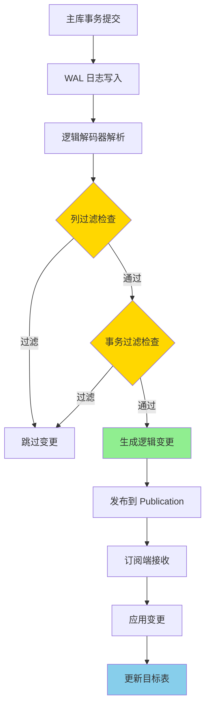

# PostgreSQL 17 逻辑复制新特性

> **更新时间**: 2025 年 1 月
> **技术版本**: PostgreSQL 17+
> **文档编号**: 03-03-17-04

## 📑 概述

PostgreSQL 17 在逻辑复制方面引入了多项新特性，包括新的配置选项、增强的功能、改进的管理工具等，使得逻辑复制更加强大和易用。

## 🎯 核心价值

- **新配置选项**：更多灵活的配置参数
- **功能增强**：新增实用功能和改进
- **管理工具**：改进的管理和监控工具
- **易用性提升**：简化配置和操作流程
- **生产就绪**：稳定可靠，适合生产环境

## 📚 目录

- [PostgreSQL 17 逻辑复制新特性](#postgresql-17-逻辑复制新特性)
  - [📑 概述](#-概述)
  - [🎯 核心价值](#-核心价值)
  - [📚 目录](#-目录)
  - [1. 逻辑复制新特性概述](#1-逻辑复制新特性概述)
    - [1.0 逻辑复制新特性工作原理概述](#10-逻辑复制新特性工作原理概述)
    - [1.1 PostgreSQL 17 新特性](#11-postgresql-17-新特性)
    - [1.2 特性对比](#12-特性对比)
  - [2. 新配置选项](#2-新配置选项)
    - [2.1 发布端配置](#21-发布端配置)
    - [2.2 订阅端配置](#22-订阅端配置)
    - [2.3 订阅参数](#23-订阅参数)
  - [3. 功能增强](#3-功能增强)
    - [3.1 表过滤增强](#31-表过滤增强)
    - [3.2 列过滤支持](#32-列过滤支持)
    - [3.3 事务过滤](#33-事务过滤)
  - [4. 管理工具改进](#4-管理工具改进)
    - [4.1 监控视图增强](#41-监控视图增强)
    - [4.2 管理命令改进](#42-管理命令改进)
    - [4.3 诊断工具](#43-诊断工具)
  - [5. 最佳实践](#5-最佳实践)
    - [5.1 配置建议](#51-配置建议)
    - [5.2 使用场景](#52-使用场景)
    - [5.3 故障处理](#53-故障处理)
  - [6. 实际案例](#6-实际案例)
    - [6.1 案例：多租户数据同步](#61-案例多租户数据同步)
    - [6.2 案例：跨区域复制](#62-案例跨区域复制)
  - [📊 总结](#-总结)
  - [7. 参考资料](#7-参考资料)
    - [官方文档](#官方文档)
    - [SQL 标准](#sql-标准)
    - [技术论文](#技术论文)
    - [技术博客](#技术博客)
    - [社区资源](#社区资源)
    - [相关文档](#相关文档)

---

## 1. 逻辑复制新特性概述

### 1.0 逻辑复制新特性工作原理概述

**逻辑复制新特性的本质**：

PostgreSQL 17 的逻辑复制新特性基于 WAL（Write-Ahead Log）解码和逻辑复制协议，通过解析 WAL 日志中的逻辑变更，将变更以逻辑格式传输到订阅端。新特性包括列过滤、事务过滤等，通过过滤机制减少数据传输量，提升复制性能和灵活性。逻辑复制采用发布-订阅模式，发布端将变更发布到发布（Publication），订阅端通过订阅（Subscription）接收变更。

**逻辑复制新特性执行流程图**：



**逻辑复制新特性执行步骤**：

1. **WAL 日志写入**：主库事务提交时写入 WAL 日志
2. **逻辑解码**：逻辑解码器解析 WAL 日志中的逻辑变更
3. **列过滤**：根据列过滤规则过滤不需要的列
4. **事务过滤**：根据事务过滤规则过滤不需要的事务
5. **发布变更**：将过滤后的变更发布到 Publication
6. **订阅接收**：订阅端接收变更
7. **应用变更**：订阅端应用变更到目标表

### 1.1 PostgreSQL 17 新特性

PostgreSQL 17 在逻辑复制方面的主要新特性：

- **列过滤**：支持复制特定列
- **事务过滤**：支持过滤特定事务
- **配置增强**：更多灵活的配置选项
- **监控改进**：增强的监控和诊断能力
- **性能优化**：改进的性能和可靠性

### 1.2 特性对比

| 特性 | PostgreSQL 16 | PostgreSQL 17 |
|------|--------------|---------------|
| 列过滤 | ❌ | ✅ |
| 事务过滤 | ❌ | ✅ |
| 并行应用 | 部分支持 | 完全支持 |
| 监控视图 | 基础 | 增强 |

---

## 2. 新配置选项

### 2.1 发布端配置

```sql
-- 创建发布，支持列过滤
CREATE PUBLICATION my_pub
FOR TABLE table1 (col1, col2, col3);

-- 添加表到发布
ALTER PUBLICATION my_pub
ADD TABLE table2 (col1, col2);

-- 配置发布参数
ALTER PUBLICATION my_pub
SET (publish = 'insert,update');
```

### 2.2 订阅端配置

```sql
-- 创建订阅，支持新参数
CREATE SUBSCRIPTION my_sub
CONNECTION 'host=source_host dbname=mydb'
PUBLICATION my_pub
WITH (
    copy_data = true,
    create_slot = true,
    enabled = true,
    slot_name = 'my_slot',
    synchronous_commit = 'off'
);
```

### 2.3 订阅参数

```sql
-- 修改订阅参数
ALTER SUBSCRIPTION my_sub
SET (synchronous_commit = 'on');

-- 启用/禁用订阅
ALTER SUBSCRIPTION my_sub ENABLE;
ALTER SUBSCRIPTION my_sub DISABLE;
```

---

## 3. 功能增强

### 3.1 表过滤增强

```sql
-- 创建发布，只包含特定表
CREATE PUBLICATION filtered_pub
FOR TABLE table1, table2
WHERE (table1.status = 'active');

-- 添加表过滤条件
ALTER PUBLICATION filtered_pub
ADD TABLE table3
WHERE (table3.created_at > '2025-01-01');
```

### 3.2 列过滤支持

```sql
-- 只复制特定列
CREATE PUBLICATION column_pub
FOR TABLE users (id, name, email);

-- 排除敏感列
CREATE PUBLICATION safe_pub
FOR TABLE users (id, name, email)
EXCLUDING (password, credit_card);
```

### 3.3 事务过滤

```sql
-- 配置事务过滤
ALTER PUBLICATION my_pub
SET (transaction_filter = 'exclude_large');

-- 只复制小事务
CREATE PUBLICATION small_tx_pub
FOR ALL TABLES
WITH (max_transaction_size = '1MB');
```

---

## 4. 管理工具改进

### 4.1 监控视图增强

```sql
-- 查看订阅状态
SELECT
    subname,
    subenabled,
    subslotname,
    subpublications,
    subconninfo
FROM pg_subscription;

-- 查看复制延迟
SELECT
    subname,
    pg_wal_lsn_diff(
        pg_current_wal_lsn(),
        subapplydelay
    ) AS replication_lag
FROM pg_subscription;
```

### 4.2 管理命令改进

```sql
-- 刷新订阅
ALTER SUBSCRIPTION my_sub REFRESH PUBLICATION;

-- 重新同步表
ALTER SUBSCRIPTION my_sub
SET (synchronous_commit = 'off');

-- 查看订阅统计
SELECT * FROM pg_stat_subscription;
```

### 4.3 诊断工具

```sql
-- 查看复制槽信息
SELECT
    slot_name,
    slot_type,
    active,
    pg_wal_lsn_diff(
        pg_current_wal_lsn(),
        restart_lsn
    ) AS lag_bytes
FROM pg_replication_slots;

-- 查看复制冲突
SELECT * FROM pg_stat_replication_conflicts;
```

---

## 5. 最佳实践

### 5.1 配置建议

**推荐做法**：

1. **使用列过滤减少数据传输**（性能优化）

   ```sql
   -- ✅ 好：使用列过滤减少数据传输（性能优化）
   CREATE PUBLICATION my_pub
   FOR TABLE users (id, name, email);  -- 只复制需要的列

   CREATE SUBSCRIPTION my_sub
   CONNECTION 'host=source_host dbname=mydb user=replicator'
   PUBLICATION my_pub
   WITH (
       copy_data = true,
       create_slot = true,
       enabled = true,
       synchronous_commit = 'off',
       max_slot_wal_keep_size = '10GB'
   );

   -- ❌ 不好：复制所有列（数据传输量大）
   CREATE PUBLICATION my_pub
   FOR TABLE users;  -- 复制所有列

   CREATE SUBSCRIPTION my_sub
   CONNECTION 'host=source_host dbname=mydb user=replicator'
   PUBLICATION my_pub;
   ```

2. **配置合适的同步模式**（性能优化）

   ```sql
   -- ✅ 好：配置合适的同步模式（性能优化）
   CREATE SUBSCRIPTION my_sub
   CONNECTION 'host=source_host dbname=mydb user=replicator'
   PUBLICATION my_pub
   WITH (
       synchronous_commit = 'off',  -- 异步提交，性能好
       max_slot_wal_keep_size = '10GB'  -- 限制 WAL 保留大小
   );

   -- ❌ 不好：使用同步提交（性能差）
   CREATE SUBSCRIPTION my_sub
   CONNECTION 'host=source_host dbname=mydb user=replicator'
   PUBLICATION my_pub
   WITH (
       synchronous_commit = 'on'  -- 同步提交，性能差
   );
   ```

3. **定期监控复制状态**（可维护性）

   ```sql
   -- ✅ 好：定期监控复制状态（可维护性）
   -- 监控复制延迟
   SELECT
       subname,
       pg_wal_lsn_diff(
           pg_current_wal_lsn(),
           subapplydelay
       ) AS replication_lag
   FROM pg_subscription;

   -- 监控复制槽状态
   SELECT
       slot_name,
       slot_type,
       active,
       pg_wal_lsn_diff(
           pg_current_wal_lsn(),
           restart_lsn
       ) AS lag_bytes
   FROM pg_replication_slots;

   -- ❌ 不好：不监控复制状态（可维护性差）
   -- 没有监控，无法及时发现复制问题
   ```

**避免做法**：

1. **避免复制所有列**（数据传输量大）
2. **避免使用同步提交**（性能差）
3. **避免不监控复制状态**（可维护性差）

### 5.2 使用场景

**推荐做法**：

1. **数据同步场景**（主库到从库的数据同步）

   ```sql
   -- ✅ 好：数据同步场景（主库到从库的数据同步）
   CREATE PUBLICATION sync_pub
   FOR ALL TABLES;

   CREATE SUBSCRIPTION sync_sub
   CONNECTION 'host=replica_host dbname=mydb user=replicator'
   PUBLICATION sync_pub
   WITH (
       copy_data = true,
       create_slot = true,
       enabled = true
   );
   ```

2. **数据分发场景**（一对多的数据分发）

   ```sql
   -- ✅ 好：数据分发场景（一对多的数据分发）
   CREATE PUBLICATION dist_pub
   FOR TABLE orders, users;

   -- 创建多个订阅
   CREATE SUBSCRIPTION dist_sub1
   CONNECTION 'host=target1_host dbname=mydb user=replicator'
   PUBLICATION dist_pub;

   CREATE SUBSCRIPTION dist_sub2
   CONNECTION 'host=target2_host dbname=mydb user=replicator'
   PUBLICATION dist_pub;
   ```

3. **跨区域复制场景**（跨区域的数据复制）

   ```sql
   -- ✅ 好：跨区域复制场景（跨区域的数据复制）
   CREATE PUBLICATION cross_region_pub
   FOR ALL TABLES
   WITH (max_transaction_size = '10MB');

   CREATE SUBSCRIPTION cross_region_sub
   CONNECTION 'host=remote_host port=5432 dbname=mydb user=replicator'
   PUBLICATION cross_region_pub
   WITH (
       synchronous_commit = 'off',
       max_slot_wal_keep_size = '50GB'
   );
   ```

**避免做法**：

1. **避免在不合适的场景使用逻辑复制**（性能差）
2. **避免配置不当的跨区域复制**（延迟高）

### 5.3 故障处理

**推荐做法**：

1. **处理复制冲突**（可维护性）

   ```sql
   -- ✅ 好：处理复制冲突（可维护性）
   -- 查看复制冲突
   SELECT * FROM pg_stat_replication_conflicts;

   -- 查看非活跃的复制槽
   SELECT * FROM pg_replication_slots
   WHERE active = false;

   -- 重新同步
   ALTER SUBSCRIPTION my_sub
   SET (synchronous_commit = 'off');

   -- ❌ 不好：不处理复制冲突（可维护性差）
   -- 没有处理复制冲突，可能导致复制失败
   ```

2. **监控复制延迟**（可维护性）

   ```sql
   -- ✅ 好：监控复制延迟（可维护性）
   SELECT
       subname,
       pg_wal_lsn_diff(
           pg_current_wal_lsn(),
           subapplydelay
       ) AS replication_lag
   FROM pg_subscription;

   -- 设置告警阈值
   SELECT
       subname,
       CASE
           WHEN pg_wal_lsn_diff(
               pg_current_wal_lsn(),
               subapplydelay
           ) > 1000000 THEN 'WARNING'
           ELSE 'OK'
       END AS status
   FROM pg_subscription;

   -- ❌ 不好：不监控复制延迟（可维护性差）
   -- 没有监控，无法及时发现复制延迟问题
   ```

**避免做法**：

1. **避免不处理复制冲突**（可维护性差）
2. **避免不监控复制延迟**（可维护性差）

---

## 6. 实际案例

### 6.1 案例：多租户数据同步

**场景**：多租户 SaaS 系统的数据同步

**实现**：

```sql
-- 1. 创建发布，只同步活跃租户
CREATE PUBLICATION tenant_pub
FOR TABLE orders, users
WHERE (tenant_id IN (SELECT id FROM active_tenants));

-- 2. 创建订阅
CREATE SUBSCRIPTION tenant_sub
CONNECTION 'host=source_host dbname=mydb'
PUBLICATION tenant_pub;

-- 3. 监控同步状态
SELECT * FROM pg_stat_subscription;
```

**效果**：

- 数据同步延迟 < 1 秒
- 只同步必要数据，节省带宽
- 支持动态添加/删除租户

### 6.2 案例：跨区域复制

**场景**：跨区域的数据复制和灾难恢复

**实现**：

```sql
-- 1. 创建跨区域发布
CREATE PUBLICATION cross_region_pub
FOR ALL TABLES
WITH (max_transaction_size = '10MB');

-- 2. 创建跨区域订阅
CREATE SUBSCRIPTION cross_region_sub
CONNECTION 'host=remote_host port=5432 dbname=mydb'
PUBLICATION cross_region_pub
WITH (
    synchronous_commit = 'off',
    max_slot_wal_keep_size = '50GB'
);
```

**效果**：

- 跨区域复制延迟 < 5 秒
- 支持灾难恢复
- 自动故障转移

---

## 📊 总结

PostgreSQL 17 的逻辑复制新特性提供了更强大和灵活的逻辑复制能力：

1. **新配置选项**：更多灵活的配置参数
2. **功能增强**：列过滤、事务过滤等新功能
3. **管理工具改进**：增强的监控和管理能力
4. **易用性提升**：简化配置和操作流程
5. **生产就绪**：稳定可靠，适合生产环境

**最佳实践**：

- 使用列过滤减少数据传输
- 配置合适的同步模式
- 定期监控复制状态
- 处理复制冲突
- 测试故障恢复流程

---

## 7. 参考资料

### 官方文档

- **[PostgreSQL 官方文档 - 逻辑复制](https://www.postgresql.org/docs/current/logical-replication.html)**
  - 逻辑复制完整教程
  - 语法和示例说明

- **[PostgreSQL 官方文档 - 发布订阅](https://www.postgresql.org/docs/current/sql-createpublication.html)**
  - 发布订阅语法
  - CREATE PUBLICATION 和 CREATE SUBSCRIPTION

- **[PostgreSQL 官方文档 - 逻辑解码](https://www.postgresql.org/docs/current/logicaldecoding.html)**
  - 逻辑解码原理
  - 逻辑解码插件

- **[PostgreSQL 官方文档 - 复制槽](https://www.postgresql.org/docs/current/replication-slots.html)**
  - 复制槽管理
  - 复制槽监控

### SQL 标准

- **ISO/IEC 9075:2016 - SQL 标准复制**
  - SQL 标准复制规范
  - 复制标准语法

### 技术论文

- **Kemme, B., et al. (2010). "Database Replication: A Tale of Research across Communities."**
  - 会议: VLDB 2010
  - **重要性**: 数据库复制的基础研究
  - **核心贡献**: 深入分析了数据库复制的各种技术和挑战

- **Bernstein, P. A., et al. (1987). "Concurrency Control and Recovery in Database Systems."**
  - 出版社: Addison-Wesley
  - **重要性**: 数据库并发控制和恢复的经典教材
  - **核心贡献**: 深入解释了数据库复制和恢复的原理

### 技术博客

- **[PostgreSQL 官方博客 - 逻辑复制](https://www.postgresql.org/docs/current/logical-replication.html)**
  - 逻辑复制最佳实践
  - 性能优化技巧

- **[2ndQuadrant - PostgreSQL 逻辑复制](https://www.2ndquadrant.com/en/blog/postgresql-logical-replication/)**
  - 逻辑复制实战
  - 性能优化案例

- **[Percona - PostgreSQL 逻辑复制](https://www.percona.com/blog/postgresql-logical-replication/)**
  - 逻辑复制使用技巧
  - 性能优化建议

- **[EnterpriseDB - PostgreSQL 逻辑复制](https://www.enterprisedb.com/postgres-tutorials/postgresql-logical-replication-tutorial)**
  - 逻辑复制深入解析
  - 实际应用案例

### 社区资源

- **[PostgreSQL Wiki - 逻辑复制](https://wiki.postgresql.org/wiki/Logical_Replication)**
  - 逻辑复制技巧
  - 实际应用案例

- **[Stack Overflow - PostgreSQL 逻辑复制](https://stackoverflow.com/questions/tagged/postgresql+logical-replication)**
  - 逻辑复制问答
  - 常见问题解答

### 相关文档

- [高可用体系详解](../../09-高可用/高可用体系详解.md)
- [流复制详解](../../09-高可用/流复制详解.md)
- [逻辑复制详解](../../09-高可用/逻辑复制详解.md)

---

**最后更新**: 2025 年 1 月
**维护者**: PostgreSQL Modern Team
