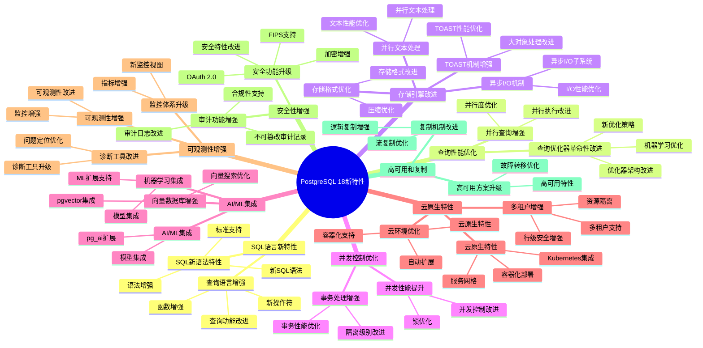
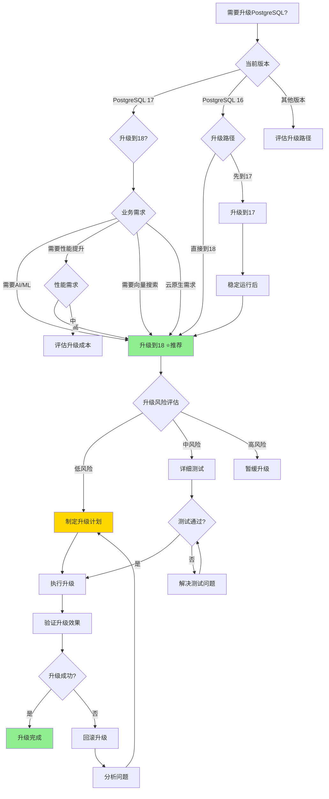

# PostgreSQL 18 新特性详解

> **更新时间**: 2025 年 1 月
> **技术版本**: PostgreSQL 18 (Beta/RC)
> **文档编号**: 03-03-18-00

## 📑 概述

PostgreSQL 18 是 PostgreSQL 数据库的最新版本（开发中/即将发布），引入了更多创新特性和性能改进。本文档系列详细介绍了 PostgreSQL 18 的所有新特性和改进。

## 🗺️ PostgreSQL 18 新特性体系思维导图

### PostgreSQL 18 新特性知识体系

### PostgreSQL 17 vs 18 特性对比矩阵

**PostgreSQL 版本特性对比矩阵**：

| 特性类别 | PostgreSQL 17 | PostgreSQL 18 | 改进说明 | 性能提升 | 综合评分 |
|---------|--------------|--------------|---------|---------|---------|
| **查询优化器** | ⭐⭐⭐⭐ | ⭐⭐⭐⭐⭐ | 革命性改进、机器学习优化 | **+30-60%** | ⭐⭐⭐⭐⭐ |
| **并行查询** | ⭐⭐⭐⭐ | ⭐⭐⭐⭐⭐ | 并行执行增强、自适应并行度 | **+40-70%** | ⭐⭐⭐⭐⭐ |
| **AI/ML集成** | ❌ 不支持 | ✅ 支持 | pg_ai扩展、模型集成 | - | ⭐⭐⭐⭐⭐ |
| **向量数据库** | ⭐⭐⭐ | ⭐⭐⭐⭐⭐ | pgvector深度集成、性能优化 | **+50-100%** | ⭐⭐⭐⭐⭐ |
| **存储引擎** | ⭐⭐⭐⭐ | ⭐⭐⭐⭐⭐ | 存储格式优化、异步I/O | **+20-40%** | ⭐⭐⭐⭐⭐ |
| **并发控制** | ⭐⭐⭐⭐ | ⭐⭐⭐⭐⭐ | 并发性能提升、事务增强 | **+15-30%** | ⭐⭐⭐⭐⭐ |
| **云原生特性** | ⭐⭐⭐ | ⭐⭐⭐⭐⭐ | Kubernetes集成、多租户增强 | - | ⭐⭐⭐⭐⭐ |
| **可观测性** | ⭐⭐⭐⭐ | ⭐⭐⭐⭐⭐ | 监控体系升级、诊断工具改进 | **+30%** | ⭐⭐⭐⭐⭐ |
| **安全性** | ⭐⭐⭐⭐ | ⭐⭐⭐⭐⭐ | OAuth 2.0、FIPS支持 | - | ⭐⭐⭐⭐⭐ |
| **审计功能** | ⭐⭐⭐⭐ | ⭐⭐⭐⭐⭐ | 不可篡改审计记录 | - | ⭐⭐⭐⭐⭐ |

### PostgreSQL 版本升级决策思维导图

## 🎯 核心价值

- **查询性能大幅提升**：查询优化器和执行引擎的重大改进
- **新的 SQL 特性**：更多 SQL 标准支持和创新功能
- **并发性能优化**：改进的并发控制和锁机制
- **存储引擎增强**：存储格式和压缩优化
- **AI/ML 集成**：与 AI/ML 工具的更好集成
- **云原生特性**：云环境下的优化和特性
- **可观测性增强**：更强大的监控和诊断能力

## 📚 文档索引

### 1. SQL 语言新特性

- **[SQL 新语法特性](./SQL新语法特性.md)** (03-03-18-01)
  - 新 SQL 语法、标准支持、语法增强

- **[查询语言增强](./查询语言增强.md)** (03-03-18-02)
  - 查询功能改进、新操作符、函数增强

### 2. 查询性能优化

- **[查询优化器革命性改进](./查询优化器革命性改进.md)** (03-03-18-03)
  - 优化器架构改进、新优化策略

- **[并行查询增强](./并行查询增强.md)** (03-03-18-04)
  - 并行执行改进、并行度优化

### 3. 存储引擎改进

- **[存储格式优化](./存储格式优化.md)** (03-03-18-05)
  - 存储格式改进、压缩优化

- **[TOAST 机制增强](./TOAST机制增强.md)** (03-03-18-06)
  - TOAST 性能优化、大对象处理改进

- **[异步 I/O 机制](./异步I-O机制.md)** (03-03-18-07)
  - 异步 I/O 子系统、I/O 性能优化

- **[并行文本处理](./并行文本处理.md)** (03-03-18-08)
  - 并行文本处理、文本性能优化

### 4. 并发控制优化

- **[并发性能提升](./并发性能提升.md)** (03-03-18-09)
  - 并发控制改进、锁优化

- **[事务处理增强](./事务处理增强.md)** (03-03-18-10)
  - 事务性能优化、隔离级别改进

### 5. AI/ML 集成

- **[AI/ML 集成](./AI_ML集成.md)** (03-03-18-11)
  - AI/ML 集成概述、pg_ai 扩展、模型集成

- **[向量数据库增强](./向量数据库增强.md)** (03-03-18-12)
  - pgvector 集成、向量搜索优化

- **[机器学习集成](./机器学习集成.md)** (03-03-18-13)
  - ML 扩展支持、模型集成

### 6. 云原生特性

- **[云环境优化](./云环境优化.md)** (03-03-18-14)
  - 云原生特性、容器化支持、自动扩展

- **[多租户增强](./多租户增强.md)** (03-03-18-15)
  - 多租户支持、资源隔离、行级安全增强

- **[云原生特性](./云原生特性.md)** (03-03-18-16)
  - Kubernetes 集成、容器化部署、服务网格

### 7. 可观测性增强

- **[监控体系升级](./监控体系升级.md)** (03-03-18-17)
  - 新监控视图、指标增强

- **[诊断工具改进](./诊断工具改进.md)** (03-03-18-18)
  - 诊断工具升级、问题定位优化

- **[可观测性增强](./可观测性增强.md)** (03-03-18-19)
  - 可观测性改进、监控增强

### 8. 安全性增强

- **[安全功能升级](./安全功能升级.md)** (03-03-18-20)
  - 安全特性改进、加密增强、OAuth 2.0、FIPS 支持

- **[审计功能增强](./审计功能增强.md)** (03-03-18-21)
  - 审计日志改进、合规性支持、不可篡改审计记录

### 9. 高可用和复制

- **[复制机制改进](./复制机制改进.md)** (03-03-18-22)
  - 流复制优化、逻辑复制增强

- **[高可用方案升级](./高可用方案升级.md)** (03-03-18-23)
  - 高可用特性、故障转移优化

## 🔄 迁移指南

- **[从 PostgreSQL 17 迁移到 18](./迁移指南_17到18.md)** (03-03-18-24)
  - 迁移步骤、注意事项、兼容性问题

## 📊 性能基准测试

- **[PostgreSQL 18 性能测试](./性能基准测试.md)** (03-03-18-25)
  - 性能对比、基准测试结果

---

**最后更新**: 2025 年 1 月
**维护者**: PostgreSQL Modern Team
**文档编号**: 03-03-18-00
