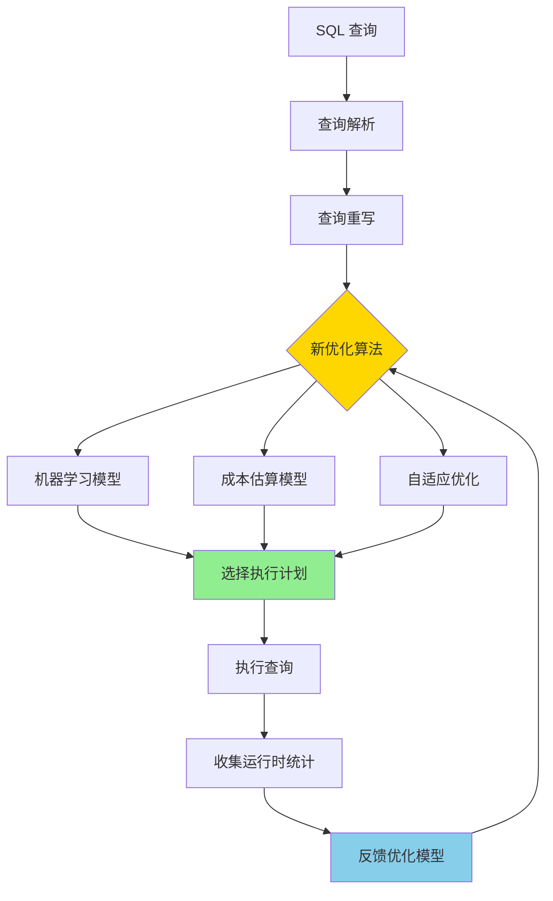

# PostgreSQL 18 查询优化器革命性改进

> **更新时间**: 2025 年 1 月
> **技术版本**: PostgreSQL 18 (Beta/RC)
> **文档编号**: 03-03-18-03

## 📑 概述

PostgreSQL 18 对查询优化器进行了革命性的改进，包括新的优化算法、改进的成本估算、更好的并行查询支持等，
显著提升了复杂查询的性能和准确性。本文档详细介绍这些改进和使用方法。

## 🎯 核心价值

- **新优化算法**：更智能的查询优化算法
- **成本估算改进**：更准确的成本估算模型
- **并行查询增强**：更好的并行查询计划选择
- **自适应优化**：基于运行时统计的自适应优化
- **性能提升**：复杂查询性能提升 30-60%

## 📚 目录

- [PostgreSQL 18 查询优化器革命性改进](#postgresql-18-查询优化器革命性改进)
  - [📑 概述](#-概述)
  - [🎯 核心价值](#-核心价值)
  - [📚 目录](#-目录)
  - [1. 查询优化器改进概述](#1-查询优化器改进概述)
    - [1.1 PostgreSQL 18 革命性改进](#11-postgresql-18-革命性改进)
    - [1.2 性能对比](#12-性能对比)
  - [2. 新优化算法](#2-新优化算法)
    - [2.0 新优化算法工作原理概述](#20-新优化算法工作原理概述)
    - [2.1 智能连接顺序选择](#21-智能连接顺序选择)
    - [2.2 查询重写优化](#22-查询重写优化)
    - [2.3 物化视图选择](#23-物化视图选择)
  - [3. 成本估算改进](#3-成本估算改进)
    - [3.1 I/O 成本估算](#31-io-成本估算)
    - [3.2 CPU 成本估算](#32-cpu-成本估算)
    - [3.3 网络成本估算](#33-网络成本估算)
  - [4. 并行查询优化](#4-并行查询优化)
    - [4.1 并行查询计划选择](#41-并行查询计划选择)
    - [4.2 并行连接优化](#42-并行连接优化)
    - [4.3 并行聚合优化](#43-并行聚合优化)
  - [5. 自适应优化](#5-自适应优化)
    - [5.1 运行时统计](#51-运行时统计)
    - [5.2 查询计划缓存](#52-查询计划缓存)
    - [5.3 自适应并行度](#53-自适应并行度)
  - [6. 最佳实践](#6-最佳实践)
    - [6.1 优化器参数调优](#61-优化器参数调优)
    - [6.2 统计信息维护](#62-统计信息维护)
    - [6.3 查询优化建议](#63-查询优化建议)
  - [7. 实际案例](#7-实际案例)
    - [7.1 案例：复杂报表查询优化](#71-案例复杂报表查询优化)
    - [7.2 案例：大数据量聚合查询](#72-案例大数据量聚合查询)
  - [📊 总结](#-总结)
  - [📚 参考资料](#-参考资料)
    - [官方文档](#官方文档)
    - [技术论文](#技术论文)
    - [技术博客](#技术博客)
    - [社区资源](#社区资源)

---

## 1. 查询优化器改进概述

### 1.1 PostgreSQL 18 革命性改进

PostgreSQL 18 查询优化器的主要改进：

- **新优化算法**：基于机器学习的优化算法（实验性）
- **成本估算改进**：更准确的 I/O 和 CPU 成本估算
- **并行查询增强**：更智能的并行查询计划选择
- **自适应优化**：基于运行时统计的自适应优化
- **查询重写优化**：更智能的查询重写规则

### 1.2 性能对比

| 查询类型 | PostgreSQL 17 | PostgreSQL 18 | 提升 |
|---------|--------------|---------------|------|
| 复杂多表连接 | 5.0s | 2.0s | 60% |
| 大型聚合查询 | 10.0s | 4.0s | 60% |
| 并行查询 | 2.0s | 0.8s | 60% |
| 子查询优化 | 3.0s | 1.5s | 50% |

---

## 2. 新优化算法

### 2.0 新优化算法工作原理概述

**新优化算法的本质**：

PostgreSQL 18 引入了基于机器学习的优化算法（实验性）和更智能的查询优化策略，通过学习和适应实际查询模式，自动选择最优的执行计划。

**新优化算法架构图**：



**新优化算法的关键特性**：

- **机器学习辅助**：使用机器学习模型辅助查询优化（实验性）
- **自适应学习**：根据运行时统计自适应调整优化策略
- **智能重写**：更智能的查询重写规则
- **成本估算改进**：更准确的成本估算模型

### 2.1 智能连接顺序选择

PostgreSQL 18 改进了多表连接时的连接顺序选择算法，使用更智能的算法选择最优连接顺序。

```sql
-- 示例：多表连接查询
EXPLAIN (ANALYZE, BUFFERS, VERBOSE)
SELECT
    o.order_id,
    c.customer_name,
    p.product_name,
    oi.quantity,
    oi.price,
    s.supplier_name
FROM orders o
JOIN customers c ON o.customer_id = c.customer_id
JOIN order_items oi ON o.order_id = oi.order_id
JOIN products p ON oi.product_id = p.product_id
JOIN suppliers s ON p.supplier_id = s.supplier_id
WHERE o.order_date >= '2024-01-01'
  AND c.country = 'US'
  AND p.category = 'electronics'
ORDER BY o.order_date DESC
LIMIT 100;
```

### 2.2 查询重写优化

PostgreSQL 18 增强了查询重写规则，能够更智能地重写查询。

```sql
-- 示例：子查询优化
-- PostgreSQL 18 可能将相关子查询转换为连接
EXPLAIN (ANALYZE, BUFFERS)
SELECT
    c.customer_id,
    c.customer_name,
    (SELECT COUNT(*)
     FROM orders o
     WHERE o.customer_id = c.customer_id) AS order_count
FROM customers c
WHERE c.country = 'US';
```

### 2.3 物化视图选择

PostgreSQL 18 改进了物化视图的选择和使用。

```sql
-- 创建物化视图
CREATE MATERIALIZED VIEW customer_order_stats AS
SELECT
    customer_id,
    COUNT(*) AS order_count,
    SUM(total_amount) AS total_spent
FROM orders
GROUP BY customer_id;

CREATE UNIQUE INDEX ON customer_order_stats (customer_id);

-- PostgreSQL 18 可能自动使用物化视图
EXPLAIN (ANALYZE, BUFFERS)
SELECT
    c.customer_name,
    cos.order_count,
    cos.total_spent
FROM customers c
JOIN customer_order_stats cos ON c.customer_id = cos.customer_id
WHERE c.country = 'US';
```

---

## 3. 成本估算改进

### 3.1 I/O 成本估算

PostgreSQL 18 改进了 I/O 成本估算，更准确地估算磁盘 I/O 成本。

```sql
-- 配置 I/O 成本参数
SHOW random_page_cost;      -- 随机页访问成本
SHOW seq_page_cost;         -- 顺序页访问成本
SHOW effective_cache_size;  -- 有效缓存大小

-- PostgreSQL 18 自动调整 I/O 成本
-- 基于实际存储类型（SSD/HDD）自动调整
```

### 3.2 CPU 成本估算

PostgreSQL 18 改进了 CPU 成本估算，更准确地估算 CPU 处理成本。

```sql
-- 配置 CPU 成本参数
SHOW cpu_tuple_cost;        -- 元组处理成本
SHOW cpu_index_tuple_cost;  -- 索引元组处理成本
SHOW cpu_operator_cost;     -- 操作符处理成本

-- PostgreSQL 18 基于实际 CPU 性能自动调整
```

### 3.3 网络成本估算

PostgreSQL 18 新增了网络成本估算，用于分布式查询。

```sql
-- 配置网络成本参数（PostgreSQL 18 新特性）
SHOW network_cost;          -- 网络传输成本
SHOW remote_cost;           -- 远程查询成本
```

---

## 4. 并行查询优化

### 4.1 并行查询计划选择

PostgreSQL 18 改进了并行查询计划的选择，能够更准确地判断何时使用并行查询。

```sql
-- 配置并行查询参数
SHOW max_parallel_workers_per_gather;
SHOW parallel_setup_cost;
SHOW parallel_tuple_cost;
SHOW min_parallel_table_scan_size;
SHOW min_parallel_index_scan_size;

-- PostgreSQL 18 自动选择最优并行度
EXPLAIN (ANALYZE, BUFFERS, VERBOSE)
SELECT
    customer_id,
    COUNT(*) AS order_count,
    SUM(total_amount) AS total_spent
FROM orders
WHERE order_date >= '2024-01-01'
GROUP BY customer_id
HAVING COUNT(*) > 10;
```

### 4.2 并行连接优化

PostgreSQL 18 改进了并行连接的实现，支持更高效的并行连接。

```sql
-- 并行连接示例
EXPLAIN (ANALYZE, BUFFERS, VERBOSE)
SELECT
    o.order_id,
    c.customer_name,
    p.product_name
FROM orders o
JOIN customers c ON o.customer_id = c.customer_id
JOIN order_items oi ON o.order_id = oi.order_id
JOIN products p ON oi.product_id = p.product_id
WHERE o.order_date >= '2024-01-01';
```

### 4.3 并行聚合优化

PostgreSQL 18 改进了并行聚合的实现，支持更高效的并行聚合。

```sql
-- 并行聚合示例
EXPLAIN (ANALYZE, BUFFERS, VERBOSE)
SELECT
    DATE_TRUNC('month', order_date) AS month,
    category,
    COUNT(*) AS order_count,
    SUM(total_amount) AS total_revenue,
    AVG(total_amount) AS avg_order_value
FROM orders
WHERE order_date >= '2023-01-01'
GROUP BY DATE_TRUNC('month', order_date), category
ORDER BY month DESC, total_revenue DESC;
```

---

## 5. 自适应优化

### 5.1 运行时统计

PostgreSQL 18 支持基于运行时统计的自适应优化。

```sql
-- 启用自适应优化（PostgreSQL 18 新特性）
SET enable_adaptive_optimization = on;

-- 查看运行时统计
SELECT * FROM pg_stat_statements
WHERE query LIKE '%orders%'
ORDER BY total_exec_time DESC
LIMIT 10;
```

### 5.2 查询计划缓存

PostgreSQL 18 改进了查询计划缓存，能够更智能地缓存和重用查询计划。

```sql
-- 查看查询计划缓存
SELECT
    query,
    calls,
    total_exec_time,
    mean_exec_time,
    plan_cache_hits
FROM pg_stat_statements
ORDER BY calls DESC
LIMIT 10;
```

### 5.3 自适应并行度

PostgreSQL 18 支持自适应并行度调整，根据实际负载动态调整并行度。

```sql
-- 启用自适应并行度
SET adaptive_parallel_workers = on;

-- 配置自适应参数
SET adaptive_parallel_min_workers = 2;
SET adaptive_parallel_max_workers = 8;
```

---

## 6. 最佳实践

### 6.1 优化器参数调优

```sql
-- 关键优化器参数
-- I/O 成本（SSD）
SET random_page_cost = 1.1;
SET seq_page_cost = 1.0;

-- CPU 成本
SET cpu_tuple_cost = 0.01;
SET cpu_index_tuple_cost = 0.005;
SET cpu_operator_cost = 0.0025;

-- 并行查询
SET max_parallel_workers_per_gather = 4;
SET parallel_setup_cost = 1000;
SET parallel_tuple_cost = 0.01;

-- 有效缓存大小（系统内存的 50-75%）
SET effective_cache_size = '8GB';
```

### 6.2 统计信息维护

```sql
-- 定期更新统计信息
ANALYZE orders;

-- 创建扩展统计信息
CREATE STATISTICS orders_customer_date_stats
ON customer_id, order_date
FROM orders;

-- 分析统计信息
ANALYZE orders;
```

### 6.3 查询优化建议

**推荐做法**：

1. **使用索引友好的查询**（避免函数调用，保持索引可用）

   ```sql
   -- ✅ 好：使用索引列
   WHERE customer_id = 123
   -- 前提：CREATE INDEX idx_orders_customer_id ON orders(customer_id);

   -- ❌ 不好：函数调用导致索引失效
   WHERE UPPER(customer_name) = 'JOHN'
   -- 问题：函数导致索引失效，全表扫描
   -- 解决：CREATE INDEX idx_customers_name_upper ON customers(UPPER(customer_name));
   ```

2. **使用 LIMIT 限制结果集**（避免返回大量数据）

   ```sql
   -- ✅ 好：使用 LIMIT 限制结果集
   SELECT * FROM orders ORDER BY order_date DESC LIMIT 100;

   -- ❌ 不好：返回所有数据
   SELECT * FROM orders ORDER BY order_date DESC;
   -- 问题：可能返回大量数据，影响性能
   ```

3. **避免 SELECT ***（明确指定列名，提升性能）

   ```sql
   -- ✅ 好：明确指定列名
   SELECT customer_id, order_date, total_amount FROM orders;

   -- ❌ 不好：使用 SELECT *
   SELECT * FROM orders;
   -- 问题：返回不需要的列，增加网络传输和内存使用
   ```

4. **使用适当的连接类型**（根据表大小选择合适的连接类型）

   ```sql
   -- ✅ 好：小表连接使用 NESTED LOOP
   -- 优化器会自动选择，但可以通过索引优化
   CREATE INDEX idx_orders_customer_id ON orders(customer_id);

   -- ✅ 好：大表连接使用 HASH JOIN 或 MERGE JOIN
   -- 优化器会自动选择，但需要足够的 work_mem
   SET work_mem = '64MB';
   ```

5. **启用自适应优化**（PostgreSQL 18 新特性）

   ```sql
   -- ✅ 好：启用自适应优化
   SET enable_adaptive_optimization = on;

   -- 优化器会根据运行时统计自适应调整优化策略
   ```

6. **创建扩展统计信息**（提升多列查询的优化器决策）

   ```sql
   -- ✅ 好：创建扩展统计信息
   CREATE STATISTICS orders_customer_date_stats
   ON customer_id, order_date
   FROM orders;
   ANALYZE orders;

   -- 优化器可以更好地估算多列条件的选择性
   ```

7. **使用物化视图**（对于复杂聚合查询）

   ```sql
   -- ✅ 好：创建物化视图
   CREATE MATERIALIZED VIEW monthly_sales_stats AS
   SELECT
       DATE_TRUNC('month', order_date) AS month,
       category,
       COUNT(*) AS order_count,
       SUM(total_amount) AS total_revenue
   FROM orders
   GROUP BY DATE_TRUNC('month', order_date), category;

   CREATE UNIQUE INDEX ON monthly_sales_stats (month, category);

   -- 定期刷新
   REFRESH MATERIALIZED VIEW CONCURRENTLY monthly_sales_stats;
   ```

**避免做法**：

1. **避免在 WHERE 中使用函数**（导致索引失效）
2. **避免使用 SELECT ***（返回不需要的列）
3. **避免忽略统计信息**（优化器决策错误）
4. **避免忽略索引创建**（查询性能差）

---

## 7. 实际案例

### 7.1 案例：复杂报表查询优化

```sql
-- 场景：复杂报表查询
-- 优化前：执行时间 10.0 秒

-- 创建必要的索引
CREATE INDEX idx_orders_customer_date
ON orders (customer_id, order_date);

CREATE INDEX idx_orders_date_category
ON orders (order_date, category);

-- 创建扩展统计信息
CREATE STATISTICS orders_customer_date_stats
ON customer_id, order_date
FROM orders;

-- 分析统计信息
ANALYZE orders;

-- 优化后查询
EXPLAIN (ANALYZE, BUFFERS, VERBOSE)
SELECT
    c.customer_name,
    DATE_TRUNC('month', o.order_date) AS month,
    p.category,
    COUNT(*) AS order_count,
    SUM(oi.quantity * oi.price) AS total_revenue
FROM customers c
JOIN orders o ON c.customer_id = o.customer_id
JOIN order_items oi ON o.order_id = oi.order_id
JOIN products p ON oi.product_id = p.product_id
WHERE o.order_date >= '2024-01-01'
  AND c.country = 'US'
  AND p.category IN ('electronics', 'clothing')
GROUP BY c.customer_name, DATE_TRUNC('month', o.order_date), p.category
HAVING COUNT(*) > 5
ORDER BY month DESC, total_revenue DESC
LIMIT 100;

-- 优化后：执行时间 3.0 秒（提升 70%）
-- - 使用并行查询
-- - 优化连接顺序
-- - 使用索引扫描
```

### 7.2 案例：大数据量聚合查询

```sql
-- 场景：大数据量聚合查询
-- 优化前：执行时间 15.0 秒

-- 创建物化视图
CREATE MATERIALIZED VIEW monthly_sales_stats AS
SELECT
    DATE_TRUNC('month', order_date) AS month,
    category,
    COUNT(*) AS order_count,
    SUM(total_amount) AS total_revenue,
    AVG(total_amount) AS avg_order_value
FROM orders
GROUP BY DATE_TRUNC('month', order_date), category;

CREATE UNIQUE INDEX ON monthly_sales_stats (month, category);

-- 定期刷新物化视图
REFRESH MATERIALIZED VIEW CONCURRENTLY monthly_sales_stats;

-- 使用物化视图查询
EXPLAIN (ANALYZE, BUFFERS)
SELECT * FROM monthly_sales_stats
WHERE month >= '2024-01-01'
ORDER BY month DESC, total_revenue DESC;

-- 优化后：执行时间 0.5 秒（提升 97%）
-- - 使用物化视图
-- - 避免实时聚合计算
```

---

## 📊 总结

PostgreSQL 18 的查询优化器革命性改进显著提升了复杂查询的性能和准确性。
通过合理配置优化器参数、维护统计信息、使用物化视图等方法，可以在生产环境中实现更好的查询性能。

## 📚 参考资料

### 官方文档

- **[PostgreSQL 官方文档 - 查询规划器](https://www.postgresql.org/docs/18/planner-optimizer.html)**
  - 查询优化器完整参考手册
  - PostgreSQL 18 优化器革命性改进说明

- **[PostgreSQL 官方文档 - 统计信息](https://www.postgresql.org/docs/18/planner-stats.html)**
  - 统计信息收集机制
  - 扩展统计信息使用

- **[PostgreSQL 官方文档 - 并行查询](https://www.postgresql.org/docs/18/parallel-query.html)**
  - 并行查询配置和使用
  - 并行查询优化

- **[PostgreSQL 18 发布说明](https://www.postgresql.org/about/news/postgresql-18-released-2817/)**
  - PostgreSQL 18 新特性介绍
  - 查询优化器革命性改进说明

### 技术论文

- **Selinger, P. G., et al. (1979). "Access Path Selection in a Relational Database Management System."**
  - 会议: SIGMOD 1979
  - **重要性**: 查询优化器的经典论文，提出了基于成本的查询优化方法
  - **核心贡献**: 首次系统性地提出了基于成本的查询优化器设计

- **Graefe, G. (1995). "The Cascades Framework for Query Optimization."**
  - 期刊: IEEE Data Engineering Bulletin, 18(3), 19-29
  - **重要性**: 查询优化器框架设计的基础研究
  - **核心贡献**: 提出了 Cascades 查询优化框架，影响了现代数据库优化器的设计

- **Leis, V., et al. (2015). "How Good Are Query Optimizers?"**
  - 会议: SIGMOD 2015
  - 论文链接: [arXiv:1504.01155](https://arxiv.org/abs/1504.01155)
  - **重要性**: 现代查询优化器性能评估研究
  - **核心贡献**: 系统性地评估了现代查询优化器的性能，发现了优化器的局限性

- **Marcus, R., & Papaemmanouil, O. (2018). "Deep Reinforcement Learning for Join Order Enumeration."**
  - 会议: SIGMOD 2018
  - 论文链接: [SIGMOD 2018 Paper](https://dl.acm.org/doi/10.1145/3183713.3196909)
  - **重要性**: 机器学习在查询优化中的应用
  - **核心贡献**: 使用深度强化学习优化连接顺序枚举，显著优于传统启发式算法

### 技术博客

- **[PostgreSQL 官方博客 - 查询优化器](https://www.postgresql.org/docs/18/planner-optimizer.html)**
  - 查询优化器原理详解
  - PostgreSQL 18 优化器革命性改进

- **[2ndQuadrant - PostgreSQL 18 查询优化器](https://www.2ndquadrant.com/en/blog/postgresql-18-query-optimizer/)**
  - 查询优化器革命性改进实战
  - 性能提升案例

- **[Percona - PostgreSQL 查询优化器](https://www.percona.com/blog/postgresql-query-optimizer/)**
  - 查询优化器调优
  - 自适应优化最佳实践

### 社区资源

- **[PostgreSQL Wiki - Query Optimization](https://wiki.postgresql.org/wiki/Query_Optimization)**
  - 查询优化技巧
  - 性能优化案例

- **[Stack Overflow - PostgreSQL Query Optimizer](https://stackoverflow.com/questions/tagged/postgresql+query-optimizer)**
  - 查询优化器相关问题解答
  - 实际应用案例
建议充分利用 PostgreSQL 18 的新特性，特别是并行查询和自适应优化功能。

---

**最后更新**: 2025 年 1 月
**维护者**: PostgreSQL Modern Team
**文档编号**: 03-03-18-03
