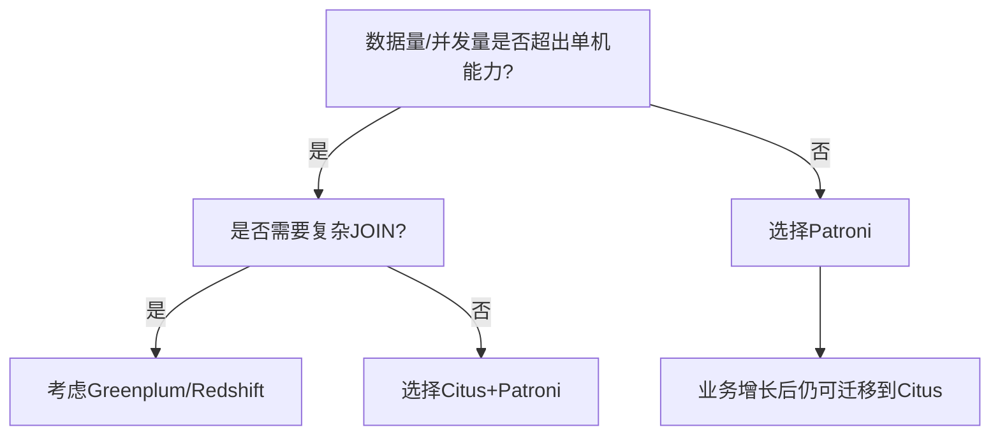

# PostgreSQL Patroni 与 Citus 核心区别

> **更新时间**: 2025 年 1 月
> **技术版本**: PostgreSQL 16+/17+/18+ with Patroni 3.0+, Citus 12.1+
> **文档编号**: 03-03-TREND-35

## 📑 目录

- [PostgreSQL Patroni 与 Citus 核心区别](#postgresql-patroni-与-citus-核心区别)
  - [📑 目录](#-目录)
  - [一、核心定位与本质区别](#一核心定位与本质区别)
  - [二、架构与工作原理](#二架构与工作原理)
    - [2.1 Patroni 架构](#21-patroni-架构)
    - [2.2 Citus 架构](#22-citus-架构)
  - [三、功能特性对比](#三功能特性对比)
  - [四、典型应用场景](#四典型应用场景)
    - [4.1 Patroni 适用场景](#41-patroni-适用场景)
    - [4.2 Citus 适用场景](#42-citus-适用场景)
  - [五、协作关系：1+1\>2](#五协作关系112)
  - [六、选型决策树](#六选型决策树)
  - [七、总结建议](#七总结建议)
  - [八、参考资料](#八参考资料)
    - [8.1 官方文档](#81-官方文档)
    - [8.2 相关文档](#82-相关文档)
    - [8.3 实际应用案例](#83-实际应用案例)
    - [8.4 相关资源](#84-相关资源)

---

## 一、核心定位与本质区别

这两个工具解决的问题域完全不同，**Patroni**专注于**高可用性**，而 **Citus** 专注于**水平扩展**。它们可以独立使用，也常结合部署。

| 对比维度 | **Patroni** | **Citus** |
|----------|-------------|-----------|
| **核心目标** | **高可用性 (High Availability)**<br>自动故障转移与集群管理 | **水平扩展 (Horizontal Scaling)**<br>分布式数据分片与并行查询 |
| **本质** | 基于Python的**管理框架**<br>不修改PostgreSQL内核 | PostgreSQL的**扩展插件**<br>深度集成至数据库引擎 |
| **解决问题** | 节点宕机时自动切换主备，保障服务持续性 | 单机性能瓶颈，通过分片实现读写能力线性增长 |

**一句话概括**：Patroni是PostgreSQL的"**故障自愈系统**"，Citus是PostgreSQL的"**分布式加速引擎**"。

---

## 二、架构与工作原理

### 2.1 Patroni 架构

- **外部协调者模式**：每个PG节点独立运行Patroni代理进程

- **依赖DCS**：通过etcd/Consul/ZooKeeper实现分布式共识和领导者选举

- **无侵入性**：不改写SQL，对应用透明

- **复制机制**：基于PostgreSQL原生流复制，支持同步/异步模式

- **脑裂防护**：通过领导者锁和Linux看门狗杜绝双主

> Patroni持续监控主备节点健康状态，通过REST API统一配置，故障时自动执行切换并将原主节点重新加入集群

### 2.2 Citus 架构

- **插件化改造**：安装扩展后，PostgreSQL变为分布式数据库

- **双角色设计**：
  - **Coordinator节点**：接收SQL，解析执行计划，路由查询
  - **Worker节点**：存储数据分片，执行并行计算

- **数据分片**：通过`create_distributed_table()`将表按分片键哈希分布

- **查询处理**：将复杂查询分解为片段，分发到各Worker并行执行后汇总

> Citus采用无共享架构(Shared-Nothing)，通过分片实现存储和计算能力的水平扩展，适合大规模数据场景

---

## 三、功能特性对比

| 功能 | Patroni | Citus |
|------|---------|-------|
| **故障检测与转移** | ✅ 秒级自动切换，RTO通常<30秒 | ⚠️ 依赖外部HA工具（如Patroni） |
| **数据分片** | ❌ 不涉及 | ✅ 自动分片，支持100+节点 |
| **读扩展** | ✅ 通过增加备节点 | ✅ Worker节点天然支持 |
| **写扩展** | ❌ 单主限制 | ✅ 多分片并行写入 |
| **跨分片JOIN** | N/A | ⚠️ 仅支持共置(co-located)JOIN，复杂JOIN性能受限 |
| **多租户支持** | N/A | ✅ 租户隔离优化，支持SaaS场景 |
| **配置方式** | YAML文件+DCS | SQL命令+扩展参数 |
| **应用透明度** | 完全透明 | 需选择分片键，部分场景需改写SQL |

---

## 四、典型应用场景

### 4.1 Patroni 适用场景

- **金融交易系统**：要求RPO≈0，不能接受数据丢失

- **电商平台**：订单、支付等核心业务的高可用保障

- **数据规模中等**：TB级以下，性能无需分片

- **技术栈简单**：不愿引入分布式复杂性

### 4.2 Citus 适用场景

- **实时分析**：每秒数千次写入，数百次并发查询

- **多租户SaaS**：为数千企业客户提供隔离服务

- **数据仓库**：PB级数据扫描，复杂聚合分析

- **物联网**：海量设备时序数据存储与查询

---

## 五、协作关系：1+1>2

两者**不是竞争关系**，而是互补的黄金搭档：

```bash
# 典型部署架构
Coordinator节点 (Patroni HA集群)
   ↓
Worker节点1 (Patroni HA集群)  Worker节点2 (Patroni HA集群)  Worker节点3...
```

**整合优势**：

- **Citus负责扩展**：数据分片、并行查询

- **Patroni负责高可用**：每个Worker和Coordinator都组成Patroni集群

- **自动元数据管理**：Patroni自动在Coordinator上维护Worker节点状态

- **故障无感知**：Worker主节点宕机时，Patroni自动切换，Citus自动识别新主

**部署要点**：

1. Patroni自动将`citus`加入`shared_preload_libraries`

2. 设置`synchronous_mode = quorum`保障数据一致性

3. Coordinator自动发现Worker主节点并更新`pg_dist_node`元数据

4. 支持按Worker组独立执行故障切换

---

## 六、选型决策树



---

## 七、总结建议

| 需求 | 推荐方案 | 理由 |
|------|----------|------|
| **只求高可用，数据量不大** | **Patroni** | 轻量、稳定、易维护 |
| **数据量大，但业务简单** | **Citus** | 水平扩展，性能线性增长 |
| **既要高可用又要扩展** | **Citus + Patroni** | 生产环境主流方案 |
| **复杂分析查询** | **专用OLAP引擎** | Citus对非分片键JOIN支持有限 |

**最终建议**：对于绝大多数需要扩展的生产PostgreSQL集群，**Citus与Patroni的组合是事实标准**。Citus解决"能不能处理"的问题，Patroni解决"能不能持续提供服务"的问题。

---

## 八、参考资料

### 8.1 官方文档

- **[Patroni 官方文档](https://patroni.readthedocs.io/)**
  - 版本: Patroni 3.0+
  - 内容: Patroni 高可用集群管理框架
  - **最后更新**: 2025-01-15

- **[Citus 官方文档](https://docs.citusdata.com/)**
  - 版本: Citus 12.1+
  - 内容: Citus 分布式数据库扩展
  - **最后更新**: 2025-01-15

### 8.2 相关文档

- [Citus 分布式数据库详解](./Citus分布式数据库详解.md)
- [Citus 与 PostgreSQL 18 集成](./Citus与PostgreSQL18集成.md)
- [高可用体系详解](../09-高可用/高可用体系详解.md)
- [复制与高可用](../09-高可用/复制与高可用.md)

### 8.3 实际应用案例

- **Microsoft Azure Database for PostgreSQL**
  - 场景: 云数据库服务
  - 技术: Citus + Patroni 组合
  - 效果: 支持 PB 级数据，99.99% 可用性

- **阿里巴巴 AnalyticDB for PostgreSQL**
  - 场景: 企业级数据仓库
  - 技术: Citus 分布式架构 + 高可用方案
  - 效果: 支持大规模 OLAP 查询，自动故障转移

### 8.4 相关资源

- [PostgreSQL 高可用最佳实践](https://www.postgresql.org/docs/current/high-availability.html)
- [分布式数据库架构设计](https://www.postgresql.org/docs/current/high-availability.html)

---

**最后更新**: 2025 年 1 月
**维护者**: PostgreSQL Modern Team
**文档编号**: 03-03-TREND-35
