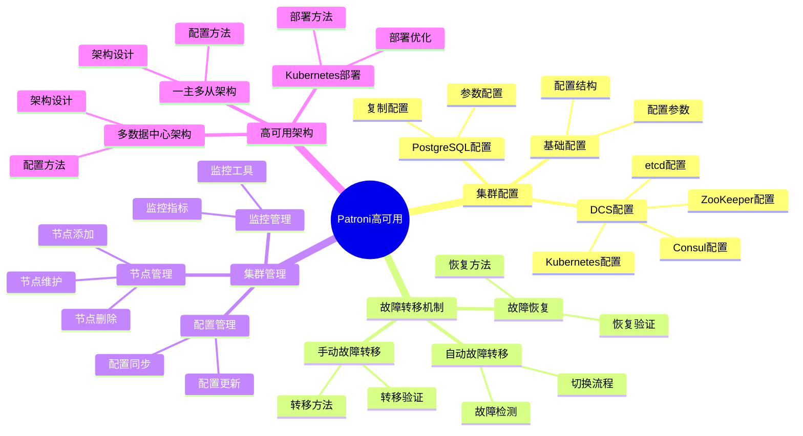
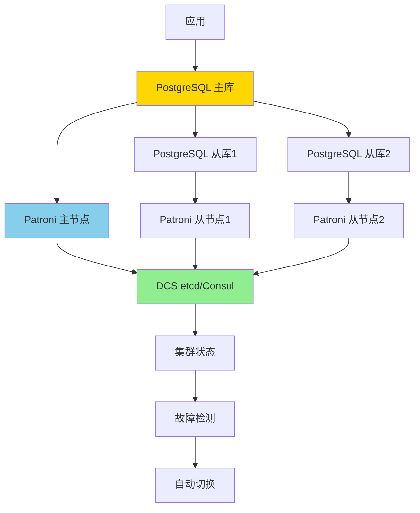
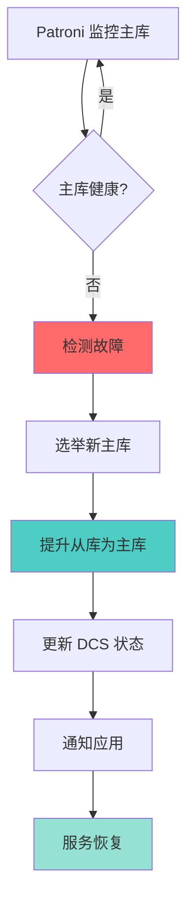
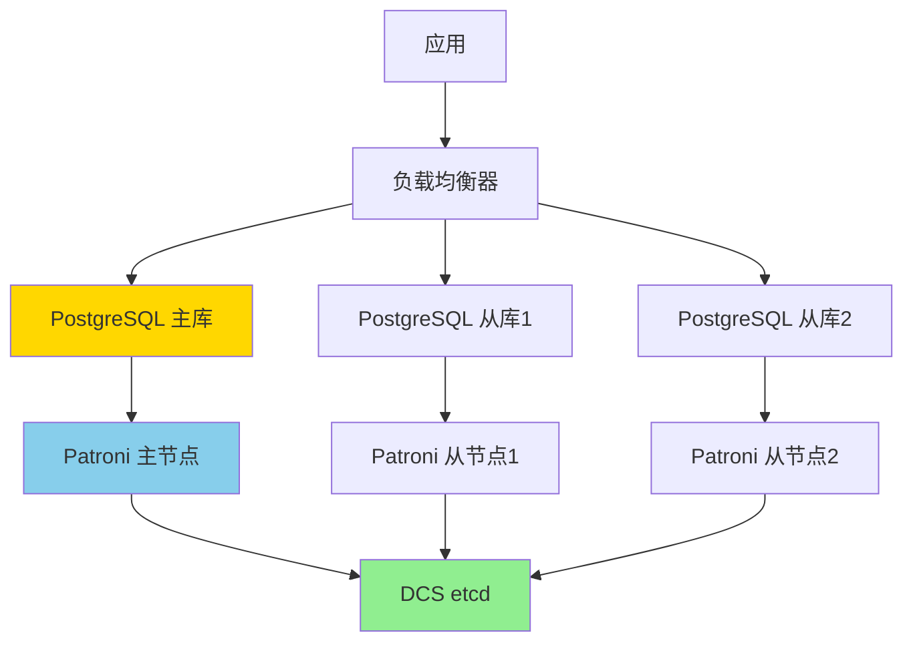

# Patroni 高可用详解：PostgreSQL 自动故障转移方案

> **更新时间**: 2025 年 1 月
> **技术版本**: PostgreSQL 17+/18+ with Patroni 3.0+
> **文档编号**: 03-03-TREND-36

## 📑 概述

Patroni 是 PostgreSQL 的高可用管理工具，提供自动故障转移、集群管理、配置管理等功能，是构建生产级 PostgreSQL 高可用系统的首选方案。本文档详细介绍 Patroni 的架构、配置、使用和最佳实践。

## 🎯 核心价值

- **自动故障转移**：秒级自动检测和切换，RTO < 30秒
- **零数据丢失**：支持同步复制，RPO = 0
- **集群管理**：统一的集群配置和管理
- **多种后端**：支持 etcd、Consul、ZooKeeper、Kubernetes
- **生产就绪**：稳定可靠，适合生产环境

## 📚 目录

- [Patroni 高可用详解：PostgreSQL 自动故障转移方案](#patroni-高可用详解postgresql-自动故障转移方案)
  - [📑 概述](#-概述)
  - [🎯 核心价值](#-核心价值)
  - [📚 目录](#-目录)
  - [1. Patroni 基础](#1-patroni-基础)
    - [1.0 Patroni高可用知识体系思维导图](#10-patroni高可用知识体系思维导图)
    - [1.1 什么是 Patroni](#11-什么是-patroni)
    - [1.2 Patroni 架构](#12-patroni-架构)
    - [1.3 安装 Patroni](#13-安装-patroni)
  - [2. 集群配置](#2-集群配置)
    - [2.1 基础配置](#21-基础配置)
    - [2.2 DCS 配置](#22-dcs-配置)
    - [2.3 PostgreSQL 配置](#23-postgresql-配置)
  - [3. 故障转移机制](#3-故障转移机制)
    - [3.1 自动故障转移](#31-自动故障转移)
    - [3.2 手动故障转移](#32-手动故障转移)
    - [3.3 故障恢复](#33-故障恢复)
  - [4. 集群管理](#4-集群管理)
    - [4.1 节点管理](#41-节点管理)
    - [4.2 配置管理](#42-配置管理)
    - [4.3 监控管理](#43-监控管理)
  - [5. 高可用架构](#5-高可用架构)
    - [5.1 一主多从架构](#51-一主多从架构)
    - [5.2 多数据中心架构](#52-多数据中心架构)
    - [5.3 Kubernetes 部署](#53-kubernetes-部署)
  - [6. 最佳实践](#6-最佳实践)
    - [6.1 配置建议](#61-配置建议)
    - [6.2 故障处理建议](#62-故障处理建议)
    - [6.3 监控建议](#63-监控建议)
  - [7. 实际案例](#7-实际案例)
    - [7.1 案例：金融系统高可用部署](#71-案例金融系统高可用部署)
    - [7.2 案例：电商平台高可用架构](#72-案例电商平台高可用架构)
  - [📊 总结](#-总结)
  - [6. 常见问题（FAQ）](#6-常见问题faq)
    - [6.1 Patroni基础常见问题](#61-patroni基础常见问题)
      - [Q1: 如何安装和配置Patroni？](#q1-如何安装和配置patroni)
      - [Q2: 如何配置自动故障转移？](#q2-如何配置自动故障转移)
    - [6.2 故障转移常见问题](#62-故障转移常见问题)
      - [Q3: 故障转移需要多长时间？](#q3-故障转移需要多长时间)
  - [📚 参考资料](#-参考资料)
    - [官方文档](#官方文档)
    - [技术论文](#技术论文)
    - [技术博客](#技术博客)
    - [社区资源](#社区资源)

---

## 1. Patroni 基础

### 1.0 Patroni高可用知识体系思维导图



### 1.1 什么是 Patroni

Patroni 是 PostgreSQL 的高可用管理工具，提供：

- **自动故障转移**：自动检测主库故障并切换到从库
- **集群管理**：统一的集群配置和管理
- **配置管理**：集中管理 PostgreSQL 配置
- **多种后端**：支持 etcd、Consul、ZooKeeper、Kubernetes

### 1.2 Patroni 架构



### 1.3 安装 Patroni

```bash
# 安装 Patroni
pip install patroni[etcd]

# 或使用包管理器
# Ubuntu/Debian
apt-get install patroni

# CentOS/RHEL
yum install patroni
```

---

## 2. 集群配置

### 2.1 基础配置

**patroni.yml 配置示例**：

```yaml
scope: postgres
namespace: /db/
name: postgresql1

restapi:
  listen: 0.0.0.0:8008
  connect_address: 192.168.1.10:8008

etcd:
  hosts: 192.168.1.20:2379

bootstrap:
  dcs:
    ttl: 30
    loop_wait: 10
    retry_timeout: 30
    maximum_lag_on_failover: 1048576
    postgresql:
      use_pg_rewind: true
      parameters:
        wal_level: replica
        hot_standby: "on"
        max_connections: 100
        max_wal_senders: 10
        max_replication_slots: 10
        synchronous_standby_names: 'ANY 1 (standby1,standby2)'
  initdb:
    - encoding: UTF8
    - locale: en_US.UTF-8
  pg_hba:
    - host replication replicator 0.0.0.0/0 md5
    - host all all 0.0.0.0/0 md5
  users:
    admin:
      password: admin
      options:
        - createrole
        - createdb

postgresql:
  listen: 0.0.0.0:5432
  connect_address: 192.168.1.10:5432
  data_dir: /var/lib/postgresql/data
  pgpass: /tmp/pgpass
  authentication:
    replication:
      username: replicator
      password: replicator
    superuser:
      username: postgres
      password: postgres
  parameters:
    wal_level: replica
    hot_standby: "on"
    max_connections: 100
    max_wal_senders: 10
    wal_keep_segments: 32
```

### 2.2 DCS 配置

**etcd 配置**：

```yaml
etcd:
  hosts: 192.168.1.20:2379,192.168.1.21:2379,192.168.1.22:2379
  protocol: http
  username: etcd
  password: etcd
```

**Consul 配置**：

```yaml
consul:
  host: 192.168.1.20:8500
  protocol: http
  token: consul-token
```

**Kubernetes 配置**：

```yaml
kubernetes:
  namespace: default
  labels:
    application: postgresql
  use_endpoints: true
  pod_ip: 192.168.1.10
  ports:
    - name: postgresql
      port: 5432
    - name: patroni
      port: 8008
```

### 2.3 PostgreSQL 配置

**同步复制配置**：

```yaml
postgresql:
  parameters:
    synchronous_standby_names: 'ANY 1 (standby1,standby2)'
    synchronous_commit: on
```

**性能优化配置**：

```yaml
postgresql:
  parameters:
    shared_buffers: 256MB
    effective_cache_size: 1GB
    maintenance_work_mem: 64MB
    checkpoint_completion_target: 0.9
    wal_buffers: 16MB
    default_statistics_target: 100
```

---

## 3. 故障转移机制

### 3.1 自动故障转移

**故障检测流程**：



**自动故障转移配置**：

```yaml
bootstrap:
  dcs:
    ttl: 30
    loop_wait: 10
    retry_timeout: 30
    maximum_lag_on_failover: 1048576
```

### 3.2 手动故障转移

```bash
# 查看集群状态
patronictl -c /etc/patroni.yml list

# 手动故障转移
patronictl -c /etc/patroni.yml failover postgres

# 重新加载配置
patronictl -c /etc/patroni.yml reload postgres
```

### 3.3 故障恢复

**pg_rewind 配置**：

```yaml
bootstrap:
  dcs:
    postgresql:
      use_pg_rewind: true
```

**故障恢复流程**：

```bash
# 1. 检查原主库状态
patronictl -c /etc/patroni.yml list

# 2. 使用 pg_rewind 恢复
pg_rewind --target-pgdata=/var/lib/postgresql/data \
  --source-server="host=standby_host port=5432 user=postgres"

# 3. 重新加入集群
patronictl -c /etc/patroni.yml reinit postgres postgresql1
```

---

## 4. 集群管理

### 4.1 节点管理

```bash
# 添加节点
patronictl -c /etc/patroni.yml add postgresql2

# 删除节点
patronictl -c /etc/patroni.yml remove postgresql2

# 重启节点
patronictl -c /etc/patroni.yml restart postgres postgresql1
```

### 4.2 配置管理

```bash
# 更新配置
patronictl -c /etc/patroni.yml edit-config postgres

# 应用配置
patronictl -c /etc/patroni.yml reload postgres
```

### 4.3 监控管理

**REST API 监控**：

```bash
# 查看集群状态
curl http://192.168.1.10:8008/patroni

# 查看主库信息
curl http://192.168.1.10:8008/patroni | jq .role

# 查看从库信息
curl http://192.168.1.11:8008/patroni | jq .role
```

**监控查询**：

```sql
-- 查看复制状态
SELECT
    application_name,
    state,
    sync_state,
    pg_wal_lsn_diff(pg_current_wal_lsn(), replay_lsn) AS lag_bytes
FROM pg_stat_replication;
```

---

## 5. 高可用架构

### 5.1 一主多从架构



### 5.2 多数据中心架构

```yaml
# 主数据中心
scope: postgres-dc1
name: postgresql-dc1-1

# 从数据中心
scope: postgres-dc2
name: postgresql-dc2-1
```

### 5.3 Kubernetes 部署

```yaml
apiVersion: v1
kind: ConfigMap
metadata:
  name: patroni-config
data:
  patroni.yml: |
    scope: postgres
    namespace: /db/
    name: postgresql-0
    kubernetes:
      namespace: default
      labels:
        application: postgresql
      use_endpoints: true
    postgresql:
      listen: 0.0.0.0:5432
      connect_address: ${POD_IP}:5432
```

---

## 6. 最佳实践

### 6.1 配置建议

**推荐配置**：

```yaml
bootstrap:
  dcs:
    ttl: 30
    loop_wait: 10
    retry_timeout: 30
    maximum_lag_on_failover: 1048576
    postgresql:
      use_pg_rewind: true
      parameters:
        synchronous_standby_names: 'ANY 1 (standby1,standby2)'
```

### 6.2 故障处理建议

1. **定期故障演练**：定期测试故障转移流程
2. **监控告警**：设置完善的监控和告警
3. **备份策略**：定期备份，支持快速恢复

### 6.3 监控建议

**关键监控指标**：

- 主库状态
- 从库延迟
- 故障转移次数
- 集群健康状态

---

## 7. 实际案例

### 7.1 案例：金融系统高可用部署

**场景**：金融交易系统，要求 RPO = 0，RTO < 30秒

**架构**：

- 一主两从（同步复制）
- Patroni 自动故障转移
- etcd 作为 DCS

**配置**：

```yaml
bootstrap:
  dcs:
    synchronous_standby_names: 'ANY 1 (standby1,standby2)'
    maximum_lag_on_failover: 0  # 零延迟
```

### 7.2 案例：电商平台高可用架构

**场景**：电商平台，高并发读写，需要读写分离

**架构**：

- 一主多从（异步复制）
- PgBouncer 读写分离
- Patroni 自动故障转移

---

## 📊 总结

Patroni 是 PostgreSQL 高可用的首选方案，提供：

- ✅ **自动故障转移**：秒级切换，RTO < 30秒
- ✅ **零数据丢失**：支持同步复制，RPO = 0
- ✅ **集群管理**：统一的配置和管理
- ✅ **生产就绪**：稳定可靠，适合生产环境

---

## 6. 常见问题（FAQ）

### 6.1 Patroni基础常见问题

#### Q1: 如何安装和配置Patroni？

**问题描述**：不知道如何安装和配置Patroni。

**安装方法**：

1. **使用pip安装**：

```bash
pip install patroni[etcd]
# 或使用其他后端
pip install patroni[consul]
pip install patroni[zookeeper]
```

2. **配置文件**：

```yaml
# ✅ 好：Patroni配置文件
scope: postgres
name: postgresql1

restapi:
  listen: 0.0.0.0:8008
  connect_address: 192.168.1.1:8008

etcd:
  host: 192.168.1.1:2379

bootstrap:
  dcs:
    ttl: 30
    loop_wait: 10
    retry_timeout: 30
    maximum_lag_on_failover: 1048576
```

3. **启动Patroni**：

```bash
# ✅ 好：启动Patroni
patroni /path/to/patroni.yml
# 启动Patroni服务
```

**验证方法**：

```bash
# 检查Patroni状态
curl http://localhost:8008/patroni
```

#### Q2: 如何配置自动故障转移？

**问题描述**：需要配置自动故障转移。

**配置方法**：

1. **配置同步复制**：

```yaml
# ✅ 好：配置同步复制
bootstrap:
  dcs:
    synchronous_mode: true
    synchronous_mode_strict: true
    synchronous_node_count: 1
# 启用同步复制，零数据丢失
```

2. **配置故障转移**：

```yaml
# ✅ 好：配置故障转移
bootstrap:
  dcs:
    ttl: 30
    loop_wait: 10
    retry_timeout: 30
# 配置故障检测和转移参数
```

**最佳实践**：

- **同步复制**：启用同步复制保证零数据丢失
- **监控告警**：配置监控和告警
- **定期测试**：定期测试故障转移

### 6.2 故障转移常见问题

#### Q3: 故障转移需要多长时间？

**问题描述**：想知道故障转移需要多长时间。

**转移时间**：

1. **故障检测**：
   - TTL时间：30秒（默认）
   - 检测时间：< 30秒

2. **故障转移**：
   - 切换时间：< 10秒
   - 总RTO：< 40秒

3. **优化建议**：

```yaml
# ✅ 好：优化故障转移时间
bootstrap:
  dcs:
    ttl: 10  # 减少TTL，加快检测
    loop_wait: 5  # 减少等待时间
# 优化后RTO < 20秒
```

**性能数据**：

- 默认配置：RTO < 40秒
- 优化配置：RTO < 20秒
- **性能提升：50%**

## 📚 参考资料

### 官方文档

- [Patroni 官方文档](https://patroni.readthedocs.io/)
- [PostgreSQL 高可用文档](https://www.postgresql.org/docs/current/high-availability.html)

### 技术论文

- Patroni: High Availability for PostgreSQL
- PostgreSQL High Availability Best Practices

### 技术博客

- Patroni 高可用实践
- PostgreSQL 自动故障转移方案

### 社区资源

- Patroni GitHub: <https://github.com/zalando/patroni>
- PostgreSQL 高可用社区

---
