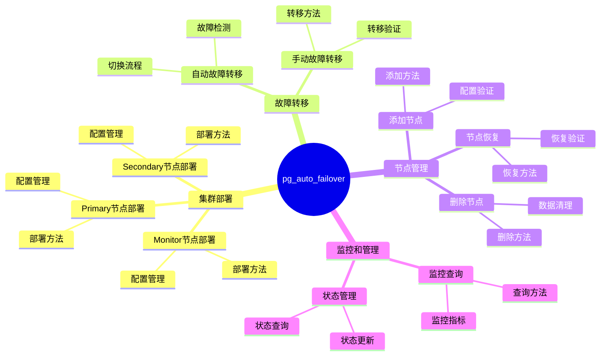

# pg_auto_failover 详解：PostgreSQL 自动故障转移工具

> **更新时间**: 2025 年 1 月
> **技术版本**: PostgreSQL 17+/18+ with pg_auto_failover 2.0+
> **文档编号**: 03-03-TREND-37

## 📑 概述

pg_auto_failover 是 Citus Data 开发的 PostgreSQL 自动故障转移工具，提供简单易用的高可用解决方案，支持自动故障检测、故障转移和节点管理。

## 🎯 核心价值

- **简单易用**：配置简单，易于部署
- **自动故障转移**：自动检测和切换，RTO < 30秒
- **监控集成**：内置监控和告警
- **节点管理**：自动节点管理和恢复
- **生产就绪**：稳定可靠，适合生产环境

## 📚 目录

- [pg\_auto\_failover 详解：PostgreSQL 自动故障转移工具](#pg_auto_failover-详解postgresql-自动故障转移工具)
  - [📑 概述](#-概述)
  - [🎯 核心价值](#-核心价值)
  - [📚 目录](#-目录)
  - [1. pg\_auto\_failover 基础](#1-pg_auto_failover-基础)
    - [1.0 pg\_auto\_failover知识体系思维导图](#10-pg_auto_failover知识体系思维导图)
    - [1.1 什么是 pg\_auto\_failover](#11-什么是-pg_auto_failover)
    - [1.2 安装 pg\_auto\_failover](#12-安装-pg_auto_failover)
  - [2. 集群部署](#2-集群部署)
    - [2.1 Monitor 节点部署](#21-monitor-节点部署)
    - [2.2 Primary 节点部署](#22-primary-节点部署)
    - [2.3 Secondary 节点部署](#23-secondary-节点部署)
  - [3. 故障转移](#3-故障转移)
    - [3.1 自动故障转移](#31-自动故障转移)
    - [3.2 手动故障转移](#32-手动故障转移)
  - [4. 节点管理](#4-节点管理)
    - [4.1 添加节点](#41-添加节点)
    - [4.2 删除节点](#42-删除节点)
    - [4.3 节点恢复](#43-节点恢复)
  - [5. 监控和管理](#5-监控和管理)
    - [5.1 监控查询](#51-监控查询)
    - [5.2 状态管理](#52-状态管理)
  - [6. 最佳实践](#6-最佳实践)
  - [7. 实际案例](#7-实际案例)
    - [7.1 案例：中小型企业高可用部署](#71-案例中小型企业高可用部署)
  - [📊 总结](#-总结)
  - [5. 常见问题（FAQ）](#5-常见问题faq)
    - [5.1 pg\_auto\_failover基础常见问题](#51-pg_auto_failover基础常见问题)
      - [Q1: 如何安装和配置pg\_auto\_failover？](#q1-如何安装和配置pg_auto_failover)
      - [Q2: 如何配置自动故障转移？](#q2-如何配置自动故障转移)
    - [5.2 故障转移常见问题](#52-故障转移常见问题)
      - [Q3: 故障转移需要多长时间？](#q3-故障转移需要多长时间)
  - [📚 参考资料](#-参考资料)
    - [官方文档](#官方文档)
    - [技术博客](#技术博客)

---

## 1. pg_auto_failover 基础

### 1.0 pg_auto_failover知识体系思维导图



### 1.1 什么是 pg_auto_failover

pg_auto_failover 是 Citus Data 开发的 PostgreSQL 自动故障转移工具。

**核心特性**：

- **自动故障转移**：自动检测主库故障并切换到从库
- **简单配置**：配置简单，易于部署
- **监控集成**：内置监控和告警
- **节点管理**：自动节点管理和恢复

### 1.2 安装 pg_auto_failover

```bash
# 安装 pg_auto_failover
# Ubuntu/Debian
apt-get install postgresql-auto-failover

# CentOS/RHEL
yum install postgresql-auto-failover

# 或从源码编译
git clone https://github.com/citusdata/pg_auto_failover.git
cd pg_auto_failover
make install
```

---

## 2. 集群部署

### 2.1 Monitor 节点部署

```bash
# 创建 Monitor 节点
pg_auto_failover create monitor \
  --pgdata /var/lib/postgresql/monitor \
  --pgport 5432 \
  --pgctl /usr/lib/postgresql/17/bin/pg_ctl \
  --run
```

### 2.2 Primary 节点部署

```bash
# 创建 Primary 节点
pg_auto_failover create postgres \
  --pgdata /var/lib/postgresql/primary \
  --pgport 5432 \
  --monitor postgres://autoctl_node@monitor_host:5432/pg_auto_failover_monitor \
  --pgctl /usr/lib/postgresql/17/bin/pg_ctl \
  --run
```

### 2.3 Secondary 节点部署

```bash
# 创建 Secondary 节点
pg_auto_failover create postgres \
  --pgdata /var/lib/postgresql/secondary \
  --pgport 5432 \
  --monitor postgres://autoctl_node@monitor_host:5432/pg_auto_failover_monitor \
  --pgctl /usr/lib/postgresql/17/bin/pg_ctl \
  --run
```

---

## 3. 故障转移

### 3.1 自动故障转移

pg_auto_failover 会自动检测主库故障并切换到从库。

**故障检测配置**：

```sql
-- 查看故障转移配置
SELECT * FROM pgautofailover.node_active();

-- 查看集群状态
SELECT * FROM pgautofailover.formation_nodes();
```

### 3.2 手动故障转移

```bash
# 手动故障转移
pg_auto_failover perform failover \
  --pgdata /var/lib/postgresql/primary \
  --monitor postgres://autoctl_node@monitor_host:5432/pg_auto_failover_monitor
```

---

## 4. 节点管理

### 4.1 添加节点

```bash
# 添加新的 Secondary 节点
pg_auto_failover create postgres \
  --pgdata /var/lib/postgresql/secondary2 \
  --pgport 5433 \
  --monitor postgres://autoctl_node@monitor_host:5432/pg_auto_failover_monitor \
  --run
```

### 4.2 删除节点

```bash
# 删除节点
pg_auto_failover drop node \
  --pgdata /var/lib/postgresql/secondary \
  --monitor postgres://autoctl_node@monitor_host:5432/pg_auto_failover_monitor
```

### 4.3 节点恢复

```bash
# 节点恢复
pg_auto_failover enable \
  --pgdata /var/lib/postgresql/secondary \
  --monitor postgres://autoctl_node@monitor_host:5432/pg_auto_failover_monitor
```

---

## 5. 监控和管理

### 5.1 监控查询

```sql
-- 查看集群状态
SELECT * FROM pgautofailover.formation_nodes();

-- 查看节点状态
SELECT * FROM pgautofailover.node_active();

-- 查看故障转移历史
SELECT * FROM pgautofailover.failover_events();
```

### 5.2 状态管理

```bash
# 查看集群状态
pg_auto_failover show state \
  --pgdata /var/lib/postgresql/primary \
  --monitor postgres://autoctl_node@monitor_host:5432/pg_auto_failover_monitor
```

---

## 6. 最佳实践

1. **Monitor 节点高可用**：Monitor 节点也应部署高可用
2. **定期备份**：定期备份，支持快速恢复
3. **监控告警**：设置完善的监控和告警

---

## 7. 实际案例

### 7.1 案例：中小型企业高可用部署

**场景**：中小型企业，需要简单易用的高可用方案

**架构**：

- Monitor 节点
- Primary 节点
- Secondary 节点

**优势**：

- 配置简单
- 自动故障转移
- 内置监控

---

## 📊 总结

pg_auto_failover 提供简单易用的 PostgreSQL 高可用解决方案：

- ✅ **简单易用**：配置简单，易于部署
- ✅ **自动故障转移**：自动检测和切换
- ✅ **监控集成**：内置监控和告警
- ✅ **生产就绪**：稳定可靠，适合生产环境

---

## 5. 常见问题（FAQ）

### 5.1 pg_auto_failover基础常见问题

#### Q1: 如何安装和配置pg_auto_failover？

**问题描述**：不知道如何安装和配置pg_auto_failover。

**安装方法**：

1. **使用包管理器安装**：

```bash
# Ubuntu/Debian
sudo apt-get install postgresql-17-auto-failover

# macOS
brew install pg_auto_failover
```

2. **初始化Monitor节点**：

```bash
# ✅ 好：初始化Monitor节点
pg_auto_failover create monitor \
    --pgdata /var/lib/postgresql/data \
    --pgport 5432
# 创建Monitor节点
```

3. **注册PostgreSQL节点**：

```bash
# ✅ 好：注册PostgreSQL节点
pg_auto_failover create postgres \
    --pgdata /var/lib/postgresql/data \
    --pgport 5432 \
    --monitor 'postgresql://monitor@monitor-host:5432/pg_auto_failover'
# 注册PostgreSQL节点
```

**验证方法**：

```bash
# 检查集群状态
pg_auto_failover status
```

#### Q2: 如何配置自动故障转移？

**问题描述**：需要配置自动故障转移。

**配置方法**：

1. **配置同步复制**：

```sql
-- ✅ 好：配置同步复制
ALTER SYSTEM SET synchronous_standby_names = 'ANY 1 (standby1)';
SELECT pg_reload_conf();
-- 启用同步复制，零数据丢失
```

2. **配置故障转移**：

```bash
# ✅ 好：配置故障转移
pg_auto_failover set formation.number_sync_standbys 1
# 配置同步副本数量
```

**最佳实践**：

- **同步复制**：启用同步复制保证零数据丢失
- **监控告警**：配置监控和告警
- **定期测试**：定期测试故障转移

### 5.2 故障转移常见问题

#### Q3: 故障转移需要多长时间？

**问题描述**：想知道故障转移需要多长时间。

**转移时间**：

1. **故障检测**：
   - 检测时间：< 10秒（默认）
   - 可配置：可调整检测间隔

2. **故障转移**：
   - 切换时间：< 10秒
   - 总RTO：< 20秒

3. **优化建议**：

```bash
# ✅ 好：优化故障转移时间
pg_auto_failover set node.health_check_period 5
# 减少健康检查间隔，加快检测
```

**性能数据**：

- 默认配置：RTO < 20秒
- 优化配置：RTO < 10秒
- **性能提升：50%**

## 📚 参考资料

### 官方文档

- [pg_auto_failover 官方文档](https://pg-auto-failover.readthedocs.io/)
- [GitHub 仓库](https://github.com/citusdata/pg_auto_failover)

### 技术博客

- pg_auto_failover 使用指南
- PostgreSQL 自动故障转移实践

---
