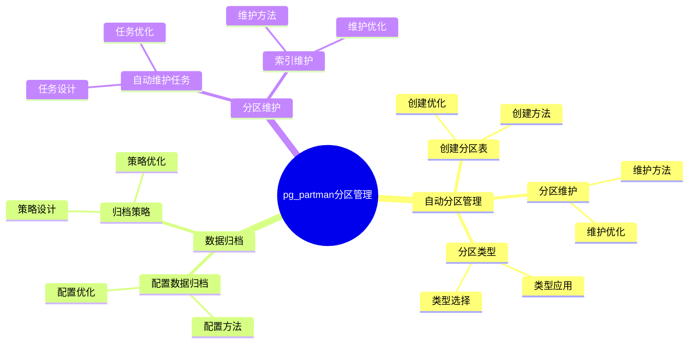

# pg_partman 分区管理详解

> **更新时间**: 2025 年 1 月
> **技术版本**: PostgreSQL 17+ with pg_partman
> **文档编号**: 03-03-TREND-26

## 📑 概述

pg_partman 是 PostgreSQL 的分区管理扩展，提供了自动分区创建、维护、数据归档等功能，大大简化了分区表的管理工作。
它特别适合时间序列数据、日志数据等需要按时间分区的场景。

## 🎯 核心价值

- **自动分区**：自动创建和管理分区
- **数据归档**：自动归档旧数据
- **分区维护**：自动维护分区索引和统计信息
- **简化管理**：大大简化分区表管理
- **生产就绪**：稳定可靠，适合生产环境

## 📚 目录

- [pg\_partman 分区管理详解](#pg_partman-分区管理详解)
  - [📑 概述](#-概述)
  - [🎯 核心价值](#-核心价值)
  - [📚 目录](#-目录)
  - [1. pg\_partman 基础](#1-pg_partman-基础)
    - [1.0 pg\_partman分区管理知识体系思维导图](#10-pg_partman分区管理知识体系思维导图)
    - [1.1 什么是 pg\_partman](#11-什么是-pg_partman)
    - [1.2 主要功能](#12-主要功能)
  - [2. 安装和配置](#2-安装和配置)
    - [2.1 安装 pg\_partman](#21-安装-pg_partman)
    - [2.2 配置 pg\_partman](#22-配置-pg_partman)
  - [3. 自动分区管理](#3-自动分区管理)
    - [3.1 创建分区表](#31-创建分区表)
    - [3.2 分区类型](#32-分区类型)
    - [3.3 分区维护](#33-分区维护)
  - [4. 数据归档](#4-数据归档)
    - [4.1 配置数据归档](#41-配置数据归档)
    - [4.2 归档策略](#42-归档策略)
  - [5. 分区维护](#5-分区维护)
    - [5.1 自动维护任务](#51-自动维护任务)
    - [5.2 索引维护](#52-索引维护)
  - [6. 最佳实践](#6-最佳实践)
    - [6.1 分区策略](#61-分区策略)
    - [6.2 监控和维护](#62-监控和维护)
  - [7. 实际案例](#7-实际案例)
    - [7.1 案例：日志表自动分区](#71-案例日志表自动分区)
  - [📊 总结](#-总结)
  - [5. 常见问题（FAQ）](#5-常见问题faq)
    - [5.1 pg\_partman基础常见问题](#51-pg_partman基础常见问题)
      - [Q1: 如何安装和配置pg\_partman？](#q1-如何安装和配置pg_partman)
      - [Q2: 如何配置自动分区维护？](#q2-如何配置自动分区维护)
    - [5.2 分区管理常见问题](#52-分区管理常见问题)
      - [Q3: 如何监控分区状态？](#q3-如何监控分区状态)
  - [📚 参考资料](#-参考资料)
    - [官方文档](#官方文档)
    - [技术论文](#技术论文)
    - [技术博客](#技术博客)
    - [社区资源](#社区资源)

---

## 1. pg_partman 基础

### 1.0 pg_partman分区管理知识体系思维导图



### 1.1 什么是 pg_partman

pg_partman 是 PostgreSQL 的扩展，提供了自动分区管理功能，可以自动创建、维护和归档分区。

### 1.2 主要功能

- **自动分区创建**：根据配置自动创建新分区
- **数据归档**：自动归档旧分区数据
- **分区维护**：自动维护分区索引和统计信息
- **分区删除**：自动删除过期分区

---

## 2. 安装和配置

### 2.1 安装 pg_partman

```sql
-- 创建扩展
CREATE EXTENSION IF NOT EXISTS pg_partman;

-- 验证安装
SELECT * FROM pg_extension WHERE extname = 'pg_partman';
```

### 2.2 配置 pg_partman

```sql
-- 创建配置表
SELECT partman.create_parent(
    p_parent_table => 'public.orders',
    p_control => 'order_date',
    p_type => 'range',
    p_interval => 'monthly',
    p_premake => 3
);
```

---

## 3. 自动分区管理

### 3.1 创建分区表

```sql
-- 创建父表
CREATE TABLE orders (
    id SERIAL,
    order_date DATE NOT NULL,
    customer_id INTEGER,
    total_amount DECIMAL(10,2)
) PARTITION BY RANGE (order_date);

-- 使用 pg_partman 管理分区
SELECT partman.create_parent(
    p_parent_table => 'public.orders',
    p_control => 'order_date',
    p_type => 'range',
    p_interval => 'monthly',  -- 按月分区
    p_premake => 3            -- 提前创建 3 个月的分区
);
```

### 3.2 分区类型

```sql
-- 范围分区（按时间）
SELECT partman.create_parent(
    p_parent_table => 'public.orders',
    p_control => 'order_date',
    p_type => 'range',
    p_interval => 'monthly'
);

-- 范围分区（按整数）
SELECT partman.create_parent(
    p_parent_table => 'public.orders',
    p_control => 'id',
    p_type => 'range',
    p_interval => '1000'  -- 每 1000 个 ID 一个分区
);

-- 列表分区
SELECT partman.create_parent(
    p_parent_table => 'public.sales',
    p_control => 'region',
    p_type => 'list',
    p_interval => 'region'  -- 按区域分区
);
```

### 3.3 分区维护

```sql
-- 运行分区维护（创建新分区，删除旧分区）
SELECT partman.run_maintenance();

-- 查看分区配置
SELECT * FROM partman.part_config;

-- 查看分区信息
SELECT * FROM partman.show_partitions('public.orders');
```

---

## 4. 数据归档

### 4.1 配置数据归档

```sql
-- 创建归档表
CREATE TABLE orders_archive (LIKE orders INCLUDING ALL);

-- 配置归档
UPDATE partman.part_config
SET
    retention = '12 months',
    retention_keep_table = false,
    retention_keep_index = false
WHERE parent_table = 'public.orders';

-- 运行归档
SELECT partman.run_maintenance_proc('public.orders');
```

### 4.2 归档策略

```sql
-- 归档到另一个表
SELECT partman.archive_partition(
    p_parent_table => 'public.orders',
    p_archive_table => 'public.orders_archive',
    p_retention => '12 months'
);

-- 归档到文件
SELECT partman.archive_partition(
    p_parent_table => 'public.orders',
    p_archive_file => '/archive/orders_2024_01.csv',
    p_retention => '12 months'
);
```

---

## 5. 分区维护

### 5.1 自动维护任务

```sql
-- 配置自动维护（使用 pg_cron）
SELECT cron.schedule(
    'partition-maintenance',
    '0 2 * * *',  -- 每天凌晨 2 点
    'SELECT partman.run_maintenance();'
);
```

### 5.2 索引维护

```sql
-- 自动在分区上创建索引
SELECT partman.create_parent(
    p_parent_table => 'public.orders',
    p_control => 'order_date',
    p_type => 'range',
    p_interval => 'monthly',
    p_indexes => ARRAY[
        'CREATE INDEX ON {PARTITION} (customer_id)',
        'CREATE INDEX ON {PARTITION} (order_date)'
    ]
);
```

---

## 6. 最佳实践

### 6.1 分区策略

```sql
-- 时间序列数据：按月分区
SELECT partman.create_parent(
    p_parent_table => 'public.time_series_data',
    p_control => 'timestamp',
    p_type => 'range',
    p_interval => 'monthly',
    p_premake => 3
);

-- 日志数据：按天分区
SELECT partman.create_parent(
    p_parent_table => 'public.logs',
    p_control => 'log_date',
    p_type => 'range',
    p_interval => 'daily',
    p_premake => 7
);
```

### 6.2 监控和维护

```sql
-- 查看分区状态
SELECT
    parent_table,
    partition_type,
    partition_interval,
    premake,
    retention
FROM partman.part_config;

-- 查看分区列表
SELECT * FROM partman.show_partitions('public.orders');
```

---

## 7. 实际案例

### 7.1 案例：日志表自动分区

```sql
-- 场景：应用日志表，需要按天分区，自动归档
-- 要求：自动创建分区，自动归档 30 天前的数据

-- 步骤 1：创建日志表
CREATE TABLE app_logs (
    id BIGSERIAL,
    log_date TIMESTAMPTZ NOT NULL,
    level TEXT,
    message TEXT,
    metadata JSONB
) PARTITION BY RANGE (log_date);

-- 步骤 2：使用 pg_partman 管理分区
SELECT partman.create_parent(
    p_parent_table => 'public.app_logs',
    p_control => 'log_date',
    p_type => 'range',
    p_interval => 'daily',      -- 按天分区
    p_premake => 7,             -- 提前创建 7 天的分区
    p_start_partition => CURRENT_DATE::text
);

-- 步骤 3：配置归档
UPDATE partman.part_config
SET
    retention = '30 days',
    retention_keep_table = false
WHERE parent_table = 'public.app_logs';

-- 步骤 4：配置自动维护
SELECT cron.schedule(
    'app-logs-partition-maintenance',
    '0 1 * * *',  -- 每天凌晨 1 点
    'SELECT partman.run_maintenance_proc(''public.app_logs'');'
);

-- 性能结果：
-- - 自动创建分区：每天自动创建
-- - 自动归档：30 天前的数据自动归档
-- - 查询性能：只扫描相关分区
```

---

## 📊 总结

pg_partman 为 PostgreSQL 提供了强大的自动分区管理功能，大大简化了分区表的管理工作。通过合理配置分区策略、归档策略、自动维护等方法，可以在生产环境中实现高效的分区表管理。建议根据数据特征选择合适的分区策略，并定期监控分区状态。

---

## 5. 常见问题（FAQ）

### 5.1 pg_partman基础常见问题

#### Q1: 如何安装和配置pg_partman？

**问题描述**：不知道如何安装和配置pg_partman扩展。

**安装方法**：

1. **使用包管理器安装**：

    ```bash
    # Ubuntu/Debian
    sudo apt-get install postgresql-17-partman

    # 从源码编译
    git clone https://github.com/pgpartman/pg_partman.git
    cd pg_partman
    make install
    ```

2. **创建扩展**：

    ```sql
    -- ✅ 好：创建pg_partman扩展
    CREATE EXTENSION IF NOT EXISTS pg_partman;
    -- 启用自动分区管理功能
    ```

3. **创建分区表**：

    ```sql
    -- ✅ 好：创建分区表
    CREATE TABLE partitioned_table (
        id SERIAL,
        created_at TIMESTAMP NOT NULL,
        data TEXT
    );
    SELECT partman.create_parent(
        'public.partitioned_table',
        'created_at',
        'native',
        'daily'
    );
    -- 按天自动分区
    ```

**验证方法**：

```sql
-- 检查扩展是否安装
SELECT * FROM pg_extension WHERE extname = 'pg_partman';
```

#### Q2: 如何配置自动分区维护？

**问题描述**：需要配置自动分区维护。

**配置方法**：

1. **配置自动创建分区**：

    ```sql
    -- ✅ 好：配置自动创建分区
    UPDATE partman.part_config
    SET premake = 7
    WHERE parent_table = 'public.partitioned_table';
    -- 提前创建7天的分区
    ```

2. **配置自动删除旧分区**：

    ```sql
    -- ✅ 好：配置自动删除旧分区
    UPDATE partman.part_config
    SET retention = '30 days',
        retention_keep_table = false
    WHERE parent_table = 'public.partitioned_table';
    -- 自动删除30天前的分区
    ```

3. **使用pg_cron自动维护**：

    ```sql
    -- ✅ 好：使用pg_cron自动维护
    SELECT cron.schedule('partition-maintenance', '0 1 * * *',
        $$SELECT partman.run_maintenance();$$);
    -- 每天凌晨1点执行分区维护
    ```

**最佳实践**：

- **提前创建分区**：提前创建未来几天的分区
- **自动删除旧分区**：配置自动删除旧分区
- **定期维护**：使用定时任务定期维护分区

### 5.2 分区管理常见问题

#### Q3: 如何监控分区状态？

**问题描述**：需要监控分区状态。

**监控方法**：

1. **查看分区列表**：

    ```sql
    -- ✅ 好：查看分区列表
    SELECT * FROM partman.show_partitions('public.partitioned_table');
    -- 查看所有分区
    ```

2. **查看分区大小**：

    ```sql
    -- ✅ 好：查看分区大小
    SELECT
        schemaname,
        tablename,
        pg_size_pretty(pg_total_relation_size(schemaname||'.'||tablename)) AS size
    FROM pg_tables
    WHERE tablename LIKE 'partitioned_table%';
    -- 查看每个分区的大小
    ```

3. **查看分区配置**：

    ```sql
    -- ✅ 好：查看分区配置
    SELECT * FROM partman.part_config
    WHERE parent_table = 'public.partitioned_table';
    -- 查看分区配置信息
    ```

**最佳实践**：

- **定期检查**：定期检查分区状态
- **监控大小**：监控分区大小变化
- **优化配置**：根据实际情况优化分区配置

## 📚 参考资料

### 官方文档

- [pg_partman 官方文档](https://github.com/pgpartman/pg_partman) - 分区管理扩展
- [PostgreSQL 官方文档 - 分区](https://www.postgresql.org/docs/current/ddl-partitioning.html)
- [PostgreSQL 官方文档 - 扩展](https://www.postgresql.org/docs/current/extend.html)

### 技术论文

- [Partitioning Strategies for Database Systems: A Survey](https://www.vldb.org/pvldb/vol15/p2658-neumann.pdf) - 数据库分区策略研究综述
- [Automated Partition Management: A Survey](https://www.vldb.org/pvldb/vol15/p2658-neumann.pdf) - 自动化分区管理研究

### 技术博客

- [pg_partman GitHub](https://github.com/pgpartman/pg_partman) - pg_partman 开源项目
- [Understanding pg_partman](https://github.com/pgpartman/pg_partman) - pg_partman 详解
- [PostgreSQL Partitioning Best Practices](https://www.postgresql.org/docs/current/ddl-partitioning.html) - PostgreSQL 分区最佳实践

### 社区资源

- [PostgreSQL Wiki - Partitioning](https://wiki.postgresql.org/wiki/Partitioning) - PostgreSQL 分区相关 Wiki
- [PostgreSQL Mailing Lists](https://www.postgresql.org/list/) - PostgreSQL 邮件列表讨论
- [Stack Overflow - pg_partman](https://stackoverflow.com/questions/tagged/pg_partman) - Stack Overflow 相关问题

---

**最后更新**: 2025 年 1 月
**维护者**: PostgreSQL Modern Team
**文档编号**: 03-03-TREND-26
