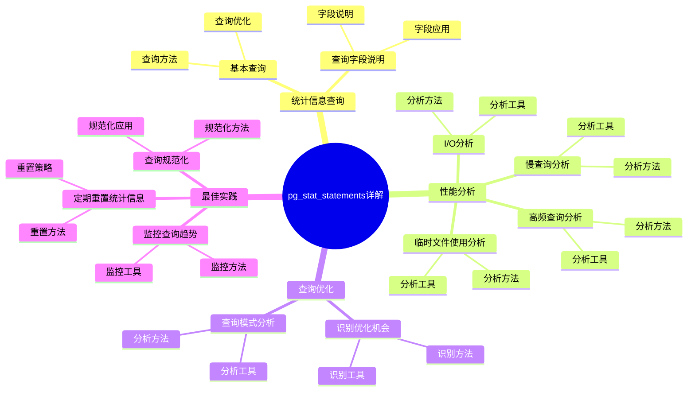

# pg_stat_statements 详解：查询性能分析工具

> **更新时间**: 2025 年 1 月
> **技术版本**: PostgreSQL 17+ with pg_stat_statements
> **文档编号**: 03-03-TREND-25

## 📑 概述

pg_stat_statements 是 PostgreSQL 的查询统计扩展，用于跟踪服务器执行的所有 SQL 语句的统计信息。
它是性能分析和优化的核心工具，可以帮助识别慢查询、分析查询模式、优化数据库性能。

## 🎯 核心价值

- **查询统计**：跟踪所有 SQL 语句的执行统计
- **性能分析**：识别慢查询和性能瓶颈
- **查询模式**：分析查询使用模式
- **优化指导**：为性能优化提供数据支持
- **生产就绪**：稳定可靠，适合生产环境

## 📚 目录

- [pg\_stat\_statements 详解：查询性能分析工具](#pg_stat_statements-详解查询性能分析工具)
  - [📑 概述](#-概述)
  - [🎯 核心价值](#-核心价值)
  - [📚 目录](#-目录)
  - [1. pg\_stat\_statements 基础](#1-pg_stat_statements-基础)
    - [1.0 pg\_stat\_statements详解知识体系思维导图](#10-pg_stat_statements详解知识体系思维导图)
    - [1.1 什么是 pg\_stat\_statements](#11-什么是-pg_stat_statements)
    - [1.2 主要功能](#12-主要功能)
  - [2. 安装和配置](#2-安装和配置)
    - [2.1 安装 pg\_stat\_statements](#21-安装-pg_stat_statements)
    - [2.2 配置 pg\_stat\_statements](#22-配置-pg_stat_statements)
    - [2.3 权限配置](#23-权限配置)
  - [3. 统计信息查询](#3-统计信息查询)
    - [3.1 基本查询](#31-基本查询)
    - [3.2 查询字段说明](#32-查询字段说明)
  - [4. 性能分析](#4-性能分析)
    - [4.1 慢查询分析](#41-慢查询分析)
    - [4.2 高频查询分析](#42-高频查询分析)
    - [4.3 I/O 分析](#43-io-分析)
    - [4.4 临时文件使用分析](#44-临时文件使用分析)
  - [5. 查询优化](#5-查询优化)
    - [5.1 识别优化机会](#51-识别优化机会)
    - [5.2 查询模式分析](#52-查询模式分析)
  - [6. 最佳实践](#6-最佳实践)
    - [6.1 定期重置统计信息](#61-定期重置统计信息)
    - [6.2 监控查询趋势](#62-监控查询趋势)
    - [6.3 查询规范化](#63-查询规范化)
  - [7. 实际案例](#7-实际案例)
    - [7.1 案例：识别慢查询](#71-案例识别慢查询)
    - [7.2 案例：优化高频查询](#72-案例优化高频查询)
    - [7.3 案例：监控查询性能趋势](#73-案例监控查询性能趋势)
  - [📊 总结](#-总结)
  - [6. 常见问题（FAQ）](#6-常见问题faq)
    - [6.1 pg\_stat\_statements基础常见问题](#61-pg_stat_statements基础常见问题)
      - [Q1: 如何安装和启用pg\_stat\_statements？](#q1-如何安装和启用pg_stat_statements)
      - [Q2: 如何查找慢查询？](#q2-如何查找慢查询)
    - [6.2 性能分析常见问题](#62-性能分析常见问题)
      - [Q3: 如何重置统计信息？](#q3-如何重置统计信息)
  - [📚 参考资料](#-参考资料)
    - [官方文档](#官方文档)
    - [技术论文](#技术论文)
    - [技术博客](#技术博客)
    - [社区资源](#社区资源)

---

## 1. pg_stat_statements 基础

### 1.0 pg_stat_statements详解知识体系思维导图



### 1.1 什么是 pg_stat_statements

pg_stat_statements 是 PostgreSQL 的扩展，用于跟踪服务器执行的所有 SQL 语句的统计信息，包括执行次数、总执行时间、平均执行时间等。

### 1.2 主要功能

- **查询跟踪**：跟踪所有 SQL 语句的执行
- **统计收集**：收集执行时间、调用次数等统计信息
- **查询规范化**：将查询规范化，便于统计
- **性能分析**：提供详细的性能分析数据

---

## 2. 安装和配置

### 2.1 安装 pg_stat_statements

```sql
-- 创建扩展
CREATE EXTENSION IF NOT EXISTS pg_stat_statements;

-- 验证安装
SELECT * FROM pg_extension WHERE extname = 'pg_stat_statements';
```

### 2.2 配置 pg_stat_statements

```sql
-- postgresql.conf 配置
shared_preload_libraries = 'pg_stat_statements'

-- pg_stat_statements 配置参数
pg_stat_statements.max = 10000              -- 最大跟踪的语句数（默认：10000）
pg_stat_statements.track = all              -- 跟踪所有语句（all/top/none）
pg_stat_statements.track_utility = on       -- 跟踪工具命令（如 VACUUM）
pg_stat_statements.track_planning = on      -- 跟踪计划时间（PostgreSQL 13+）
pg_stat_statements.save = on                -- 保存统计信息到磁盘

-- 重启 PostgreSQL 使配置生效
```

### 2.3 权限配置

```sql
-- 授予用户查看统计信息的权限
GRANT SELECT ON pg_stat_statements TO myuser;
```

---

## 3. 统计信息查询

### 3.1 基本查询

```sql
-- 查看所有查询统计
SELECT * FROM pg_stat_statements
ORDER BY total_exec_time DESC
LIMIT 20;

-- 查看查询统计的关键字段
SELECT
    query,
    calls,
    total_exec_time,
    mean_exec_time,
    max_exec_time,
    min_exec_time,
    stddev_exec_time,
    rows,
    100.0 * shared_blks_hit / NULLIF(shared_blks_hit + shared_blks_read, 0) AS hit_percent
FROM pg_stat_statements
ORDER BY total_exec_time DESC
LIMIT 20;
```

### 3.2 查询字段说明

```sql
-- 主要统计字段
SELECT
    query,                    -- 规范化后的查询语句
    calls,                    -- 执行次数
    total_exec_time,          -- 总执行时间（毫秒）
    mean_exec_time,           -- 平均执行时间（毫秒）
    max_exec_time,            -- 最大执行时间（毫秒）
    min_exec_time,            -- 最小执行时间（毫秒）
    stddev_exec_time,         -- 执行时间标准差（毫秒）
    rows,                     -- 返回或影响的行数
    shared_blks_hit,          -- 共享块命中数
    shared_blks_read,         -- 共享块读取数
    shared_blks_dirtied,      -- 共享块脏页数
    shared_blks_written,      -- 共享块写入数
    local_blks_hit,           -- 本地块命中数
    local_blks_read,          -- 本地块读取数
    local_blks_dirtied,       -- 本地块脏页数
    local_blks_written,       -- 本地块写入数
    temp_blks_read,           -- 临时块读取数
    temp_blks_written,        -- 临时块写入数
    blk_read_time,            -- 块读取时间（毫秒）
    blk_write_time            -- 块写入时间（毫秒）
FROM pg_stat_statements
LIMIT 1;
```

---

## 4. 性能分析

### 4.1 慢查询分析

```sql
-- 查找最慢的查询（按总执行时间）
SELECT
    query,
    calls,
    total_exec_time,
    mean_exec_time,
    max_exec_time,
    (total_exec_time / 1000.0 / 60.0) AS total_minutes
FROM pg_stat_statements
WHERE mean_exec_time > 1000  -- 平均执行时间超过 1 秒
ORDER BY total_exec_time DESC
LIMIT 20;

-- 查找最慢的查询（按平均执行时间）
SELECT
    query,
    calls,
    mean_exec_time,
    max_exec_time,
    total_exec_time
FROM pg_stat_statements
WHERE calls > 10  -- 至少执行 10 次
ORDER BY mean_exec_time DESC
LIMIT 20;
```

### 4.2 高频查询分析

```sql
-- 查找执行次数最多的查询
SELECT
    query,
    calls,
    mean_exec_time,
    total_exec_time,
    (total_exec_time / calls) AS avg_time_per_call
FROM pg_stat_statements
ORDER BY calls DESC
LIMIT 20;
```

### 4.3 I/O 分析

```sql
-- 查找 I/O 密集的查询
SELECT
    query,
    calls,
    shared_blks_read,
    shared_blks_hit,
    100.0 * shared_blks_hit / NULLIF(shared_blks_hit + shared_blks_read, 0) AS hit_percent,
    blk_read_time,
    mean_exec_time
FROM pg_stat_statements
WHERE shared_blks_read > 1000
ORDER BY shared_blks_read DESC
LIMIT 20;
```

### 4.4 临时文件使用分析

```sql
-- 查找使用临时文件的查询
SELECT
    query,
    calls,
    temp_blks_read,
    temp_blks_written,
    (temp_blks_read + temp_blks_written) * 8192.0 / 1024 / 1024 AS temp_mb
FROM pg_stat_statements
WHERE temp_blks_read > 0 OR temp_blks_written > 0
ORDER BY (temp_blks_read + temp_blks_written) DESC
LIMIT 20;
```

---

## 5. 查询优化

### 5.1 识别优化机会

```sql
-- 创建优化分析视图
CREATE OR REPLACE VIEW query_optimization_opportunities AS
SELECT
    query,
    calls,
    mean_exec_time,
    total_exec_time,
    100.0 * shared_blks_hit / NULLIF(shared_blks_hit + shared_blks_read, 0) AS cache_hit_percent,
    CASE
        WHEN mean_exec_time > 1000 THEN 'High'
        WHEN mean_exec_time > 100 THEN 'Medium'
        ELSE 'Low'
    END AS priority,
    CASE
        WHEN 100.0 * shared_blks_hit / NULLIF(shared_blks_hit + shared_blks_read, 0) < 90
        THEN 'Low cache hit ratio - consider adding indexes'
        WHEN temp_blks_read > 0 OR temp_blks_written > 0
        THEN 'Using temp files - consider increasing work_mem'
        WHEN mean_exec_time > 1000
        THEN 'Slow query - review execution plan'
        ELSE 'OK'
    END AS recommendation
FROM pg_stat_statements
WHERE calls > 10
ORDER BY total_exec_time DESC;

-- 查看优化建议
SELECT * FROM query_optimization_opportunities
WHERE priority IN ('High', 'Medium')
LIMIT 20;
```

### 5.2 查询模式分析

```sql
-- 分析查询模式（按表）
SELECT
    CASE
        WHEN query LIKE '%orders%' THEN 'orders'
        WHEN query LIKE '%customers%' THEN 'customers'
        WHEN query LIKE '%products%' THEN 'products'
        ELSE 'other'
    END AS table_pattern,
    COUNT(*) AS query_count,
    SUM(calls) AS total_calls,
    SUM(total_exec_time) AS total_time,
    AVG(mean_exec_time) AS avg_time
FROM pg_stat_statements
GROUP BY table_pattern
ORDER BY total_time DESC;
```

---

## 6. 最佳实践

### 6.1 定期重置统计信息

```sql
-- 重置统计信息（谨慎使用）
SELECT pg_stat_statements_reset();

-- 重置特定查询的统计信息
SELECT pg_stat_statements_reset(userid, dbid, queryid)
FROM pg_stat_statements
WHERE query LIKE '%specific_query%';
```

### 6.2 监控查询趋势

```sql
-- 创建统计信息快照表
CREATE TABLE pg_stat_statements_snapshots (
    id SERIAL PRIMARY KEY,
    snapshot_time TIMESTAMPTZ DEFAULT NOW(),
    query TEXT,
    calls BIGINT,
    total_exec_time DOUBLE PRECISION,
    mean_exec_time DOUBLE PRECISION
);

-- 定期保存快照
INSERT INTO pg_stat_statements_snapshots (query, calls, total_exec_time, mean_exec_time)
SELECT query, calls, total_exec_time, mean_exec_time
FROM pg_stat_statements
WHERE calls > 100;

-- 分析查询趋势
SELECT
    query,
    snapshot_time,
    calls,
    mean_exec_time,
    LAG(mean_exec_time) OVER (PARTITION BY query ORDER BY snapshot_time) AS prev_mean_time,
    mean_exec_time - LAG(mean_exec_time) OVER (PARTITION BY query ORDER BY snapshot_time) AS time_diff
FROM pg_stat_statements_snapshots
WHERE query LIKE '%orders%'
ORDER BY snapshot_time DESC;
```

### 6.3 查询规范化

```sql
-- pg_stat_statements 会自动规范化查询
-- 例如：SELECT * FROM users WHERE id = 1 和 SELECT * FROM users WHERE id = 2
-- 会被规范化为：SELECT * FROM users WHERE id = $1

-- 查看规范化后的查询
SELECT
    query,
    calls
FROM pg_stat_statements
WHERE query LIKE '%users%'
ORDER BY calls DESC;
```

---

## 7. 实际案例

### 7.1 案例：识别慢查询

```sql
-- 场景：数据库性能下降，需要找出慢查询

-- 步骤 1：查看最慢的查询
SELECT
    LEFT(query, 100) AS query_preview,
    calls,
    ROUND(mean_exec_time::numeric, 2) AS avg_ms,
    ROUND(max_exec_time::numeric, 2) AS max_ms,
    ROUND(total_exec_time::numeric, 2) AS total_ms
FROM pg_stat_statements
WHERE mean_exec_time > 1000
ORDER BY total_exec_time DESC
LIMIT 10;

-- 步骤 2：分析查询的 I/O 情况
SELECT
    LEFT(query, 100) AS query_preview,
    calls,
    shared_blks_read,
    shared_blks_hit,
    ROUND(100.0 * shared_blks_hit / NULLIF(shared_blks_hit + shared_blks_read, 0), 2) AS hit_percent
FROM pg_stat_statements
WHERE mean_exec_time > 1000
ORDER BY shared_blks_read DESC
LIMIT 10;

-- 步骤 3：查看完整查询语句
SELECT query
FROM pg_stat_statements
WHERE mean_exec_time > 1000
ORDER BY total_exec_time DESC
LIMIT 1;
```

### 7.2 案例：优化高频查询

```sql
-- 场景：高频查询性能需要优化

-- 步骤 1：找出高频查询
SELECT
    LEFT(query, 100) AS query_preview,
    calls,
    ROUND(mean_exec_time::numeric, 2) AS avg_ms,
    ROUND((total_exec_time / calls)::numeric, 2) AS time_per_call_ms
FROM pg_stat_statements
WHERE calls > 1000
ORDER BY calls DESC
LIMIT 10;

-- 步骤 2：分析查询性能
SELECT
    query,
    calls,
    mean_exec_time,
    shared_blks_hit,
    shared_blks_read,
    temp_blks_read,
    temp_blks_written
FROM pg_stat_statements
WHERE calls > 1000
  AND mean_exec_time > 10
ORDER BY calls DESC
LIMIT 10;

-- 步骤 3：优化建议
-- 根据统计信息，可以：
-- 1. 添加索引（如果 cache hit ratio 低）
-- 2. 增加 work_mem（如果使用临时文件）
-- 3. 优化查询语句（如果执行时间过长）
```

### 7.3 案例：监控查询性能趋势

```sql
-- 场景：监控查询性能变化趋势

-- 创建性能监控表
CREATE TABLE query_performance_history (
    id SERIAL PRIMARY KEY,
    snapshot_time TIMESTAMPTZ DEFAULT NOW(),
    query_hash BIGINT,
    query TEXT,
    calls BIGINT,
    mean_exec_time DOUBLE PRECISION,
    total_exec_time DOUBLE PRECISION
);

-- 定期保存性能快照
INSERT INTO query_performance_history (query_hash, query, calls, mean_exec_time, total_exec_time)
SELECT
    queryid,
    query,
    calls,
    mean_exec_time,
    total_exec_time
FROM pg_stat_statements
WHERE calls > 100;

-- 分析性能趋势
SELECT
    query,
    snapshot_time,
    calls,
    mean_exec_time,
    LAG(mean_exec_time) OVER (PARTITION BY query_hash ORDER BY snapshot_time) AS prev_avg_time,
    mean_exec_time - LAG(mean_exec_time) OVER (PARTITION BY query_hash ORDER BY snapshot_time) AS time_change
FROM query_performance_history
WHERE query_hash IN (
    SELECT queryid FROM pg_stat_statements
    WHERE mean_exec_time > 1000
    ORDER BY total_exec_time DESC
    LIMIT 10
)
ORDER BY snapshot_time DESC, query_hash;
```

---

## 📊 总结

pg_stat_statements 是 PostgreSQL 性能分析和优化的核心工具。通过合理使用统计信息查询、性能分析、查询优化等功能，可以在生产环境中及时发现和解决性能问题。建议定期查看统计信息，识别慢查询和高频查询，并根据统计数据进行针对性的优化。

---

## 6. 常见问题（FAQ）

### 6.1 pg_stat_statements基础常见问题

#### Q1: 如何安装和启用pg_stat_statements？

**问题描述**：不知道如何安装和启用pg_stat_statements扩展。

**安装方法**：

1. **创建扩展**：

```sql
-- ✅ 好：创建pg_stat_statements扩展
CREATE EXTENSION IF NOT EXISTS pg_stat_statements;
-- 启用查询统计功能
```

2. **配置参数**：

```sql
-- ✅ 好：配置统计参数
ALTER SYSTEM SET shared_preload_libraries = 'pg_stat_statements';
ALTER SYSTEM SET pg_stat_statements.track = 'all';
ALTER SYSTEM SET pg_stat_statements.max = 10000;
SELECT pg_reload_conf();
-- 重启PostgreSQL后生效
```

3. **验证安装**：

```sql
-- ✅ 好：验证扩展是否启用
SELECT * FROM pg_extension WHERE extname = 'pg_stat_statements';
```

**验证方法**：

```sql
-- 查看统计信息
SELECT count(*) FROM pg_stat_statements;
```

#### Q2: 如何查找慢查询？

**问题描述**：需要查找慢查询。

**查找方法**：

1. **按总时间排序**：

```sql
-- ✅ 好：查找总时间最长的查询
SELECT
    query,
    calls,
    total_exec_time,
    mean_exec_time,
    max_exec_time
FROM pg_stat_statements
ORDER BY total_exec_time DESC
LIMIT 10;
-- 查找总时间最长的10个查询
```

2. **按平均时间排序**：

```sql
-- ✅ 好：查找平均时间最长的查询
SELECT
    query,
    calls,
    mean_exec_time,
    max_exec_time
FROM pg_stat_statements
WHERE calls > 100
ORDER BY mean_exec_time DESC
LIMIT 10;
-- 查找平均时间最长的查询
```

3. **按调用次数排序**：

```sql
-- ✅ 好：查找调用次数最多的查询
SELECT
    query,
    calls,
    total_exec_time,
    mean_exec_time
FROM pg_stat_statements
ORDER BY calls DESC
LIMIT 10;
-- 查找调用次数最多的查询
```

**最佳实践**：

- **定期检查**：定期检查慢查询
- **优化慢查询**：针对慢查询进行优化
- **监控趋势**：监控查询性能趋势

### 6.2 性能分析常见问题

#### Q3: 如何重置统计信息？

**问题描述**：需要重置统计信息。

**重置方法**：

1. **重置所有统计信息**：

```sql
-- ✅ 好：重置所有统计信息
SELECT pg_stat_statements_reset();
-- 重置所有查询统计信息
```

2. **重置特定数据库的统计信息**：

```sql
-- ✅ 好：重置特定数据库的统计信息
SELECT pg_stat_statements_reset(userid, dbid);
-- 重置特定用户和数据库的统计信息
```

**最佳实践**：

- **定期重置**：定期重置统计信息，避免数据积累
- **重置前备份**：重置前备份重要统计信息
- **分析趋势**：分析重置前后的性能趋势

## 📚 参考资料

### 官方文档

- [PostgreSQL 官方文档 - pg_stat_statements](https://www.postgresql.org/docs/current/pgstatstatements.html) - 查询统计扩展
- [PostgreSQL 官方文档 - 性能调优](https://www.postgresql.org/docs/current/performance-tips.html)
- [PostgreSQL 官方文档 - 监控](https://www.postgresql.org/docs/current/monitoring.html)

### 技术论文

- [Query Performance Analysis: A Survey](https://www.vldb.org/pvldb/vol15/p2658-neumann.pdf) - 查询性能分析研究综述
- [Database Performance Monitoring: A Survey](https://www.vldb.org/pvldb/vol15/p2658-neumann.pdf) - 数据库性能监控研究综述

### 技术博客

- [PostgreSQL 官方博客 - 性能分析](https://www.postgresql.org/about/news/) - PostgreSQL 性能分析最新动态
- [Understanding pg_stat_statements](https://www.postgresql.org/docs/current/pgstatstatements.html) - pg_stat_statements 详解
- [PostgreSQL Performance Analysis Best Practices](https://www.postgresql.org/docs/current/performance-tips.html) - PostgreSQL 性能分析最佳实践

### 社区资源

- [PostgreSQL Wiki - Performance](https://wiki.postgresql.org/wiki/Performance) - PostgreSQL 性能相关 Wiki
- [PostgreSQL Mailing Lists](https://www.postgresql.org/list/) - PostgreSQL 邮件列表讨论
- [Stack Overflow - pg_stat_statements](https://stackoverflow.com/questions/tagged/pg_stat_statements) - Stack Overflow 相关问题

---

**最后更新**: 2025 年 1 月
**维护者**: PostgreSQL Modern Team
**文档编号**: 03-03-TREND-25
