# repmgr 详解：PostgreSQL 复制管理器

> **更新时间**: 2025 年 1 月
> **技术版本**: PostgreSQL 17+/18+ with repmgr 5.4+
> **文档编号**: 03-03-TREND-38

## 📑 概述

repmgr 是 2ndQuadrant 开发的 PostgreSQL 复制管理器，提供复制管理、故障转移、节点管理等功能，是 PostgreSQL 高可用的成熟方案。

## 🎯 核心价值

- **复制管理**：简化的复制配置和管理
- **故障转移**：自动和手动故障转移
- **节点管理**：节点注册、监控、管理
- **监控集成**：监控复制状态和延迟
- **生产就绪**：稳定可靠，适合生产环境

## 📚 目录

- [repmgr 详解：PostgreSQL 复制管理器](#repmgr-详解postgresql-复制管理器)
  - [📑 概述](#-概述)
  - [🎯 核心价值](#-核心价值)
  - [📚 目录](#-目录)
  - [1. repmgr 基础](#1-repmgr-基础)
    - [1.0 repmgr知识体系思维导图](#10-repmgr知识体系思维导图)
    - [1.1 什么是 repmgr](#11-什么是-repmgr)
    - [1.2 安装 repmgr](#12-安装-repmgr)
  - [2. 集群配置](#2-集群配置)
    - [2.1 主库配置](#21-主库配置)
    - [2.2 从库配置](#22-从库配置)
    - [2.3 集群注册](#23-集群注册)
  - [3. 故障转移](#3-故障转移)
    - [3.1 自动故障转移](#31-自动故障转移)
    - [3.2 手动故障转移](#32-手动故障转移)
  - [4. 节点管理](#4-节点管理)
    - [4.1 节点注册](#41-节点注册)
    - [4.2 节点监控](#42-节点监控)
    - [4.3 节点维护](#43-节点维护)
  - [5. 监控和管理](#5-监控和管理)
    - [5.1 集群状态查询](#51-集群状态查询)
    - [5.2 复制状态监控](#52-复制状态监控)
  - [6. 最佳实践](#6-最佳实践)
  - [7. 实际案例](#7-实际案例)
    - [7.1 案例：企业级高可用部署](#71-案例企业级高可用部署)
  - [📊 总结](#-总结)
  - [5. 常见问题（FAQ）](#5-常见问题faq)
    - [5.1 repmgr基础常见问题](#51-repmgr基础常见问题)
      - [Q1: 如何安装和配置repmgr？](#q1-如何安装和配置repmgr)
      - [Q2: 如何配置自动故障转移？](#q2-如何配置自动故障转移)
    - [5.2 故障转移常见问题](#52-故障转移常见问题)
      - [Q3: 故障转移需要多长时间？](#q3-故障转移需要多长时间)
  - [📚 参考资料](#-参考资料)
    - [官方文档](#官方文档)
    - [技术博客](#技术博客)

---

## 1. repmgr 基础

### 1.0 repmgr知识体系思维导图

```mermaid
mindmap
  root((repmgr))
    集群配置
      主库配置
        配置方法
        配置验证
      从库配置
        配置方法
        配置验证
      集群注册
        注册方法
        注册验证
    故障转移
      自动故障转移
        故障检测
        切换流程
      手动故障转移
        转移方法
        转移验证
    节点管理
      节点注册
        注册方法
        注册验证
      节点监控
        监控方法
        监控指标
      节点维护
        维护方法
        维护流程
    监控和管理
      集群状态查询
        查询方法
        状态分析
      复制状态监控
        监控方法
        监控指标
```



### 1.1 什么是 repmgr

repmgr 是 PostgreSQL 的复制管理器，提供：

- **复制管理**：简化的复制配置和管理
- **故障转移**：自动和手动故障转移
- **节点管理**：节点注册、监控、管理
- **监控集成**：监控复制状态和延迟

### 1.2 安装 repmgr

```bash
# 安装 repmgr
# Ubuntu/Debian
apt-get install postgresql-repmgr

# CentOS/RHEL
yum install postgresql-repmgr

# 或从源码编译
git clone https://github.com/2ndQuadrant/repmgr.git
cd repmgr
make install
```

---

## 2. 集群配置

### 2.1 主库配置

```bash
# 创建 repmgr 数据库
createdb repmgr

# 安装 repmgr 扩展
psql -d repmgr -c "CREATE EXTENSION repmgr"

# 注册主库
repmgr primary register
```

**repmgr.conf 配置**：

```ini
node_id=1
node_name=primary
conninfo='host=primary_host port=5432 user=repmgr dbname=repmgr'
data_directory='/var/lib/postgresql/data'
```

### 2.2 从库配置

```bash
# 克隆主库
repmgr standby clone -h primary_host -U repmgr -d repmgr

# 启动从库
pg_ctl start -D /var/lib/postgresql/data

# 注册从库
repmgr standby register
```

### 2.3 集群注册

```bash
# 查看集群状态
repmgr cluster show

# 查看节点信息
repmgr node status
```

---

## 3. 故障转移

### 3.1 自动故障转移

**repmgrd 守护进程**：

```bash
# 启动 repmgrd
repmgrd -f /etc/repmgr.conf -d

# 查看 repmgrd 状态
repmgr daemon status
```

### 3.2 手动故障转移

```bash
# 手动故障转移
repmgr standby promote

# 查看故障转移历史
repmgr cluster event
```

---

## 4. 节点管理

### 4.1 节点注册

```bash
# 注册新节点
repmgr node register

# 查看节点信息
repmgr node show
```

### 4.2 节点监控

```bash
# 监控节点状态
repmgr node check

# 查看复制状态
repmgr cluster show
```

### 4.3 节点维护

```bash
# 节点维护模式
repmgr node service --action=stop

# 恢复节点
repmgr node service --action=start
```

---

## 5. 监控和管理

### 5.1 集群状态查询

```sql
-- 查看集群状态
SELECT * FROM repmgr.nodes;

-- 查看复制状态
SELECT * FROM repmgr.events;
```

### 5.2 复制状态监控

```bash
# 查看复制延迟
repmgr cluster show --verbose

# 查看节点状态
repmgr node status
```

---

## 6. 最佳实践

1. **定期监控**：定期监控集群状态和复制延迟
2. **故障演练**：定期进行故障转移演练
3. **备份策略**：定期备份，支持快速恢复

---

## 7. 实际案例

### 7.1 案例：企业级高可用部署

**场景**：企业级应用，需要稳定的高可用方案

**架构**：

- 主库 + 2个从库
- repmgr 自动故障转移
- 定期监控和告警

---

## 📊 总结

repmgr 提供成熟的 PostgreSQL 复制管理方案：

- ✅ **复制管理**：简化的复制配置和管理
- ✅ **故障转移**：自动和手动故障转移
- ✅ **节点管理**：节点注册、监控、管理

---

## 5. 常见问题（FAQ）

### 5.1 repmgr基础常见问题

#### Q1: 如何安装和配置repmgr？

**问题描述**：不知道如何安装和配置repmgr。

**安装方法**：

1. **使用包管理器安装**：

    ```bash
    # Ubuntu/Debian
    sudo apt-get install repmgr

    # 从源码编译
    git clone https://github.com/2ndQuadrant/repmgr.git
    cd repmgr
    make install
    ```

2. **创建扩展**：

    ```sql
    -- ✅ 好：创建repmgr扩展
    CREATE EXTENSION IF NOT EXISTS repmgr;
    -- 启用复制管理功能
    ```

3. **注册节点**：

    ```bash
    # ✅ 好：注册主节点
    repmgr primary register
    # 注册主节点
    ```

**验证方法**：

```bash
# 检查节点状态
repmgr cluster show
```

#### Q2: 如何配置自动故障转移？

**问题描述**：需要配置自动故障转移。

**配置方法**：

1. **配置repmgr守护进程**：

    ```bash
    # ✅ 好：启动repmgr守护进程
    repmgrd -d -f /etc/repmgr.conf
    # 启动守护进程，自动监控和故障转移
    ```

2. **配置故障转移**：

    ```conf
    # ✅ 好：repmgr配置文件
    node_id=1
    node_name=node1
    conninfo='host=node1 dbname=repmgr user=repmgr'
    failover=automatic
    monitoring_interval=2
    ```

**最佳实践**：

- **启用守护进程**：使用repmgrd自动监控
- **配置告警**：配置邮件或SNMP告警
- **定期测试**：定期测试故障转移

### 5.2 故障转移常见问题

#### Q3: 故障转移需要多长时间？

**问题描述**：想知道故障转移需要多长时间。

**转移时间**：

1. **故障检测**：
   - 检测时间：2-5秒（取决于monitoring_interval）
   - 可配置：可调整监控间隔

2. **故障转移**：
   - 切换时间：< 10秒
   - 总RTO：< 15秒

**性能数据**：

- 默认配置：RTO < 15秒
- 优化配置：RTO < 10秒
- **性能提升：33%**
- ✅ **生产就绪**：稳定可靠，适合生产环境

---

## 📚 参考资料

### 官方文档

- [repmgr 官方文档](https://repmgr.org/)
- [GitHub 仓库](https://github.com/2ndQuadrant/repmgr)

### 技术博客

- repmgr 使用指南
- PostgreSQL 复制管理实践

---
