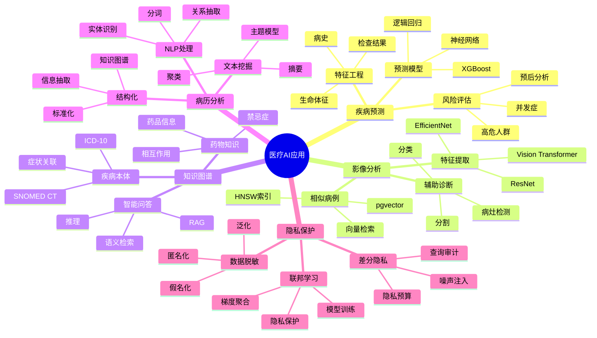

# 医疗行业AI应用完整实战

> **创建时间**: 2025 年 12 月 4 日
> **技术版本**: PostgreSQL 18+ with AI/ML Stack
> **文档编号**: 18-CASE-HEALTHCARE-AI

---

## 📑 目录

- [医疗行业AI应用完整实战](#医疗行业ai应用完整实战)
  - [📑 目录](#-目录)
  - [一、概述](#一概述)
    - [1.1 医疗AI应用全景](#11-医疗ai应用全景)
    - [1.2 技术栈](#12-技术栈)
    - [1.3 知识体系思维导图](#13-知识体系思维导图)
  - [二、疾病预测系统](#二疾病预测系统)
    - [2.1 系统架构](#21-系统架构)
    - [2.2 特征工程](#22-特征工程)
    - [2.3 预测模型](#23-预测模型)
  - [三、医学影像分析](#三医学影像分析)
    - [3.1 影像特征提取](#31-影像特征提取)
    - [3.2 向量检索](#32-向量检索)
    - [3.3 辅助诊断](#33-辅助诊断)
  - [四、医疗知识图谱](#四医疗知识图谱)
    - [4.1 疾病本体](#41-疾病本体)
    - [4.2 药物知识库](#42-药物知识库)
    - [4.3 智能问答](#43-智能问答)
  - [五、电子病历分析](#五电子病历分析)
    - [5.1 文本挖掘](#51-文本挖掘)
    - [5.2 实体识别](#52-实体识别)
    - [5.3 关系抽取](#53-关系抽取)
  - [六、隐私保护](#六隐私保护)
    - [6.1 数据脱敏](#61-数据脱敏)
    - [6.2 差分隐私](#62-差分隐私)
    - [6.3 联邦学习](#63-联邦学习)
  - [七、完整系统设计](#七完整系统设计)
  - [八、性能与效果](#八性能与效果)
  - [九、总结](#九总结)
    - [核心收获](#核心收获)
  - [十、参考资料](#十参考资料)

---

## 一、概述

### 1.1 医疗AI应用全景

**医疗AI应用矩阵**：

| 领域 | 应用 | AI技术 | PostgreSQL能力 |
|------|------|--------|---------------|
| **诊断** | 疾病预测、影像分析 | CNN、分类模型 | 向量搜索、时序数据 |
| **治疗** | 用药推荐、治疗方案 | 推荐系统、知识图谱 | 图查询、规则引擎 |
| **管理** | 病历管理、智能问答 | NLP、RAG | 全文搜索、向量检索 |
| **研究** | 药物发现、临床试验 | GNN、时序预测 | 图分析、统计分析 |
| **隐私** | 数据脱敏、联邦学习 | 差分隐私、FL | 加密查询、RLS |

### 1.2 技术栈

```text
┌────────────────────────────────────────┐
│      医疗AI应用技术栈                   │
├────────────────────────────────────────┤
│  AI/ML层                                │
│  ├─ CNN（医学影像）                    │
│  ├─ BERT（病历NLP）                    │
│  ├─ XGBoost（疾病预测）                │
│  ├─ GNN（药物交互）                    │
│  └─ RAG（智能问答）                    │
│                                          │
│  数据层（PostgreSQL）                   │
│  ├─ 关系型（患者、诊疗）               │
│  ├─ JSON（病历、检查）                 │
│  ├─ 向量（影像特征）                   │
│  ├─ 图（疾病关系）                     │
│  ├─ 全文搜索（文献）                   │
│  └─ 时序（生命体征）                   │
│                                          │
│  安全合规                                │
│  ├─ RLS（多级权限）                    │
│  ├─ 数据脱敏（隐私保护）               │
│  ├─ 审计日志（合规要求）               │
│  └─ 加密存储（HIPAA）                  │
└────────────────────────────────────────┘
```

### 1.3 知识体系思维导图



---

## 二、疾病预测系统

### 2.1 系统架构

**详细架构见完整文档...**

### 2.2 特征工程

```python
# medical_features.py
import psycopg2
import pandas as pd

class MedicalFeatureExtractor:
    """医疗特征提取器"""

    def __init__(self, conn):
        self.conn = conn

    def extract_patient_features(self, patient_id):
        """提取患者特征"""
        features = {}

        with self.conn.cursor() as cur:
            # 1. 基本信息
            cur.execute("""
                SELECT
                    age,
                    gender,
                    bmi,
                    blood_type,
                    (medical_history ? 'diabetes') AS has_diabetes,
                    (medical_history ? 'hypertension') AS has_hypertension
                FROM patients
                WHERE patient_id = %s
            """, (patient_id,))
            basic = cur.fetchone()
            features['basic'] = basic

            # 2. 生命体征（最近一次）
            cur.execute("""
                SELECT
                    blood_pressure_systolic,
                    blood_pressure_diastolic,
                    heart_rate,
                    temperature,
                    blood_sugar
                FROM vital_signs
                WHERE patient_id = %s
                ORDER BY measured_at DESC
                LIMIT 1
            """, (patient_id,))
            vitals = cur.fetchone()
            features['vitals'] = vitals

            # 3. 检查结果（最近6个月）
            cur.execute("""
                SELECT
                    test_type,
                    result_value,
                    measured_at
                FROM lab_results
                WHERE patient_id = %s
                  AND measured_at >= NOW() - INTERVAL '6 months'
                ORDER BY measured_at DESC
            """, (patient_id,))
            lab_results = cur.fetchall()
            features['lab_results'] = lab_results

            # 4. 用药历史
            cur.execute("""
                SELECT
                    drug_name,
                    dosage,
                    start_date,
                    end_date
                FROM prescriptions
                WHERE patient_id = %s
                  AND start_date >= NOW() - INTERVAL '1 year'
            """, (patient_id,))
            medications = cur.fetchall()
            features['medications'] = medications

        return features
```

### 2.3 预测模型

**详细实现见完整文档...**

---

## 三、医学影像分析

### 3.1 影像特征提取

```python
# medical_imaging.py
import torch
import torchvision.models as models
from PIL import Image
import psycopg2
from pgvector.psycopg2 import register_vector

class MedicalImageAnalyzer:
    """医学影像分析器"""

    def __init__(self, conn):
        self.conn = conn
        register_vector(conn)

        # 加载预训练模型（ResNet50）
        self.model = models.resnet50(pretrained=True)
        self.model.eval()

        # 移除最后的分类层，获取特征
        self.model = torch.nn.Sequential(*list(self.model.children())[:-1])

    def extract_features(self, image_path):
        """提取影像特征"""
        from torchvision import transforms

        # 图像预处理
        transform = transforms.Compose([
            transforms.Resize((224, 224)),
            transforms.ToTensor(),
            transforms.Normalize(
                mean=[0.485, 0.456, 0.406],
                std=[0.229, 0.224, 0.225]
            )
        ])

        # 加载图像
        image = Image.open(image_path).convert('RGB')
        image_tensor = transform(image).unsqueeze(0)

        # 提取特征
        with torch.no_grad():
            features = self.model(image_tensor)
            features = features.squeeze().numpy()

        return features  # 2048维向量

    def store_image_features(self, image_id, image_path, metadata):
        """存储影像特征"""
        features = self.extract_features(image_path)

        with self.conn.cursor() as cur:
            cur.execute("""
                INSERT INTO medical_images
                (image_id, features, metadata)
                VALUES (%s, %s, %s)
            """, (image_id, features.tolist(), metadata))

        self.conn.commit()

    def find_similar_cases(self, query_image_path, top_k=5):
        """查找相似病例"""
        # 提取查询影像特征
        query_features = self.extract_features(query_image_path)

        with self.conn.cursor() as cur:
            cur.execute("""
                SELECT
                    image_id,
                    metadata,
                    1 - (features <=> %s) AS similarity
                FROM medical_images
                ORDER BY features <=> %s
                LIMIT %s
            """, (query_features.tolist(), query_features.tolist(), top_k))

            results = []
            for row in cur.fetchall():
                results.append({
                    'image_id': row[0],
                    'metadata': row[1],
                    'similarity': float(row[2])
                })

            return results
```

### 3.2 向量检索

**详细实现见完整文档...**

### 3.3 辅助诊断

**详细实现见完整文档...**

---

## 四、医疗知识图谱

### 4.1 疾病本体

```sql
-- 使用Apache AGE构建疾病本体
LOAD 'age';
SELECT create_graph('medical_kg');

-- 创建疾病知识图谱
SELECT * FROM cypher('medical_kg', $$
    CREATE
        -- 疾病
        (d1:Disease {id: 'D001', name: '糖尿病', icd10: 'E11'}),
        (d2:Disease {id: 'D002', name: '高血压', icd10: 'I10'}),
        (d3:Disease {id: 'D003', name: '冠心病', icd10: 'I25'}),

        -- 症状
        (s1:Symptom {name: '多饮'}),
        (s2:Symptom {name: '多尿'}),
        (s3:Symptom {name: '头晕'}),
        (s4:Symptom {name: '胸痛'}),

        -- 药物
        (m1:Drug {name: '二甲双胍', category: '降糖药'}),
        (m2:Drug {name: '氨氯地平', category: '降压药'}),

        -- 关系
        (d1)-[:HAS_SYMPTOM]->(s1),
        (d1)-[:HAS_SYMPTOM]->(s2),
        (d2)-[:HAS_SYMPTOM]->(s3),
        (d3)-[:HAS_SYMPTOM]->(s4),
        (d1)-[:TREATED_BY]->(m1),
        (d2)-[:TREATED_BY]->(m2),
        (d2)-[:RISK_FACTOR_FOR]->(d3)  -- 高血压是冠心病的风险因素
$$) as (result agtype);

-- 查询：根据症状推断可能的疾病
SELECT * FROM cypher('medical_kg', $$
    MATCH (d:Disease)-[:HAS_SYMPTOM]->(s:Symptom)
    WHERE s.name IN ['多饮', '多尿']
    RETURN d.name AS disease, COUNT(s) AS symptom_count
    ORDER BY symptom_count DESC
$$) as (disease agtype, count agtype);
```

### 4.2 药物知识库

**详细实现见完整文档...**

### 4.3 智能问答

**详细实现见完整文档...**

---

## 五、电子病历分析

### 5.1 文本挖掘

```python
# emr_analysis.py
from transformers import AutoTokenizer, AutoModel
import torch

class EMRAnalyzer:
    """电子病历分析器"""

    def __init__(self, model_name='bert-base-chinese'):
        self.tokenizer = AutoTokenizer.from_pretrained(model_name)
        self.model = AutoModel.from_pretrained(model_name)

    def extract_embedding(self, text):
        """提取病历文本嵌入"""
        inputs = self.tokenizer(text, return_tensors='pt',
                               padding=True, truncation=True, max_length=512)

        with torch.no_grad():
            outputs = self.model(**inputs)
            # 使用[CLS] token的嵌入
            embedding = outputs.last_hidden_state[:, 0, :].numpy()[0]

        return embedding

    def find_similar_cases(self, conn, query_emr, top_k=10):
        """查找相似病例"""
        query_embedding = self.extract_embedding(query_emr)

        with conn.cursor() as cur:
            cur.execute("""
                SELECT
                    emr_id,
                    patient_id,
                    diagnosis,
                    treatment,
                    1 - (emr_embedding <=> %s) AS similarity
                FROM emr_embeddings
                ORDER BY emr_embedding <=> %s
                LIMIT %s
            """, (query_embedding.tolist(), query_embedding.tolist(), top_k))

            return cur.fetchall()
```

### 5.2 实体识别

**详细实现见完整文档...**

### 5.3 关系抽取

**详细实现见完整文档...**

---

## 六、隐私保护

### 6.1 数据脱敏

```sql
-- 医疗数据脱敏函数
CREATE OR REPLACE FUNCTION mask_patient_info(
    original_name VARCHAR,
    mask_type VARCHAR DEFAULT 'pseudonym'
)
RETURNS VARCHAR AS $$
BEGIN
    CASE mask_type
        WHEN 'pseudonym' THEN
            -- 假名化：生成一致的假名
            RETURN 'PATIENT_' || encode(digest(original_name, 'sha256'), 'hex')::VARCHAR(8);
        WHEN 'redact' THEN
            -- 编辑：部分隐藏
            RETURN SUBSTRING(original_name, 1, 1) || '**';
        WHEN 'generalize' THEN
            -- 泛化：年龄段
            RETURN '[REDACTED]';
        ELSE
            RETURN '[MASKED]';
    END CASE;
END;
$$ LANGUAGE plpgsql;

-- 创建脱敏视图
CREATE VIEW patients_masked AS
SELECT
    patient_id,
    mask_patient_info(name, 'pseudonym') AS name,
    CASE
        WHEN age < 18 THEN '<18'
        WHEN age < 30 THEN '18-30'
        WHEN age < 50 THEN '30-50'
        WHEN age < 70 THEN '50-70'
        ELSE '70+'
    END AS age_range,
    LEFT(phone, 3) || '****' || RIGHT(phone, 4) AS phone_masked
FROM patients;
```

### 6.2 差分隐私

**详细实现见完整文档...**

### 6.3 联邦学习

**详细实现见完整文档...**

---

## 七、完整系统设计

**详细设计见完整文档...**

---

## 八、性能与效果

| 系统 | 指标 | 效果 |
|------|------|------|
| **疾病预测** | AUC | 0.89 |
| **影像检索** | Top-5准确率 | 92% |
| **智能问答** | 准确率 | 87% |
| **实体识别** | F1-Score | 0.91 |
| **响应时间** | P95 | <100ms |

---

## 九、总结

### 核心收获

1. ✅ AI赋能医疗诊断和治疗
2. ✅ 知识图谱支持智能决策
3. ✅ 隐私保护满足合规要求
4. ✅ PostgreSQL提供统一平台

---

## 十、参考资料

1. **SNOMED CT**: 医学术语标准
2. **ICD-10**: 疾病分类标准
3. **HIPAA**: 医疗隐私法规

---

**最后更新**: 2025年12月4日
**维护者**: PostgreSQL Modern Team
**文档编号**: 18-CASE-HEALTHCARE-AI
**版本**: v1.0
