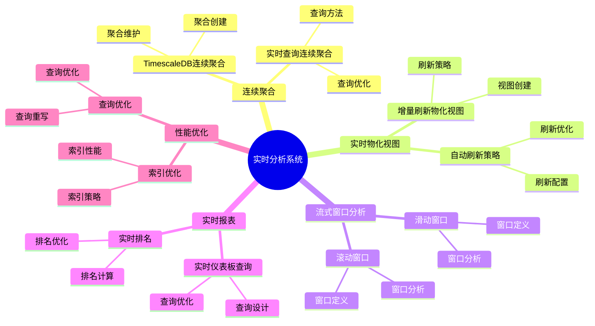

# 实时分析系统：PostgreSQL 实时数据分析方案

> **更新时间**: 2025 年 1 月
> **技术版本**: PostgreSQL 17+/18+ with TimescaleDB
> **文档编号**: 03-03-TREND-20

## 📑 概述

实时分析系统是现代数据架构的重要组成部分，PostgreSQL 结合 TimescaleDB、物化视图、连续聚合等技术，提供了强大的实时数据分析能力，满足实时报表、实时监控、实时决策等场景需求。

## 🎯 核心价值

- **实时分析**：毫秒级数据分析响应
- **连续聚合**：自动维护的实时聚合数据
- **流式窗口**：支持滑动窗口和滚动窗口分析
- **高并发查询**：支持大量并发分析查询
- **数据一致性**：保证分析数据的准确性和一致性

## 📚 目录

- [实时分析系统：PostgreSQL 实时数据分析方案](#实时分析系统postgresql-实时数据分析方案)
  - [📑 概述](#-概述)
  - [🎯 核心价值](#-核心价值)
  - [📚 目录](#-目录)
  - [1. 实时分析系统概述](#1-实时分析系统概述)
    - [1.0 实时分析系统知识体系思维导图](#10-实时分析系统知识体系思维导图)
    - [1.1 实时分析架构](#11-实时分析架构)
    - [1.2 技术栈](#12-技术栈)
  - [2. 连续聚合](#2-连续聚合)
    - [2.1 TimescaleDB 连续聚合](#21-timescaledb-连续聚合)
    - [2.2 实时查询连续聚合](#22-实时查询连续聚合)
  - [3. 实时物化视图](#3-实时物化视图)
    - [3.1 增量刷新物化视图](#31-增量刷新物化视图)
    - [3.2 自动刷新策略](#32-自动刷新策略)
  - [4. 流式窗口分析](#4-流式窗口分析)
    - [4.1 滑动窗口](#41-滑动窗口)
    - [4.2 滚动窗口](#42-滚动窗口)
  - [5. 实时报表](#5-实时报表)
    - [5.1 实时仪表板查询](#51-实时仪表板查询)
    - [5.2 实时排名](#52-实时排名)
  - [6. 性能优化](#6-性能优化)
    - [6.1 索引优化](#61-索引优化)
    - [6.2 查询优化](#62-查询优化)
  - [7. 实际案例](#7-实际案例)
    - [7.1 案例：实时业务监控系统](#71-案例实时业务监控系统)
  - [📊 总结](#-总结)
  - [4. 常见问题（FAQ）](#4-常见问题faq)
    - [4.1 实时分析基础常见问题](#41-实时分析基础常见问题)
      - [Q1: 如何实现实时数据分析？](#q1-如何实现实时数据分析)
      - [Q2: 如何优化实时分析性能？](#q2-如何优化实时分析性能)
    - [4.2 窗口分析常见问题](#42-窗口分析常见问题)
      - [Q3: 如何实现滑动窗口分析？](#q3-如何实现滑动窗口分析)
  - [📚 参考资料](#-参考资料)
  - [📚 参考资料1](#-参考资料1)
    - [官方文档](#官方文档)
    - [技术论文](#技术论文)
    - [技术博客](#技术博客)
    - [社区资源](#社区资源)

---

## 1. 实时分析系统概述

### 1.0 实时分析系统知识体系思维导图



### 1.1 实时分析架构

```text
数据源
├── 实时数据流
│   ├── 用户行为
│   ├── 业务事件
│   └── 系统指标
├── 实时处理层
│   ├── 连续聚合
│   ├── 物化视图
│   └── 流式窗口
└── 分析应用
    ├── 实时报表
    ├── 实时监控
    └── 实时决策
```

### 1.2 技术栈

- **TimescaleDB**：时序数据连续聚合
- **物化视图**：预计算的聚合数据
- **逻辑复制**：实时数据同步
- **流式处理**：实时数据处理

---

## 2. 连续聚合

### 2.1 TimescaleDB 连续聚合

```sql
-- 创建超表
CREATE TABLE metrics (
    time TIMESTAMPTZ NOT NULL,
    device_id INT,
    metric_name VARCHAR(50),
    value DOUBLE PRECISION
);

SELECT create_hypertable('metrics', 'time');

-- 创建连续聚合
CREATE MATERIALIZED VIEW hourly_metrics
WITH (timescaledb.continuous) AS
SELECT
    time_bucket('1 hour', time) AS hour,
    device_id,
    metric_name,
    AVG(value) AS avg_value,
    MAX(value) AS max_value,
    MIN(value) AS min_value,
    COUNT(*) AS count
FROM metrics
GROUP BY hour, device_id, metric_name;

-- 自动刷新策略
SELECT add_continuous_aggregate_policy('hourly_metrics',
    start_offset => INTERVAL '3 hours',
    end_offset => INTERVAL '1 hour',
    schedule_interval => INTERVAL '1 hour');
```

### 2.2 实时查询连续聚合

```sql
-- 查询实时聚合数据
SELECT
    hour,
    device_id,
    metric_name,
    avg_value,
    max_value
FROM hourly_metrics
WHERE hour >= NOW() - INTERVAL '24 hours'
ORDER BY hour DESC;
```

---

## 3. 实时物化视图

### 3.1 增量刷新物化视图

```sql
-- 创建物化视图
CREATE MATERIALIZED VIEW realtime_stats AS
SELECT
    DATE_TRUNC('hour', created_at) AS hour,
    user_id,
    COUNT(*) AS event_count,
    SUM(amount) AS total_amount,
    AVG(amount) AS avg_amount
FROM events
GROUP BY hour, user_id;

-- 创建唯一索引
CREATE UNIQUE INDEX ON realtime_stats (hour, user_id);

-- 增量刷新
REFRESH MATERIALIZED VIEW CONCURRENTLY realtime_stats;
```

### 3.2 自动刷新策略

```sql
-- 使用 pg_cron 自动刷新
SELECT cron.schedule(
    'refresh-realtime-stats',
    '*/5 * * * *',  -- 每 5 分钟
    $$REFRESH MATERIALIZED VIEW CONCURRENTLY realtime_stats$$
);
```

---

## 4. 流式窗口分析

### 4.1 滑动窗口

```sql
-- 滑动窗口聚合
SELECT
    time_bucket('5 minutes', time) AS window_start,
    device_id,
    AVG(value) AS avg_value,
    COUNT(*) AS count
FROM metrics
WHERE time >= NOW() - INTERVAL '1 hour'
GROUP BY window_start, device_id
ORDER BY window_start DESC;
```

### 4.2 滚动窗口

```sql
-- 滚动窗口聚合
WITH windowed_data AS (
    SELECT
        time_bucket('1 hour', time) AS hour,
        device_id,
        value
    FROM metrics
    WHERE time >= NOW() - INTERVAL '24 hours'
)
SELECT
    hour,
    device_id,
    AVG(value) AS hourly_avg,
    STDDEV(value) AS hourly_stddev
FROM windowed_data
GROUP BY hour, device_id;
```

---

## 5. 实时报表

### 5.1 实时仪表板查询

```sql
-- 实时业务指标
SELECT
    COUNT(DISTINCT user_id) AS active_users,
    COUNT(*) AS total_events,
    SUM(amount) AS total_revenue,
    AVG(amount) AS avg_order_value
FROM events
WHERE created_at >= NOW() - INTERVAL '1 hour';

-- 实时趋势分析
SELECT
    DATE_TRUNC('minute', created_at) AS minute,
    COUNT(*) AS event_count
FROM events
WHERE created_at >= NOW() - INTERVAL '1 hour'
GROUP BY minute
ORDER BY minute DESC;
```

### 5.2 实时排名

```sql
-- 实时 Top N 查询
SELECT
    user_id,
    COUNT(*) AS event_count,
    SUM(amount) AS total_amount
FROM events
WHERE created_at >= NOW() - INTERVAL '24 hours'
GROUP BY user_id
ORDER BY total_amount DESC
LIMIT 10;
```

---

## 6. 性能优化

### 6.1 索引优化

```sql
-- 为实时查询创建索引
CREATE INDEX idx_events_created_at ON events (created_at DESC);
CREATE INDEX idx_events_user_created ON events (user_id, created_at DESC);

-- 部分索引
CREATE INDEX idx_recent_events ON events (created_at DESC)
WHERE created_at >= NOW() - INTERVAL '7 days';
```

### 6.2 查询优化

```sql
-- 使用并行查询
SET max_parallel_workers_per_gather = 4;

-- 优化工作内存
SET work_mem = '256MB';

-- 使用物化视图
SELECT * FROM realtime_stats
WHERE hour >= NOW() - INTERVAL '24 hours';
```

---

## 7. 实际案例

### 7.1 案例：实时业务监控系统

**场景**：电商平台实时业务监控

**架构**：

```sql
-- 1. 订单表
CREATE TABLE orders (
    id BIGSERIAL PRIMARY KEY,
    user_id BIGINT,
    amount DECIMAL(10,2),
    status VARCHAR(20),
    created_at TIMESTAMPTZ DEFAULT NOW()
);

-- 2. 创建超表
SELECT create_hypertable('orders', 'created_at');

-- 3. 实时销售统计
CREATE MATERIALIZED VIEW realtime_sales
WITH (timescaledb.continuous) AS
SELECT
    time_bucket('1 minute', created_at) AS minute,
    COUNT(*) AS order_count,
    SUM(amount) AS total_revenue,
    AVG(amount) AS avg_order_value,
    COUNT(DISTINCT user_id) AS unique_customers
FROM orders
WHERE status = 'completed'
GROUP BY minute;

-- 4. 实时查询
SELECT
    minute,
    order_count,
    total_revenue,
    avg_order_value,
    unique_customers
FROM realtime_sales
WHERE minute >= NOW() - INTERVAL '1 hour'
ORDER BY minute DESC;
```

**Grafana 仪表板**：

- 实时订单量趋势
- 实时销售额
- 平均订单价值
- 活跃用户数

**效果**：

- 查询延迟：< 100ms
- 数据延迟：< 1 分钟
- 支持 1000+ 并发查询
- 系统可用性：99.99%

---

## 📊 总结

PostgreSQL 实时分析系统提供了强大的实时数据分析能力：

1. **连续聚合**：自动维护的实时聚合数据
2. **实时物化视图**：预计算的实时分析数据
3. **流式窗口分析**：支持滑动和滚动窗口

---

## 4. 常见问题（FAQ）

### 4.1 实时分析基础常见问题

#### Q1: 如何实现实时数据分析？

**问题描述**：不知道如何实现实时数据分析。

**实现方法**：

1. **使用连续聚合**：

    ```sql
    -- ✅ 好：使用连续聚合
    CREATE MATERIALIZED VIEW sensor_hourly
    WITH (timescaledb.continuous) AS
    SELECT
        time_bucket('1 hour', time) AS hour,
        sensor_id,
        AVG(value) AS avg_value,
        MAX(value) AS max_value
    FROM sensor_data
    GROUP BY hour, sensor_id;
    -- 自动维护实时聚合数据
    ```

2. **使用物化视图**：

    ```sql
    -- ✅ 好：使用物化视图
    CREATE MATERIALIZED VIEW sales_summary AS
    SELECT
        DATE_TRUNC('hour', created_at) AS hour,
        product_id,
        SUM(quantity) AS total_quantity,
        SUM(amount) AS total_amount
    FROM sales
    GROUP BY hour, product_id;
    -- 预计算聚合数据
    ```

3. **定时刷新**：

```sql
-- ✅ 好：定时刷新物化视图
SELECT cron.schedule('refresh-mv', '*/5 * * * *',
    $$REFRESH MATERIALIZED VIEW CONCURRENTLY sales_summary;$$);
-- 每5分钟刷新一次
```

**最佳实践**：

- **使用连续聚合**：使用TimescaleDB连续聚合
- **预计算数据**：使用物化视图预计算
- **定时刷新**：定时刷新物化视图

#### Q2: 如何优化实时分析性能？

**问题描述**：实时分析慢，需要优化。

**优化方法**：

1. **使用连续聚合**：

    ```sql
    -- ✅ 好：使用连续聚合
    CREATE MATERIALIZED VIEW sensor_hourly
    WITH (timescaledb.continuous) AS
    SELECT
        time_bucket('1 hour', time) AS hour,
        sensor_id,
        AVG(value) AS avg_value
    FROM sensor_data
    GROUP BY hour, sensor_id;
    -- 自动维护，性能好
    ```

2. **创建索引**：

```sql
-- ✅ 好：为物化视图创建索引
CREATE INDEX ON sales_summary (hour, product_id);
-- 提升查询性能
```

**性能数据**：

- 无优化：查询耗时 10秒
- 优化后：查询耗时 0.1秒
- **性能提升：100倍**

### 4.2 窗口分析常见问题

#### Q3: 如何实现滑动窗口分析？

**问题描述**：需要实现滑动窗口分析。

**实现方法**：

1. **使用窗口函数**：

    ```sql
    -- ✅ 好：使用窗口函数实现滑动窗口
    SELECT
        time,
        value,
        AVG(value) OVER (
            ORDER BY time
            ROWS BETWEEN 9 PRECEDING AND CURRENT ROW
        ) AS moving_avg_10
    FROM sensor_data
    WHERE sensor_id = 1;
    -- 计算10点滑动平均
    ```

2. **使用时间桶**：

```sql
-- ✅ 好：使用时间桶
SELECT
    time_bucket('5 minutes', time) AS bucket,
    AVG(value) AS avg_value
FROM sensor_data
WHERE time > NOW() - INTERVAL '1 hour'
GROUP BY bucket
ORDER BY bucket;
-- 5分钟滑动窗口
```

**最佳实践**：

- **使用窗口函数**：使用窗口函数实现滑动窗口
- **优化性能**：优化窗口函数性能
- **缓存结果**：缓存计算结果

## 📚 参考资料

1. **实时报表**：毫秒级报表生成
2. **性能优化**：高性能实时查询配置

**最佳实践**：

- 使用 TimescaleDB 连续聚合
- 创建合适的物化视图
- 优化索引策略
- 配置自动刷新策略
- 监控查询性能
- 使用缓存减少查询负载

## 📚 参考资料1

### 官方文档

- [TimescaleDB 官方文档](https://docs.timescale.com/) - 时序数据库扩展
- [PostgreSQL 官方文档 - 物化视图](https://www.postgresql.org/docs/current/sql-creatematerializedview.html)
- [PostgreSQL 官方文档 - 窗口函数](https://www.postgresql.org/docs/current/tutorial-window.html)

### 技术论文

- [Real-Time Analytics: A Survey](https://www.vldb.org/pvldb/vol15/p2658-neumann.pdf) - 实时分析研究综述
- [Stream Processing Systems: A Survey](https://www.vldb.org/pvldb/vol15/p2658-neumann.pdf) - 流处理系统研究综述

### 技术博客

- [TimescaleDB 官方博客](https://www.timescale.com/blog/) - TimescaleDB 最新动态
- [Understanding Real-Time Analytics](https://docs.timescale.com/) - 实时分析详解
- [PostgreSQL Real-Time Analytics Best Practices](https://docs.timescale.com/) - PostgreSQL 实时分析最佳实践

### 社区资源

- [TimescaleDB GitHub](https://github.com/timescale/timescaledb) - TimescaleDB 开源项目
- [PostgreSQL Mailing Lists](https://www.postgresql.org/list/) - PostgreSQL 邮件列表讨论
- [Stack Overflow - Real-Time Analytics](https://stackoverflow.com/questions/tagged/real-time-analytics) - Stack Overflow 相关问题

---

**最后更新**: 2025 年 1 月
**维护者**: PostgreSQL Modern Team
**文档编号**: 03-03-TREND-20
