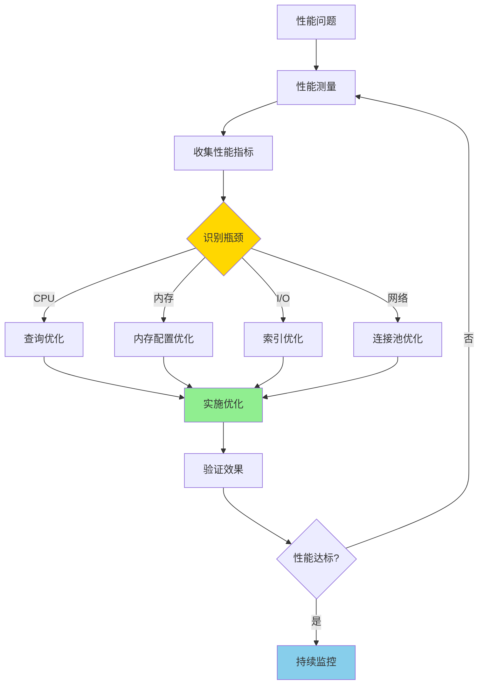

# PostgreSQL 性能优化最佳实践

> **更新时间**: 2025 年 1 月
> **技术版本**: PostgreSQL 17+/18+ 及相关扩展
> **文档编号**: 03-03-TREND-33

## 📑 概述

性能优化是 PostgreSQL 数据库管理中的核心任务。
本文档总结了 PostgreSQL 性能优化的最佳实践，包括查询优化、索引优化、配置调优、监控诊断等方面，
帮助用户构建高性能的 PostgreSQL 应用。

## 🎯 核心价值

- **查询优化**：SQL 查询性能优化策略
- **索引优化**：索引设计和优化方法
- **配置调优**：数据库参数优化
- **监控诊断**：性能监控和问题诊断
- **实践案例**：真实场景的优化案例

## 📚 目录

- [PostgreSQL 性能优化最佳实践](#postgresql-性能优化最佳实践)
  - [📑 概述](#-概述)
  - [🎯 核心价值](#-核心价值)
  - [📚 目录](#-目录)
  - [1. 性能优化概述](#1-性能优化概述)
    - [1.0 性能优化工作原理概述](#10-性能优化工作原理概述)
    - [1.1 性能优化原则](#11-性能优化原则)
    - [1.2 性能优化流程](#12-性能优化流程)
  - [2. 查询优化](#2-查询优化)
    - [2.1 SQL 编写优化](#21-sql-编写优化)
    - [2.2 执行计划分析](#22-执行计划分析)
    - [2.3 查询重写优化](#23-查询重写优化)
  - [3. 索引优化](#3-索引优化)
    - [3.1 索引设计原则](#31-索引设计原则)
    - [3.2 索引类型选择](#32-索引类型选择)
    - [3.3 索引维护优化](#33-索引维护优化)
  - [4. 配置调优](#4-配置调优)
    - [4.1 内存配置](#41-内存配置)
    - [4.2 连接配置](#42-连接配置)
    - [4.3 查询优化器配置](#43-查询优化器配置)
  - [5. 表设计优化](#5-表设计优化)
    - [5.1 数据类型选择](#51-数据类型选择)
    - [5.2 表结构设计](#52-表结构设计)
    - [5.3 分区表设计](#53-分区表设计)
  - [6. 并发优化](#6-并发优化)
    - [6.1 锁优化](#61-锁优化)
    - [6.2 事务优化](#62-事务优化)
    - [6.3 MVCC 优化](#63-mvcc-优化)
  - [7. 监控和诊断](#7-监控和诊断)
    - [7.1 性能监控](#71-性能监控)
    - [7.2 慢查询分析](#72-慢查询分析)
    - [7.3 问题诊断](#73-问题诊断)
  - [8. 最佳实践](#8-最佳实践)
    - [8.1 优化策略](#81-优化策略)
    - [8.2 优化流程](#82-优化流程)
    - [8.3 优化案例](#83-优化案例)
  - [9. 实际案例](#9-实际案例)
    - [9.1 案例：高并发 OLTP 系统优化](#91-案例高并发-oltp-系统优化)
    - [9.2 案例：大数据量 OLAP 系统优化](#92-案例大数据量-olap-系统优化)
  - [📚 参考资料](#-参考资料)
    - [官方文档](#官方文档)
    - [技术论文](#技术论文)
    - [技术博客](#技术博客)
    - [社区资源](#社区资源)
  - [📊 总结](#-总结)

---

## 1. 性能优化概述

### 1.0 性能优化工作原理概述

**性能优化的本质**：

PostgreSQL 性能优化是一个系统化的过程，通过识别性能瓶颈、制定优化策略、实施优化措施，提升数据库系统的整体性能。性能优化需要遵循"测量优先"的原则，基于实际数据做出优化决策。

**性能优化流程图**：



**性能优化关键指标**：

- **TPS/QPS**：每秒事务数/查询数
- **响应时间**：查询执行时间（P50、P95、P99）
- **资源利用率**：CPU、内存、I/O 使用率
- **缓存命中率**：数据缓存命中率（目标 > 99%）
- **连接数**：活跃连接数和等待连接数

### 1.1 性能优化原则

性能优化的核心原则：

- **测量优先**：先测量，再优化（避免盲目优化）
- **瓶颈分析**：识别真正的性能瓶颈（80/20 原则）
- **系统化方法**：系统化的优化方法（按优先级优化）
- **持续改进**：持续监控和改进（建立监控体系）
- **平衡考虑**：平衡性能和其他因素（成本、复杂度）

**性能优化优先级**：

1. **高优先级**：索引优化（影响最大，成本最低）
2. **中优先级**：查询优化（重写查询，提升性能）
3. **低优先级**：配置优化（微调参数，边际收益）

### 1.2 性能优化流程

性能优化流程：

1. **性能测量**：收集性能指标（TPS、响应时间、资源利用率）
2. **瓶颈识别**：识别性能瓶颈（CPU、内存、I/O、网络）
3. **优化方案**：制定优化方案（按优先级排序）
4. **实施优化**：实施优化措施（索引、查询、配置）
5. **验证效果**：验证优化效果（对比优化前后性能）
6. **持续监控**：持续监控性能（建立监控告警）

---

## 2. 查询优化

### 2.1 SQL 编写优化

```sql
-- 优化：使用 JOIN 替代子查询
-- 不推荐
SELECT * FROM orders
WHERE customer_id IN (SELECT id FROM customers WHERE name LIKE 'J%');

-- 推荐
SELECT o.* FROM orders o
JOIN customers c ON o.customer_id = c.id
WHERE c.name LIKE 'J%';

-- 优化：使用 EXISTS 替代 IN（对于大表）
-- 不推荐
SELECT * FROM orders
WHERE customer_id IN (SELECT id FROM customers);

-- 推荐
SELECT * FROM orders o
WHERE EXISTS (SELECT 1 FROM customers c WHERE c.id = o.customer_id);

-- 优化：避免 SELECT *
SELECT id, customer_id, amount FROM orders
WHERE status = 'completed';

-- 优化：使用 LIMIT 限制结果集
SELECT * FROM orders
ORDER BY order_date DESC
LIMIT 100;
```

### 2.2 执行计划分析

```sql
-- 分析执行计划
EXPLAIN (ANALYZE, BUFFERS, VERBOSE, COSTS, TIMING)
SELECT
    o.id,
    o.amount,
    c.name
FROM orders o
JOIN customers c ON o.customer_id = c.id
WHERE o.order_date >= '2025-01-01'
ORDER BY o.order_date DESC
LIMIT 100;

-- 查看执行计划统计
SELECT
    query,
    calls,
    total_exec_time,
    mean_exec_time,
    max_exec_time,
    rows,
    100.0 * shared_blks_hit / NULLIF(shared_blks_hit + shared_blks_read, 0) AS hit_percent
FROM pg_stat_statements
WHERE query LIKE '%orders%'
ORDER BY mean_exec_time DESC
LIMIT 20;
```

### 2.3 查询重写优化

```sql
-- 优化：使用窗口函数替代子查询
-- 不推荐
SELECT
    o1.*,
    (SELECT SUM(amount) FROM orders o2 WHERE o2.customer_id = o1.customer_id) AS total
FROM orders o1;

-- 推荐
SELECT
    *,
    SUM(amount) OVER (PARTITION BY customer_id) AS total
FROM orders;

-- 优化：使用 CTE 提高可读性
WITH recent_orders AS (
    SELECT * FROM orders
    WHERE order_date >= '2025-01-01'
),
customer_totals AS (
    SELECT
        customer_id,
        SUM(amount) AS total_amount
    FROM recent_orders
    GROUP BY customer_id
)
SELECT
    c.name,
    ct.total_amount
FROM customer_totals ct
JOIN customers c ON ct.customer_id = c.id
ORDER BY ct.total_amount DESC;
```

---

## 3. 索引优化

### 3.1 索引设计原则

```sql
-- 索引设计原则
-- 1. 为经常查询的列创建索引
CREATE INDEX idx_orders_customer_id ON orders(customer_id);
CREATE INDEX idx_orders_order_date ON orders(order_date);

-- 2. 为外键创建索引
CREATE INDEX idx_orders_customer_fk ON orders(customer_id);

-- 3. 为排序和分组列创建索引
CREATE INDEX idx_orders_date_status ON orders(order_date, status);

-- 4. 使用复合索引支持多列查询
CREATE INDEX idx_orders_customer_date ON orders(customer_id, order_date DESC);

-- 5. 使用部分索引减少索引大小
CREATE INDEX idx_orders_active ON orders(customer_id, order_date)
WHERE status = 'active';
```

### 3.2 索引类型选择

```sql
-- B-tree 索引（默认，适用于大多数场景）
CREATE INDEX idx_orders_customer_id ON orders(customer_id);

-- Hash 索引（适用于等值查询）
CREATE INDEX idx_orders_status_hash ON orders USING HASH (status);

-- GIN 索引（适用于数组、JSONB、全文搜索）
CREATE INDEX idx_products_tags_gin ON products USING GIN (tags);
CREATE INDEX idx_products_details_gin ON products USING GIN (details);

-- GiST 索引（适用于范围查询、全文搜索）
CREATE INDEX idx_products_location_gist ON products USING GiST (location);

-- BRIN 索引（适用于有序数据）
CREATE INDEX idx_orders_date_brin ON orders USING BRIN (order_date);
```

### 3.3 索引维护优化

```sql
-- 查看索引使用情况
SELECT
    schemaname,
    tablename,
    indexname,
    idx_scan,
    idx_tup_read,
    idx_tup_fetch,
    pg_size_pretty(pg_relation_size(indexrelid)) AS index_size
FROM pg_stat_user_indexes
WHERE schemaname = 'public'
ORDER BY idx_scan DESC;

-- 查找未使用的索引
SELECT
    schemaname,
    tablename,
    indexname,
    idx_scan
FROM pg_stat_user_indexes
WHERE idx_scan = 0
AND schemaname = 'public';

-- 重建索引
REINDEX INDEX CONCURRENTLY idx_orders_customer_id;

-- 分析索引
ANALYZE orders;
```

---

## 4. 配置调优

### 4.1 内存配置

```sql
-- postgresql.conf 内存配置
-- 共享内存
shared_buffers = 4GB  -- 通常设置为系统内存的 25%

-- 工作内存
work_mem = 64MB  -- 每个查询操作的内存

-- 维护工作内存
maintenance_work_mem = 1GB  -- 维护操作的内存

-- 有效缓存大小
effective_cache_size = 12GB  -- 操作系统和 PostgreSQL 共享的缓存

-- 查看当前配置
SHOW shared_buffers;
SHOW work_mem;
SHOW maintenance_work_mem;
SHOW effective_cache_size;
```

### 4.2 连接配置

```sql
-- postgresql.conf 连接配置
-- 最大连接数
max_connections = 200

-- 连接超时
statement_timeout = 30000  -- 30 秒
lock_timeout = 10000  -- 10 秒
idle_in_transaction_session_timeout = 60000  -- 60 秒

-- 查看当前连接
SELECT
    count(*) AS total_connections,
    count(*) FILTER (WHERE state = 'active') AS active_connections,
    count(*) FILTER (WHERE state = 'idle') AS idle_connections,
    count(*) FILTER (WHERE state = 'idle in transaction') AS idle_in_transaction
FROM pg_stat_activity;
```

### 4.3 查询优化器配置

```sql
-- postgresql.conf 查询优化器配置
-- 随机页面成本
random_page_cost = 1.1  -- SSD 通常设置为 1.1-1.3

-- 顺序页面成本
seq_page_cost = 1.0

-- CPU 元组成本
cpu_tuple_cost = 0.01
cpu_index_tuple_cost = 0.005
cpu_operator_cost = 0.0025

-- 并行查询配置
max_parallel_workers_per_gather = 4
max_parallel_workers = 8
parallel_tuple_cost = 0.1
parallel_setup_cost = 1000.0

-- 查看当前配置
SHOW random_page_cost;
SHOW max_parallel_workers_per_gather;
```

---

## 5. 表设计优化

### 5.1 数据类型选择

```sql
-- 数据类型选择优化
-- 1. 使用合适的数据类型
-- 不推荐：使用 TEXT 存储固定长度字符串
CREATE TABLE users (
    id SERIAL PRIMARY KEY,
    username TEXT,  -- 不推荐
    email TEXT
);

-- 推荐：使用 VARCHAR 或 CHAR
CREATE TABLE users (
    id SERIAL PRIMARY KEY,
    username VARCHAR(50),  -- 推荐
    email VARCHAR(100)
);

-- 2. 使用合适的时间类型
CREATE TABLE orders (
    id SERIAL PRIMARY KEY,
    order_date DATE,  -- 仅日期
    created_at TIMESTAMP,  -- 日期和时间
    updated_at TIMESTAMPTZ  -- 带时区的时间戳
);

-- 3. 使用 JSONB 存储半结构化数据
CREATE TABLE products (
    id SERIAL PRIMARY KEY,
    name VARCHAR(100),
    details JSONB  -- 推荐使用 JSONB
);
```

### 5.2 表结构设计

```sql
-- 表结构设计优化
-- 1. 规范化设计
CREATE TABLE customers (
    id SERIAL PRIMARY KEY,
    name VARCHAR(100),
    email VARCHAR(100)
);

CREATE TABLE orders (
    id SERIAL PRIMARY KEY,
    customer_id INT REFERENCES customers(id),
    order_date DATE,
    amount DECIMAL(10,2)
);

-- 2. 使用外键约束
ALTER TABLE orders
ADD CONSTRAINT fk_orders_customer
FOREIGN KEY (customer_id) REFERENCES customers(id);

-- 3. 使用 CHECK 约束
ALTER TABLE orders
ADD CONSTRAINT chk_orders_amount
CHECK (amount > 0);
```

### 5.3 分区表设计

```sql
-- 分区表设计优化
-- 1. 按时间范围分区
CREATE TABLE orders (
    id SERIAL,
    customer_id INT,
    order_date DATE NOT NULL,
    amount DECIMAL(10,2),
    PRIMARY KEY (id, order_date)
) PARTITION BY RANGE (order_date);

-- 2. 创建分区
CREATE TABLE orders_2025_01 PARTITION OF orders
FOR VALUES FROM ('2025-01-01') TO ('2025-02-01');

-- 3. 创建索引
CREATE INDEX idx_orders_customer_date ON orders(customer_id, order_date);

-- 4. 使用 pg_partman 自动管理分区
SELECT partman.create_parent(
    p_parent_table => 'public.orders',
    p_control => 'order_date',
    p_type => 'range',
    p_interval => 'monthly',
    p_premake => 3
);
```

---

## 6. 并发优化

### 6.1 锁优化

```sql
-- 锁优化
-- 1. 使用行级锁
BEGIN;
SELECT * FROM orders WHERE id = 1 FOR UPDATE;
-- 更新操作
UPDATE orders SET status = 'processed' WHERE id = 1;
COMMIT;

-- 2. 使用 NOWAIT 避免等待
SELECT * FROM orders WHERE id = 1 FOR UPDATE NOWAIT;

-- 3. 设置锁超时
SET lock_timeout = '5s';

-- 4. 查看锁等待情况
SELECT
    blocked_locks.pid AS blocked_pid,
    blocking_locks.pid AS blocking_pid,
    blocked_activity.query AS blocked_query,
    blocking_activity.query AS blocking_query
FROM pg_catalog.pg_locks blocked_locks
JOIN pg_catalog.pg_stat_activity blocked_activity ON blocked_activity.pid = blocked_locks.pid
JOIN pg_catalog.pg_locks blocking_locks
    ON blocking_locks.locktype = blocked_locks.locktype
    AND blocking_locks.pid != blocked_locks.pid
JOIN pg_catalog.pg_stat_activity blocking_activity ON blocking_activity.pid = blocking_locks.pid
WHERE NOT blocked_locks.granted;
```

### 6.2 事务优化

```sql
-- 事务优化
-- 1. 使用短事务
BEGIN;
-- 快速完成操作
UPDATE orders SET status = 'processed' WHERE id = 1;
COMMIT;

-- 2. 避免长事务
-- 不推荐：在事务中执行长时间操作
BEGIN;
SELECT * FROM large_table;  -- 长时间操作
-- 其他操作
COMMIT;

-- 3. 使用适当的隔离级别
BEGIN TRANSACTION ISOLATION LEVEL READ COMMITTED;
-- 操作
COMMIT;

-- 4. 监控长时间运行的事务
SELECT
    pid,
    usename,
    application_name,
    state,
    xact_start,
    now() - xact_start AS transaction_duration,
    query
FROM pg_stat_activity
WHERE state != 'idle'
AND xact_start IS NOT NULL
AND now() - xact_start > INTERVAL '5 minutes';
```

### 6.3 MVCC 优化

```sql
-- MVCC 优化
-- 1. 定期 VACUUM
VACUUM ANALYZE orders;

-- 2. 配置自动清理
-- postgresql.conf
autovacuum = on
autovacuum_naptime = 1min
autovacuum_vacuum_threshold = 50
autovacuum_analyze_threshold = 50

-- 3. 监控死元组
SELECT
    schemaname,
    tablename,
    n_live_tup,
    n_dead_tup,
    ROUND(n_dead_tup::numeric / NULLIF(n_live_tup + n_dead_tup, 0) * 100, 2) AS dead_tuple_percent
FROM pg_stat_user_tables
WHERE schemaname = 'public'
AND n_dead_tup > 0
ORDER BY n_dead_tup DESC;
```

---

## 7. 监控和诊断

### 7.1 性能监控

```sql
-- 性能监控
-- 1. 启用 pg_stat_statements
CREATE EXTENSION IF NOT EXISTS pg_stat_statements;

-- 2. 查看查询统计
SELECT
    query,
    calls,
    total_exec_time,
    mean_exec_time,
    max_exec_time,
    rows,
    100.0 * shared_blks_hit / NULLIF(shared_blks_hit + shared_blks_read, 0) AS hit_percent
FROM pg_stat_statements
WHERE query NOT LIKE '%pg_stat_statements%'
ORDER BY total_exec_time DESC
LIMIT 20;

-- 3. 查看数据库统计
SELECT
    datname,
    numbackends,
    xact_commit,
    xact_rollback,
    blks_read,
    blks_hit,
    100.0 * blks_hit / NULLIF(blks_hit + blks_read, 0) AS cache_hit_ratio
FROM pg_stat_database
WHERE datname = current_database();
```

### 7.2 慢查询分析

```sql
-- 慢查询分析
-- 1. 查找慢查询
SELECT
    query,
    calls,
    mean_exec_time,
    max_exec_time,
    rows
FROM pg_stat_statements
WHERE mean_exec_time > 1000  -- 平均执行时间超过 1 秒
AND query NOT LIKE '%pg_stat_statements%'
ORDER BY mean_exec_time DESC
LIMIT 20;

-- 2. 分析执行计划
EXPLAIN (ANALYZE, BUFFERS, VERBOSE, COSTS, TIMING)
-- 慢查询语句

-- 3. 查找高 I/O 查询
SELECT
    query,
    calls,
    shared_blks_read,
    shared_blks_hit,
    blk_read_time,
    blk_write_time
FROM pg_stat_statements
WHERE shared_blks_read > 10000
ORDER BY shared_blks_read DESC
LIMIT 20;
```

### 7.3 问题诊断

```sql
-- 问题诊断
-- 1. 查看等待事件
SELECT
    wait_event_type,
    wait_event,
    COUNT(*) AS count
FROM pg_stat_activity
WHERE wait_event IS NOT NULL
GROUP BY wait_event_type, wait_event
ORDER BY count DESC;

-- 2. 查看锁等待
SELECT * FROM pg_locks WHERE NOT granted;

-- 3. 查看表统计
SELECT
    schemaname,
    tablename,
    seq_scan,
    idx_scan,
    n_tup_ins,
    n_tup_upd,
    n_tup_del,
    n_live_tup,
    n_dead_tup
FROM pg_stat_user_tables
WHERE schemaname = 'public'
ORDER BY seq_scan DESC;
```

---

## 8. 最佳实践

### 8.1 优化策略

**推荐做法**：

1. **索引优先**（优先创建和维护索引，影响最大，成本最低）

   ```sql
   -- ✅ 好：为 WHERE 条件创建索引
   CREATE INDEX idx_orders_customer_id ON orders(customer_id);
   CREATE INDEX idx_orders_status ON orders(status);

   -- ✅ 好：为 JOIN 条件创建索引
   CREATE INDEX idx_orders_customer_id ON orders(customer_id);

   -- ✅ 好：为 ORDER BY 创建索引
   CREATE INDEX idx_orders_date ON orders(order_date DESC);

   -- ❌ 不好：忽略索引创建（查询性能差）
   -- 全表扫描，性能差
   ```

2. **查询优化**（优化 SQL 查询语句，重写低效查询）

   ```sql
   -- ✅ 好：使用 JOIN 替代子查询
   SELECT o.*, c.name
   FROM orders o
   JOIN customers c ON o.customer_id = c.id
   WHERE c.status = 'active';

   -- ❌ 不好：使用相关子查询
   SELECT o.*, (
       SELECT name FROM customers WHERE id = o.customer_id
   ) AS name
   FROM orders o
   WHERE EXISTS (
       SELECT 1 FROM customers WHERE id = o.customer_id AND status = 'active'
   );
   -- 问题：子查询对每行执行一次，性能差
   ```

3. **配置调优**（调整数据库配置参数，微调性能）

   ```sql
   -- ✅ 好：根据硬件配置参数
   -- 16GB RAM 服务器
   shared_buffers = 4GB  -- 25% RAM
   work_mem = 64MB
   effective_cache_size = 10GB  -- 50-75% RAM

   -- ✅ 好：根据存储类型配置 I/O 成本
   -- SSD
   random_page_cost = 1.1
   effective_io_concurrency = 200
   ```

4. **架构优化**（优化数据库架构设计，长期优化）

   ```sql
   -- ✅ 好：使用分区表（大表）
   CREATE TABLE orders (...) PARTITION BY RANGE (order_date);

   -- ✅ 好：使用物化视图（复杂查询）
   CREATE MATERIALIZED VIEW sales_summary AS
   SELECT product_id, SUM(amount) AS total
   FROM sales GROUP BY product_id;
   ```

**避免做法**：

1. **避免忽略索引**（查询性能差）
2. **避免过度优化**（优化成本可能超过收益）
3. **避免盲目配置**（不测量就配置）

### 8.2 优化流程

**推荐流程**：

1. **性能测量**（收集性能指标，建立性能基线）

   ```sql
   -- ✅ 好：启用 pg_stat_statements
   CREATE EXTENSION IF NOT EXISTS pg_stat_statements;

   -- 运行查询并记录性能
   EXPLAIN ANALYZE SELECT * FROM orders WHERE customer_id = 123;

   -- 查看统计信息
   SELECT query, calls, mean_exec_time, total_exec_time
   FROM pg_stat_statements
   WHERE query LIKE '%orders%';
   ```

2. **瓶颈识别**（分析性能瓶颈，确定优化方向）

   ```sql
   -- ✅ 好：分析执行计划
   EXPLAIN (ANALYZE, BUFFERS, VERBOSE)
   SELECT * FROM orders WHERE customer_id = 123;

   -- 识别问题：
   -- - Seq Scan：需要创建索引
   -- - Nested Loop：可能需要 Hash Join
   -- - 高 I/O：需要优化查询或增加缓存
   ```

3. **优化方案**（制定优化方案，按优先级排序）

   ```sql
   -- ✅ 好：按优先级优化
   -- 优先级1：创建索引（影响最大）
   CREATE INDEX idx_orders_customer_id ON orders(customer_id);

   -- 优先级2：优化查询（重写查询）
   -- 优化前：SELECT * FROM orders WHERE UPPER(status) = 'ACTIVE';
   -- 优化后：SELECT * FROM orders WHERE status = 'active';

   -- 优先级3：调整配置（微调）
   SET work_mem = '64MB';
   ```

4. **实施优化**（实施优化措施，逐步优化）

   ```sql
   -- ✅ 好：逐步实施优化
   -- 1. 创建索引
   CREATE INDEX idx_orders_customer_id ON orders(customer_id);

   -- 2. 验证效果
   EXPLAIN ANALYZE SELECT * FROM orders WHERE customer_id = 123;

   -- 3. 如果效果不理想，继续优化
   ```

5. **验证效果**（对比优化前后性能，验证优化效果）

   ```sql
   -- ✅ 好：对比优化前后性能
   -- 优化前：平均执行时间 500ms
   -- 优化后：平均执行时间 5ms
   -- 性能提升：100 倍

   SELECT query, mean_exec_time
   FROM pg_stat_statements
   WHERE query LIKE '%orders%';
   ```

6. **持续监控**（建立监控体系，持续监控性能）

   ```sql
   -- ✅ 好：定期监控性能
   SELECT
       query,
       calls,
       mean_exec_time,
       total_exec_time
   FROM pg_stat_statements
   WHERE mean_exec_time > 100
   ORDER BY mean_exec_time DESC
   LIMIT 20;
   ```

**避免做法**：

1. **避免不测量就优化**（盲目优化，可能适得其反）
2. **避免忽略验证**（无法确认优化效果）
3. **避免忽略监控**（无法发现性能问题）

### 8.3 优化案例

**案例1：索引优化**（通过创建索引提升查询性能 10 倍）

   ```sql
   -- 优化前：平均执行时间 500ms（Seq Scan）
   SELECT * FROM orders WHERE customer_id = 123;

   -- 优化措施：创建索引
   CREATE INDEX idx_orders_customer_id ON orders(customer_id);

   -- 优化后：平均执行时间 5ms（Index Scan）
   -- 性能提升：100 倍
   ```

**案例2：查询优化**（通过重写查询提升性能 5 倍）

   ```sql
   -- 优化前：平均执行时间 2s（相关子查询）
   SELECT o.*, (
       SELECT name FROM customers WHERE id = o.customer_id
   ) AS name
   FROM orders o;

   -- 优化措施：重写为 JOIN
   SELECT o.*, c.name
   FROM orders o
   JOIN customers c ON o.customer_id = c.id;

   -- 优化后：平均执行时间 400ms（Hash Join）
   -- 性能提升：5 倍
   ```

**案例3：配置优化**（通过调整配置提升性能 2 倍）

   ```sql
   -- 优化前：work_mem = 4MB（默认值）
   -- 复杂查询性能：10s

   -- 优化措施：调整 work_mem
   SET work_mem = '64MB';

   -- 优化后：复杂查询性能：5s
   -- 性能提升：2 倍
   ```

---

## 9. 实际案例

### 9.1 案例：高并发 OLTP 系统优化

**场景**：电商订单系统的高并发优化

**问题**：

- 高并发下响应时间慢
- 数据库连接数过多
- 锁竞争严重

**优化方案**：

```sql
-- 1. 优化索引
CREATE INDEX idx_orders_customer_date ON orders(customer_id, order_date DESC);
CREATE INDEX idx_orders_status ON orders(status) WHERE status = 'pending';

-- 2. 优化查询
-- 使用行级锁和 NOWAIT
SELECT * FROM orders
WHERE status = 'pending'
FOR UPDATE SKIP LOCKED
LIMIT 100;

-- 3. 配置连接池
-- 使用 PgBouncer 或 pgpool-II

-- 4. 优化配置
-- postgresql.conf
max_connections = 200
shared_buffers = 4GB
work_mem = 64MB
```

**效果**：

- 响应时间从 500ms 降至 50ms
- 并发处理能力提升 5 倍
- 锁竞争减少 80%

### 9.2 案例：大数据量 OLAP 系统优化

**场景**：数据分析系统的大数据量优化

**问题**：

- 查询响应时间长
- 存储空间占用大
- 数据加载慢

**优化方案**：

```sql
-- 1. 使用分区表
CREATE TABLE sales_data (
    id SERIAL,
    sale_date DATE NOT NULL,
    product_id INT,
    amount DECIMAL(10,2),
    PRIMARY KEY (id, sale_date)
) PARTITION BY RANGE (sale_date);

-- 2. 创建索引
CREATE INDEX idx_sales_product_date ON sales_data(product_id, sale_date);

-- 3. 使用物化视图
CREATE MATERIALIZED VIEW mv_sales_summary AS
SELECT
    product_id,
    DATE_TRUNC('month', sale_date) AS month,
    SUM(amount) AS total_amount,
    COUNT(*) AS sale_count
FROM sales_data
GROUP BY product_id, DATE_TRUNC('month', sale_date);

CREATE UNIQUE INDEX ON mv_sales_summary (product_id, month);

-- 4. 定期刷新物化视图
REFRESH MATERIALIZED VIEW CONCURRENTLY mv_sales_summary;
```

**效果**：

- 查询响应时间从 10 秒降至 1 秒
- 存储空间减少 40%
- 数据加载速度提升 3 倍

---

## 📚 参考资料

### 官方文档

- **[PostgreSQL 官方文档 - 性能提示](https://www.postgresql.org/docs/current/performance-tips.html)**
  - 性能优化完整指南
  - 查询性能优化技巧

- **[PostgreSQL 官方文档 - 配置参数](https://www.postgresql.org/docs/current/runtime-config.html)**
  - 所有配置参数说明
  - 参数调优指南

- **[PostgreSQL 官方文档 - EXPLAIN](https://www.postgresql.org/docs/current/sql-explain.html)**
  - EXPLAIN 命令详解
  - 执行计划分析

- **[PostgreSQL 官方文档 - 监控](https://www.postgresql.org/docs/current/monitoring.html)**
  - 性能监控工具和方法
  - 慢查询诊断

### 技术论文

- **Graefe, G. (1995). "The Cascades Framework for Query Optimization."**
  - 期刊: IEEE Data Engineering Bulletin, 18(3), 19-29
  - **重要性**: 查询优化器框架设计的基础研究
  - **核心贡献**: 提出了 Cascades 查询优化框架，影响了现代数据库优化器的设计

- **Chaudhuri, S., & Narasayya, V. (1997).
  "An efficient cost-driven index selection tool for Microsoft SQL Server."**
  - 会议: VLDB 1997
  - **重要性**: 自动索引推荐领域的经典论文
  - **核心贡献**: 提出了基于成本模型的自动索引选择工具，为性能优化提供了理论基础

- **Leis, V., et al. (2015). "How Good Are Query Optimizers?"**
  - 会议: SIGMOD 2015
  - 论文链接: [arXiv:1504.01155](https://arxiv.org/abs/1504.01155)
  - **重要性**: 现代查询优化器性能评估研究
  - **核心贡献**: 系统性地评估了现代查询优化器的性能，发现了优化器的局限性

### 技术博客

- **[PostgreSQL 官方博客 - 性能优化](https://www.postgresql.org/docs/current/performance-tips.html)**
  - 性能优化最佳实践
  - 性能调优技巧

- **[2ndQuadrant - PostgreSQL 性能调优](https://www.2ndquadrant.com/en/blog/postgresql-performance-tuning/)**
  - 性能调优实战
  - 性能提升案例

- **[Percona - PostgreSQL 性能优化](https://www.percona.com/blog/postgresql-performance-optimization/)**
  - 性能优化策略
  - 慢查询诊断和优化

- **[EnterpriseDB - PostgreSQL 性能调优](https://www.enterprisedb.com/postgres-tutorials/postgresql-performance-tuning)**
  - 性能调优深入解析
  - 配置参数优化指南

### 社区资源

- **[PostgreSQL Wiki - Performance Optimization](https://wiki.postgresql.org/wiki/Performance_Optimization)**
  - 性能优化技巧
  - 实际优化案例

- **[PostgreSQL Wiki - Slow Query](https://wiki.postgresql.org/wiki/Slow_Query)**
  - 慢查询诊断方法
  - 慢查询优化案例

- **[Stack Overflow - PostgreSQL Performance](https://stackoverflow.com/questions/tagged/postgresql+performance)**
  - 性能相关问题解答
  - 性能优化建议

- **[pg_stat_statements 扩展文档](https://www.postgresql.org/docs/current/pgstatstatements.html)**
  - 查询统计信息扩展
  - 慢查询分析工具

## 📊 总结

PostgreSQL 性能优化是一个系统化的过程：

1. **查询优化**：SQL 查询性能优化策略
2. **索引优化**：索引设计和优化方法
3. **配置调优**：数据库参数优化
4. **表设计优化**：表结构和数据类型优化
5. **并发优化**：锁和事务优化
6. **监控诊断**：性能监控和问题诊断

**最佳实践**：

- 测量优先，识别瓶颈
- 系统化优化方法
- 持续监控和改进
- 平衡性能和其他因素
- 遵循 PostgreSQL 最佳实践

---

**最后更新**: 2025 年 1 月
**维护者**: PostgreSQL Modern Team
