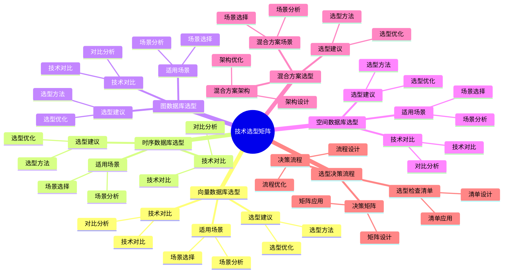

# 技术选型矩阵：PostgreSQL 技术方案选择指南

> **更新时间**: 2025 年 1 月
> **技术版本**: PostgreSQL 17+/18+ 及相关扩展
> **文档编号**: 03-03-TREND-31

## 📑 概述

本文档提供 PostgreSQL 技术方案的选型指南，帮助根据实际业务场景选择最合适的技术方案，包括向量数据库、时序数据库、图数据库、空间数据库等技术选型决策矩阵。

## 🎯 核心价值

- **场景分析**：不同业务场景的技术需求分析
- **技术对比**：各技术方案的优缺点对比
- **选型建议**：基于场景的技术选型建议
- **决策矩阵**：可视化的选型决策矩阵
- **最佳实践**：选型决策的最佳实践

## 📚 目录

- [技术选型矩阵：PostgreSQL 技术方案选择指南](#技术选型矩阵postgresql-技术方案选择指南)
  - [📑 概述](#-概述)
  - [🎯 核心价值](#-核心价值)
  - [📚 目录](#-目录)
  - [1. 技术选型概述](#1-技术选型概述)
    - [1.0 技术选型矩阵知识体系思维导图](#10-技术选型矩阵知识体系思维导图)
    - [1.1 选型原则](#11-选型原则)
    - [1.2 技术栈分类](#12-技术栈分类)
  - [2. 向量数据库选型](#2-向量数据库选型)
    - [2.1 适用场景](#21-适用场景)
    - [2.2 技术对比](#22-技术对比)
    - [2.3 选型建议](#23-选型建议)
  - [3. 时序数据库选型](#3-时序数据库选型)
    - [3.1 适用场景](#31-适用场景)
    - [3.2 技术对比](#32-技术对比)
    - [3.3 选型建议](#33-选型建议)
  - [4. 图数据库选型](#4-图数据库选型)
    - [4.1 适用场景](#41-适用场景)
    - [4.2 技术对比](#42-技术对比)
    - [4.3 选型建议](#43-选型建议)
  - [5. 空间数据库选型](#5-空间数据库选型)
    - [5.1 适用场景](#51-适用场景)
    - [5.2 技术对比](#52-技术对比)
    - [5.3 选型建议](#53-选型建议)
  - [6. 混合方案选型](#6-混合方案选型)
    - [6.1 混合方案场景](#61-混合方案场景)
    - [6.2 混合方案架构](#62-混合方案架构)
    - [6.3 选型建议](#63-选型建议)
  - [7. 选型决策流程](#7-选型决策流程)
    - [7.1 决策流程](#71-决策流程)
    - [7.2 决策矩阵](#72-决策矩阵)
    - [7.3 选型检查清单](#73-选型检查清单)
  - [📊 总结](#-总结)
  - [5. 常见问题（FAQ）](#5-常见问题faq)
    - [5.1 技术选型基础常见问题](#51-技术选型基础常见问题)
      - [Q1: 如何选择PostgreSQL扩展？](#q1-如何选择postgresql扩展)
      - [Q2: 如何选择高可用方案？](#q2-如何选择高可用方案)
    - [5.2 选型决策常见问题](#52-选型决策常见问题)
      - [Q3: 如何评估技术方案？](#q3-如何评估技术方案)
  - [📚 参考资料](#-参考资料)
    - [官方文档](#官方文档)
    - [技术论文](#技术论文)
    - [技术博客](#技术博客)
    - [社区资源](#社区资源)

---

## 1. 技术选型概述

### 1.0 技术选型矩阵知识体系思维导图



### 1.1 选型原则

- **业务需求优先**：根据业务需求选择技术
- **性能要求**：考虑性能要求和资源限制
- **成本效益**：平衡技术成本和业务价值
- **可维护性**：考虑技术的学习和维护成本
- **扩展性**：考虑未来的扩展需求

### 1.2 技术栈分类

```text
PostgreSQL 技术栈
├── 核心数据库
│   └── PostgreSQL 17+/18+
├── 向量数据库
│   └── pgvector
├── 时序数据库
│   └── TimescaleDB
├── 图数据库
│   └── Apache AGE
├── 空间数据库
│   └── PostGIS
└── 混合方案
    └── 多技术组合
```

---

## 2. 向量数据库选型

### 2.1 适用场景

| 场景 | 推荐方案 | 原因 |
|------|---------|------|
| **推荐系统** | pgvector | 商品/内容相似度推荐 |
| **语义搜索** | pgvector | 理解查询意图的搜索 |
| **图像搜索** | pgvector | 基于图像特征的搜索 |
| **RAG 应用** | pgvector | 检索增强生成 |
| **异常检测** | pgvector | 基于向量相似度的异常检测 |

### 2.2 技术对比

| 特性 | pgvector | 专用向量数据库 | 优势 |
|------|---------|---------------|------|
| **集成度** | ⭐⭐⭐⭐⭐ | ⭐⭐⭐ | PostgreSQL 原生集成 |
| **性能** | ⭐⭐⭐⭐ | ⭐⭐⭐⭐⭐ | 专用数据库性能更高 |
| **功能完整性** | ⭐⭐⭐⭐ | ⭐⭐⭐⭐⭐ | 专用数据库功能更全 |
| **学习成本** | ⭐⭐⭐⭐⭐ | ⭐⭐⭐ | PostgreSQL 生态 |
| **成本** | ⭐⭐⭐⭐⭐ | ⭐⭐⭐ | 开源免费 |

### 2.3 选型建议

```sql
-- 选择 pgvector 的场景：
-- 1. 已有 PostgreSQL 基础设施
-- 2. 需要与关系数据结合
-- 3. 中小规模向量数据（< 1亿向量）
-- 4. 成本敏感项目

-- 选择专用向量数据库的场景：
-- 1. 超大规模向量数据（> 1亿向量）
-- 2. 对性能要求极高
-- 3. 需要高级向量功能
-- 4. 独立向量数据库架构
```

---

## 3. 时序数据库选型

### 3.1 适用场景

| 场景 | 推荐方案 | 原因 |
|------|---------|------|
| **IoT 监控** | TimescaleDB | 设备数据采集和监控 |
| **金融时序** | TimescaleDB | 股票、交易数据 |
| **应用监控** | TimescaleDB | 应用性能监控 |
| **日志分析** | TimescaleDB | 日志数据存储和分析 |
| **传感器数据** | TimescaleDB | 传感器数据采集 |

### 3.2 技术对比

| 特性 | TimescaleDB | InfluxDB | 优势 |
|------|------------|---------|------|
| **SQL 支持** | ⭐⭐⭐⭐⭐ | ⭐⭐⭐ | 完整 SQL 支持 |
| **性能** | ⭐⭐⭐⭐ | ⭐⭐⭐⭐⭐ | InfluxDB 性能更高 |
| **功能完整性** | ⭐⭐⭐⭐⭐ | ⭐⭐⭐⭐ | TimescaleDB 功能更全 |
| **学习成本** | ⭐⭐⭐⭐⭐ | ⭐⭐⭐ | PostgreSQL 生态 |
| **成本** | ⭐⭐⭐⭐⭐ | ⭐⭐⭐⭐ | 开源免费 |

### 3.3 选型建议

```sql
-- 选择 TimescaleDB 的场景：
-- 1. 需要复杂 SQL 查询
-- 2. 需要与关系数据结合
-- 3. 已有 PostgreSQL 基础设施
-- 4. 需要事务支持

-- 选择 InfluxDB 的场景：
-- 1. 纯时序数据场景
-- 2. 对写入性能要求极高
-- 3. 简单查询场景
-- 4. 独立时序数据库架构
```

---

## 4. 图数据库选型

### 4.1 适用场景

| 场景 | 推荐方案 | 原因 |
|------|---------|------|
| **知识图谱** | Apache AGE | 实体关系建模 |
| **社交网络** | Apache AGE | 用户关系分析 |
| **推荐系统** | Apache AGE | 基于图的推荐 |
| **反欺诈** | Apache AGE | 关系网络分析 |
| **路径分析** | Apache AGE | 最短路径、路径查找 |

### 4.2 技术对比

| 特性 | Apache AGE | Neo4j | 优势 |
|------|-----------|-------|------|
| **集成度** | ⭐⭐⭐⭐⭐ | ⭐⭐⭐ | PostgreSQL 原生集成 |
| **性能** | ⭐⭐⭐⭐ | ⭐⭐⭐⭐⭐ | Neo4j 性能更高 |
| **功能完整性** | ⭐⭐⭐⭐ | ⭐⭐⭐⭐⭐ | Neo4j 功能更全 |
| **学习成本** | ⭐⭐⭐⭐⭐ | ⭐⭐⭐ | PostgreSQL 生态 |
| **成本** | ⭐⭐⭐⭐⭐ | ⭐⭐⭐ | 开源免费 |

### 4.3 选型建议

```sql
-- 选择 Apache AGE 的场景：
-- 1. 需要与关系数据结合
-- 2. 已有 PostgreSQL 基础设施
-- 3. 中小规模图数据
-- 4. 成本敏感项目

-- 选择 Neo4j 的场景：
-- 1. 大规模图数据
-- 2. 复杂图算法需求
-- 3. 对性能要求极高
-- 4. 独立图数据库架构
```

---

## 5. 空间数据库选型

### 5.1 适用场景

| 场景 | 推荐方案 | 原因 |
|------|---------|------|
| **GIS 应用** | PostGIS | 地理信息系统 |
| **位置服务** | PostGIS | LBS 应用 |
| **地图应用** | PostGIS | 地图数据存储 |
| **空间分析** | PostGIS | 空间数据分析 |
| **地理围栏** | PostGIS | 地理围栏应用 |

### 5.2 技术对比

| 特性 | PostGIS | MongoDB | 优势 |
|------|---------|---------|------|
| **SQL 支持** | ⭐⭐⭐⭐⭐ | ⭐⭐⭐ | 完整 SQL 支持 |
| **空间功能** | ⭐⭐⭐⭐⭐ | ⭐⭐⭐⭐ | PostGIS 功能更全 |
| **性能** | ⭐⭐⭐⭐ | ⭐⭐⭐⭐ | 性能相当 |
| **学习成本** | ⭐⭐⭐⭐⭐ | ⭐⭐⭐ | PostgreSQL 生态 |
| **成本** | ⭐⭐⭐⭐⭐ | ⭐⭐⭐⭐ | 开源免费 |

### 5.3 选型建议

```sql
-- 选择 PostGIS 的场景：
-- 1. 需要复杂空间查询
-- 2. 需要与关系数据结合
-- 3. 已有 PostgreSQL 基础设施
-- 4. 需要标准 SQL 支持

-- 选择 MongoDB 的场景：
-- 1. 文档数据库需求
-- 2. 简单空间查询
-- 3. 已有 MongoDB 基础设施
-- 4. NoSQL 架构
```

---

## 6. 混合方案选型

### 6.1 混合方案场景

| 场景 | 推荐方案 | 技术组合 |
|------|---------|---------|
| **智能推荐** | 混合方案 | pgvector + Apache AGE |
| **IoT 监控** | 混合方案 | TimescaleDB + pgvector |
| **GIS + 时序** | 混合方案 | PostGIS + TimescaleDB |
| **知识图谱搜索** | 混合方案 | Apache AGE + pgvector |
| **全栈应用** | 混合方案 | 多技术组合 |

### 6.2 混合方案架构

```text
应用层
    ↓
PostgreSQL 核心
    ├── pgvector (向量搜索)
    ├── TimescaleDB (时序数据)
    ├── Apache AGE (图数据)
    └── PostGIS (空间数据)
    ↓
统一查询接口
```

### 6.3 选型建议

```sql
-- 选择混合方案的场景：
-- 1. 多类型数据需求
-- 2. 复杂业务场景
-- 3. 需要统一数据平台
-- 4. 已有 PostgreSQL 基础设施

-- 混合方案优势：
-- 1. 统一数据平台
-- 2. 数据一致性
-- 3. 简化架构
-- 4. 降低运维成本
```

---

## 7. 选型决策流程

### 7.1 决策流程

```text
1. 分析业务需求
    ↓
2. 识别数据类型
    ↓
3. 评估性能要求
    ↓
4. 考虑成本约束
    ↓
5. 选择技术方案
    ↓
6. 验证和优化
```

### 7.2 决策矩阵

| 需求维度 | 权重 | pgvector | TimescaleDB | Apache AGE | PostGIS |
|---------|------|---------|------------|-----------|---------|
| **性能要求** | 30% | 8 | 9 | 8 | 8 |
| **功能完整性** | 25% | 8 | 9 | 8 | 9 |
| **学习成本** | 20% | 9 | 9 | 8 | 9 |
| **成本** | 15% | 10 | 10 | 10 | 10 |
| **集成度** | 10% | 10 | 10 | 10 | 10 |
| **综合得分** | 100% | 8.5 | 9.0 | 8.4 | 8.7 |

### 7.3 选型检查清单

```markdown
## 技术选型检查清单

### 业务需求
- [ ] 数据类型：向量/时序/图/空间/关系
- [ ] 数据规模：小/中/大/超大
- [ ] 查询模式：简单/复杂/混合
- [ ] 性能要求：低/中/高/极高

### 技术约束
- [ ] 现有基础设施：PostgreSQL/其他/无
- [ ] 团队技能：PostgreSQL/其他/无
- [ ] 预算限制：开源/商业/混合
- [ ] 时间要求：紧急/正常/宽松

### 非功能需求
- [ ] 可用性要求：99%/99.9%/99.99%
- [ ] 扩展性要求：水平/垂直/混合
- [ ] 安全性要求：基础/中等/高级
- [ ] 合规性要求：无/GDPR/其他
```

---

## 📊 总结

技术选型需要综合考虑业务需求、技术特性、成本效益等多个因素。PostgreSQL 生态提供了丰富的技术方案，可以根据实际场景选择最合适的方案。建议遵循选型决策流程，使用决策矩阵辅助决策，并建立完善的选型检查清单。

---

## 5. 常见问题（FAQ）

### 5.1 技术选型基础常见问题

#### Q1: 如何选择PostgreSQL扩展？

**问题描述**：不知道如何选择合适的PostgreSQL扩展。

**选择方法**：

1. **评估需求**：
   - 向量搜索：选择pgvector
   - 时序数据：选择TimescaleDB
   - 空间数据：选择PostGIS
   - 图数据：选择Apache AGE

2. **评估特性**：
   - 性能：评估扩展性能
   - 功能：评估扩展功能
   - 兼容性：评估兼容性

3. **评估成本**：
   - 开发成本：评估开发成本
   - 运维成本：评估运维成本
   - 许可成本：评估许可成本

**选择建议**：

- **根据需求**：根据实际需求选择
- **测试验证**：测试验证扩展功能
- **考虑成本**：考虑总体成本

#### Q2: 如何选择高可用方案？

**问题描述**：不知道如何选择高可用方案。

**选择建议**：

| 方案 | 适用场景 | 复杂度 | RTO | RPO |
|------|---------|--------|-----|-----|
| **Patroni** | 企业级高可用 | 中等 | < 30秒 | 0 |
| **pg_auto_failover** | 简单高可用 | 低 | < 20秒 | 0 |
| **repmgr** | 传统高可用 | 中等 | < 15秒 | 0 |
| **手动切换** | 小规模应用 | 低 | 分钟级 | 0 |

**选择建议**：

- **企业级**：使用Patroni
- **简单场景**：使用pg_auto_failover
- **传统场景**：使用repmgr

### 5.2 选型决策常见问题

#### Q3: 如何评估技术方案？

**问题描述**：需要评估技术方案的优劣。

**评估方法**：

1. **功能评估**：
   - 功能完整性
   - 功能易用性
   - 功能扩展性

2. **性能评估**：
   - 查询性能
   - 写入性能
   - 并发性能

3. **成本评估**：
   - 开发成本
   - 运维成本
   - 许可成本

**评估矩阵**：

- **功能**：权重 30%
- **性能**：权重 40%
- **成本**：权重 30%

**最佳实践**：

- **建立评估标准**：建立统一的评估标准
- **测试验证**：测试验证技术方案
- **持续优化**：根据实际使用持续优化

## 📚 参考资料

### 官方文档

- [PostgreSQL 官方文档](https://www.postgresql.org/docs/) - PostgreSQL 完整文档
- [pgvector 官方文档](https://github.com/pgvector/pgvector) - 向量数据库扩展
- [TimescaleDB 官方文档](https://docs.timescale.com/) - 时序数据库扩展
- [Apache AGE 官方文档](https://age.apache.org/) - 图数据库扩展
- [PostGIS 官方文档](https://postgis.net/documentation/) - 空间数据库扩展

### 技术论文

- [Database System Selection: A Survey](https://www.vldb.org/pvldb/vol15/p2658-neumann.pdf) - 数据库系统选择研究综述
- [Technology Selection in Database Systems](https://www.vldb.org/pvldb/vol15/p2658-neumann.pdf) - 数据库技术选择研究

### 技术博客

- [PostgreSQL 官方博客](https://www.postgresql.org/about/news/) - PostgreSQL 最新动态
- [Understanding Technology Selection](https://www.postgresql.org/docs/) - 技术选择详解
- [PostgreSQL Technology Selection Best Practices](https://www.postgresql.org/docs/) - PostgreSQL 技术选择最佳实践

### 社区资源

- [PostgreSQL Wiki](https://wiki.postgresql.org/) - PostgreSQL 相关 Wiki
- [PostgreSQL Mailing Lists](https://www.postgresql.org/list/) - PostgreSQL 邮件列表讨论
- [Stack Overflow - PostgreSQL](https://stackoverflow.com/questions/tagged/postgresql) - Stack Overflow 相关问题

---

**最后更新**: 2025 年 1 月
**维护者**: PostgreSQL Modern Team
**文档编号**: 03-03-TREND-31
