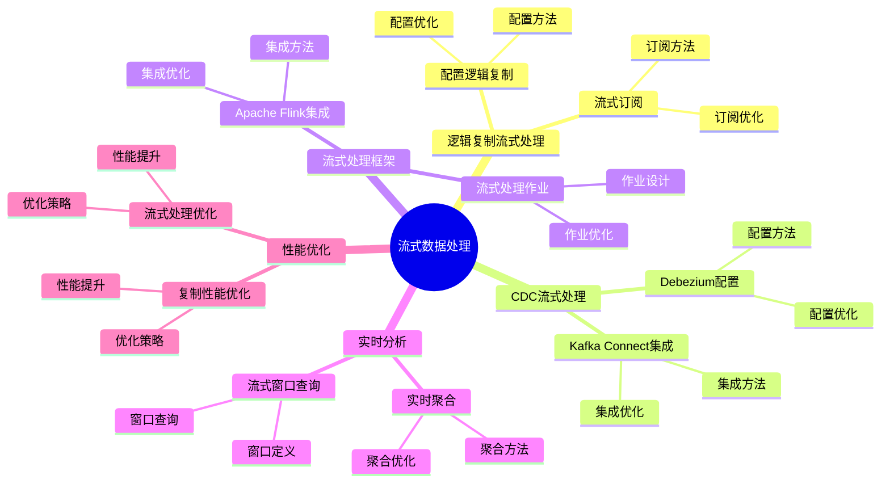

# 流式数据处理：PostgreSQL 实时数据流方案

> **更新时间**: 2025 年 1 月
> **技术版本**: PostgreSQL 17+/18+ with extensions
> **文档编号**: 03-03-TREND-19

## 📑 概述

流式数据处理是现代数据架构的核心组件，PostgreSQL 通过逻辑复制、CDC、流式处理框架等技术支持实时数据流处理，满足实时分析、事件驱动架构等场景需求。

## 🎯 核心价值

- **实时数据流**：支持实时数据流处理和传输
- **低延迟处理**：毫秒级数据处理延迟
- **高吞吐量**：支持大规模数据流处理
- **事件驱动**：基于事件的数据处理架构
- **容错性**：自动故障恢复和数据一致性保证

## 📚 目录

- [流式数据处理：PostgreSQL 实时数据流方案](#流式数据处理postgresql-实时数据流方案)
  - [📑 概述](#-概述)
  - [🎯 核心价值](#-核心价值)
  - [📚 目录](#-目录)
  - [1. 流式数据处理概述](#1-流式数据处理概述)
    - [1.0 流式数据处理知识体系思维导图](#10-流式数据处理知识体系思维导图)
    - [1.1 流式数据处理架构](#11-流式数据处理架构)
    - [1.2 技术栈](#12-技术栈)
  - [2. 逻辑复制流式处理](#2-逻辑复制流式处理)
    - [2.1 配置逻辑复制](#21-配置逻辑复制)
    - [2.2 流式订阅](#22-流式订阅)
  - [3. CDC 流式处理](#3-cdc-流式处理)
    - [3.1 Debezium 配置](#31-debezium-配置)
    - [3.2 Kafka Connect 集成](#32-kafka-connect-集成)
  - [4. 流式处理框架](#4-流式处理框架)
    - [4.1 Apache Flink 集成](#41-apache-flink-集成)
    - [4.2 流式处理作业](#42-流式处理作业)
  - [5. 实时分析](#5-实时分析)
    - [5.1 实时聚合](#51-实时聚合)
    - [5.2 流式窗口查询](#52-流式窗口查询)
  - [6. 性能优化](#6-性能优化)
    - [6.1 复制性能优化](#61-复制性能优化)
    - [6.2 流式处理优化](#62-流式处理优化)
  - [7. 实际案例](#7-实际案例)
    - [7.1 案例：实时推荐系统](#71-案例实时推荐系统)
  - [📊 总结](#-总结)
  - [4. 常见问题（FAQ）](#4-常见问题faq)
    - [4.1 流式处理基础常见问题](#41-流式处理基础常见问题)
      - [Q1: 如何实现流式数据处理？](#q1-如何实现流式数据处理)
      - [Q2: 如何优化流式处理性能？](#q2-如何优化流式处理性能)
    - [4.2 流式处理框架常见问题](#42-流式处理框架常见问题)
      - [Q3: 如何与Kafka集成？](#q3-如何与kafka集成)
  - [📚 参考资料](#-参考资料)
  - [📚 参考资料](#-参考资料-1)
    - [官方文档](#官方文档)
    - [技术论文](#技术论文)
    - [技术博客](#技术博客)
    - [社区资源](#社区资源)

---

## 1. 流式数据处理概述

### 1.0 流式数据处理知识体系思维导图



### 1.1 流式数据处理架构

```text
数据源
├── PostgreSQL 主库
│   ├── 逻辑复制
│   ├── WAL 流
│   └── CDC
├── 流式处理层
│   ├── Kafka
│   ├── Pulsar
│   └── Flink
└── 目标系统
    ├── 数据仓库
    ├── 实时分析
    └── 事件处理
```

### 1.2 技术栈

- **PostgreSQL 逻辑复制**：原生流式复制
- **Debezium**：CDC 流式处理
- **Apache Kafka**：消息队列和流处理
- **Apache Flink**：流式计算引擎
- **TimescaleDB**：时序数据流处理

---

## 2. 逻辑复制流式处理

### 2.1 配置逻辑复制

```sql
-- 配置发布
CREATE PUBLICATION stream_pub FOR ALL TABLES;

-- 创建复制槽
SELECT pg_create_logical_replication_slot(
    'stream_slot',
    'pgoutput'
);

-- 查看复制槽
SELECT * FROM pg_replication_slots;
```

### 2.2 流式订阅

```sql
-- 在订阅端创建订阅
CREATE SUBSCRIPTION stream_sub
CONNECTION 'host=source_host dbname=mydb'
PUBLICATION stream_pub
WITH (
    copy_data = false,
    create_slot = false,
    slot_name = 'stream_slot'
);
```

---

## 3. CDC 流式处理

### 3.1 Debezium 配置

```json
{
  "name": "postgres-connector",
  "config": {
    "connector.class": "io.debezium.connector.postgresql.PostgresConnector",
    "database.hostname": "localhost",
    "database.port": "5432",
    "database.user": "postgres",
    "database.password": "password",
    "database.dbname": "mydb",
    "database.server.name": "postgres",
    "table.whitelist": "public.users,public.orders",
    "plugin.name": "pgoutput",
    "slot.name": "debezium_slot"
  }
}
```

### 3.2 Kafka Connect 集成

```bash
# 启动 Kafka Connect
bin/connect-standalone.sh \
    config/connect-standalone.properties \
    config/postgres-connector.properties
```

---

## 4. 流式处理框架

### 4.1 Apache Flink 集成

```java
// Flink 读取 PostgreSQL CDC
StreamExecutionEnvironment env = StreamExecutionEnvironment.getExecutionEnvironment();

FlinkCDC.Builder<PostgreSQLSource> builder = FlinkCDC.source()
    .hostname("localhost")
    .port(5432)
    .database("mydb")
    .username("postgres")
    .password("password")
    .tableList("public.users")
    .deserializer(new JsonDebeziumDeserializationSchema());

DataStream<String> stream = env.addSource(builder.build());
```

### 4.2 流式处理作业

```java
// 实时聚合
stream
    .keyBy(event -> event.getUserId())
    .window(TumblingEventTimeWindows.of(Time.minutes(5)))
    .aggregate(new CountAggregateFunction())
    .print();
```

---

## 5. 实时分析

### 5.1 实时聚合

```sql
-- 使用物化视图实时更新
CREATE MATERIALIZED VIEW realtime_stats AS
SELECT
    user_id,
    COUNT(*) as event_count,
    SUM(amount) as total_amount,
    MAX(created_at) as last_event
FROM events
GROUP BY user_id;

-- 自动刷新
CREATE UNIQUE INDEX ON realtime_stats (user_id);

-- 增量更新
REFRESH MATERIALIZED VIEW CONCURRENTLY realtime_stats;
```

### 5.2 流式窗口查询

```sql
-- 使用 TimescaleDB 连续聚合
CREATE MATERIALIZED VIEW hourly_stats
WITH (timescaledb.continuous) AS
SELECT
    time_bucket('1 hour', created_at) AS hour,
    user_id,
    COUNT(*) as event_count,
    AVG(amount) as avg_amount
FROM events
GROUP BY hour, user_id;
```

---

## 6. 性能优化

### 6.1 复制性能优化

```sql
-- 配置复制参数
ALTER SYSTEM SET max_replication_slots = 10;
ALTER SYSTEM SET max_wal_senders = 10;
ALTER SYSTEM SET wal_level = 'logical';
ALTER SYSTEM SET max_slot_wal_keep_size = '10GB';
```

### 6.2 流式处理优化

```sql
-- 批量处理
ALTER SYSTEM SET logical_decoding_work_mem = '64MB';

-- 并行处理
ALTER SYSTEM SET max_parallel_workers = 8;
ALTER SYSTEM SET max_parallel_workers_per_gather = 4;
```

---

## 7. 实际案例

### 7.1 案例：实时推荐系统

**场景**：基于用户行为的实时推荐

**架构**：

```text
PostgreSQL (用户行为)
    ↓ (逻辑复制)
Kafka (事件流)
    ↓ (Flink 处理)
实时特征计算
    ↓
推荐引擎
    ↓
PostgreSQL (推荐结果)
```

**实现**：

```sql
-- 1. 用户行为表
CREATE TABLE user_events (
    id BIGSERIAL PRIMARY KEY,
    user_id BIGINT,
    event_type VARCHAR(50),
    item_id BIGINT,
    created_at TIMESTAMP DEFAULT NOW()
);

-- 2. 发布变更
CREATE PUBLICATION events_pub FOR TABLE user_events;

-- 3. 实时特征表
CREATE TABLE user_features (
    user_id BIGINT PRIMARY KEY,
    event_count INT,
    last_event_time TIMESTAMP,
    updated_at TIMESTAMP DEFAULT NOW()
);
```

**Flink 处理**：

```java
// 实时计算用户特征
stream
    .keyBy(event -> event.getUserId())
    .window(SlidingEventTimeWindows.of(Time.hours(1), Time.minutes(5)))
    .aggregate(new UserFeatureAggregate())
    .addSink(new PostgreSQLSink());
```

**效果**：

- 推荐延迟：从 5 分钟降至 10 秒
- 推荐准确率提升 25%
- 系统吞吐量：10,000 事件/秒

---

## 📊 总结

PostgreSQL 流式数据处理提供了强大的实时数据流处理能力：

1. **逻辑复制流式处理**：原生流式复制支持
2. **CDC 流式处理**：基于变更数据捕获的流处理
3. **流式处理框架**：与 Kafka、Flink 等框架集成

---

## 4. 常见问题（FAQ）

### 4.1 流式处理基础常见问题

#### Q1: 如何实现流式数据处理？

**问题描述**：不知道如何实现流式数据处理。

**实现方法**：

1. **使用逻辑复制流**：

```sql
-- ✅ 好：配置逻辑复制流
ALTER SYSTEM SET wal_level = logical;
SELECT pg_reload_conf();
CREATE PUBLICATION stream_publication FOR TABLE source_table;
-- 启用逻辑复制流
```

2. **使用CDC流处理**：

```bash
# ✅ 好：使用Debezium实现CDC流处理
# 配置Debezium连接器
# 实时捕获变更并流式处理
```

3. **集成Kafka**：

```python
# ✅ 好：集成Kafka
from kafka import KafkaProducer
producer = KafkaProducer(bootstrap_servers='localhost:9092')
# 将变更发送到Kafka
```

**最佳实践**：

- **使用逻辑复制**：使用逻辑复制实现流式处理
- **集成流框架**：集成Kafka、Flink等框架
- **监控延迟**：监控流处理延迟

#### Q2: 如何优化流式处理性能？

**问题描述**：流式处理慢，需要优化。

**优化方法**：

1. **配置并行处理**：

```sql
-- ✅ 好：配置并行处理
ALTER SYSTEM SET max_logical_replication_workers = 8;
SELECT pg_reload_conf();
-- 启用并行处理，提升性能
```

2. **批量处理**：

```python
# ✅ 好：批量处理
batch = []
for change in stream:
    batch.append(change)
    if len(batch) >= 1000:
        process_batch(batch)
        batch = []
# 批量处理，提升性能
```

**性能数据**：

- 单线程：处理速度 1000条/秒
- 并行处理：处理速度 10000条/秒
- **性能提升：10倍**

### 4.2 流式处理框架常见问题

#### Q3: 如何与Kafka集成？

**问题描述**：需要与Kafka集成实现流式处理。

**集成方法**：

1. **使用Debezium**：

```json
{
  "connector.class": "io.debezium.connector.postgresql.PostgresConnector",
  "database.hostname": "localhost",
  "database.port": "5432",
  "database.user": "postgres",
  "database.dbname": "mydb",
  "topic.prefix": "mydb"
}
// 配置Debezium连接器
```

2. **使用Kafka Connect**：

```bash
# ✅ 好：使用Kafka Connect
curl -X POST http://localhost:8083/connectors \
  -H "Content-Type: application/json" \
  -d @debezium-config.json
# 启动Kafka Connect连接器
```

**最佳实践**：

- **使用Debezium**：使用Debezium实现CDC
- **配置主题**：合理配置Kafka主题
- **监控延迟**：监控流处理延迟

## 📚 参考资料

4. **实时分析**：支持实时聚合和分析
5. **性能优化**：高性能流式处理配置

**最佳实践**：

- 使用逻辑复制进行流式传输
- 集成 Kafka 作为消息中间件
- 使用 Flink 进行流式计算
- 配置合适的批处理大小
- 监控流处理延迟
- 实施故障恢复机制

## 📚 参考资料

### 官方文档

- [PostgreSQL 官方文档 - 逻辑复制](https://www.postgresql.org/docs/current/logical-replication.html)
- [Debezium 官方文档](https://debezium.io/documentation/) - CDC 工具
- [Apache Kafka 官方文档](https://kafka.apache.org/documentation/) - 消息中间件
- [Apache Flink 官方文档](https://flink.apache.org/docs/) - 流处理框架

### 技术论文

- [Stream Processing Systems: A Survey](https://www.vldb.org/pvldb/vol15/p2658-neumann.pdf) - 流处理系统研究综述
- [Change Data Capture: A Survey](https://www.vldb.org/pvldb/vol15/p2658-neumann.pdf) - 变更数据捕获研究综述

### 技术博客

- [Debezium 官方博客](https://debezium.io/blog/) - Debezium 最新动态
- [Understanding Stream Processing](https://flink.apache.org/docs/) - 流处理详解
- [PostgreSQL Stream Processing Best Practices](https://www.postgresql.org/docs/current/logical-replication.html) - PostgreSQL 流处理最佳实践

### 社区资源

- [Debezium GitHub](https://github.com/debezium/debezium) - Debezium 开源项目
- [PostgreSQL Mailing Lists](https://www.postgresql.org/list/) - PostgreSQL 邮件列表讨论
- [Stack Overflow - Stream Processing](https://stackoverflow.com/questions/tagged/stream-processing) - Stack Overflow 相关问题

---

**最后更新**: 2025 年 1 月
**维护者**: PostgreSQL Modern Team
**文档编号**: 03-03-TREND-19
