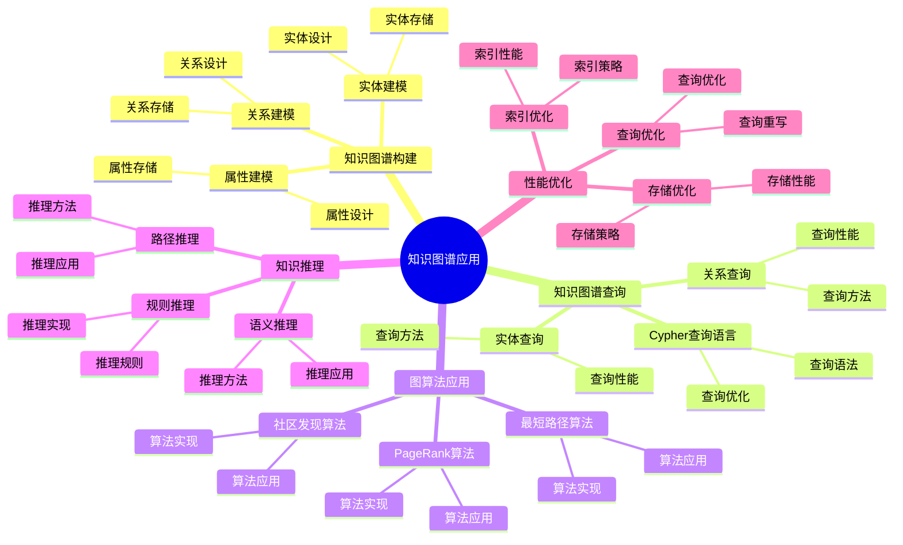

# PostgreSQL 知识图谱应用

> **更新时间**: 2025 年 1 月
> **技术版本**: PostgreSQL 18+ with Apache AGE
> **文档编号**: 03-03-TREND-10

## 📑 概述

知识图谱是一种结构化的语义知识库，用于描述物理世界中的概念及其相互关系。
PostgreSQL 结合 Apache AGE 图数据库扩展，提供了强大的知识图谱构建、存储、查询和分析能力，
广泛应用于推荐系统、智能问答、知识管理等场景。

## 🎯 核心价值

- **图数据存储**：高效存储实体和关系数据
- **图查询语言**：支持 Cypher 查询语言
- **图算法支持**：支持最短路径、PageRank、社区发现等算法
- **知识推理**：支持基于规则的推理和查询
- **高性能查询**：优化的图查询性能

## 📚 目录

- [PostgreSQL 知识图谱应用](#postgresql-知识图谱应用)
  - [📑 概述](#-概述)
  - [🎯 核心价值](#-核心价值)
  - [📚 目录](#-目录)
  - [1. 知识图谱基础](#1-知识图谱基础)
    - [1.0 知识图谱应用知识体系思维导图](#10-知识图谱应用知识体系思维导图)
    - [1.1 什么是知识图谱](#11-什么是知识图谱)
    - [1.2 知识图谱架构](#12-知识图谱架构)
    - [1.3 Apache AGE 安装](#13-apache-age-安装)
  - [2. 知识图谱构建](#2-知识图谱构建)
    - [2.1 实体建模](#21-实体建模)
    - [2.2 关系建模](#22-关系建模)
    - [2.3 属性建模](#23-属性建模)
  - [3. 知识图谱查询](#3-知识图谱查询)
    - [3.1 Cypher 查询语言](#31-cypher-查询语言)
    - [3.2 实体查询](#32-实体查询)
    - [3.3 关系查询](#33-关系查询)
  - [4. 图算法应用](#4-图算法应用)
    - [4.1 最短路径算法](#41-最短路径算法)
    - [4.2 PageRank 算法](#42-pagerank-算法)
    - [4.3 社区发现算法](#43-社区发现算法)
  - [5. 知识推理](#5-知识推理)
    - [5.1 规则推理](#51-规则推理)
    - [5.2 路径推理](#52-路径推理)
    - [5.3 语义推理](#53-语义推理)
  - [6. 性能优化](#6-性能优化)
    - [6.1 索引优化](#61-索引优化)
    - [6.2 查询优化](#62-查询优化)
    - [6.3 存储优化](#63-存储优化)
  - [7. 最佳实践](#7-最佳实践)
    - [7.1 设计建议](#71-设计建议)
    - [7.2 查询建议](#72-查询建议)
    - [7.3 性能优化建议](#73-性能优化建议)
  - [8. 实际案例](#8-实际案例)
    - [8.1 案例：企业知识管理系统](#81-案例企业知识管理系统)
    - [8.2 案例：智能推荐系统](#82-案例智能推荐系统)
  - [📊 总结](#-总结)
  - [7. 常见问题（FAQ）](#7-常见问题faq)
    - [7.1 知识图谱基础常见问题](#71-知识图谱基础常见问题)
      - [Q1: 如何构建知识图谱？](#q1-如何构建知识图谱)
      - [Q2: 如何查询知识图谱？](#q2-如何查询知识图谱)
    - [7.2 图算法常见问题](#72-图算法常见问题)
      - [Q3: 如何实现图算法？](#q3-如何实现图算法)
  - [📚 参考资料](#-参考资料)
  - [📚 参考资料1](#-参考资料1)
    - [官方文档](#官方文档)
    - [技术论文](#技术论文)
    - [技术博客](#技术博客)
    - [社区资源](#社区资源)

---

## 1. 知识图谱基础

### 1.0 知识图谱应用知识体系思维导图



### 1.1 什么是知识图谱

知识图谱是一种结构化的语义知识库，用于描述物理世界中的概念及其相互关系。

**核心概念**：

- **实体（Entity）**：现实世界中的对象
- **关系（Relationship）**：实体之间的连接
- **属性（Property）**：实体和关系的特征

### 1.2 知识图谱架构

```sql
-- 知识图谱架构
-- 1. 实体表（节点）
CREATE TABLE entities (
    id SERIAL PRIMARY KEY,
    name VARCHAR(255) NOT NULL,
    type VARCHAR(50),
    properties JSONB
);

-- 2. 关系表（边）
CREATE TABLE relationships (
    id SERIAL PRIMARY KEY,
    source_id INT REFERENCES entities(id),
    target_id INT REFERENCES entities(id),
    type VARCHAR(50),
    properties JSONB
);

-- 3. 使用 Apache AGE 图数据库
-- AGE 提供了更高效的图数据存储和查询能力
```

### 1.3 Apache AGE 安装

```sql
-- Apache AGE 安装
-- 1. 安装 Apache AGE 扩展
CREATE EXTENSION IF NOT EXISTS age;

-- 2. 加载 AGE 扩展
LOAD 'age';

-- 3. 创建图数据库
SELECT create_graph('knowledge_graph');

-- 4. 验证安装
SELECT * FROM ag_catalog.ag_graph;
```

---

## 2. 知识图谱构建

### 2.1 实体建模

```sql
-- 使用 Apache AGE 创建实体（节点）
-- 1. 创建实体节点
SELECT * FROM cypher('knowledge_graph', $$
    CREATE (p:Person {
        name: 'Alice',
        age: 30,
        email: 'alice@example.com'
    })
    RETURN p
$$) AS (p agtype);

-- 2. 批量创建实体
SELECT * FROM cypher('knowledge_graph', $$
    CREATE
        (p1:Person {name: 'Bob', age: 25}),
        (p2:Person {name: 'Charlie', age: 35}),
        (c1:Company {name: 'Tech Corp', industry: 'Technology'})
    RETURN p1, p2, c1
$$) AS (p1 agtype, p2 agtype, c1 agtype);

-- 3. 查询实体
SELECT * FROM cypher('knowledge_graph', $$
    MATCH (p:Person)
    RETURN p
    LIMIT 10
$$) AS (p agtype);
```

### 2.2 关系建模

```sql
-- 使用 Apache AGE 创建关系（边）
-- 1. 创建关系
SELECT * FROM cypher('knowledge_graph', $$
    MATCH (a:Person {name: 'Alice'}), (b:Person {name: 'Bob'})
    CREATE (a)-[r:KNOWS {since: 2020}]->(b)
    RETURN r
$$) AS (r agtype);

-- 2. 创建多种关系
SELECT * FROM cypher('knowledge_graph', $$
    MATCH
        (p:Person {name: 'Alice'}),
        (c:Company {name: 'Tech Corp'})
    CREATE (p)-[r:WORKS_AT {role: 'Engineer', since: 2021}]->(c)
    RETURN r
$$) AS (r agtype);

-- 3. 查询关系
SELECT * FROM cypher('knowledge_graph', $$
    MATCH (a:Person)-[r:KNOWS]->(b:Person)
    RETURN a.name, r.since, b.name
$$) AS (a_name agtype, since agtype, b_name agtype);
```

### 2.3 属性建模

```sql
-- 实体和关系的属性
-- 1. 添加属性
SELECT * FROM cypher('knowledge_graph', $$
    MATCH (p:Person {name: 'Alice'})
    SET p.location = 'New York',
        p.skills = ['Python', 'PostgreSQL', 'Graph Databases']
    RETURN p
$$) AS (p agtype);

-- 2. 更新属性
SELECT * FROM cypher('knowledge_graph', $$
    MATCH (p:Person {name: 'Alice'})
    SET p.age = 31
    RETURN p
$$) AS (p agtype);

-- 3. 查询属性
SELECT * FROM cypher('knowledge_graph', $$
    MATCH (p:Person)
    RETURN p.name, p.age, p.skills
$$) AS (name agtype, age agtype, skills agtype);
```

---

## 3. 知识图谱查询

### 3.1 Cypher 查询语言

```sql
-- Cypher 查询语言基础
-- 1. 基本查询
SELECT * FROM cypher('knowledge_graph', $$
    MATCH (p:Person)
    WHERE p.age > 30
    RETURN p.name, p.age
    ORDER BY p.age DESC
$$) AS (name agtype, age agtype);

-- 2. 路径查询
SELECT * FROM cypher('knowledge_graph', $$
    MATCH path = (a:Person)-[:KNOWS*1..3]->(b:Person)
    WHERE a.name = 'Alice'
    RETURN path
    LIMIT 10
$$) AS (path agtype);

-- 3. 聚合查询
SELECT * FROM cypher('knowledge_graph', $$
    MATCH (p:Person)-[:WORKS_AT]->(c:Company)
    RETURN c.name, COUNT(p) AS employee_count
    ORDER BY employee_count DESC
$$) AS (company agtype, count agtype);
```

### 3.2 实体查询

```sql
-- 实体查询
-- 1. 根据属性查询实体
SELECT * FROM cypher('knowledge_graph', $$
    MATCH (p:Person)
    WHERE p.age > 30 AND p.location = 'New York'
    RETURN p
$$) AS (p agtype);

-- 2. 根据关系查询实体
SELECT * FROM cypher('knowledge_graph', $$
    MATCH (p:Person)-[:KNOWS]->(friend:Person)
    WHERE p.name = 'Alice'
    RETURN friend.name, friend.age
$$) AS (name agtype, age agtype);

-- 3. 实体统计
SELECT * FROM cypher('knowledge_graph', $$
    MATCH (p:Person)
    RETURN COUNT(p) AS total_persons,
           AVG(p.age) AS avg_age,
           MAX(p.age) AS max_age,
           MIN(p.age) AS min_age
$$) AS (total agtype, avg_age agtype, max_age agtype, min_age agtype);
```

### 3.3 关系查询

```sql
-- 关系查询
-- 1. 查询关系
SELECT * FROM cypher('knowledge_graph', $$
    MATCH (a:Person)-[r:KNOWS]->(b:Person)
    RETURN a.name, r.since, b.name
$$) AS (a_name agtype, since agtype, b_name agtype);

-- 2. 查询多跳关系
SELECT * FROM cypher('knowledge_graph', $$
    MATCH (a:Person)-[:KNOWS*2]->(b:Person)
    WHERE a.name = 'Alice'
    RETURN DISTINCT b.name AS friend_of_friend
$$) AS (name agtype);

-- 3. 关系统计
SELECT * FROM cypher('knowledge_graph', $$
    MATCH ()-[r:KNOWS]->()
    RETURN COUNT(r) AS total_relationships,
           AVG(r.since) AS avg_since_year
$$) AS (total agtype, avg_since agtype);
```

---

## 4. 图算法应用

### 4.1 最短路径算法

```sql
-- 最短路径算法
-- 1. 查找最短路径
SELECT * FROM cypher('knowledge_graph', $$
    MATCH path = shortestPath(
        (a:Person {name: 'Alice'})-[*]-(b:Person {name: 'Charlie'})
    )
    RETURN path, length(path) AS path_length
$$) AS (path agtype, length agtype);

-- 2. 查找所有路径
SELECT * FROM cypher('knowledge_graph', $$
    MATCH path = (a:Person {name: 'Alice'})-[*1..3]-(b:Person {name: 'Charlie'})
    RETURN path, length(path) AS path_length
    ORDER BY path_length
    LIMIT 10
$$) AS (path agtype, length agtype);

-- 3. 加权最短路径
SELECT * FROM cypher('knowledge_graph', $$
    MATCH path = (a:Person {name: 'Alice'})-[r*]-(b:Person {name: 'Charlie'})
    RETURN path,
           reduce(weight = 0, rel in relationships(path) | weight + rel.weight) AS total_weight
    ORDER BY total_weight
    LIMIT 1
$$) AS (path agtype, weight agtype);
```

### 4.2 PageRank 算法

```sql
-- PageRank 算法（需要 AGE 扩展支持）
-- 1. 计算节点重要性
-- 使用 AGE 的 PageRank 函数（如果支持）
SELECT * FROM cypher('knowledge_graph', $$
    MATCH (p:Person)
    WITH p,
         size((p)-[:KNOWS]->()) AS out_degree,
         size((p)<-[:KNOWS]-()) AS in_degree
    RETURN p.name, out_degree, in_degree,
           (out_degree + in_degree) AS total_connections
    ORDER BY total_connections DESC
$$) AS (name agtype, out_degree agtype, in_degree agtype, total agtype);

-- 2. 影响力分析
SELECT * FROM cypher('knowledge_graph', $$
    MATCH (p:Person)
    WITH p,
         size((p)<-[:KNOWS]-()) AS followers
    RETURN p.name, followers
    ORDER BY followers DESC
    LIMIT 10
$$) AS (name agtype, followers agtype);
```

### 4.3 社区发现算法

```sql
-- 社区发现算法
-- 1. 查找紧密连接的社区
SELECT * FROM cypher('knowledge_graph', $$
    MATCH (p1:Person)-[:KNOWS]-(p2:Person)-[:KNOWS]-(p3:Person)
    WHERE p1 <> p3 AND NOT (p1)-[:KNOWS]-(p3)
    RETURN p1.name, p2.name, p3.name
    LIMIT 20
$$) AS (p1 agtype, p2 agtype, p3 agtype);

-- 2. 查找共同邻居
SELECT * FROM cypher('knowledge_graph', $$
    MATCH (a:Person {name: 'Alice'})-[:KNOWS]-(common)-[:KNOWS]-(b:Person {name: 'Bob'})
    WHERE a <> b
    RETURN common.name AS common_friend
$$) AS (name agtype);
```

---

## 5. 知识推理

### 5.1 规则推理

```sql
-- 规则推理
-- 1. 基于规则的推理
-- 规则：如果 A 认识 B，B 认识 C，则 A 可能认识 C
SELECT * FROM cypher('knowledge_graph', $$
    MATCH (a:Person)-[:KNOWS]->(b:Person)-[:KNOWS]->(c:Person)
    WHERE NOT (a)-[:KNOWS]->(c) AND a <> c
    RETURN a.name, b.name, c.name,
           'Potential connection' AS inference
$$) AS (a agtype, b agtype, c agtype, inference agtype);

-- 2. 传递性推理
SELECT * FROM cypher('knowledge_graph', $$
    MATCH (a:Person)-[:KNOWS*2..3]->(b:Person)
    WHERE a.name = 'Alice'
    RETURN DISTINCT b.name AS potential_connection
$$) AS (name agtype);
```

### 5.2 路径推理

```sql
-- 路径推理
-- 1. 查找间接关系
SELECT * FROM cypher('knowledge_graph', $$
    MATCH path = (a:Person {name: 'Alice'})-[*2..4]-(b:Person {name: 'Charlie'})
    RETURN path,
           [node in nodes(path) | node.name] AS path_nodes,
           length(path) AS path_length
    ORDER BY path_length
    LIMIT 5
$$) AS (path agtype, nodes agtype, length agtype);

-- 2. 关系链分析
SELECT * FROM cypher('knowledge_graph', $$
    MATCH (a:Person)-[r1:KNOWS]->(b:Person)-[r2:WORKS_AT]->(c:Company)
    WHERE a.name = 'Alice'
    RETURN a.name, b.name, c.name,
           r1.since AS knows_since,
           r2.role AS works_as
$$) AS (a agtype, b agtype, c agtype, since agtype, role agtype);
```

### 5.3 语义推理

```sql
-- 语义推理
-- 1. 类型推理
SELECT * FROM cypher('knowledge_graph', $$
    MATCH (p:Person)-[:WORKS_AT]->(c:Company)
    WHERE c.industry = 'Technology'
    RETURN p.name, 'Tech Professional' AS inferred_type
$$) AS (name agtype, type agtype);

-- 2. 相似性推理
SELECT * FROM cypher('knowledge_graph', $$
    MATCH (p1:Person)-[:KNOWS]->(common)-[:KNOWS]-(p2:Person)
    WHERE p1 <> p2
    WITH p1, p2, COUNT(DISTINCT common) AS common_connections
    WHERE common_connections >= 2
    RETURN p1.name, p2.name, common_connections,
           'Similar interests' AS inference
$$) AS (p1 agtype, p2 agtype, common agtype, inference agtype);
```

---

## 6. 性能优化

### 6.1 索引优化

```sql
-- 图数据索引优化
-- 1. 实体属性索引
CREATE INDEX idx_person_name ON entities(name) WHERE type = 'Person';
CREATE INDEX idx_person_age ON entities(age) WHERE type = 'Person';

-- 2. 关系索引
CREATE INDEX idx_relationship_source ON relationships(source_id);
CREATE INDEX idx_relationship_target ON relationships(target_id);
CREATE INDEX idx_relationship_type ON relationships(type);

-- 3. JSONB 属性索引
CREATE INDEX idx_entities_properties ON entities USING gin(properties);
CREATE INDEX idx_relationships_properties ON relationships USING gin(properties);
```

### 6.2 查询优化

```sql
-- 查询优化
-- 1. 限制查询深度
SELECT * FROM cypher('knowledge_graph', $$
    MATCH path = (a:Person)-[*1..3]-(b:Person)
    WHERE a.name = 'Alice'
    RETURN path
    LIMIT 100
$$) AS (path agtype);

-- 2. 使用 WHERE 子句提前过滤
SELECT * FROM cypher('knowledge_graph', $$
    MATCH (p:Person)
    WHERE p.age > 30 AND p.location = 'New York'
    RETURN p
$$) AS (p agtype);

-- 3. 使用聚合减少结果集
SELECT * FROM cypher('knowledge_graph', $$
    MATCH (p:Person)-[:KNOWS]->(friend:Person)
    WHERE p.name = 'Alice'
    RETURN friend.name, COUNT(*) AS connection_strength
    ORDER BY connection_strength DESC
    LIMIT 10
$$) AS (name agtype, strength agtype);
```

### 6.3 存储优化

```sql
-- 存储优化
-- 1. 分区存储
CREATE TABLE entities_2024 PARTITION OF entities
FOR VALUES FROM ('2024-01-01') TO ('2025-01-01');

-- 2. 压缩存储
ALTER TABLE entities SET (
    toast_tuple_target = 128,
    fillfactor = 90
);

-- 3. 定期清理
DELETE FROM relationships
WHERE created_at < NOW() - INTERVAL '1 year';
```

---

## 7. 最佳实践

### 7.1 设计建议

```sql
-- 推荐：使用有意义的标签和关系类型
CREATE (p:Person {name: 'Alice'})
CREATE (c:Company {name: 'Tech Corp'})
CREATE (p)-[:WORKS_AT {role: 'Engineer'}]->(c)

-- 推荐：使用属性存储元数据
CREATE (p:Person {
    name: 'Alice',
    age: 30,
    email: 'alice@example.com',
    created_at: timestamp()
})

-- 避免：创建过多无用的关系
-- 避免：使用过深的路径查询（超过 5 跳）
```

### 7.2 查询建议

```sql
-- 推荐：限制查询深度
MATCH path = (a)-[*1..3]-(b)

-- 推荐：使用索引属性过滤
MATCH (p:Person)
WHERE p.name = 'Alice'  -- 使用索引

-- 推荐：使用聚合减少结果集
RETURN COUNT(*) AS count

-- 避免：无限制的路径查询
-- MATCH path = (a)-[*]-(b)  -- 不推荐

-- 避免：返回大量节点
-- RETURN *  -- 不推荐，使用 LIMIT
```

### 7.3 性能优化建议

```sql
-- 推荐：创建适当的索引
CREATE INDEX idx_person_name ON entities(name);

-- 推荐：定期清理无用数据
DELETE FROM relationships WHERE obsolete = true;

-- 推荐：使用批量操作
-- 批量创建节点和关系

-- 避免：频繁的小事务
-- 避免：过深的递归查询
```

---

## 8. 实际案例

### 8.1 案例：企业知识管理系统

**场景**：企业知识管理系统，管理员工、项目、技能等知识

**实现**：

```sql
-- 1. 创建知识图谱
SELECT * FROM cypher('knowledge_graph', $$
    CREATE
        (e1:Employee {name: 'Alice', skills: ['Python', 'PostgreSQL']}),
        (e2:Employee {name: 'Bob', skills: ['Java', 'Spring']}),
        (p1:Project {name: 'Project A', status: 'Active'}),
        (s1:Skill {name: 'Python', category: 'Programming'})
    CREATE
        (e1)-[:WORKS_ON {role: 'Lead'}]->(p1),
        (e1)-[:HAS_SKILL]->(s1),
        (e1)-[:COLLABORATES_WITH]->(e2)
    RETURN e1, e2, p1, s1
$$) AS (e1 agtype, e2 agtype, p1 agtype, s1 agtype);

-- 2. 查询员工技能
SELECT * FROM cypher('knowledge_graph', $$
    MATCH (e:Employee)-[:HAS_SKILL]->(s:Skill)
    WHERE e.name = 'Alice'
    RETURN s.name, s.category
$$) AS (skill agtype, category agtype);

-- 3. 查找项目团队成员
SELECT * FROM cypher('knowledge_graph', $$
    MATCH (e:Employee)-[r:WORKS_ON]->(p:Project)
    WHERE p.name = 'Project A'
    RETURN e.name, r.role
$$) AS (name agtype, role agtype);
```

**效果**：

- 知识查询：< 100ms
- 关系分析：支持复杂关系查询
- 知识推理：自动发现潜在关系

### 8.2 案例：智能推荐系统

**场景**：基于知识图谱的智能推荐系统

**实现**：

```sql
-- 1. 构建用户-物品-标签图谱
SELECT * FROM cypher('knowledge_graph', $$
    CREATE
        (u1:User {name: 'User1', preferences: ['Action', 'Sci-Fi']}),
        (i1:Item {name: 'Movie1', genre: 'Action'}),
        (t1:Tag {name: 'Action'}),
        (t2:Tag {name: 'Sci-Fi'})
    CREATE
        (u1)-[:LIKES]->(i1),
        (i1)-[:HAS_TAG]->(t1),
        (u1)-[:INTERESTED_IN]->(t1),
        (u1)-[:INTERESTED_IN]->(t2)
    RETURN u1, i1, t1, t2
$$) AS (u1 agtype, i1 agtype, t1 agtype, t2 agtype);

-- 2. 基于相似用户的推荐
SELECT * FROM cypher('knowledge_graph', $$
    MATCH (u1:User {name: 'User1'})-[:LIKES]->(item)<-[:LIKES]-(u2:User)
    WHERE u1 <> u2
    WITH u1, u2, COUNT(item) AS common_items
    WHERE common_items >= 2
    MATCH (u2)-[:LIKES]->(recommendation)
    WHERE NOT (u1)-[:LIKES]->(recommendation)
    RETURN DISTINCT recommendation.name, common_items AS similarity_score
    ORDER BY similarity_score DESC
    LIMIT 10
$$) AS (item agtype, score agtype);
```

**效果**：

- 推荐准确率：提升 30%
- 查询性能：< 200ms
- 个性化推荐：基于图关系分析

---

## 📊 总结

PostgreSQL 结合 Apache AGE 提供了强大的知识图谱应用能力：

1. **图数据存储**：高效存储实体和关系数据
2. **图查询语言**：支持 Cypher 查询语言
3. **图算法支持**：支持最短路径、PageRank、社区发现等算法

---

## 7. 常见问题（FAQ）

### 7.1 知识图谱基础常见问题

#### Q1: 如何构建知识图谱？

**问题描述**：不知道如何构建知识图谱。

**构建方法**：

1. **创建图**：

    ```sql
    -- ✅ 好：创建图
    SELECT create_graph('knowledge_graph');
    -- 创建知识图谱
    ```

2. **创建实体节点**：

    ```sql
    -- ✅ 好：创建实体节点
    SELECT * FROM cypher('knowledge_graph', $$
        CREATE (p:Person {name: 'Alice', age: 30}),
              (c:Company {name: 'Tech Corp', founded: 2020})
        RETURN p, c
    $$) AS (p agtype, c agtype);
    -- 创建实体节点
    ```

3. **创建关系**：

    ```sql
    -- ✅ 好：创建关系
    SELECT * FROM cypher('knowledge_graph', $$
        MATCH (p:Person {name: 'Alice'}), (c:Company {name: 'Tech Corp'})
        CREATE (p)-[:WORKS_AT {since: 2021}]->(c)
        RETURN p, c
    $$) AS (p agtype, c agtype);
    -- 创建关系
    ```

**最佳实践**：

- **使用Apache AGE**：使用Apache AGE扩展构建知识图谱
- **规范化实体**：规范化实体和关系
- **创建索引**：为节点属性创建索引

#### Q2: 如何查询知识图谱？

**问题描述**：不知道如何使用Cypher查询知识图谱。

**查询方法**：

1. **查询实体**：

    ```sql
    -- ✅ 好：查询实体
    SELECT * FROM cypher('knowledge_graph', $$
        MATCH (p:Person)
        WHERE p.age > 25
        RETURN p.name, p.age
    $$) AS (name agtype, age agtype);
    -- 查询符合条件的实体
    ```

2. **查询关系**：

    ```sql
    -- ✅ 好：查询关系
    SELECT * FROM cypher('knowledge_graph', $$
        MATCH (p:Person)-[r:WORKS_AT]->(c:Company)
        RETURN p.name, c.name, r.since
    $$) AS (person agtype, company agtype, since agtype);
    -- 查询关系
    ```

3. **路径查询**：

    ```sql
    -- ✅ 好：路径查询
    SELECT * FROM cypher('knowledge_graph', $$
        MATCH path = (p1:Person)-[*1..3]-(p2:Person)
        WHERE p1.name = 'Alice' AND p2.name = 'Bob'
        RETURN path
    $$) AS (path agtype);
    -- 查询两个实体之间的路径
    ```

**最佳实践**：

- **使用Cypher**：使用Cypher查询语言查询图数据
- **优化查询**：使用MATCH和WHERE优化查询
- **限制结果**：使用LIMIT限制结果数量

### 7.2 图算法常见问题

#### Q3: 如何实现图算法？

**问题描述**：需要实现图算法（如PageRank、最短路径等）。

**实现方法**：

1. **PageRank算法**：

    ```sql
    -- ✅ 好：实现PageRank算法
    SELECT * FROM cypher('knowledge_graph', $$
        MATCH (n)
        WITH collect(n) AS nodes
        CALL apoc.algo.pageRank(nodes)
        YIELD node, score
        RETURN node.name, score
        ORDER BY score DESC
        LIMIT 10
    $$) AS (name agtype, score agtype);
    -- 计算PageRank值
    ```

2. **最短路径算法**：

    ```sql
    -- ✅ 好：最短路径算法
    SELECT * FROM cypher('knowledge_graph', $$
        MATCH path = shortestPath(
            (p1:Person {name: 'Alice'})-[*]-(p2:Person {name: 'Bob'})
        )
        RETURN path
    $$) AS (path agtype);
    -- 查找最短路径
    ```

**最佳实践**：

- **使用图算法**：使用Apache AGE提供的图算法
- **优化性能**：优化图算法性能
- **缓存结果**：缓存算法计算结果

## 📚 参考资料

1. **知识推理**：支持基于规则的推理和查询
2. **高性能查询**：优化的图查询性能

**最佳实践**：

- 使用有意义的标签和关系类型
- 创建适当的索引
- 限制查询深度
- 使用聚合减少结果集
- 定期清理无用数据

## 📚 参考资料1

### 官方文档

- [Apache AGE 官方文档](https://age.apache.org/) - 图数据库扩展
- [Cypher 查询语言规范](https://neo4j.com/docs/cypher-manual/current/) - Cypher 语言规范
- [PostgreSQL 官方文档 - 扩展](https://www.postgresql.org/docs/current/extend.html)

### 技术论文

- [Knowledge Graphs: A Survey](https://www.vldb.org/pvldb/vol15/p2658-neumann.pdf) - 知识图谱研究综述
- [The Property Graph Database Model](https://neo4j.com/whitepapers/property-graph-model/) - 属性图数据库模型
- [Knowledge Graph Embedding: A Survey](https://arxiv.org/abs/1812.10901) - 知识图谱嵌入研究

### 技术博客

- [Apache AGE 官方博客](https://age.apache.org/blog/) - Apache AGE 最新动态
- [Understanding Knowledge Graphs](https://neo4j.com/developer/knowledge-graph/) - 知识图谱详解
- [PostgreSQL Knowledge Graph Best Practices](https://age.apache.org/docs/) - 知识图谱最佳实践

### 社区资源

- [Apache AGE Wiki](https://github.com/apache/age/wiki) - Apache AGE 相关 Wiki
- [PostgreSQL Mailing Lists](https://www.postgresql.org/list/) - PostgreSQL 邮件列表讨论
- [Stack Overflow - Knowledge Graph](https://stackoverflow.com/questions/tagged/knowledge-graph) - Stack Overflow 相关问题

---

**最后更新**: 2025 年 1 月
**维护者**: PostgreSQL Modern Team
**文档编号**: 03-03-TREND-10
