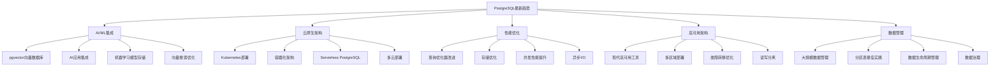

# PostgreSQL最新趋势与最佳实践总览

> **更新时间**: 2025年1月
> **技术版本**: PostgreSQL 17+/18+/19预览
> **文档编号**: 19-00-01

---

## 📑 目录

- [PostgreSQL最新趋势与最佳实践总览](#postgresql最新趋势与最佳实践总览)
  - [📑 目录](#-目录)
  - [1. 概述](#1-概述)
    - [1.1 文档目的](#11-文档目的)
    - [1.2 核心价值](#12-核心价值)
  - [2. 最新趋势思维导图](#2-最新趋势思维导图)
  - [3. 技术趋势分析矩阵](#3-技术趋势分析矩阵)
    - [3.1 2024-2025技术趋势重要性矩阵](#31-2024-2025技术趋势重要性矩阵)
    - [3.2 技术选型对比矩阵](#32-技术选型对比矩阵)
      - [AI/ML集成方案对比](#aiml集成方案对比)
      - [高可用方案对比](#高可用方案对比)
  - [4. 最佳实践决策树](#4-最佳实践决策树)
    - [4.1 AI应用技术选型决策树](#41-ai应用技术选型决策树)
    - [4.2 高可用方案选择决策树](#42-高可用方案选择决策树)
  - [5. 模块导航](#5-模块导航)
    - [5.1 AI/ML集成模块](#51-aiml集成模块)
    - [5.2 云原生架构模块](#52-云原生架构模块)
    - [5.3 性能优化模块](#53-性能优化模块)
    - [5.4 高可用架构模块](#54-高可用架构模块)
    - [5.5 数据管理模块](#55-数据管理模块)
  - [6. 快速导航决策矩阵](#6-快速导航决策矩阵)
    - [6.1 按需求导航](#61-按需求导航)
    - [6.2 按角色导航](#62-按角色导航)

---

## 1. 概述

### 1.1 文档目的

本文档是PostgreSQL最新趋势与最佳实践模块的总览文档，旨在：

- 📊 **趋势分析**：深度分析2024-2025年PostgreSQL最新技术趋势
- 🎯 **最佳实践**：总结生产环境中的最佳实践和架构设计
- 🔍 **技术选型**：提供技术选型决策矩阵和决策树
- 📈 **性能优化**：分享最新的性能优化技术和方案

### 1.2 核心价值

| 价值维度 | 说明 | 适用场景 |
|---------|------|---------|
| **技术前瞻性** | 紧跟最新技术趋势 | 技术选型、架构规划 |
| **实践指导性** | 基于真实生产案例 | 项目实施、问题解决 |
| **决策支持性** | 提供决策矩阵和决策树 | 技术选型、方案对比 |
| **性能优化性** | 最新优化技术和数据 | 性能调优、容量规划 |

---

## 2. 最新趋势思维导图



---

## 3. 技术趋势分析矩阵

### 3.1 2024-2025技术趋势重要性矩阵

| 技术趋势 | 技术成熟度 | 市场采用率 | 性能提升 | 学习成本 | 综合评分 | 优先级 |
|---------|-----------|-----------|---------|---------|---------|--------|
| **pgvector向量数据库** | ⭐⭐⭐⭐ | ⭐⭐⭐⭐⭐ | ⭐⭐⭐⭐⭐ | ⭐⭐⭐ | **4.5** | P0 |
| **云原生架构** | ⭐⭐⭐⭐⭐ | ⭐⭐⭐⭐⭐ | ⭐⭐⭐⭐ | ⭐⭐⭐ | **4.3** | P0 |
| **查询优化器改进** | ⭐⭐⭐⭐⭐ | ⭐⭐⭐⭐⭐ | ⭐⭐⭐⭐⭐ | ⭐⭐ | **4.5** | P0 |
| **异步I/O机制** | ⭐⭐⭐⭐ | ⭐⭐⭐ | ⭐⭐⭐⭐⭐ | ⭐⭐⭐ | **3.8** | P1 |
| **Serverless PostgreSQL** | ⭐⭐⭐ | ⭐⭐⭐ | ⭐⭐⭐⭐ | ⭐⭐⭐⭐ | **3.5** | P1 |
| **多区域部署** | ⭐⭐⭐⭐ | ⭐⭐⭐⭐ | ⭐⭐⭐ | ⭐⭐⭐⭐ | **3.8** | P1 |

### 3.2 技术选型对比矩阵

#### AI/ML集成方案对比

| 方案 | 性能 | 易用性 | 成本 | 可扩展性 | 适用场景 |
|------|------|--------|------|---------|---------|
| **pgvector** | ⭐⭐⭐⭐⭐ | ⭐⭐⭐⭐ | ⭐⭐⭐⭐ | ⭐⭐⭐⭐ | 向量搜索、推荐系统 |
| **PostgreSQL + 外部AI服务** | ⭐⭐⭐ | ⭐⭐⭐⭐⭐ | ⭐⭐⭐ | ⭐⭐⭐⭐⭐ | 复杂AI应用 |
| **专用向量数据库** | ⭐⭐⭐⭐⭐ | ⭐⭐⭐ | ⭐⭐ | ⭐⭐⭐ | 大规模向量搜索 |

#### 高可用方案对比

| 方案 | 故障恢复时间 | 数据一致性 | 运维复杂度 | 成本 | 适用场景 |
|------|------------|-----------|-----------|------|---------|
| **Patroni** | < 30秒 | ⭐⭐⭐⭐⭐ | ⭐⭐⭐ | ⭐⭐⭐⭐ | 企业级高可用 |
| **Citus** | < 1分钟 | ⭐⭐⭐⭐ | ⭐⭐⭐⭐ | ⭐⭐⭐ | 分布式场景 |
| **pg_auto_failover** | < 1分钟 | ⭐⭐⭐⭐⭐ | ⭐⭐⭐⭐⭐ | ⭐⭐⭐⭐⭐ | 简单高可用 |
| **repmgr** | < 2分钟 | ⭐⭐⭐⭐ | ⭐⭐⭐ | ⭐⭐⭐⭐ | 传统高可用 |

---

## 4. 最佳实践决策树

### 4.1 AI应用技术选型决策树

```text
需要AI功能？
├─ 是
│  ├─ 主要需求？
│  │  ├─ 向量搜索
│  │  │  ├─ 数据规模？
│  │  │  │  ├─ 小规模（< 1M向量） → pgvector
│  │  │  │  ├─ 中规模（1M-100M） → pgvector + 优化
│  │  │  │  └─ 大规模（> 100M） → 专用向量数据库
│  │  │  └─ 查询延迟要求？
│  │  │     ├─ < 10ms → pgvector + HNSW索引
│  │  │     └─ > 10ms → pgvector + IVFFlat索引
│  │  ├─ 机器学习模型存储
│  │  │  └─ 模型大小？
│  │  │     ├─ < 1GB → PostgreSQL BYTEA
│  │  │     └─ > 1GB → 对象存储 + PostgreSQL元数据
│  │  └─ 复杂AI应用
│  │     └─ PostgreSQL + 外部AI服务（OpenAI、HuggingFace）
│  └─ 否 → 无需AI功能
```

### 4.2 高可用方案选择决策树

```text
需要高可用？
├─ 是
│  ├─ 数据规模？
│  │  ├─ 单机可承载 → 单机高可用
│  │  │  ├─ 运维能力？
│  │  │  │  ├─ 强 → Patroni
│  │  │  │  └─ 弱 → pg_auto_failover
│  │  └─ 需要分布式 → 分布式高可用
│  │     └─ Citus
│  ├─ 故障恢复时间要求？
│  │  ├─ < 30秒 → Patroni
│  │  ├─ < 1分钟 → pg_auto_failover
│  │  └─ < 2分钟 → repmgr
│  └─ 数据一致性要求？
│     ├─ 最高 → Patroni + 同步复制
│     └─ 可接受短暂不一致 → 异步复制
└─ 否 → 单机部署
```

---

## 5. 模块导航

### 5.1 AI/ML集成模块

**文档列表**：

1. [PostgreSQL与AI集成架构](./01-AI-ML集成/PostgreSQL与AI集成架构.md)
2. [pgvector生产级应用](./01-AI-ML集成/pgvector生产级应用.md)
3. [向量搜索优化最佳实践](./01-AI-ML集成/向量搜索优化最佳实践.md)
4. [AI应用案例深度分析](./01-AI-ML集成/AI应用案例深度分析.md)

**核心内容**：

- pgvector向量数据库深度解析
- AI应用架构设计
- 向量搜索性能优化
- 生产级应用案例

### 5.2 云原生架构模块

**文档列表**：

1. [Kubernetes部署最佳实践](./02-云原生架构/Kubernetes部署最佳实践.md)
2. [容器化架构设计](./02-云原生架构/容器化架构设计.md)
3. [Serverless PostgreSQL深度解析](./02-云原生架构/Serverless_PostgreSQL深度解析.md)
4. [多云部署策略对比](./02-云原生架构/多云部署策略对比.md)

**核心内容**：

- Kubernetes部署方案
- 容器化最佳实践
- Serverless架构设计
- 多云部署策略

### 5.3 性能优化模块

**文档列表**：

1. [2024性能优化最佳实践](./03-性能优化/2024性能优化最佳实践.md)
2. [查询优化器深度解析](./03-性能优化/查询优化器深度解析.md)
3. [存储优化新方案](./03-性能优化/存储优化新方案.md)
4. [并发性能提升技术](./03-性能优化/并发性能提升技术.md)

**核心内容**：

- 最新性能优化技术
- 查询优化器改进分析
- 存储优化方案
- 并发性能提升

### 5.4 高可用架构模块

**文档列表**：

1. [现代高可用架构设计](./04-高可用架构/现代高可用架构设计.md)
2. [Patroni vs Citus对比分析](./04-高可用架构/Patroni_vs_Citus对比分析.md)
3. [故障转移最佳实践](./04-高可用架构/故障转移最佳实践.md)
4. [多区域部署方案](./04-高可用架构/多区域部署方案.md)

**核心内容**：

- 现代高可用工具对比
- 故障转移优化
- 多区域部署方案
- 生产级架构设计

### 5.5 数据管理模块

**文档列表**：

1. [大规模数据管理策略](./05-数据管理/大规模数据管理策略.md)
2. [分区表最佳实践2024](./05-数据管理/分区表最佳实践2024.md)
3. [数据归档与生命周期管理](./05-数据管理/数据归档与生命周期管理.md)
4. [数据治理最佳实践](./05-数据管理/数据治理最佳实践.md)

**核心内容**：

- 大规模数据管理
- 分区表最新实践
- 数据生命周期管理
- 数据治理方案

---

## 6. 快速导航决策矩阵

### 6.1 按需求导航

| 需求 | 推荐模块 | 推荐文档 | 优先级 |
|------|---------|---------|--------|
| **AI应用开发** | AI/ML集成 | pgvector生产级应用 | P0 |
| **云原生部署** | 云原生架构 | Kubernetes部署最佳实践 | P0 |
| **性能优化** | 性能优化 | 2024性能优化最佳实践 | P0 |
| **高可用设计** | 高可用架构 | 现代高可用架构设计 | P0 |
| **大数据管理** | 数据管理 | 大规模数据管理策略 | P1 |

### 6.2 按角色导航

| 角色 | 推荐模块 | 推荐文档 |
|------|---------|---------|
| **架构师** | 全部模块 | 技术选型决策矩阵、架构设计文档 |
| **开发工程师** | AI/ML集成、性能优化 | 应用开发、性能优化文档 |
| **运维工程师** | 云原生架构、高可用架构 | 部署、运维文档 |
| **DBA** | 数据管理、性能优化 | 数据管理、性能调优文档 |

---

**最后更新**: 2025年1月
**维护者**: PostgreSQL Modern Team
**文档编号**: 19-00-01
