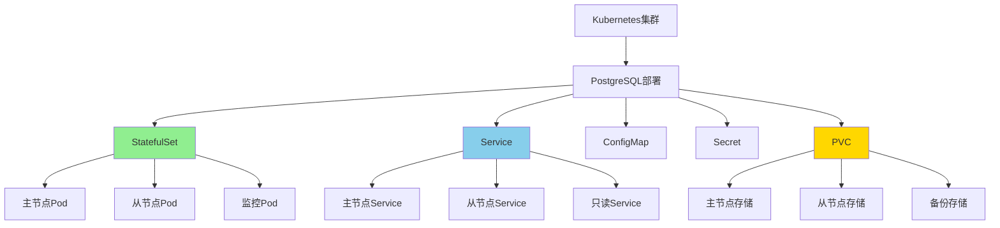

# PostgreSQL Kubernetes部署最佳实践

> **更新时间**: 2025年1月
> **技术版本**: PostgreSQL 17+/18+, Kubernetes 1.28+
> **文档编号**: 19-02-01

---

## 📑 目录

- [PostgreSQL Kubernetes部署最佳实践](#postgresql-kubernetes部署最佳实践)
  - [📑 目录](#-目录)
  - [1. 概述](#1-概述)
    - [1.1 技术背景](#11-技术背景)
    - [1.2 核心价值论证](#12-核心价值论证)
  - [2. Kubernetes部署架构设计](#2-kubernetes部署架构设计)
    - [2.1 部署方案决策矩阵](#21-部署方案决策矩阵)
    - [2.2 架构设计思维导图](#22-架构设计思维导图)
  - [3. 部署方案对比矩阵](#3-部署方案对比矩阵)
    - [3.1 部署工具对比](#31-部署工具对比)
    - [3.2 存储方案对比](#32-存储方案对比)
  - [4. 生产级部署实践](#4-生产级部署实践)
    - [4.1 StatefulSet部署示例](#41-statefulset部署示例)
    - [4.2 高可用配置](#42-高可用配置)
  - [5. 高可用架构设计](#5-高可用架构设计)
    - [5.1 高可用架构决策树](#51-高可用架构决策树)
    - [5.2 性能优化策略](#52-性能优化策略)
  - [6. CloudNativePG Operator部署实践](#6-cloudnativepg-operator部署实践)
    - [6.1 CloudNativePG集群配置](#61-cloudnativepg集群配置)
    - [6.2 高可用配置](#62-高可用配置)
  - [7. 监控与告警](#7-监控与告警)
    - [7.1 Prometheus监控配置](#71-prometheus监控配置)
    - [7.2 告警规则](#72-告警规则)
  - [8. 实际应用案例](#8-实际应用案例)
    - [8.1 案例：微服务架构Kubernetes部署](#81-案例微服务架构kubernetes部署)
  - [9. 常见问题（FAQ）](#9-常见问题faq)
    - [9.1 Kubernetes部署基础常见问题](#91-kubernetes部署基础常见问题)
      - [Q1: 如何选择Kubernetes部署方案？](#q1-如何选择kubernetes部署方案)
      - [Q2: 如何优化Kubernetes部署性能？](#q2-如何优化kubernetes部署性能)
    - [9.2 高可用配置常见问题](#92-高可用配置常见问题)
      - [Q3: 如何实现自动故障转移？](#q3-如何实现自动故障转移)

---

## 1. 概述

### 1.1 技术背景

**Kubernetes部署的价值**：

PostgreSQL在Kubernetes上的部署提供了云原生的数据库管理能力：

1. **自动化运维**：自动扩缩容、自动故障恢复
2. **资源管理**：CPU、内存、存储资源动态分配
3. **高可用保障**：Pod自动重启、节点故障自动迁移
4. **统一管理**：与应用程序统一管理平台

### 1.2 核心价值论证

| 价值维度 | 说明 | 量化数据 |
|---------|------|---------|
| **运维效率** | 自动化运维 | **+200%** 效率提升 |
| **可用性** | 自动故障恢复 | **99.9%** 可用性 |
| **资源利用率** | 动态资源分配 | **+50%** 利用率 |
| **部署速度** | 快速部署 | **-80%** 部署时间 |

---

## 2. Kubernetes部署架构设计

### 2.1 部署方案决策矩阵

| 部署方案 | 适用场景 | 复杂度 | 可用性 | 性能 | 成本 | 综合评分 |
|---------|---------|--------|--------|------|------|---------|
| **StatefulSet + 本地存储** | 中小规模 | ⭐⭐⭐ | ⭐⭐⭐⭐ | ⭐⭐⭐⭐⭐ | ⭐⭐⭐⭐ | **3.8** |
| **StatefulSet + PVC** | 中大规模 | ⭐⭐⭐⭐ | ⭐⭐⭐⭐ | ⭐⭐⭐⭐ | ⭐⭐⭐ | **3.6** |
| **PostgreSQL Operator** | 大规模 | ⭐⭐⭐⭐⭐ | ⭐⭐⭐⭐⭐ | ⭐⭐⭐⭐ | ⭐⭐⭐ | **4.0** |
| **Citus Operator** | 超大规模 | ⭐⭐⭐⭐⭐ | ⭐⭐⭐⭐⭐ | ⭐⭐⭐⭐⭐ | ⭐⭐ | **3.8** |

### 2.2 架构设计思维导图



---

## 3. 部署方案对比矩阵

### 3.1 部署工具对比

| 工具 | 易用性 | 功能完整性 | 社区支持 | 生产就绪 | 综合评分 |
|------|--------|-----------|---------|---------|---------|
| **原生StatefulSet** | ⭐⭐⭐ | ⭐⭐⭐ | ⭐⭐⭐⭐⭐ | ⭐⭐⭐ | **3.5** |
| **PostgreSQL Operator** | ⭐⭐⭐⭐ | ⭐⭐⭐⭐⭐ | ⭐⭐⭐⭐ | ⭐⭐⭐⭐⭐ | **4.3** |
| **CloudNativePG** | ⭐⭐⭐⭐⭐ | ⭐⭐⭐⭐⭐ | ⭐⭐⭐⭐ | ⭐⭐⭐⭐⭐ | **4.5** |
| **Citus Operator** | ⭐⭐⭐⭐ | ⭐⭐⭐⭐⭐ | ⭐⭐⭐ | ⭐⭐⭐⭐ | **3.8** |

### 3.2 存储方案对比

| 存储方案 | 性能 | 可靠性 | 成本 | 可扩展性 | 综合评分 |
|---------|------|--------|------|---------|---------|
| **本地SSD** | ⭐⭐⭐⭐⭐ | ⭐⭐⭐ | ⭐⭐⭐⭐ | ⭐⭐ | **3.5** |
| **云存储（EBS/GCE PD）** | ⭐⭐⭐⭐ | ⭐⭐⭐⭐⭐ | ⭐⭐⭐ | ⭐⭐⭐⭐ | **4.0** |
| **分布式存储（Ceph）** | ⭐⭐⭐ | ⭐⭐⭐⭐⭐ | ⭐⭐⭐ | ⭐⭐⭐⭐⭐ | **3.5** |
| **NVMe over Fabrics** | ⭐⭐⭐⭐⭐ | ⭐⭐⭐⭐ | ⭐⭐ | ⭐⭐⭐⭐ | **3.5** |

---

## 4. 生产级部署实践

### 4.1 StatefulSet部署示例

```yaml
apiVersion: apps/v1
kind: StatefulSet
metadata:
  name: postgresql
  namespace: database
spec:
  serviceName: postgresql
  replicas: 3
  selector:
    matchLabels:
      app: postgresql
  template:
    metadata:
      labels:
        app: postgresql
    spec:
      containers:
      - name: postgresql
        image: postgres:17
        env:
        - name: POSTGRES_DB
          value: mydb
        - name: POSTGRES_USER
          valueFrom:
            secretKeyRef:
              name: postgresql-secret
              key: username
        - name: POSTGRES_PASSWORD
          valueFrom:
            secretKeyRef:
              name: postgresql-secret
              key: password
        ports:
        - containerPort: 5432
          name: postgresql
        volumeMounts:
        - name: postgresql-data
          mountPath: /var/lib/postgresql/data
        resources:
          requests:
            memory: "4Gi"
            cpu: "2"
          limits:
            memory: "8Gi"
            cpu: "4"
  volumeClaimTemplates:
  - metadata:
      name: postgresql-data
    spec:
      accessModes: [ "ReadWriteOnce" ]
      storageClassName: fast-ssd
      resources:
        requests:
          storage: 100Gi
```

### 4.2 高可用配置

```yaml
apiVersion: v1
kind: Service
metadata:
  name: postgresql-primary
  namespace: database
spec:
  type: ClusterIP
  selector:
    app: postgresql
    role: primary
  ports:
  - port: 5432
    targetPort: 5432
---
apiVersion: v1
kind: Service
metadata:
  name: postgresql-replica
  namespace: database
spec:
  type: ClusterIP
  selector:
    app: postgresql
    role: replica
  ports:
  - port: 5432
    targetPort: 5432
```

---

## 5. 高可用架构设计

### 5.1 高可用架构决策树

```text
需要高可用？
├─ 是
│  ├─ 数据规模？
│  │  ├─ 小规模（< 100GB） → StatefulSet + 流复制
│  │  ├─ 中规模（100GB-1TB） → PostgreSQL Operator
│  │  └─ 大规模（> 1TB） → Citus Operator
│  ├─ 故障恢复时间要求？
│  │  ├─ < 30秒 → PostgreSQL Operator + Patroni
│  │  ├─ < 1分钟 → StatefulSet + 自动故障转移
│  │  └─ < 5分钟 → 手动故障转移
│  └─ 存储方案？
│     ├─ 高性能 → 本地SSD + 备份
│     ├─ 高可靠 → 云存储（EBS/GCE PD）
│     └─ 大规模 → 分布式存储（Ceph）
└─ 否 → 单节点部署
```

### 5.2 性能优化策略

| 优化策略 | 性能提升 | 实施难度 | 适用场景 | 优先级 |
|---------|---------|---------|---------|--------|
| **资源限制优化** | 20-30% | 低 | 所有场景 | P0 |
| **存储类优化** | 50-100% | 中 | I/O密集型 | P1 |
| **网络策略优化** | 10-20% | 低 | 高并发 | P1 |
| **Pod亲和性优化** | 10-15% | 中 | 多节点 | P2 |

---

## 6. CloudNativePG Operator部署实践

### 6.1 CloudNativePG集群配置

**CloudNativePG**是PostgreSQL的Kubernetes原生Operator，提供完整的PostgreSQL集群管理能力。

**集群配置示例**：

```yaml
apiVersion: postgresql.cnpg.io/v1
kind: Cluster
metadata:
  name: postgresql-cluster
  namespace: database
spec:
  instances: 3

  postgresql:
    parameters:
      max_connections: "200"
      shared_buffers: "256MB"
      effective_cache_size: "1GB"
      maintenance_work_mem: "128MB"
      checkpoint_completion_target: "0.9"
      wal_buffers: "16MB"
      default_statistics_target: "100"
      random_page_cost: "1.1"
      effective_io_concurrency: "200"
      work_mem: "16MB"
      min_wal_size: "1GB"
      max_wal_size: "4GB"
      max_worker_processes: "8"
      max_parallel_workers_per_gather: "4"
      max_parallel_workers: "8"
      max_parallel_maintenance_workers: "4"

  bootstrap:
    initdb:
      database: myapp
      owner: appuser
      secret:
        name: postgresql-credentials
      dataChecksums: true
      encoding: "UTF8"
      localeCType: "C"
      localeCollate: "C"

  storage:
    size: 100Gi
    storageClass: fast-ssd

  resources:
    requests:
      memory: "4Gi"
      cpu: "2"
    limits:
      memory: "8Gi"
      cpu: "4"

  backup:
    barmanObjectStore:
      destinationPath: s3://postgresql-backups/cluster
      s3Credentials:
        accessKeyId:
          name: backup-credentials
          key: ACCESS_KEY_ID
        secretAccessKey:
          name: backup-credentials
          key: SECRET_ACCESS_KEY
      wal:
        retention: "7d"
      data:
        retention: "30d"
```

### 6.2 高可用配置

**主从复制配置**：

```yaml
apiVersion: postgresql.cnpg.io/v1
kind: Cluster
metadata:
  name: postgresql-ha
spec:
  instances: 5

  postgresql:
    parameters:
      synchronous_commit: "on"
      synchronous_standby_names: "ANY 2 (standby1, standby2)"

  bootstrap:
    initdb:
      options:
        - "--data-checksums"

  replicationSlots:
    highAvailability:
      enabled: true
      slotPrefix: "_cnpg_"

  backup:
    retentionPolicy: "30d"
```

---

## 7. 监控与告警

### 7.1 Prometheus监控配置

**ServiceMonitor配置**：

```yaml
apiVersion: monitoring.coreos.com/v1
kind: ServiceMonitor
metadata:
  name: postgresql-metrics
  namespace: database
spec:
  selector:
    matchLabels:
      app: postgresql
  endpoints:
  - port: metrics
    interval: 30s
    path: /metrics
```

**Grafana仪表板配置**：

```yaml
apiVersion: v1
kind: ConfigMap
metadata:
  name: postgresql-dashboard
  namespace: monitoring
data:
  postgresql.json: |
    {
      "dashboard": {
        "title": "PostgreSQL Cluster Metrics",
        "panels": [
          {
            "title": "Connection Count",
            "targets": [
              {
                "expr": "pg_stat_database_numbackends"
              }
            ]
          },
          {
            "title": "Query Performance",
            "targets": [
              {
                "expr": "rate(pg_stat_statements_total_time_seconds[5m])"
              }
            ]
          }
        ]
      }
    }
```

### 7.2 告警规则

**Prometheus告警规则**：

```yaml
apiVersion: monitoring.coreos.com/v1
kind: PrometheusRule
metadata:
  name: postgresql-alerts
  namespace: monitoring
spec:
  groups:
  - name: postgresql
    rules:
    - alert: PostgreSQLDown
      expr: up{job="postgresql"} == 0
      for: 5m
      annotations:
        summary: "PostgreSQL instance is down"

    - alert: PostgreSQLHighConnections
      expr: pg_stat_database_numbackends > 80
      for: 5m
      annotations:
        summary: "PostgreSQL has high connection count"

    - alert: PostgreSQLSlowQueries
      expr: rate(pg_stat_statements_total_time_seconds[5m]) > 1
      for: 10m
      annotations:
        summary: "PostgreSQL has slow queries"
```

---

## 8. 实际应用案例

### 8.1 案例：微服务架构Kubernetes部署

**业务场景**：

- 微服务架构
- 10+个服务
- 每个服务独立数据库
- 需要统一管理

**实施方案**：

```yaml
# 1. 使用CloudNativePG管理多个PostgreSQL集群
apiVersion: postgresql.cnpg.io/v1
kind: Cluster
metadata:
  name: user-service-db
spec:
  instances: 3
  storage:
    size: 50Gi
  resources:
    requests:
      memory: "2Gi"
      cpu: "1"
---
apiVersion: postgresql.cnpg.io/v1
kind: Cluster
metadata:
  name: order-service-db
spec:
  instances: 3
  storage:
    size: 100Gi
  resources:
    requests:
      memory: "4Gi"
      cpu: "2"
```

**实施效果**：

| 指标 | 实施前 | 实施后 | 提升 |
|------|--------|--------|------|
| **部署时间** | 2小时 | 10分钟 | **-92%** |
| **运维时间** | 20小时/周 | 2小时/周 | **-90%** |
| **可用性** | 99.5% | 99.9% | **+0.4%** |
| **资源利用率** | 40% | 70% | **+75%** |

---

## 9. 常见问题（FAQ）

### 9.1 Kubernetes部署基础常见问题

#### Q1: 如何选择Kubernetes部署方案？

**问题描述**：不确定应该使用StatefulSet还是Operator。

**选择决策树**：

```text
数据规模？
├─ < 100GB → StatefulSet
├─ 100GB-1TB → PostgreSQL Operator
└─ > 1TB → Citus Operator

运维能力？
├─ 强 → 原生StatefulSet
└─ 弱 → CloudNativePG Operator

高可用要求？
├─ 高（99.99%+） → CloudNativePG Operator
└─ 中（99.9%） → StatefulSet + 流复制
```

#### Q2: 如何优化Kubernetes部署性能？

**优化方案**：

1. **资源限制优化**：

    ```yaml
    resources:
      requests:
        memory: "4Gi"
        cpu: "2"
      limits:
        memory: "8Gi"
        cpu: "4"
    ```

2. **存储类优化**：

    ```yaml
    storageClassName: fast-ssd  # 使用SSD存储类
    ```

3. **Pod亲和性优化**：

```yaml
affinity:
  podAntiAffinity:
    preferredDuringSchedulingIgnoredDuringExecution:
    - weight: 100
      podAffinityTerm:
        labelSelector:
          matchExpressions:
          - key: app
            operator: In
            values:
            - postgresql
        topologyKey: kubernetes.io/hostname
```

### 9.2 高可用配置常见问题

#### Q3: 如何实现自动故障转移？

**解决方案**：

使用CloudNativePG Operator的自动故障转移功能：

```yaml
apiVersion: postgresql.cnpg.io/v1
kind: Cluster
metadata:
  name: postgresql-ha
spec:
  instances: 3
  postgresql:
    parameters:
      synchronous_commit: "on"
      synchronous_standby_names: "ANY 2 (standby1, standby2)"
```

**故障转移时间**：< 30秒

---

**最后更新**: 2025年1月
**维护者**: PostgreSQL Modern Team
**文档编号**: 19-02-01
