# PostgreSQL Kubernetes部署最佳实践

> **更新时间**: 2025年1月
> **技术版本**: PostgreSQL 17+/18+, Kubernetes 1.28+
> **文档编号**: 19-02-01

---

## 📑 目录

- [PostgreSQL Kubernetes部署最佳实践](#postgresql-kubernetes部署最佳实践)
  - [📑 目录](#-目录)
  - [1. 概述](#1-概述)
    - [1.1 技术背景](#11-技术背景)
    - [1.2 核心价值论证](#12-核心价值论证)
  - [2. Kubernetes部署架构设计](#2-kubernetes部署架构设计)
    - [2.1 部署方案决策矩阵](#21-部署方案决策矩阵)
    - [2.2 架构设计思维导图](#22-架构设计思维导图)
  - [3. 部署方案对比矩阵](#3-部署方案对比矩阵)
    - [3.1 部署工具对比](#31-部署工具对比)
    - [3.2 存储方案对比](#32-存储方案对比)
  - [4. 生产级部署实践](#4-生产级部署实践)
    - [4.1 StatefulSet部署示例](#41-statefulset部署示例)
    - [4.2 高可用配置](#42-高可用配置)
  - [5. 高可用架构设计](#5-高可用架构设计)
    - [5.1 高可用架构决策树](#51-高可用架构决策树)
    - [5.2 性能优化策略](#52-性能优化策略)

---

## 1. 概述

### 1.1 技术背景

**Kubernetes部署的价值**：

PostgreSQL在Kubernetes上的部署提供了云原生的数据库管理能力：

1. **自动化运维**：自动扩缩容、自动故障恢复
2. **资源管理**：CPU、内存、存储资源动态分配
3. **高可用保障**：Pod自动重启、节点故障自动迁移
4. **统一管理**：与应用程序统一管理平台

### 1.2 核心价值论证

| 价值维度 | 说明 | 量化数据 |
|---------|------|---------|
| **运维效率** | 自动化运维 | **+200%** 效率提升 |
| **可用性** | 自动故障恢复 | **99.9%** 可用性 |
| **资源利用率** | 动态资源分配 | **+50%** 利用率 |
| **部署速度** | 快速部署 | **-80%** 部署时间 |

---

## 2. Kubernetes部署架构设计

### 2.1 部署方案决策矩阵

| 部署方案 | 适用场景 | 复杂度 | 可用性 | 性能 | 成本 | 综合评分 |
|---------|---------|--------|--------|------|------|---------|
| **StatefulSet + 本地存储** | 中小规模 | ⭐⭐⭐ | ⭐⭐⭐⭐ | ⭐⭐⭐⭐⭐ | ⭐⭐⭐⭐ | **3.8** |
| **StatefulSet + PVC** | 中大规模 | ⭐⭐⭐⭐ | ⭐⭐⭐⭐ | ⭐⭐⭐⭐ | ⭐⭐⭐ | **3.6** |
| **PostgreSQL Operator** | 大规模 | ⭐⭐⭐⭐⭐ | ⭐⭐⭐⭐⭐ | ⭐⭐⭐⭐ | ⭐⭐⭐ | **4.0** |
| **Citus Operator** | 超大规模 | ⭐⭐⭐⭐⭐ | ⭐⭐⭐⭐⭐ | ⭐⭐⭐⭐⭐ | ⭐⭐ | **3.8** |

### 2.2 架构设计思维导图

```mermaid
graph TD
    A[Kubernetes集群] --> B[PostgreSQL部署]
    B --> C[StatefulSet]
    B --> D[Service]
    B --> E[ConfigMap]
    B --> F[Secret]
    B --> G[PVC]

    C --> C1[主节点Pod]
    C --> C2[从节点Pod]
    C --> C3[监控Pod]

    D --> D1[主节点Service]
    D --> D2[从节点Service]
    D --> D3[只读Service]

    G --> G1[主节点存储]
    G --> G2[从节点存储]
    G --> G3[备份存储]

    style C fill:#90EE90
    style D fill:#87CEEB
    style G fill:#FFD700
```



---

## 3. 部署方案对比矩阵

### 3.1 部署工具对比

| 工具 | 易用性 | 功能完整性 | 社区支持 | 生产就绪 | 综合评分 |
|------|--------|-----------|---------|---------|---------|
| **原生StatefulSet** | ⭐⭐⭐ | ⭐⭐⭐ | ⭐⭐⭐⭐⭐ | ⭐⭐⭐ | **3.5** |
| **PostgreSQL Operator** | ⭐⭐⭐⭐ | ⭐⭐⭐⭐⭐ | ⭐⭐⭐⭐ | ⭐⭐⭐⭐⭐ | **4.3** |
| **CloudNativePG** | ⭐⭐⭐⭐⭐ | ⭐⭐⭐⭐⭐ | ⭐⭐⭐⭐ | ⭐⭐⭐⭐⭐ | **4.5** |
| **Citus Operator** | ⭐⭐⭐⭐ | ⭐⭐⭐⭐⭐ | ⭐⭐⭐ | ⭐⭐⭐⭐ | **3.8** |

### 3.2 存储方案对比

| 存储方案 | 性能 | 可靠性 | 成本 | 可扩展性 | 综合评分 |
|---------|------|--------|------|---------|---------|
| **本地SSD** | ⭐⭐⭐⭐⭐ | ⭐⭐⭐ | ⭐⭐⭐⭐ | ⭐⭐ | **3.5** |
| **云存储（EBS/GCE PD）** | ⭐⭐⭐⭐ | ⭐⭐⭐⭐⭐ | ⭐⭐⭐ | ⭐⭐⭐⭐ | **4.0** |
| **分布式存储（Ceph）** | ⭐⭐⭐ | ⭐⭐⭐⭐⭐ | ⭐⭐⭐ | ⭐⭐⭐⭐⭐ | **3.5** |
| **NVMe over Fabrics** | ⭐⭐⭐⭐⭐ | ⭐⭐⭐⭐ | ⭐⭐ | ⭐⭐⭐⭐ | **3.5** |

---

## 4. 生产级部署实践

### 4.1 StatefulSet部署示例

```yaml
apiVersion: apps/v1
kind: StatefulSet
metadata:
  name: postgresql
  namespace: database
spec:
  serviceName: postgresql
  replicas: 3
  selector:
    matchLabels:
      app: postgresql
  template:
    metadata:
      labels:
        app: postgresql
    spec:
      containers:
      - name: postgresql
        image: postgres:17
        env:
        - name: POSTGRES_DB
          value: mydb
        - name: POSTGRES_USER
          valueFrom:
            secretKeyRef:
              name: postgresql-secret
              key: username
        - name: POSTGRES_PASSWORD
          valueFrom:
            secretKeyRef:
              name: postgresql-secret
              key: password
        ports:
        - containerPort: 5432
          name: postgresql
        volumeMounts:
        - name: postgresql-data
          mountPath: /var/lib/postgresql/data
        resources:
          requests:
            memory: "4Gi"
            cpu: "2"
          limits:
            memory: "8Gi"
            cpu: "4"
  volumeClaimTemplates:
  - metadata:
      name: postgresql-data
    spec:
      accessModes: [ "ReadWriteOnce" ]
      storageClassName: fast-ssd
      resources:
        requests:
          storage: 100Gi
```

### 4.2 高可用配置

```yaml
apiVersion: v1
kind: Service
metadata:
  name: postgresql-primary
  namespace: database
spec:
  type: ClusterIP
  selector:
    app: postgresql
    role: primary
  ports:
  - port: 5432
    targetPort: 5432
---
apiVersion: v1
kind: Service
metadata:
  name: postgresql-replica
  namespace: database
spec:
  type: ClusterIP
  selector:
    app: postgresql
    role: replica
  ports:
  - port: 5432
    targetPort: 5432
```

---

## 5. 高可用架构设计

### 5.1 高可用架构决策树

```text
需要高可用？
├─ 是
│  ├─ 数据规模？
│  │  ├─ 小规模（< 100GB） → StatefulSet + 流复制
│  │  ├─ 中规模（100GB-1TB） → PostgreSQL Operator
│  │  └─ 大规模（> 1TB） → Citus Operator
│  ├─ 故障恢复时间要求？
│  │  ├─ < 30秒 → PostgreSQL Operator + Patroni
│  │  ├─ < 1分钟 → StatefulSet + 自动故障转移
│  │  └─ < 5分钟 → 手动故障转移
│  └─ 存储方案？
│     ├─ 高性能 → 本地SSD + 备份
│     ├─ 高可靠 → 云存储（EBS/GCE PD）
│     └─ 大规模 → 分布式存储（Ceph）
└─ 否 → 单节点部署
```

### 5.2 性能优化策略

| 优化策略 | 性能提升 | 实施难度 | 适用场景 | 优先级 |
|---------|---------|---------|---------|--------|
| **资源限制优化** | 20-30% | 低 | 所有场景 | P0 |
| **存储类优化** | 50-100% | 中 | I/O密集型 | P1 |
| **网络策略优化** | 10-20% | 低 | 高并发 | P1 |
| **Pod亲和性优化** | 10-15% | 中 | 多节点 | P2 |

---

**最后更新**: 2025年1月
**维护者**: PostgreSQL Modern Team
**文档编号**: 19-02-01
