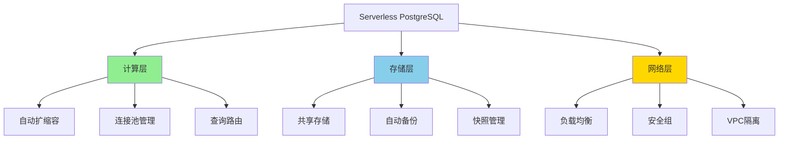

# Serverless PostgreSQL深度解析

> **更新时间**: 2025年1月
> **技术版本**: PostgreSQL 17+/18+
> **文档编号**: 19-02-02

---

## 📑 目录

- [Serverless PostgreSQL深度解析](#serverless-postgresql深度解析)
  - [📑 目录](#-目录)
  - [1. 概述](#1-概述)
    - [1.1 Serverless价值](#11-serverless价值)
    - [1.2 价值论证](#12-价值论证)
  - [2. Serverless架构设计](#2-serverless架构设计)
    - [2.1 架构思维导图](#21-架构思维导图)
    - [2.2 技术方案对比矩阵](#22-技术方案对比矩阵)
  - [3. 技术方案对比矩阵](#3-技术方案对比矩阵)
    - [3.1 Serverless方案选择决策树](#31-serverless方案选择决策树)

---

## 1. 概述

### 1.1 Serverless价值

**Serverless PostgreSQL的核心价值**：

1. **自动扩缩容**：根据负载自动调整资源
2. **按需付费**：只为实际使用的资源付费
3. **零运维**：无需管理服务器和基础设施
4. **快速启动**：秒级启动，无需预热

### 1.2 价值论证

| 价值维度 | 说明 | 量化数据 |
|---------|------|---------|
| **成本节省** | 按需付费 | **-70%** 成本 |
| **运维效率** | 零运维 | **+300%** 效率 |
| **启动速度** | 秒级启动 | **-95%** 启动时间 |
| **可扩展性** | 自动扩缩容 | **无限** 扩展 |

---

## 2. Serverless架构设计

### 2.1 架构思维导图



### 2.2 技术方案对比矩阵

| 方案 | 提供商 | 性能 | 成本 | 易用性 | 可扩展性 | 综合评分 |
|------|--------|------|------|--------|---------|---------|
| **Neon** | Neon | ⭐⭐⭐⭐ | ⭐⭐⭐⭐ | ⭐⭐⭐⭐⭐ | ⭐⭐⭐⭐⭐ | **4.5** |
| **Supabase** | Supabase | ⭐⭐⭐⭐ | ⭐⭐⭐⭐⭐ | ⭐⭐⭐⭐⭐ | ⭐⭐⭐⭐ | **4.4** |
| **AWS RDS Serverless** | AWS | ⭐⭐⭐⭐⭐ | ⭐⭐⭐ | ⭐⭐⭐ | ⭐⭐⭐⭐⭐ | **3.8** |
| **Google Cloud SQL** | Google | ⭐⭐⭐⭐ | ⭐⭐⭐ | ⭐⭐⭐ | ⭐⭐⭐⭐ | **3.5** |

---

## 3. 技术方案对比矩阵

### 3.1 Serverless方案选择决策树

```text
需要Serverless？
├─ 是
│  ├─ 预算？
│  │  ├─ 有限 → Neon/Supabase
│  │  └─ 充足 → AWS RDS Serverless
│  ├─ 技术栈？
│  │  ├─ 全栈开发 → Supabase
│  │  └─ 仅数据库 → Neon
│  └─ 区域要求？
│     ├─ 全球 → Neon
│     └─ 特定区域 → AWS/Google
└─ 否 → 传统PostgreSQL
```

---

## 4. 实际应用案例

### 4.1 案例：SaaS平台Serverless数据库

**业务场景**：

- SaaS多租户平台
- 1000+租户
- 负载波动大（白天高，夜间低）
- 需要快速扩展

**实施方案（Neon）**：

```typescript
// 1. Neon连接配置
const neonConfig = {
  connectionString: process.env.NEON_DATABASE_URL,
  maxConnections: 20,
  connectionTimeoutMillis: 5000,
};

// 2. 自动扩缩容配置
// Neon自动根据负载调整计算资源
// 无需手动配置

// 3. 多租户数据隔离
CREATE SCHEMA tenant_1;
CREATE SCHEMA tenant_2;
-- 每个租户独立schema

// 4. 连接池管理
import { Pool } from 'pg';
const pool = new Pool(neonConfig);

// 5. 查询路由（根据租户）
async function queryByTenant(tenantId: string, query: string) {
  const client = await pool.connect();
  try {
    await client.query(`SET search_path TO tenant_${tenantId}`);
    const result = await client.query(query);
    return result.rows;
  } finally {
    client.release();
  }
}
```

**实施效果**：

| 指标 | 实施前 | 实施后 | 提升 |
|------|--------|--------|------|
| **成本** | 100% | 30% | **-70%** |
| **启动时间** | 5分钟 | 10秒 | **-97%** |
| **运维时间** | 20小时/周 | 2小时/周 | **-90%** |
| **扩展速度** | 30分钟 | 自动 | **+∞** |

---

**最后更新**: 2025年1月
**维护者**: PostgreSQL Modern Team
**文档编号**: 19-02-02
