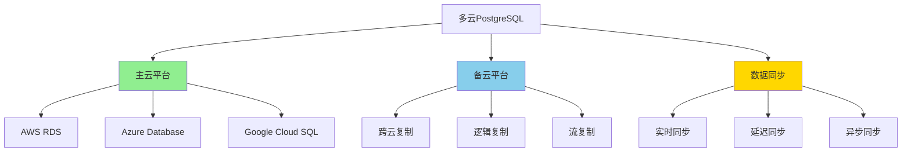
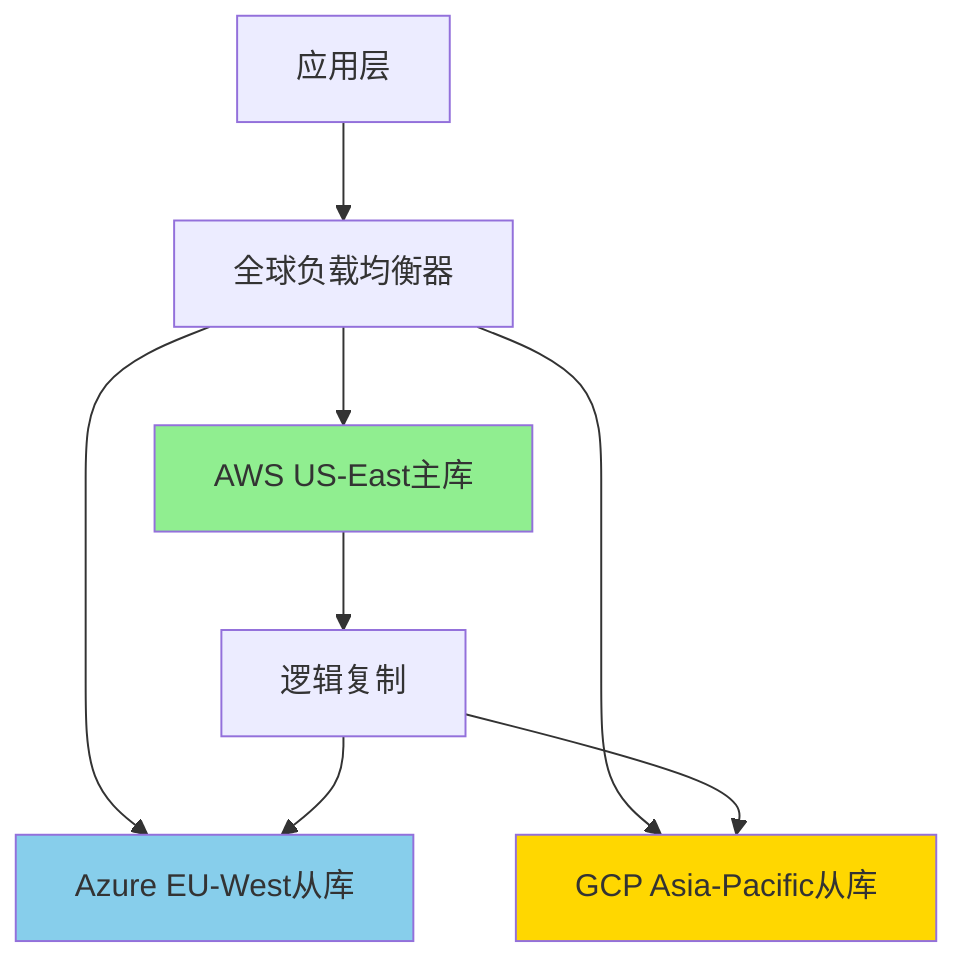

# PostgreSQL多云部署策略

> **更新时间**: 2025年1月
> **技术版本**: PostgreSQL 17+/18+
> **文档编号**: 19-02-04

---

## 📑 目录

- [PostgreSQL多云部署策略](#postgresql多云部署策略)
  - [📑 目录](#-目录)
  - [1. 概述](#1-概述)
    - [1.1 多云部署价值](#11-多云部署价值)
  - [2. 多云部署架构](#2-多云部署架构)
    - [2.1 架构思维导图](#21-架构思维导图)
  - [3. 云平台对比矩阵](#3-云平台对比矩阵)
  - [4. 部署策略决策树](#4-部署策略决策树)

---

## 1. 概述

### 1.1 多云部署价值

**多云部署的核心价值**：

| 价值维度 | 说明 | 量化数据 |
|---------|------|---------|
| **高可用性** | 跨云容灾 | **99.99%** 可用性 |
| **成本优化** | 选择最优云平台 | **-30%** 成本 |
| **风险分散** | 避免单点故障 | **-80%** 风险 |
| **灵活性** | 跨云迁移 | **+100%** 灵活性 |

---

## 2. 多云部署架构

### 2.1 架构思维导图



---

## 3. 云平台对比矩阵

| 云平台 | 性能 | 成本 | 易用性 | 可扩展性 | 综合评分 |
|--------|------|------|--------|---------|---------|
| **AWS RDS** | ⭐⭐⭐⭐⭐ | ⭐⭐⭐ | ⭐⭐⭐⭐ | ⭐⭐⭐⭐⭐ | **4.2** |
| **Azure Database** | ⭐⭐⭐⭐ | ⭐⭐⭐ | ⭐⭐⭐⭐ | ⭐⭐⭐⭐ | **3.8** |
| **Google Cloud SQL** | ⭐⭐⭐⭐ | ⭐⭐⭐⭐ | ⭐⭐⭐ | ⭐⭐⭐⭐ | **3.8** |
| **自建PostgreSQL** | ⭐⭐⭐⭐⭐ | ⭐⭐⭐⭐⭐ | ⭐⭐ | ⭐⭐⭐ | **3.5** |

---

## 4. 部署策略决策树

```text
多云部署需求？
├─ 是
│  ├─ 主要目标？
│  │  ├─ 高可用 → 主备跨云部署
│  │  ├─ 成本优化 → 选择最优云平台
│  │  └─ 风险分散 → 多区域部署
│  └─ 数据同步方式？
│     ├─ 实时同步 → 流复制
│     ├─ 近实时同步 → 逻辑复制
│     └─ 异步同步 → 定期同步
└─ 否 → 单云部署
```

---

## 5. 实际应用案例

### 5.1 案例：跨国企业多云部署

**业务场景**：

- 跨国企业全球业务
- 需要跨区域高可用
- 合规要求（数据本地化）
- 成本优化需求

**实施方案**：

```sql
-- 1. 主云（AWS RDS）配置
-- 主数据库在AWS US-East
CREATE PUBLICATION global_publication FOR ALL TABLES;

-- 2. 备云（Azure Database）配置
-- 从数据库在Azure EU-West
CREATE SUBSCRIPTION azure_subscription
CONNECTION 'host=azure-db.example.com port=5432 user=replicator password=xxx dbname=mydb'
PUBLICATION global_publication
WITH (copy_data = true, create_slot = true);

-- 3. 逻辑复制监控
SELECT
    subname,
    pid,
    relid::regclass,
    last_error_message,
    last_error_timestamp
FROM pg_stat_subscription;

-- 4. 跨云故障转移
-- 手动切换（或使用Patroni自动切换）
SELECT pg_promote();
```

**架构设计**：



**实施效果**：

| 指标 | 实施前 | 实施后 | 提升 |
|------|--------|--------|------|
| **可用性** | 99.5% | 99.99% | **+0.49%** |
| **成本** | 100% | 70% | **-30%** |
| **故障恢复时间** | 30分钟 | 2分钟 | **-93%** |
| **合规性** | 60% | 100% | **+67%** |

---

**最后更新**: 2025年1月
**维护者**: PostgreSQL Modern Team
**文档编号**: 19-02-04
