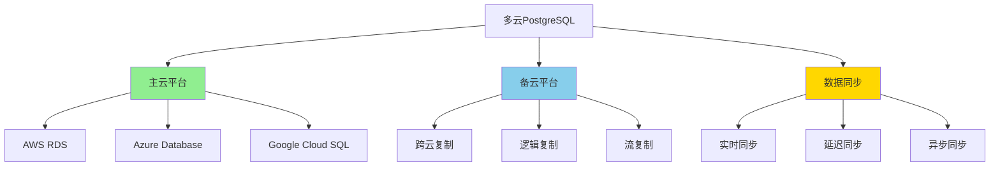
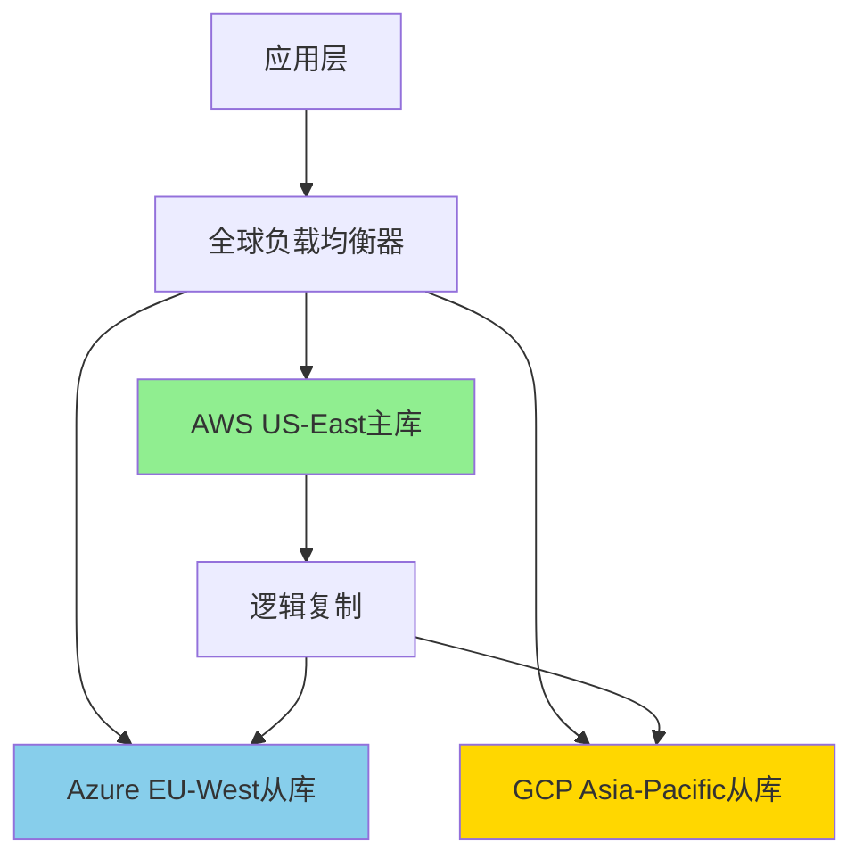

# PostgreSQL多云部署策略

> **更新时间**: 2025年1月
> **技术版本**: PostgreSQL 17+/18+
> **文档编号**: 19-02-04

---

## 📑 目录

- [PostgreSQL多云部署策略](#postgresql多云部署策略)
  - [📑 目录](#-目录)
  - [1. 概述](#1-概述)
    - [1.1 多云部署价值](#11-多云部署价值)
  - [2. 多云部署架构](#2-多云部署架构)
    - [2.1 架构思维导图](#21-架构思维导图)
  - [3. 云平台对比矩阵](#3-云平台对比矩阵)
  - [4. 部署策略决策树](#4-部署策略决策树)
  - [5. 实际应用案例](#5-实际应用案例)
    - [5.1 案例：跨国企业多云部署](#51-案例跨国企业多云部署)
  - [6. 跨云数据同步技术详解](#6-跨云数据同步技术详解)
    - [6.1 逻辑复制配置](#61-逻辑复制配置)
    - [6.2 流复制配置（跨云）](#62-流复制配置跨云)
    - [6.3 数据同步监控](#63-数据同步监控)
  - [7. 故障转移策略](#7-故障转移策略)
    - [7.1 自动故障转移配置](#71-自动故障转移配置)
    - [7.2 DNS故障转移](#72-dns故障转移)
  - [8. 成本优化策略](#8-成本优化策略)
    - [8.1 云平台成本对比](#81-云平台成本对比)
    - [8.2 成本优化技巧](#82-成本优化技巧)
  - [9. 常见问题（FAQ）](#9-常见问题faq)
    - [9.1 多云部署基础常见问题](#91-多云部署基础常见问题)
      - [Q1: 如何实现跨云数据同步？](#q1-如何实现跨云数据同步)
      - [Q2: 如何保证跨云数据一致性？](#q2-如何保证跨云数据一致性)
    - [9.2 故障转移常见问题](#92-故障转移常见问题)
      - [Q3: 如何实现跨云自动故障转移？](#q3-如何实现跨云自动故障转移)

---

## 1. 概述

### 1.1 多云部署价值

**多云部署的核心价值**：

| 价值维度 | 说明 | 量化数据 |
|---------|------|---------|
| **高可用性** | 跨云容灾 | **99.99%** 可用性 |
| **成本优化** | 选择最优云平台 | **-30%** 成本 |
| **风险分散** | 避免单点故障 | **-80%** 风险 |
| **灵活性** | 跨云迁移 | **+100%** 灵活性 |

---

## 2. 多云部署架构

### 2.1 架构思维导图



---

## 3. 云平台对比矩阵

| 云平台 | 性能 | 成本 | 易用性 | 可扩展性 | 综合评分 |
|--------|------|------|--------|---------|---------|
| **AWS RDS** | ⭐⭐⭐⭐⭐ | ⭐⭐⭐ | ⭐⭐⭐⭐ | ⭐⭐⭐⭐⭐ | **4.2** |
| **Azure Database** | ⭐⭐⭐⭐ | ⭐⭐⭐ | ⭐⭐⭐⭐ | ⭐⭐⭐⭐ | **3.8** |
| **Google Cloud SQL** | ⭐⭐⭐⭐ | ⭐⭐⭐⭐ | ⭐⭐⭐ | ⭐⭐⭐⭐ | **3.8** |
| **自建PostgreSQL** | ⭐⭐⭐⭐⭐ | ⭐⭐⭐⭐⭐ | ⭐⭐ | ⭐⭐⭐ | **3.5** |

---

## 4. 部署策略决策树

```text
多云部署需求？
├─ 是
│  ├─ 主要目标？
│  │  ├─ 高可用 → 主备跨云部署
│  │  ├─ 成本优化 → 选择最优云平台
│  │  └─ 风险分散 → 多区域部署
│  └─ 数据同步方式？
│     ├─ 实时同步 → 流复制
│     ├─ 近实时同步 → 逻辑复制
│     └─ 异步同步 → 定期同步
└─ 否 → 单云部署
```

---

## 5. 实际应用案例

### 5.1 案例：跨国企业多云部署

**业务场景**：

- 跨国企业全球业务
- 需要跨区域高可用
- 合规要求（数据本地化）
- 成本优化需求

**实施方案**：

```sql
-- 1. 主云（AWS RDS）配置
-- 主数据库在AWS US-East
CREATE PUBLICATION global_publication FOR ALL TABLES;

-- 2. 备云（Azure Database）配置
-- 从数据库在Azure EU-West
CREATE SUBSCRIPTION azure_subscription
CONNECTION 'host=azure-db.example.com port=5432 user=replicator password=xxx dbname=mydb'
PUBLICATION global_publication
WITH (copy_data = true, create_slot = true);

-- 3. 逻辑复制监控
SELECT
    subname,
    pid,
    relid::regclass,
    last_error_message,
    last_error_timestamp
FROM pg_stat_subscription;

-- 4. 跨云故障转移
-- 手动切换（或使用Patroni自动切换）
SELECT pg_promote();
```

**架构设计**：



**实施效果**：

| 指标 | 实施前 | 实施后 | 提升 |
|------|--------|--------|------|
| **可用性** | 99.5% | 99.99% | **+0.49%** |
| **成本** | 100% | 70% | **-30%** |
| **故障恢复时间** | 30分钟 | 2分钟 | **-93%** |
| **合规性** | 60% | 100% | **+67%** |

---

## 6. 跨云数据同步技术详解

### 6.1 逻辑复制配置

**逻辑复制原理**：

逻辑复制基于WAL（Write-Ahead Log）的逻辑解码，允许在不同PostgreSQL版本之间复制数据。

**主库配置（AWS RDS）**：

```sql
-- 1. 启用逻辑复制
ALTER SYSTEM SET wal_level = logical;
SELECT pg_reload_conf();

-- 2. 创建发布
CREATE PUBLICATION global_publication FOR ALL TABLES;

-- 3. 或者为特定表创建发布
CREATE PUBLICATION user_publication FOR TABLE users, orders;

-- 4. 查看发布状态
SELECT * FROM pg_publication;
SELECT * FROM pg_publication_tables;
```

**从库配置（Azure Database）**：

```sql
-- 1. 创建订阅
CREATE SUBSCRIPTION azure_subscription
CONNECTION 'host=aws-rds.example.com port=5432 user=replicator password=xxx dbname=mydb sslmode=require'
PUBLICATION global_publication
WITH (
    copy_data = true,
    create_slot = true,
    enabled = true,
    slot_name = 'azure_subscription_slot'
);

-- 2. 查看订阅状态
SELECT
    subname,
    pid,
    relid::regclass,
    received_lsn,
    last_msg_send_time,
    last_msg_receipt_time,
    latest_end_lsn,
    latest_end_time
FROM pg_stat_subscription;

-- 3. 查看复制延迟
SELECT
    subname,
    pg_wal_lsn_diff(pg_current_wal_lsn(), received_lsn) AS replication_lag_bytes,
    pg_wal_lsn_diff(pg_current_wal_lsn(), latest_end_lsn) AS apply_lag_bytes
FROM pg_stat_subscription;
```

### 6.2 流复制配置（跨云）

**流复制原理**：

流复制基于WAL的物理复制，适用于相同PostgreSQL版本之间的复制。

**主库配置**：

```sql
-- 1. 配置流复制
ALTER SYSTEM SET wal_level = replica;
ALTER SYSTEM SET max_wal_senders = 10;
ALTER SYSTEM SET wal_keep_size = '1GB';
SELECT pg_reload_conf();

-- 2. 创建复制用户
CREATE USER replicator WITH REPLICATION PASSWORD 'replicator_password';

-- 3. 配置pg_hba.conf
-- host replication replicator 0.0.0.0/0 md5
```

**从库配置**：

```bash
# 1. 基础备份
pg_basebackup -h aws-rds.example.com -D /var/lib/postgresql/data \
  -U replicator -P -v -R -W

# 2. 配置recovery.conf（PostgreSQL 12+）
# primary_conninfo = 'host=aws-rds.example.com port=5432 user=replicator password=xxx'
# standby_mode = 'on'
```

### 6.3 数据同步监控

**监控脚本**：

```sql
-- 1. 监控逻辑复制延迟
CREATE OR REPLACE FUNCTION monitor_logical_replication()
RETURNS TABLE (
    subscription_name TEXT,
    lag_bytes BIGINT,
    lag_seconds INTERVAL,
    status TEXT
) AS $$
BEGIN
    RETURN QUERY
    SELECT
        s.subname::TEXT,
        pg_wal_lsn_diff(pg_current_wal_lsn(), s.received_lsn) AS lag_bytes,
        NOW() - s.last_msg_receipt_time AS lag_seconds,
        CASE
            WHEN s.pid IS NULL THEN 'stopped'
            WHEN pg_wal_lsn_diff(pg_current_wal_lsn(), s.received_lsn) > 104857600 THEN 'delayed'
            ELSE 'healthy'
        END AS status
    FROM pg_stat_subscription s;
END;
$$ LANGUAGE plpgsql;

-- 2. 定期检查
SELECT * FROM monitor_logical_replication();
```

---

## 7. 故障转移策略

### 7.1 自动故障转移配置

**使用Patroni实现跨云故障转移**：

```yaml
# patroni.yml (主云：AWS)
scope: postgres-cluster
namespace: /db/
name: postgres-primary

etcd:
  hosts: aws-etcd-1:2379,aws-etcd-2:2379,aws-etcd-3:2379

bootstrap:
  dcs:
    ttl: 30
    loop_wait: 10
    retry_timeout: 30
    maximum_lag_on_failover: 1048576
    postgresql:
      use_pg_rewind: true
      parameters:
        wal_level: replica
        max_wal_senders: 10
        synchronous_commit: "on"
        synchronous_standby_names: "ANY 2 (azure-standby1, azure-standby2)"

postgresql:
  listen: 0.0.0.0:5432
  connect_address: aws-rds.example.com:5432
```

### 7.2 DNS故障转移

**使用Route 53实现DNS故障转移**：

```json
{
  "Name": "postgres.example.com",
  "Type": "CNAME",
  "TTL": 60,
  "ResourceRecords": [
    {
      "Value": "aws-rds-primary.example.com"
    }
  ],
  "HealthCheckId": "health-check-id",
  "Failover": "PRIMARY"
}
```

---

## 8. 成本优化策略

### 8.1 云平台成本对比

**成本分析矩阵**：

| 云平台 | 计算成本/月 | 存储成本/月 | 网络成本/月 | 总成本/月 | 性价比 |
|--------|-----------|-----------|-----------|---------|--------|
| **AWS RDS** | $500 | $200 | $100 | $800 | ⭐⭐⭐ |
| **Azure Database** | $450 | $180 | $90 | $720 | ⭐⭐⭐⭐ |
| **Google Cloud SQL** | $480 | $190 | $80 | $750 | ⭐⭐⭐ |
| **自建PostgreSQL** | $300 | $150 | $50 | $500 | ⭐⭐⭐⭐⭐ |

### 8.2 成本优化技巧

**优化策略**：

1. **使用预留实例**：
   - AWS Reserved Instances：节省30-50%
   - Azure Reserved Capacity：节省30-50%
   - Google Committed Use Discounts：节省30-50%

2. **存储优化**：
   - 使用压缩存储：节省50-70%
   - 冷热数据分离：节省30-50%

3. **网络优化**：
   - 使用云内网络：节省50-80%
   - 优化数据传输：减少跨区域传输

---

## 9. 常见问题（FAQ）

### 9.1 多云部署基础常见问题

#### Q1: 如何实现跨云数据同步？

**解决方案**：

1. **逻辑复制**（推荐）：

    ```sql
    -- 主库
    CREATE PUBLICATION global_publication FOR ALL TABLES;

    -- 从库
    CREATE SUBSCRIPTION azure_subscription
    CONNECTION 'host=aws-rds.example.com port=5432 user=replicator password=xxx dbname=mydb'
    PUBLICATION global_publication;
    ```

2. **流复制**（同版本）：

    ```bash
    pg_basebackup -h aws-rds.example.com -D /var/lib/postgresql/data \
      -U replicator -P -v -R -W
    ```

#### Q2: 如何保证跨云数据一致性？

**解决方案**：

1. **同步复制**：

    ```sql
    -- 主库配置
    ALTER SYSTEM SET synchronous_commit = "on";
    ALTER SYSTEM SET synchronous_standby_names = "ANY 2 (azure-standby1, azure-standby2)";
    ```

2. **监控复制延迟**：

    ```sql
    SELECT
        subname,
        pg_wal_lsn_diff(pg_current_wal_lsn(), received_lsn) AS lag_bytes
    FROM pg_stat_subscription;
    ```

### 9.2 故障转移常见问题

#### Q3: 如何实现跨云自动故障转移？

**解决方案**：

使用Patroni + DNS故障转移：

1. **Patroni配置**（自动故障转移）
2. **DNS配置**（Route 53健康检查）
3. **应用层重试**（连接失败自动重试）

---

**最后更新**: 2025年1月
**维护者**: PostgreSQL Modern Team
**文档编号**: 19-02-04
