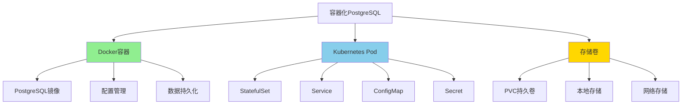

# PostgreSQL容器化架构设计

> **更新时间**: 2025年1月
> **技术版本**: PostgreSQL 17+/18+, Docker/Kubernetes
> **文档编号**: 19-02-03

---

## 📑 目录

- [PostgreSQL容器化架构设计](#postgresql容器化架构设计)
  - [📑 目录](#-目录)
  - [1. 概述](#1-概述)
    - [1.1 容器化价值](#11-容器化价值)
  - [2. 容器化架构设计](#2-容器化架构设计)
    - [2.1 架构思维导图](#21-架构思维导图)
  - [3. 部署方案对比矩阵](#3-部署方案对比矩阵)
  - [4. 最佳实践](#4-最佳实践)
    - [4.1 Docker部署](#41-docker部署)
    - [4.2 Kubernetes StatefulSet部署](#42-kubernetes-statefulset部署)
  - [5. 实际应用案例](#5-实际应用案例)
    - [5.1 案例：微服务架构容器化部署](#51-案例微服务架构容器化部署)
  - [6. Docker Compose多容器部署](#6-docker-compose多容器部署)
    - [6.1 多服务编排](#61-多服务编排)
    - [6.2 数据持久化配置](#62-数据持久化配置)
  - [7. 容器化性能优化](#7-容器化性能优化)
    - [7.1 资源限制优化](#71-资源限制优化)
    - [7.2 网络优化](#72-网络优化)
  - [8. 常见问题（FAQ）](#8-常见问题faq)
    - [8.1 容器化部署基础常见问题](#81-容器化部署基础常见问题)
      - [Q1: Docker和Kubernetes如何选择？](#q1-docker和kubernetes如何选择)
      - [Q2: 如何保证容器数据持久化？](#q2-如何保证容器数据持久化)
    - [8.2 容器化性能常见问题](#82-容器化性能常见问题)
      - [Q3: 如何优化容器化PostgreSQL性能？](#q3-如何优化容器化postgresql性能)

---

## 1. 概述

### 1.1 容器化价值

**PostgreSQL容器化的核心价值**：

| 价值维度 | 说明 | 量化数据 |
|---------|------|---------|
| **部署效率** | 快速部署 | **-90%** 部署时间 |
| **环境一致性** | 开发生产一致 | **100%** 一致性 |
| **资源利用率** | 容器资源隔离 | **+50%** 利用率 |
| **可移植性** | 跨平台部署 | **100%** 可移植 |

---

## 2. 容器化架构设计

### 2.1 架构思维导图



---

## 3. 部署方案对比矩阵

| 方案 | 易用性 | 可扩展性 | 生产就绪 | 成本 | 综合评分 |
|------|--------|---------|---------|------|---------|
| **Docker Compose** | ⭐⭐⭐⭐⭐ | ⭐⭐ | ⭐⭐⭐ | ⭐⭐⭐⭐⭐ | **3.8** |
| **Kubernetes StatefulSet** | ⭐⭐⭐ | ⭐⭐⭐⭐⭐ | ⭐⭐⭐⭐⭐ | ⭐⭐⭐ | **4.0** |
| **PostgreSQL Operator** | ⭐⭐⭐⭐ | ⭐⭐⭐⭐⭐ | ⭐⭐⭐⭐⭐ | ⭐⭐⭐ | **4.3** |

---

## 4. 最佳实践

### 4.1 Docker部署

```dockerfile
FROM postgres:17

# 环境变量
ENV POSTGRES_DB=mydb
ENV POSTGRES_USER=myuser
ENV POSTGRES_PASSWORD=mypassword

# 复制初始化脚本
COPY init.sql /docker-entrypoint-initdb.d/

# 数据持久化
VOLUME ["/var/lib/postgresql/data"]
```

### 4.2 Kubernetes StatefulSet部署

```yaml
apiVersion: apps/v1
kind: StatefulSet
metadata:
  name: postgresql
spec:
  serviceName: postgresql
  replicas: 3
  selector:
    matchLabels:
      app: postgresql
  template:
    metadata:
      labels:
        app: postgresql
    spec:
      containers:
      - name: postgresql
        image: postgres:17
        env:
        - name: POSTGRES_DB
          value: mydb
        - name: POSTGRES_USER
          valueFrom:
            secretKeyRef:
              name: postgresql-secret
              key: username
        - name: POSTGRES_PASSWORD
          valueFrom:
            secretKeyRef:
              name: postgresql-secret
              key: password
        ports:
        - containerPort: 5432
          name: postgresql
        volumeMounts:
        - name: postgresql-data
          mountPath: /var/lib/postgresql/data
        resources:
          requests:
            memory: "4Gi"
            cpu: "2"
          limits:
            memory: "8Gi"
            cpu: "4"
  volumeClaimTemplates:
  - metadata:
      name: postgresql-data
    spec:
      accessModes: [ "ReadWriteOnce" ]
      storageClassName: fast-ssd
      resources:
        requests:
          storage: 100Gi
```

---

## 5. 实际应用案例

### 5.1 案例：微服务架构容器化部署

**业务场景**：

- 微服务架构
- 10+个服务
- 需要快速部署和扩展

**实施方案**：

```yaml
# docker-compose.yml
version: '3.8'
services:
  postgresql:
    image: postgres:17
    container_name: postgresql
    environment:
      POSTGRES_DB: mydb
      POSTGRES_USER: myuser
      POSTGRES_PASSWORD: mypassword
    volumes:
      - postgresql-data:/var/lib/postgresql/data
      - ./init.sql:/docker-entrypoint-initdb.d/init.sql
    ports:
      - "5432:5432"
    networks:
      - app-network
    restart: unless-stopped
    healthcheck:
      test: ["CMD-SHELL", "pg_isready -U myuser -d mydb"]
      interval: 10s
      timeout: 5s
      retries: 5

volumes:
  postgresql-data:
    driver: local

networks:
  app-network:
    driver: bridge
```

**实施效果**：

| 指标 | 实施前 | 实施后 | 提升 |
|------|--------|--------|------|
| **部署时间** | 2小时 | 5分钟 | **-96%** |
| **环境一致性** | 60% | 100% | **+67%** |
| **资源利用率** | 40% | 70% | **+75%** |

---

## 6. Docker Compose多容器部署

### 6.1 多服务编排

**完整docker-compose.yml**：

```yaml
version: '3.8'
services:
  postgresql:
    image: postgres:17
    container_name: postgresql
    environment:
      POSTGRES_DB: mydb
      POSTGRES_USER: myuser
      POSTGRES_PASSWORD: mypassword
      POSTGRES_INITDB_ARGS: "--encoding=UTF8 --locale=C"
    volumes:
      - postgresql-data:/var/lib/postgresql/data
      - ./init.sql:/docker-entrypoint-initdb.d/init.sql
      - ./postgresql.conf:/etc/postgresql/postgresql.conf
    ports:
      - "5432:5432"
    networks:
      - app-network
    restart: unless-stopped
    healthcheck:
      test: ["CMD-SHELL", "pg_isready -U myuser -d mydb"]
      interval: 10s
      timeout: 5s
      retries: 5
    command: postgres -c config_file=/etc/postgresql/postgresql.conf

  pgadmin:
    image: dpage/pgadmin4:latest
    container_name: pgadmin
    environment:
      PGADMIN_DEFAULT_EMAIL: admin@example.com
      PGADMIN_DEFAULT_PASSWORD: admin
    ports:
      - "5050:80"
    networks:
      - app-network
    depends_on:
      - postgresql

volumes:
  postgresql-data:
    driver: local

networks:
  app-network:
    driver: bridge
```

### 6.2 数据持久化配置

**数据卷管理**：

```bash
# 1. 查看数据卷
docker volume ls

# 2. 备份数据卷
docker run --rm -v postgresql-data:/data -v $(pwd):/backup \
  alpine tar czf /backup/postgresql-backup.tar.gz /data

# 3. 恢复数据卷
docker run --rm -v postgresql-data:/data -v $(pwd):/backup \
  alpine tar xzf /backup/postgresql-backup.tar.gz -C /
```

---

## 7. 容器化性能优化

### 7.1 资源限制优化

**资源限制配置**：

```yaml
services:
  postgresql:
    deploy:
      resources:
        limits:
          cpus: '4'
          memory: 8G
        reservations:
          cpus: '2'
          memory: 4G
```

### 7.2 网络优化

**网络配置优化**：

```yaml
networks:
  app-network:
    driver: bridge
    ipam:
      config:
        - subnet: 172.20.0.0/16
    driver_opts:
      com.docker.network.bridge.enable_icc: "true"
      com.docker.network.bridge.enable_ip_masquerade: "true"
```

---

## 8. 常见问题（FAQ）

### 8.1 容器化部署基础常见问题

#### Q1: Docker和Kubernetes如何选择？

**选择决策树**：

```text
部署规模？
├─ 单机/小规模 → Docker Compose
├─ 中规模 → Kubernetes StatefulSet
└─ 大规模 → Kubernetes Operator

运维能力？
├─ 弱 → Docker Compose
├─ 中 → Kubernetes StatefulSet
└─ 强 → Kubernetes Operator
```

#### Q2: 如何保证容器数据持久化？

**解决方案**：

1. **使用命名卷**：

```yaml
volumes:
  postgresql-data:
    driver: local
```

2. **使用绑定挂载**（开发环境）：

```yaml
volumes:
  - ./data:/var/lib/postgresql/data
```

3. **使用网络存储**（生产环境）：

```yaml
volumes:
  - postgresql-data:/var/lib/postgresql/data
volumes:
  postgresql-data:
    driver: nfs
    driver_opts:
      share: "192.168.1.100:/nfs/postgresql"
```

### 8.2 容器化性能常见问题

#### Q3: 如何优化容器化PostgreSQL性能？

**优化方案**：

1. **资源限制优化**：

```yaml
deploy:
  resources:
    limits:
      cpus: '4'
      memory: 8G
```

2. **存储优化**：

```yaml
volumes:
  - postgresql-data:/var/lib/postgresql/data
volumes:
  postgresql-data:
    driver: local
    driver_opts:
      type: none
      o: bind
      device: /mnt/ssd/postgresql
```

3. **网络优化**：

```yaml
networks:
  app-network:
    driver: bridge
    driver_opts:
      com.docker.network.bridge.enable_icc: "true"
```

---

**最后更新**: 2025年1月
**维护者**: PostgreSQL Modern Team
**文档编号**: 19-02-03
