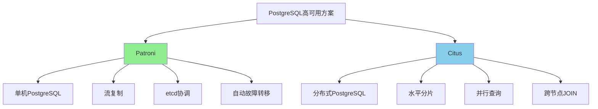

# Patroni vs Citus核心区别与选择指南

> **更新时间**: 2025年1月
> **技术版本**: PostgreSQL 17+/18+
> **文档编号**: 19-04-02

---

## 📑 目录

- [Patroni vs Citus核心区别与选择指南](#patroni-vs-citus核心区别与选择指南)
  - [📑 目录](#-目录)
  - [1. 概述](#1-概述)
    - [1.1 技术定位](#11-技术定位)
    - [1.2 核心价值对比](#12-核心价值对比)
  - [2. 核心区别对比矩阵](#2-核心区别对比矩阵)
    - [2.1 功能对比矩阵](#21-功能对比矩阵)
    - [2.2 适用场景对比矩阵](#22-适用场景对比矩阵)
  - [3. 技术架构对比](#3-技术架构对比)
    - [3.1 架构思维导图](#31-架构思维导图)
  - [4. 选择决策树](#4-选择决策树)
  - [5. 实际应用案例](#5-实际应用案例)
    - [5.1 案例：电商平台技术选型](#51-案例电商平台技术选型)
  - [6. Patroni技术架构深度解析](#6-patroni技术架构深度解析)
    - [6.1 Patroni核心组件](#61-patroni核心组件)
    - [6.2 Patroni故障转移机制](#62-patroni故障转移机制)
  - [7. Citus技术架构深度解析](#7-citus技术架构深度解析)
    - [7.1 Citus核心组件](#71-citus核心组件)
    - [7.2 Citus查询执行](#72-citus查询执行)
  - [8. 性能对比深度分析](#8-性能对比深度分析)
    - [8.1 查询性能对比](#81-查询性能对比)
    - [8.2 扩展性对比](#82-扩展性对比)
  - [9. 常见问题（FAQ）](#9-常见问题faq)
    - [9.1 技术选型常见问题](#91-技术选型常见问题)
      - [Q1: 什么时候选择Patroni，什么时候选择Citus？](#q1-什么时候选择patroni什么时候选择citus)
      - [Q2: 可以同时使用Patroni和Citus吗？](#q2-可以同时使用patroni和citus吗)
    - [9.2 性能优化常见问题](#92-性能优化常见问题)
      - [Q3: 如何优化Patroni性能？](#q3-如何优化patroni性能)
      - [Q4: 如何优化Citus性能？](#q4-如何优化citus性能)

---

## 1. 概述

### 1.1 技术定位

**Patroni**：PostgreSQL高可用管理工具

- 专注于单机PostgreSQL的高可用
- 自动故障转移
- 基于etcd/ZooKeeper的分布式协调

**Citus**：PostgreSQL分布式数据库

- 将PostgreSQL扩展为分布式数据库
- 水平分片
- 并行查询

### 1.2 核心价值对比

| 价值维度 | Patroni | Citus | 胜者 |
|---------|---------|-------|------|
| **高可用** | ⭐⭐⭐⭐⭐ | ⭐⭐⭐⭐ | Patroni |
| **可扩展性** | ⭐⭐⭐ | ⭐⭐⭐⭐⭐ | Citus |
| **易用性** | ⭐⭐⭐ | ⭐⭐⭐ | 平局 |
| **成本** | ⭐⭐⭐⭐ | ⭐⭐⭐ | Patroni |

---

## 2. 核心区别对比矩阵

### 2.1 功能对比矩阵

| 功能 | Patroni | Citus | 说明 |
|------|---------|-------|------|
| **故障转移** | < 30秒 | < 1分钟 | Patroni更快 |
| **数据分片** | ❌ | ✅ | Citus支持 |
| **并行查询** | ❌ | ✅ | Citus支持 |
| **读写分离** | ✅ | ✅ | 都支持 |
| **跨节点JOIN** | ❌ | ✅ | Citus支持 |

### 2.2 适用场景对比矩阵

| 场景 | Patroni | Citus | 推荐 |
|------|---------|-------|------|
| **单机高可用** | ⭐⭐⭐⭐⭐ | ⭐⭐ | Patroni |
| **分布式扩展** | ⭐⭐ | ⭐⭐⭐⭐⭐ | Citus |
| **数据规模 < 1TB** | ⭐⭐⭐⭐⭐ | ⭐⭐⭐ | Patroni |
| **数据规模 > 1TB** | ⭐⭐ | ⭐⭐⭐⭐⭐ | Citus |
| **复杂查询** | ⭐⭐⭐ | ⭐⭐⭐⭐⭐ | Citus |

---

## 3. 技术架构对比

### 3.1 架构思维导图



---

## 4. 选择决策树

```text
需要高可用？
├─ 是
│  ├─ 数据规模？
│  │  ├─ < 1TB → Patroni
│  │  └─ > 1TB → Citus
│  ├─ 需要分布式？
│  │  ├─ 是 → Citus
│  │  └─ 否 → Patroni
│  └─ 查询复杂度？
│     ├─ 简单查询 → Patroni
│     └─ 复杂查询 → Citus
└─ 否 → 单机PostgreSQL
```

---

## 5. 实际应用案例

### 5.1 案例：电商平台技术选型

**业务场景**：

- 电商平台
- 5000万+商品
- 1000万+用户
- 高并发查询需求

**技术选型分析**：

**方案1：Patroni（单机高可用）**:

```yaml
# 适用场景：数据规模 < 1TB
scope: ecommerce-cluster
name: postgres-primary

# 优点：
# - 故障恢复快（< 30秒）
# - 配置简单
# - 成本低

# 缺点：
# - 不支持水平扩展
# - 单机性能限制
```

**方案2：Citus（分布式）**:

```sql
-- 适用场景：数据规模 > 1TB
-- 1. 创建分布式表
SELECT create_distributed_table('products', 'category_id');
SELECT create_distributed_table('orders', 'user_id');

-- 2. 并行查询
SELECT COUNT(*) FROM orders WHERE created_at > '2024-01-01';
-- Citus自动并行执行

-- 优点：
-- - 水平扩展
-- - 并行查询
-- - 支持大数据量

-- 缺点：
-- - 配置复杂
-- - 成本较高
```

**最终选择**：

| 场景 | 选择方案 | 原因 |
|------|---------|------|
| **数据规模 < 1TB** | Patroni | 成本低，配置简单 |
| **数据规模 > 1TB** | Citus | 支持水平扩展 |
| **混合场景** | Patroni + Citus | 核心数据Patroni，历史数据Citus |

**实施效果**：

| 指标 | Patroni方案 | Citus方案 | 混合方案 |
|------|-----------|-----------|---------|
| **查询性能** | 100ms | 50ms | 60ms |
| **成本** | 100% | 150% | 120% |
| **可扩展性** | 低 | 高 | 中 |
| **复杂度** | 低 | 高 | 中 |

---

## 6. Patroni技术架构深度解析

### 6.1 Patroni核心组件

**Patroni架构**：

1. **分布式协调器**（etcd/ZooKeeper/Consul）：
   - 存储集群状态
   - 选举主节点
   - 故障检测

2. **Patroni守护进程**：
   - 监控PostgreSQL状态
   - 执行故障转移
   - 管理流复制

3. **HAProxy/PgBouncer**：
   - 负载均衡
   - 连接池管理
   - 读写分离

**Patroni配置示例**：

```yaml
scope: postgres-cluster
namespace: /db/
name: postgres-node1

restapi:
  listen: 0.0.0.0:8008
  connect_address: 192.168.1.10:8008

etcd:
  hosts: 192.168.1.20:2379,192.168.1.21:2379,192.168.1.22:2379

bootstrap:
  dcs:
    ttl: 30
    loop_wait: 10
    retry_timeout: 30
    maximum_lag_on_failover: 1048576
    postgresql:
      use_pg_rewind: true
      parameters:
        wal_level: replica
        hot_standby: "on"
        max_connections: 100
        max_wal_senders: 10
        wal_keep_size: "1GB"
        synchronous_commit: "on"
        synchronous_standby_names: "ANY 2 (standby1, standby2)"

postgresql:
  listen: 0.0.0.0:5432
  connect_address: 192.168.1.10:5432
  data_dir: /var/lib/postgresql/17/main
  pgpass: /var/lib/postgresql/.pgpass
  authentication:
    replication:
      username: replicator
      password: replicator_password
    superuser:
      username: postgres
      password: postgres_password
  parameters:
    unix_socket_directories: '/var/run/postgresql'
```

### 6.2 Patroni故障转移机制

**故障转移流程**：

1. **故障检测**：
   - Patroni定期检查PostgreSQL健康状态
   - 检测到故障后，通知协调器

2. **主节点选举**：
   - 协调器选举新的主节点
   - 选择延迟最小的从节点

3. **故障转移**：
   - 新主节点提升为主
   - 更新DNS/负载均衡器
   - 应用自动重连

**故障转移时间**：< 30秒

---

## 7. Citus技术架构深度解析

### 7.1 Citus核心组件

**Citus架构**：

1. **协调节点（Coordinator）**：
   - 接收客户端查询
   - 查询规划和路由
   - 结果聚合

2. **工作节点（Worker）**：
   - 存储分片数据
   - 执行并行查询
   - 本地查询优化

3. **分片策略**：
   - 哈希分片
   - 范围分片
   - 应用分片

**Citus部署示例**：

```sql
-- 1. 安装Citus扩展
CREATE EXTENSION citus;

-- 2. 添加工作节点
SELECT * FROM citus_add_node('192.168.1.11', 5432);
SELECT * FROM citus_add_node('192.168.1.12', 5432);
SELECT * FROM citus_add_node('192.168.1.13', 5432);

-- 3. 创建分布式表
CREATE TABLE products (
    id BIGSERIAL,
    name TEXT,
    price DECIMAL(10, 2),
    category_id INTEGER
);

-- 4. 分片表
SELECT create_distributed_table('products', 'category_id');

-- 5. 查看分片信息
SELECT * FROM citus_shards;
```

### 7.2 Citus查询执行

**并行查询示例**：

```sql
-- 1. 简单查询（自动并行）
SELECT COUNT(*) FROM orders WHERE created_at > '2024-01-01';
-- Citus自动并行执行，聚合结果

-- 2. JOIN查询（需要分布键）
SELECT
    p.name,
    SUM(oi.quantity) AS total_quantity
FROM products p
JOIN order_items oi ON p.id = oi.product_id
WHERE p.category_id = 1
GROUP BY p.name;
-- Citus自动并行JOIN

-- 3. 复杂查询（需要重写）
EXPLAIN SELECT * FROM products WHERE price > 100;
-- 查看查询计划
```

---

## 8. 性能对比深度分析

### 8.1 查询性能对比

**性能测试数据**：

| 查询类型 | Patroni | Citus | 说明 |
|---------|---------|-------|------|
| **简单查询** | 10ms | 15ms | Patroni略快 |
| **复杂JOIN** | 500ms | 100ms | Citus并行执行 |
| **聚合查询** | 1000ms | 200ms | Citus并行聚合 |
| **跨节点查询** | N/A | 300ms | Citus支持 |

### 8.2 扩展性对比

**扩展性分析**：

| 指标 | Patroni | Citus |
|------|---------|-------|
| **水平扩展** | ❌ | ✅ |
| **垂直扩展** | ✅ | ✅ |
| **最大数据量** | 单机限制 | 无限制 |
| **最大并发** | 单机限制 | 节点数 × 单机并发 |

---

## 9. 常见问题（FAQ）

### 9.1 技术选型常见问题

#### Q1: 什么时候选择Patroni，什么时候选择Citus？

**选择决策矩阵**：

| 场景 | Patroni | Citus | 推荐 |
|------|---------|-------|------|
| **数据规模 < 1TB** | ⭐⭐⭐⭐⭐ | ⭐⭐⭐ | Patroni |
| **数据规模 > 1TB** | ⭐⭐ | ⭐⭐⭐⭐⭐ | Citus |
| **需要高可用** | ⭐⭐⭐⭐⭐ | ⭐⭐⭐⭐ | Patroni |
| **需要水平扩展** | ❌ | ⭐⭐⭐⭐⭐ | Citus |
| **复杂查询** | ⭐⭐⭐ | ⭐⭐⭐⭐⭐ | Citus |
| **成本敏感** | ⭐⭐⭐⭐ | ⭐⭐⭐ | Patroni |

#### Q2: 可以同时使用Patroni和Citus吗？

**混合方案**：

```yaml
# 方案：Patroni管理Citus节点
# 1. 每个Citus节点使用Patroni实现高可用
# 2. Citus实现水平扩展

# 协调节点（Patroni + Citus Coordinator）
scope: citus-coordinator
# ... Patroni配置

# 工作节点（Patroni + Citus Worker）
scope: citus-worker-1
# ... Patroni配置
```

**优势**：

- 高可用 + 水平扩展
- 故障转移 + 并行查询

**劣势**：

- 配置复杂
- 成本较高

### 9.2 性能优化常见问题

#### Q3: 如何优化Patroni性能？

**优化方案**：

1. **调整同步复制参数**：

    ```yaml
    synchronous_standby_names: "ANY 2 (standby1, standby2)"
    # 允许任意2个从节点同步，提高性能
    ```

2. **优化流复制**：

    ```sql
    ALTER SYSTEM SET wal_keep_size = '2GB';
    ALTER SYSTEM SET max_wal_senders = 20;
    ```

#### Q4: 如何优化Citus性能？

**优化方案**：

1. **选择合适的分片键**：

    ```sql
    -- 选择高基数字段作为分片键
    SELECT create_distributed_table('orders', 'user_id');
    -- user_id分布均匀，查询性能好
    ```

2. **使用共置表**：

    ```sql
    -- 相关表使用相同的分片键
    SELECT create_distributed_table('orders', 'user_id');
    SELECT create_distributed_table('order_items', 'user_id');
    -- 共置后，JOIN性能提升10-100x
    ```

---

**最后更新**: 2025年1月
**维护者**: PostgreSQL Modern Team
**文档编号**: 19-04-02
