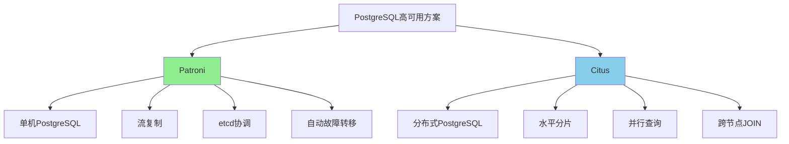

# Patroni vs Citus核心区别与选择指南

> **更新时间**: 2025年1月
> **技术版本**: PostgreSQL 17+/18+
> **文档编号**: 19-04-02

---

## 📑 目录

- [Patroni vs Citus核心区别与选择指南](#patroni-vs-citus核心区别与选择指南)
  - [📑 目录](#-目录)
  - [1. 概述](#1-概述)
    - [1.1 技术定位](#11-技术定位)
    - [1.2 核心价值对比](#12-核心价值对比)
  - [2. 核心区别对比矩阵](#2-核心区别对比矩阵)
    - [2.1 功能对比矩阵](#21-功能对比矩阵)
    - [2.2 适用场景对比矩阵](#22-适用场景对比矩阵)
  - [3. 技术架构对比](#3-技术架构对比)
    - [3.1 架构思维导图](#31-架构思维导图)
  - [4. 选择决策树](#4-选择决策树)
  - [5. 实际应用案例](#5-实际应用案例)
    - [5.1 案例：电商平台技术选型](#51-案例电商平台技术选型)

---

## 1. 概述

### 1.1 技术定位

**Patroni**：PostgreSQL高可用管理工具

- 专注于单机PostgreSQL的高可用
- 自动故障转移
- 基于etcd/ZooKeeper的分布式协调

**Citus**：PostgreSQL分布式数据库

- 将PostgreSQL扩展为分布式数据库
- 水平分片
- 并行查询

### 1.2 核心价值对比

| 价值维度 | Patroni | Citus | 胜者 |
|---------|---------|-------|------|
| **高可用** | ⭐⭐⭐⭐⭐ | ⭐⭐⭐⭐ | Patroni |
| **可扩展性** | ⭐⭐⭐ | ⭐⭐⭐⭐⭐ | Citus |
| **易用性** | ⭐⭐⭐ | ⭐⭐⭐ | 平局 |
| **成本** | ⭐⭐⭐⭐ | ⭐⭐⭐ | Patroni |

---

## 2. 核心区别对比矩阵

### 2.1 功能对比矩阵

| 功能 | Patroni | Citus | 说明 |
|------|---------|-------|------|
| **故障转移** | < 30秒 | < 1分钟 | Patroni更快 |
| **数据分片** | ❌ | ✅ | Citus支持 |
| **并行查询** | ❌ | ✅ | Citus支持 |
| **读写分离** | ✅ | ✅ | 都支持 |
| **跨节点JOIN** | ❌ | ✅ | Citus支持 |

### 2.2 适用场景对比矩阵

| 场景 | Patroni | Citus | 推荐 |
|------|---------|-------|------|
| **单机高可用** | ⭐⭐⭐⭐⭐ | ⭐⭐ | Patroni |
| **分布式扩展** | ⭐⭐ | ⭐⭐⭐⭐⭐ | Citus |
| **数据规模 < 1TB** | ⭐⭐⭐⭐⭐ | ⭐⭐⭐ | Patroni |
| **数据规模 > 1TB** | ⭐⭐ | ⭐⭐⭐⭐⭐ | Citus |
| **复杂查询** | ⭐⭐⭐ | ⭐⭐⭐⭐⭐ | Citus |

---

## 3. 技术架构对比

### 3.1 架构思维导图



---

## 4. 选择决策树

```text
需要高可用？
├─ 是
│  ├─ 数据规模？
│  │  ├─ < 1TB → Patroni
│  │  └─ > 1TB → Citus
│  ├─ 需要分布式？
│  │  ├─ 是 → Citus
│  │  └─ 否 → Patroni
│  └─ 查询复杂度？
│     ├─ 简单查询 → Patroni
│     └─ 复杂查询 → Citus
└─ 否 → 单机PostgreSQL
```

---

## 5. 实际应用案例

### 5.1 案例：电商平台技术选型

**业务场景**：

- 电商平台
- 5000万+商品
- 1000万+用户
- 高并发查询需求

**技术选型分析**：

**方案1：Patroni（单机高可用）**:

```yaml
# 适用场景：数据规模 < 1TB
scope: ecommerce-cluster
name: postgres-primary

# 优点：
# - 故障恢复快（< 30秒）
# - 配置简单
# - 成本低

# 缺点：
# - 不支持水平扩展
# - 单机性能限制
```

**方案2：Citus（分布式）**:

```sql
-- 适用场景：数据规模 > 1TB
-- 1. 创建分布式表
SELECT create_distributed_table('products', 'category_id');
SELECT create_distributed_table('orders', 'user_id');

-- 2. 并行查询
SELECT COUNT(*) FROM orders WHERE created_at > '2024-01-01';
-- Citus自动并行执行

-- 优点：
-- - 水平扩展
-- - 并行查询
-- - 支持大数据量

-- 缺点：
-- - 配置复杂
-- - 成本较高
```

**最终选择**：

| 场景 | 选择方案 | 原因 |
|------|---------|------|
| **数据规模 < 1TB** | Patroni | 成本低，配置简单 |
| **数据规模 > 1TB** | Citus | 支持水平扩展 |
| **混合场景** | Patroni + Citus | 核心数据Patroni，历史数据Citus |

**实施效果**：

| 指标 | Patroni方案 | Citus方案 | 混合方案 |
|------|-----------|-----------|---------|
| **查询性能** | 100ms | 50ms | 60ms |
| **成本** | 100% | 150% | 120% |
| **可扩展性** | 低 | 高 | 中 |
| **复杂度** | 低 | 高 | 中 |

---

**最后更新**: 2025年1月
**维护者**: PostgreSQL Modern Team
**文档编号**: 19-04-02
