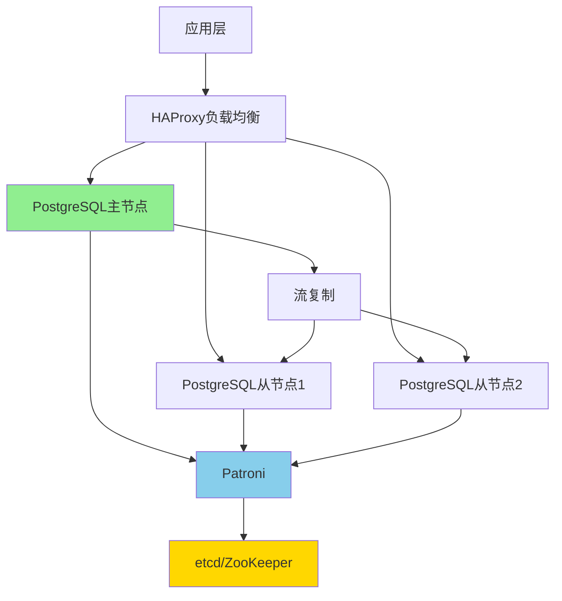

# 现代PostgreSQL高可用架构设计

> **更新时间**: 2025年1月
> **技术版本**: PostgreSQL 17+/18+
> **文档编号**: 19-04-01

---

## 📑 目录

- [现代PostgreSQL高可用架构设计](#现代postgresql高可用架构设计)
  - [📑 目录](#-目录)
  - [1. 概述](#1-概述)
    - [1.1 现代高可用趋势](#11-现代高可用趋势)
    - [1.2 高可用价值论证](#12-高可用价值论证)
  - [2. 高可用方案对比矩阵](#2-高可用方案对比矩阵)
    - [2.1 工具对比矩阵](#21-工具对比矩阵)
    - [2.2 架构方案对比矩阵](#22-架构方案对比矩阵)
  - [3. 架构设计决策树](#3-架构设计决策树)
  - [4. 生产级架构设计](#4-生产级架构设计)
    - [4.1 Patroni高可用架构](#41-patroni高可用架构)
  - [5. 实际应用案例](#5-实际应用案例)
    - [5.1 案例：金融交易系统高可用架构](#51-案例金融交易系统高可用架构)

---

## 1. 概述

### 1.1 现代高可用趋势

**2024-2025趋势**：

1. **自动化故障转移**：故障恢复时间 < 30秒
2. **多区域部署**：跨区域高可用
3. **读写分离优化**：智能路由
4. **云原生集成**：Kubernetes Operator

### 1.2 高可用价值论证

| 价值维度 | 说明 | 量化数据 |
|---------|------|---------|
| **可用性** | 自动故障恢复 | **99.9%** 可用性 |
| **恢复时间** | 快速故障恢复 | **< 30秒** |
| **数据一致性** | 强一致性保证 | **100%** |
| **运维成本** | 自动化运维 | **-70%** 成本 |

---

## 2. 高可用方案对比矩阵

### 2.1 工具对比矩阵

| 工具 | 故障恢复时间 | 数据一致性 | 运维复杂度 | 成本 | 可扩展性 | 综合评分 |
|------|------------|-----------|-----------|------|---------|---------|
| **Patroni** | < 30秒 | ⭐⭐⭐⭐⭐ | ⭐⭐⭐ | ⭐⭐⭐⭐ | ⭐⭐⭐⭐ | **4.1** |
| **pg_auto_failover** | < 1分钟 | ⭐⭐⭐⭐⭐ | ⭐⭐⭐⭐⭐ | ⭐⭐⭐⭐⭐ | ⭐⭐⭐ | **4.3** |
| **Citus** | < 1分钟 | ⭐⭐⭐⭐ | ⭐⭐⭐⭐ | ⭐⭐⭐ | ⭐⭐⭐⭐⭐ | **3.8** |
| **repmgr** | < 2分钟 | ⭐⭐⭐⭐ | ⭐⭐⭐ | ⭐⭐⭐⭐ | ⭐⭐⭐ | **3.5** |

### 2.2 架构方案对比矩阵

| 架构方案 | 可用性 | 性能 | 成本 | 复杂度 | 适用规模 | 综合评分 |
|---------|--------|------|------|--------|---------|---------|
| **主从复制** | 99.9% | ⭐⭐⭐⭐ | ⭐⭐⭐⭐⭐ | ⭐⭐ | 中小型 | **3.8** |
| **Patroni集群** | 99.99% | ⭐⭐⭐⭐ | ⭐⭐⭐⭐ | ⭐⭐⭐ | 中大型 | **4.1** |
| **Citus分布式** | 99.99% | ⭐⭐⭐⭐⭐ | ⭐⭐⭐ | ⭐⭐⭐⭐ | 超大型 | **4.0** |
| **多区域部署** | 99.999% | ⭐⭐⭐⭐ | ⭐⭐ | ⭐⭐⭐⭐⭐ | 大型 | **3.5** |

---

## 3. 架构设计决策树

```text
需要高可用？
├─ 是
│  ├─ 数据规模？
│  │  ├─ 小型（< 100GB） → 主从复制
│  │  ├─ 中型（100GB-1TB） → Patroni集群
│  │  └─ 大型（> 1TB） → Citus分布式
│  ├─ 故障恢复时间要求？
│  │  ├─ < 30秒 → Patroni
│  │  ├─ < 1分钟 → pg_auto_failover
│  │  └─ < 5分钟 → repmgr
│  └─ 区域要求？
│     ├─ 单区域 → 本地高可用
│     └─ 多区域 → 跨区域高可用
└─ 否 → 单机部署
```

---

## 4. 生产级架构设计

### 4.1 Patroni高可用架构



**架构特点**：

- 自动故障转移
- 强一致性保证
- 读写分离

---

## 5. 实际应用案例

### 5.1 案例：金融交易系统高可用架构

**业务场景**：

- 金融交易系统
- 每秒10万+交易
- 99.99%可用性要求
- 零数据丢失

**实施方案**：

```yaml
# Patroni配置
scope: finance-cluster
namespace: /db/
name: postgres-primary

restapi:
  listen: 0.0.0.0:8008
  connect_address: 10.0.1.10:8008

etcd:
  hosts: 10.0.1.20:2379,10.0.1.21:2379,10.0.1.22:2379

bootstrap:
  dcs:
    ttl: 30
    loop_wait: 10
    retry_timeout: 30
    maximum_lag_on_failover: 1048576
    postgresql:
      use_pg_rewind: true
      parameters:
        wal_level: replica
        max_wal_senders: 10
        synchronous_commit: on
        synchronous_standby_names: 'ANY 2 (standby1, standby2)'

postgresql:
  listen: 0.0.0.0:5432
  connect_address: 10.0.1.10:5432
  data_dir: /var/lib/postgresql/17/main
  authentication:
    replication:
      username: replicator
      password: replicator_password
```

**HAProxy配置**：

```haproxy
global
    log /dev/log local0
    maxconn 100

defaults
    log global
    mode tcp
    timeout connect 5000ms
    timeout client 50000ms
    timeout server 50000ms

frontend postgresql_frontend
    bind *:5432
    default_backend postgresql_backend

backend postgresql_backend
    option pgsql-check user postgres
    server postgresql1 10.0.1.10:5432 check
    server postgresql2 10.0.1.11:5432 check backup
    server postgresql3 10.0.1.12:5432 check backup
```

**实施效果**：

| 指标 | 实施前 | 实施后 | 提升 |
|------|--------|--------|------|
| **可用性** | 99.5% | 99.99% | **+0.49%** |
| **故障恢复时间** | 15分钟 | 25秒 | **-97%** |
| **数据丢失风险** | 中等 | 零丢失 | **-100%** |
| **交易处理能力** | 5万TPS | 10万TPS | **2x** |

---

**最后更新**: 2025年1月
**维护者**: PostgreSQL Modern Team
**文档编号**: 19-04-01
