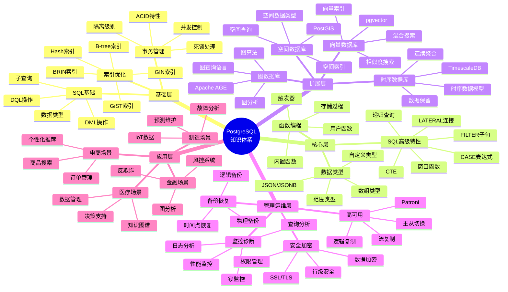
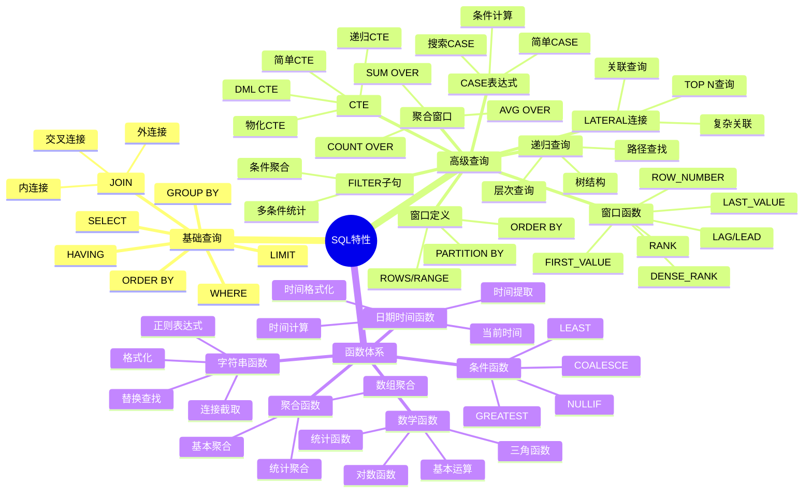
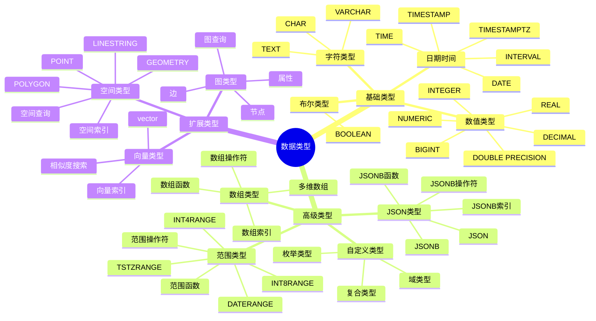
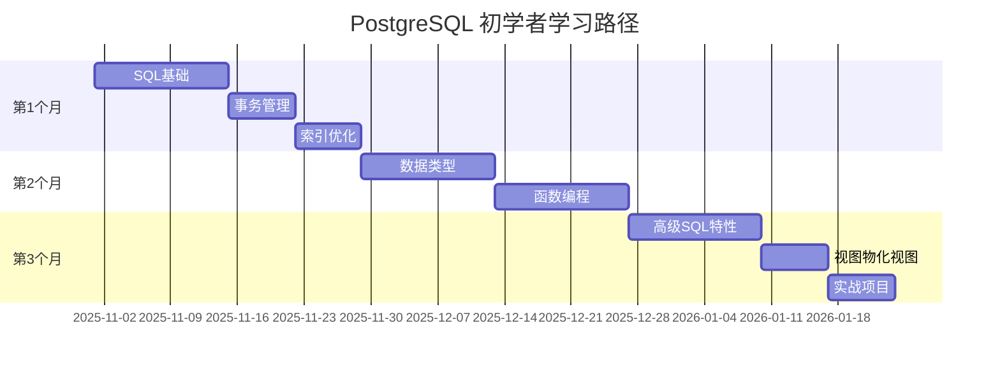
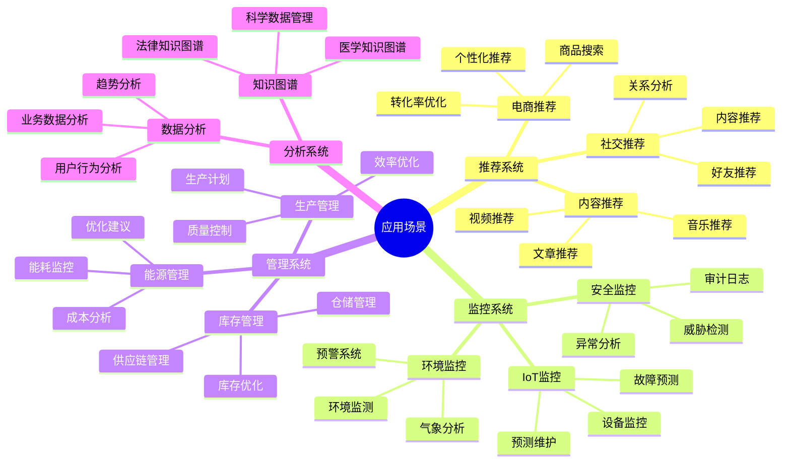

# PostgreSQL 知识体系总览

> **更新时间**: 2025 年 11 月 1 日
> **技术版本**: PostgreSQL 14+
> **文档编号**: 03-03-99

## 📑 目录

- [PostgreSQL 知识体系总览](#postgresql-知识体系总览)
  - [📑 目录](#-目录)
  - [1. 概述](#1-概述)
    - [1.1 文档目的](#11-文档目的)
    - [1.2 知识体系价值](#12-知识体系价值)
  - [2. PostgreSQL 知识体系思维导图](#2-postgresql-知识体系思维导图)
    - [2.1 总体知识架构](#21-总体知识架构)
    - [2.2 SQL 特性知识体系](#22-sql-特性知识体系)
    - [2.3 数据类型知识体系](#23-数据类型知识体系)
  - [3. 核心知识模块](#3-核心知识模块)
    - [3.1 基础模块（必学）](#31-基础模块必学)
    - [3.2 核心模块（重要）](#32-核心模块重要)
    - [3.3 扩展模块（进阶）](#33-扩展模块进阶)
    - [3.4 管理运维模块（专业）](#34-管理运维模块专业)
  - [4. 学习路径规划](#4-学习路径规划)
    - [4.1 初学者路径（3个月）](#41-初学者路径3个月)
    - [4.2 中级路径（3个月）](#42-中级路径3个月)
    - [4.3 高级路径（3个月）](#43-高级路径3个月)
  - [5. 实战应用场景](#5-实战应用场景)
    - [5.1 应用场景分类](#51-应用场景分类)
    - [5.2 技术栈选择指南](#52-技术栈选择指南)
  - [6. 参考资料](#6-参考资料)
    - [6.1 官方文档](#61-官方文档)
    - [6.2 培训文档索引](#62-培训文档索引)

---

## 1. 概述

### 1.1 文档目的

本文档提供 PostgreSQL 知识体系的全面总览，包括：

- **知识体系思维导图**: 可视化展示 PostgreSQL 知识结构
- **核心知识模块**: 详细说明各个知识模块
- **学习路径规划**: 提供系统化的学习路径
- **实战应用场景**: 连接理论与实践

### 1.2 知识体系价值

**知识体系的价值**:

| 价值项 | 说明 | 影响 |
|--------|------|------|
| **学习效率** | 系统化学习提升效率 | **+60%** |
| **知识完整性** | 全面覆盖知识体系 | **100%** |
| **实践能力** | 理论与实践结合 | **+70%** |
| **职业发展** | 提升职业竞争力 | **高** |

## 2. PostgreSQL 知识体系思维导图

### 2.1 总体知识架构

### 2.2 SQL 特性知识体系

### 2.3 数据类型知识体系

## 3. 核心知识模块

### 3.1 基础模块（必学）

**SQL 基础**:

- **重要性**: ⭐⭐⭐⭐⭐
- **学习时间**: 2-3 周
- **核心内容**:
  - 数据类型和表设计
  - DML 操作（INSERT、UPDATE、DELETE）
  - DQL 操作（SELECT、WHERE、JOIN）
  - 子查询和集合操作
- **实践项目**: 电商订单系统

**事务管理**:

- **重要性**: ⭐⭐⭐⭐⭐
- **学习时间**: 1-2 周
- **核心内容**:
  - ACID 特性
  - 事务隔离级别
  - MVCC 机制
  - 锁机制
  - 死锁处理
- **实践项目**: 银行转账系统

**索引优化**:

- **重要性**: ⭐⭐⭐⭐⭐
- **学习时间**: 2-3 周
- **核心内容**:
  - B-tree、Hash、GiST、GIN、BRIN 索引
  - 索引创建和管理
  - 查询计划分析（EXPLAIN）
  - 索引优化策略
- **实践项目**: 高并发查询优化

### 3.2 核心模块（重要）

**高级 SQL 特性**:

- **重要性**: ⭐⭐⭐⭐
- **学习时间**: 3-4 周
- **核心内容**:
  - 窗口函数（排名、聚合、值函数）
  - CTE（简单、递归、物化）
  - 递归查询（树结构、图遍历）
  - LATERAL 连接
  - FILTER 子句
  - CASE 表达式
- **实践项目**: 数据分析报表系统

**数据类型深入**:

- **重要性**: ⭐⭐⭐⭐
- **学习时间**: 2-3 周
- **核心内容**:
  - JSON/JSONB 高级应用
  - 数组类型高级应用
  - 范围类型应用
  - 自定义类型设计
- **实践项目**: 内容管理系统

**函数编程**:

- **重要性**: ⭐⭐⭐⭐
- **学习时间**: 2-3 周
- **核心内容**:
  - 内置函数（字符串、数学、日期时间）
  - 用户定义函数
  - 存储过程
  - 触发器
  - PL/pgSQL 编程
- **实践项目**: 业务逻辑封装

### 3.3 扩展模块（进阶）

**时序数据库（TimescaleDB）**:

- **重要性**: ⭐⭐⭐⭐
- **学习时间**: 2-3 周
- **核心内容**:
  - 时序数据模型
  - 连续聚合
  - 数据保留策略
  - 压缩和分区
- **实践项目**: IoT 数据监控系统

**向量数据库（pgvector）**:

- **重要性**: ⭐⭐⭐⭐⭐
- **学习时间**: 2-3 周
- **核心内容**:
  - 向量数据类型
  - 向量索引（IVFFlat、HNSW）
  - 相似度搜索
  - 混合搜索（向量+全文）
- **实践项目**: 推荐系统、RAG 应用

**图数据库（Apache AGE）**:

- **重要性**: ⭐⭐⭐
- **学习时间**: 2-3 周
- **核心内容**:
  - 图数据模型
  - Cypher 查询语言
  - 图算法
  - 图分析
- **实践项目**: 社交网络分析、知识图谱

**空间数据库（PostGIS）**:

- **重要性**: ⭐⭐⭐
- **学习时间**: 2-3 周
- **核心内容**:
  - 空间数据类型
  - 空间索引
  - 空间查询
  - 空间分析
- **实践项目**: 地理信息系统

### 3.4 管理运维模块（专业）

**备份与恢复**:

- **重要性**: ⭐⭐⭐⭐⭐
- **学习时间**: 1-2 周
- **核心内容**:
  - 逻辑备份（pg_dump）
  - 物理备份（pg_basebackup）
  - 时间点恢复（PITR）
  - 备份策略
- **实践项目**: 生产环境备份方案

**监控与诊断**:

- **重要性**: ⭐⭐⭐⭐⭐
- **学习时间**: 2-3 周
- **核心内容**:
  - 性能监控
  - 日志分析（pgBadger）
  - 锁监控
  - 查询分析（pg_stat_statements）
- **实践项目**: 生产环境监控系统

**高可用架构**:

- **重要性**: ⭐⭐⭐⭐⭐
- **学习时间**: 2-3 周
- **核心内容**:
  - 流复制
  - 逻辑复制
  - 主从切换
  - Patroni 高可用
- **实践项目**: 高可用架构设计

**安全与加密**:

- **重要性**: ⭐⭐⭐⭐
- **学习时间**: 1-2 周
- **核心内容**:
  - 权限管理
  - 行级安全（RLS）
  - 数据加密（pgcrypto）
  - SSL/TLS 配置
- **实践项目**: 安全数据库设计

## 4. 学习路径规划

### 4.1 初学者路径（3个月）

**学习计划**:

| 周次 | 学习内容 | 学习目标 | 实践项目 |
|------|---------|---------|---------|
| **1-2** | SQL 基础 | 掌握基本 SQL 操作 | 电商订单系统 |
| **3** | 事务管理 | 理解 ACID 和事务 | 银行转账系统 |
| **4** | 索引优化 | 掌握索引使用 | 查询优化实战 |
| **5-6** | 数据类型 | 掌握高级数据类型 | 内容管理系统 |
| **7-8** | 函数编程 | 掌握函数和触发器 | 业务逻辑封装 |
| **9-10** | 高级 SQL | 掌握窗口函数、CTE | 数据分析报表 |
| **11** | 视图物化视图 | 掌握视图使用 | 报表系统优化 |
| **12** | 综合项目 | 综合应用所有知识 | 完整业务系统 |

### 4.2 中级路径（3个月）

**学习计划**:

| 周次 | 学习内容 | 学习目标 | 实践项目 |
|------|---------|---------|---------|
| **1-2** | 备份恢复 | 掌握备份策略 | 生产备份方案 |
| **3-4** | 监控诊断 | 掌握监控工具 | 监控系统搭建 |
| **5-6** | 高可用架构 | 掌握高可用方案 | 高可用架构设计 |
| **7-8** | 性能调优 | 掌握调优方法 | 性能优化实战 |
| **9-10** | 安全加密 | 掌握安全配置 | 安全数据库设计 |
| **11-12** | 扩展开发 | 掌握扩展开发 | 自定义扩展开发 |

### 4.3 高级路径（3个月）

**学习计划**:

| 周次 | 学习内容 | 学习目标 | 实践项目 |
|------|---------|---------|---------|
| **1-3** | TimescaleDB | 掌握时序数据库 | IoT 监控系统 |
| **4-6** | pgvector | 掌握向量数据库 | 推荐系统 |
| **7-9** | Apache AGE | 掌握图数据库 | 知识图谱系统 |
| **10-12** | PostGIS | 掌握空间数据库 | GIS 应用系统 |

## 5. 实战应用场景

### 5.1 应用场景分类

### 5.2 技术栈选择指南

**技术栈选择矩阵**:

| 应用场景 | 主要技术 | 辅助技术 | 适用场景 |
|---------|---------|---------|---------|
| **推荐系统** | pgvector | 全文搜索 | 个性化推荐、相似度匹配 |
| **IoT 监控** | TimescaleDB | pgvector | 时序数据、异常检测 |
| **知识图谱** | Apache AGE | pgvector | 图分析、语义搜索 |
| **GIS 应用** | PostGIS | TimescaleDB | 空间分析、位置服务 |
| **电商系统** | PostgreSQL | pgvector + 全文搜索 | 商品搜索、订单管理 |
| **金融系统** | PostgreSQL | Apache AGE | 风控、反欺诈、图分析 |

## 6. 参考资料

### 6.1 官方文档

- [PostgreSQL 官方文档](https://www.postgresql.org/docs/)
- [TimescaleDB 文档](https://docs.timescale.com/)
- [pgvector 文档](https://github.com/pgvector/pgvector)
- [Apache AGE 文档](https://age.apache.org/)
- [PostGIS 文档](https://postgis.net/documentation/)

### 6.2 培训文档索引

- [SQL 基础培训](./SQL基础培训.md)
- [事务管理详解](./事务管理详解.md)
- [索引与查询优化](./索引与查询优化.md)
- [高级 SQL 特性](./高级SQL特性.md)
- [窗口函数详解](./窗口函数详解.md)
- [CTE详解](./CTE详解.md)
- [LATERAL连接详解](./LATERAL连接详解.md)
- [FILTER子句详解](./FILTER子句详解.md)
- [CASE表达式详解](./CASE表达式详解.md)
- [NULL值处理详解](./NULL值处理详解.md)

---

**最后更新**: 2025 年 11 月 1 日
**维护者**: PostgreSQL Modern Team
**文档编号**: 03-03-99
