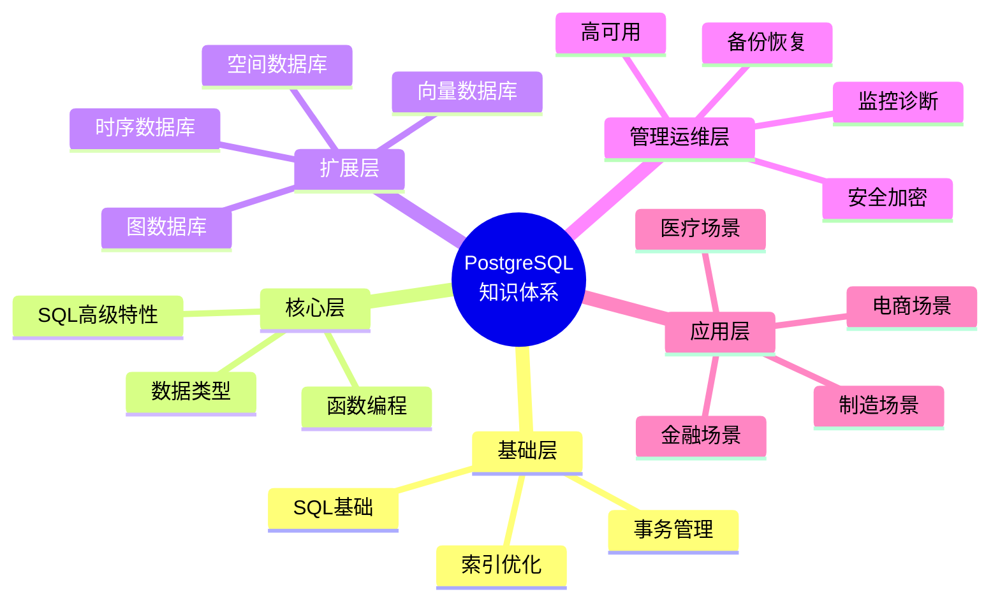

# PostgreSQL 培训资源

> **更新时间**: 2025 年 11 月 1 日
> **技术版本**: PostgreSQL 14+
> **文档编号**: 03-03-00

## 📑 培训文档索引

本目录包含 PostgreSQL 的全面培训资源，涵盖从基础到高级的所有内容。

### 基础培训

1. **[SQL 基础培训](./SQL基础培训.md)** (03-03-01)
   - SQL 数据类型
   - DML 操作（INSERT、UPDATE、DELETE）
   - DQL 操作（SELECT、WHERE、JOIN、子查询）

2. **[事务管理详解](./事务管理详解.md)** (03-03-02)
   - ACID 特性
   - 事务隔离级别
   - 并发控制
   - 死锁处理

3. **[索引与查询优化](./索引与查询优化.md)** (03-03-03)
   - 索引类型（B-tree、Hash、GiST、GIN、BRIN）
   - 索引创建与管理
   - 查询优化技巧
   - EXPLAIN 分析

### 高级培训

4. **[数据类型详解](./数据类型详解.md)** (03-03-04)
   - JSON/JSONB 操作
   - 数组操作
   - 范围类型
   - 自定义类型

5. **[函数与存储过程](./函数与存储过程.md)** (03-03-05)
   - 用户定义函数
   - 存储过程
   - 触发器

6. **[高级 SQL 特性](./高级SQL特性.md)** (03-03-06)
   - 窗口函数
   - CTE（公用表表达式）
   - 递归查询
   - 高级查询技巧

### 管理与运维

7. **[视图与物化视图](./视图与物化视图.md)** (03-03-07)
   - 视图创建和使用
   - 物化视图
   - 视图优化

8. **[权限管理](./权限管理.md)** (03-03-08)
   - 用户和角色
   - 权限授予
   - 行级安全（RLS）

9. **[备份与恢复](./备份与恢复.md)** (03-03-09)
   - 逻辑备份（pg_dump）
   - 物理备份（pg_basebackup）
   - 时间点恢复

### 设计最佳实践

10. **[数据库设计最佳实践](./数据库设计最佳实践.md)** (03-03-10)
    - 规范化设计（1NF、2NF、3NF）
    - 索引设计原则
    - 命名规范

### 高级主题

11. **[分区表管理](./分区表管理.md)** (03-03-11)
    - 范围分区、列表分区、哈希分区
    - 分区表创建和管理
    - 分区表查询优化
    - 分区维护

12. **[性能调优深入](./性能调优深入.md)** (03-03-12)
    - 配置参数调优
    - 查询计划分析
    - 统计信息管理
    - 连接池优化

13. **[监控与诊断](./监控与诊断.md)** (03-03-13)
    - 系统监控
    - 数据库监控
    - 锁监控
    - 日志分析

14. **[扩展管理](./扩展管理.md)** (03-03-14)
    - 扩展安装和管理
    - 常用扩展（pg_stat_statements、pg_trgm、pgcrypto）
    - 扩展配置

## 🎯 学习路径

### 初学者路径（4 周）

**第 1 周**: SQL 基础

- [SQL 基础培训](./SQL基础培训.md)
- 完成所有基础练习

**第 2 周**: 事务和索引

- [事务管理详解](./事务管理详解.md)
- [索引与查询优化](./索引与查询优化.md)

**第 3 周**: 数据类型和函数

- [数据类型详解](./数据类型详解.md)
- [函数与存储过程](./函数与存储过程.md)

**第 4 周**: 高级特性

- [高级 SQL 特性](./高级SQL特性.md)
- [视图与物化视图](./视图与物化视图.md)

### 中级路径（4 周）

**第 5-6 周**: 管理和运维

- [权限管理](./权限管理.md)
- [备份与恢复](./备份与恢复.md)

**第 7-8 周**: 设计和优化

- [数据库设计最佳实践](./数据库设计最佳实践.md)
- [分区表管理](./分区表管理.md)
- [性能调优深入](./性能调优深入.md)

### 高级路径（4 周）

**第 9-10 周**: 监控和诊断

- [监控与诊断](./监控与诊断.md)
- [扩展管理](./扩展管理.md)

**第 11-12 周**: 实战项目

- 综合应用所有知识
- 性能优化实战
- 故障排查实战

## 📊 知识体系总览

### PostgreSQL 知识体系思维导图

详细内容请参考：[PostgreSQL 知识体系总览](./PostgreSQL知识体系总览.md)

## 📚 相关资源

- [PostgreSQL 官方文档](https://www.postgresql.org/docs/)
- [PostgreSQL 教程](https://www.postgresql.org/docs/current/tutorial.html)
- [Neon 平台使用指南](../Neon平台/Neon架构详解.md)
- [PostgreSQL 知识体系总览](./PostgreSQL知识体系总览.md)
- [SQL 函数体系详解](./SQL函数体系详解.md)

---

**最后更新**: 2025 年 11 月 1 日
**维护者**: PostgreSQL Modern Team
**文档编号**: 03-03-00
