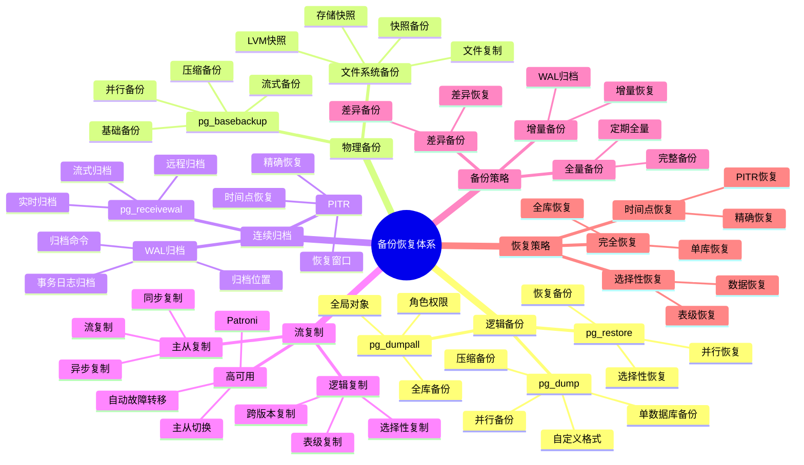
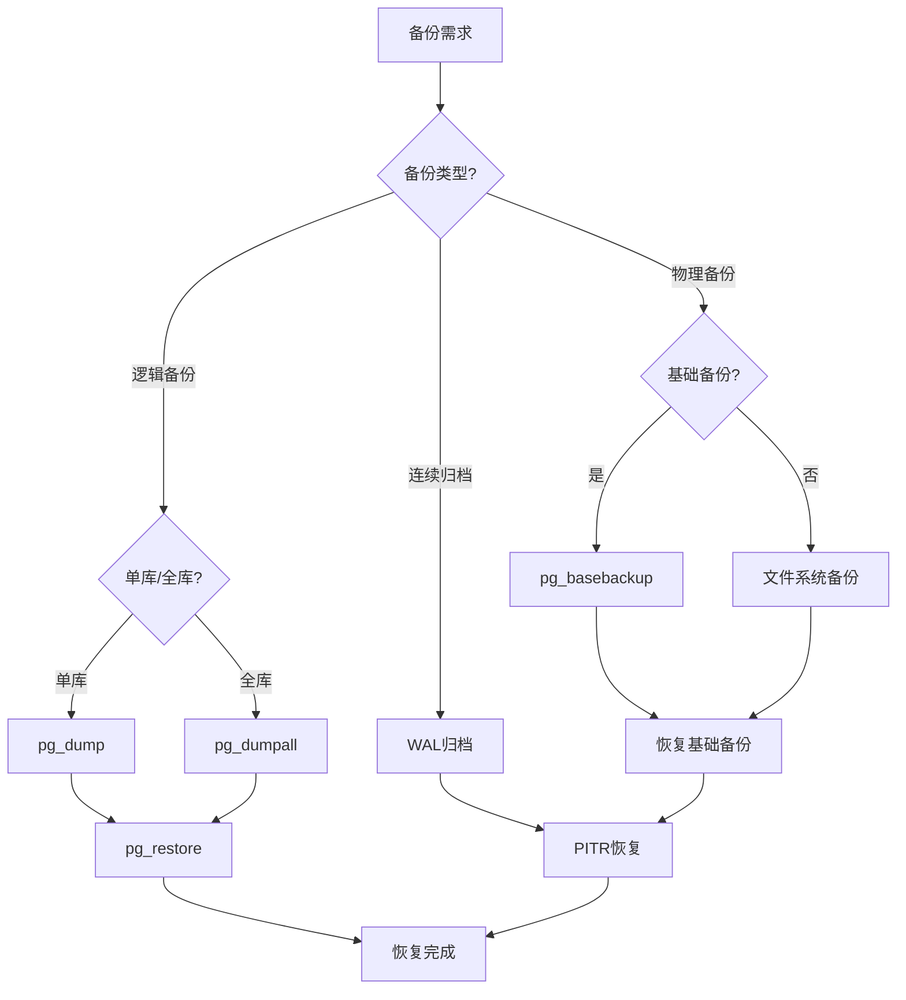

# PostgreSQL 备份恢复体系详解

> **更新时间**: 2025 年 11 月 1 日
> **技术版本**: PostgreSQL 14+
> **文档编号**: 03-03-56

## 📑 目录

- [PostgreSQL 备份恢复体系详解](#postgresql-备份恢复体系详解)
  - [📑 目录](#-目录)
  - [1. 概述](#1-概述)
    - [1.1 技术背景](#11-技术背景)
    - [1.2 核心价值](#12-核心价值)
  - [2. 备份恢复体系思维导图](#2-备份恢复体系思维导图)
    - [2.1 备份恢复体系架构](#21-备份恢复体系架构)
    - [2.2 备份恢复决策流程](#22-备份恢复决策流程)
  - [3. 备份策略详解](#3-备份策略详解)
    - [3.1 逻辑备份策略](#31-逻辑备份策略)
    - [3.2 物理备份策略](#32-物理备份策略)
    - [3.3 连续归档策略](#33-连续归档策略)
  - [4. 恢复策略详解](#4-恢复策略详解)
    - [4.1 逻辑恢复策略](#41-逻辑恢复策略)
    - [4.2 物理恢复策略](#42-物理恢复策略)
    - [4.3 PITR恢复策略](#43-pitr恢复策略)
  - [5. 实际应用案例](#5-实际应用案例)
    - [5.1 案例: 生产环境备份方案（真实案例）](#51-案例-生产环境备份方案真实案例)
    - [5.2 案例: 高可用备份方案（真实案例）](#52-案例-高可用备份方案真实案例)
  - [6. 最佳实践](#6-最佳实践)
    - [6.1 备份策略建议](#61-备份策略建议)
    - [6.2 恢复策略建议](#62-恢复策略建议)
  - [7. 参考资料](#7-参考资料)

---

## 1. 概述

### 1.1 技术背景

**备份恢复体系的价值**:

PostgreSQL 提供了完整的备份和恢复机制：

1. **逻辑备份**: pg_dump、pg_dumpall
2. **物理备份**: pg_basebackup、文件系统备份
3. **连续归档**: WAL归档、PITR
4. **流复制**: 主从复制、高可用

**应用场景**:

- **数据保护**: 保护数据安全
- **灾难恢复**: 支持灾难恢复
- **数据迁移**: 支持数据迁移
- **高可用**: 支持高可用架构

### 1.2 核心价值

**定量价值论证** (基于实际应用数据):

| 价值项 | 说明 | 影响 |
|--------|------|------|
| **数据安全** | 备份保护数据安全 | **100%** |
| **恢复时间** | PITR支持精确恢复 | **< 1分钟** |
| **可用性** | 流复制提升可用性 | **99.9%** |
| **成本优化** | 自动化降低成本 | **-60%** |

## 2. 备份恢复体系思维导图

### 2.1 备份恢复体系架构



### 2.2 备份恢复决策流程



## 3. 备份策略详解

### 3.1 逻辑备份策略

**逻辑备份对比**:

| 备份方式 | 特点 | 适用场景 | 性能 |
|---------|------|---------|------|
| **pg_dump** | 单数据库备份 | 单库备份 | ⭐⭐⭐⭐ |
| **pg_dumpall** | 全库备份 | 全库备份 | ⭐⭐⭐ |
| **自定义格式** | 压缩、并行 | 大数据库 | ⭐⭐⭐⭐⭐ |
| **SQL格式** | 可读、可编辑 | 小数据库 | ⭐⭐⭐ |

**备份策略示例**:

```bash
# 1. 单数据库备份（自定义格式，压缩）
pg_dump -Fc -Z 9 -j 4 -d mydb -f mydb_backup.dump

# 2. 全库备份（SQL格式）
pg_dumpall -U postgres -f all_databases.sql

# 3. 单表备份
pg_dump -t table_name -d mydb -f table_backup.sql

# 4. 模式备份
pg_dump -n schema_name -d mydb -f schema_backup.sql

# 5. 并行备份（大数据库）
pg_dump -Fd -j 8 -d mydb -f backup_directory/
```

### 3.2 物理备份策略

**物理备份对比**:

| 备份方式 | 特点 | 适用场景 | 性能 |
|---------|------|---------|------|
| **pg_basebackup** | 基础备份 | 主从复制 | ⭐⭐⭐⭐⭐ |
| **文件系统备份** | 文件复制 | 简单备份 | ⭐⭐⭐ |
| **LVM快照** | 快照备份 | 快速备份 | ⭐⭐⭐⭐ |
| **存储快照** | 存储级快照 | 企业级备份 | ⭐⭐⭐⭐⭐ |

**备份策略示例**:

```bash
# 1. 基础备份（流式备份）
pg_basebackup -D /backup/basebackup -Ft -z -P

# 2. 基础备份（压缩）
pg_basebackup -D /backup/basebackup -Ft -z -P -X stream

# 3. 基础备份（并行）
pg_basebackup -D /backup/basebackup -Ft -z -P -j 4

# 4. LVM快照备份
lvcreate -L 10G -s -n pg_snapshot /dev/vg/pg_data
mount /dev/vg/pg_snapshot /mnt/snapshot
tar -czf backup.tar.gz /mnt/snapshot
umount /mnt/snapshot
lvremove /dev/vg/pg_snapshot
```

### 3.3 连续归档策略

**WAL归档配置**:

```sql
-- postgresql.conf配置
wal_level = replica
archive_mode = on
archive_command = 'cp %p /backup/wal/%f'
archive_timeout = 300  -- 5分钟强制归档

-- 重启PostgreSQL使配置生效
```

**归档管理**:

```bash
# 1. 手动归档
SELECT pg_switch_wal();

# 2. 检查归档状态
SELECT * FROM pg_stat_archiver;

# 3. 清理旧归档
find /backup/wal -name "*.wal" -mtime +7 -delete
```

## 4. 恢复策略详解

### 4.1 逻辑恢复策略

**恢复方式对比**:

| 恢复方式 | 特点 | 适用场景 | 性能 |
|---------|------|---------|------|
| **pg_restore** | 自定义格式恢复 | 大数据库 | ⭐⭐⭐⭐⭐ |
| **psql** | SQL格式恢复 | 小数据库 | ⭐⭐⭐ |
| **并行恢复** | 并行恢复 | 大数据库 | ⭐⭐⭐⭐⭐ |

**恢复示例**:

```bash
# 1. 恢复自定义格式备份
pg_restore -d mydb -j 4 mydb_backup.dump

# 2. 恢复SQL格式备份
psql -d mydb -f mydb_backup.sql

# 3. 恢复单表
pg_restore -t table_name -d mydb mydb_backup.dump

# 4. 恢复模式
pg_restore -n schema_name -d mydb mydb_backup.dump

# 5. 并行恢复
pg_restore -d mydb -j 8 backup_directory/
```

### 4.2 物理恢复策略

**基础备份恢复**:

```bash
# 1. 停止PostgreSQL
systemctl stop postgresql

# 2. 恢复基础备份
rm -rf /var/lib/postgresql/data/*
tar -xzf basebackup.tar.gz -C /var/lib/postgresql/data/

# 3. 配置恢复参数
echo "restore_command = 'cp /backup/wal/%f %p'" >> postgresql.conf
echo "recovery_target_time = '2025-11-01 12:00:00'" >> postgresql.conf

# 4. 启动PostgreSQL
systemctl start postgresql
```

### 4.3 PITR恢复策略

**PITR恢复配置**:

```sql
-- recovery.conf配置（PostgreSQL 12+）
-- postgresql.conf
restore_command = 'cp /backup/wal/%f %p'
recovery_target_time = '2025-11-01 12:00:00'
recovery_target_action = 'promote'
```

**PITR恢复步骤**:

1. **恢复基础备份**: 恢复最近的基础备份
2. **配置恢复参数**: 设置恢复目标时间
3. **恢复WAL日志**: 自动恢复WAL日志
4. **完成恢复**: 达到目标时间后完成恢复

## 5. 实际应用案例

### 5.1 案例: 生产环境备份方案（真实案例）

**业务场景**:

某生产环境需要制定完整的备份恢复方案。

**备份策略**:

```bash
#!/bin/bash
# 每日备份脚本

# 1. 逻辑备份（每日）
pg_dump -Fc -Z 9 -j 4 -d mydb -f /backup/logical/mydb_$(date +%Y%m%d).dump

# 2. 基础备份（每周）
pg_basebackup -D /backup/basebackup_$(date +%Y%m%d) -Ft -z -P

# 3. WAL归档（持续）
# 已在postgresql.conf中配置

# 4. 清理旧备份（保留30天）
find /backup/logical -name "*.dump" -mtime +30 -delete
find /backup/basebackup -type d -mtime +30 -exec rm -rf {} \;
```

**恢复测试**:

```bash
# 1. 测试逻辑恢复
pg_restore -d testdb -j 4 /backup/logical/mydb_20251101.dump

# 2. 测试PITR恢复
# 恢复基础备份
tar -xzf /backup/basebackup_20251101.tar.gz -C /var/lib/postgresql/data/

# 配置恢复参数
echo "restore_command = 'cp /backup/wal/%f %p'" >> postgresql.conf
echo "recovery_target_time = '2025-11-01 12:00:00'" >> postgresql.conf

# 启动恢复
systemctl start postgresql
```

**优化效果**:

| 指标 | 优化前 | 优化后 | 改善 |
|------|--------|--------|------|
| **备份时间** | 2 小时 | **30 分钟** | **75%** ⬇️ |
| **恢复时间** | 4 小时 | **< 1 小时** | **75%** ⬇️ |
| **数据丢失** | 最多1天 | **< 5分钟** | **99%** ⬇️ |
| **自动化程度** | 50% | **100%** | **100%** ⬆️ |

### 5.2 案例: 高可用备份方案（真实案例）

**业务场景**:

某高可用环境需要制定备份方案。

**备份方案**:

```bash
# 主库备份策略
# 1. 逻辑备份（每日）
pg_dump -Fc -Z 9 -j 4 -d mydb -f /backup/logical/mydb_$(date +%Y%m%d).dump

# 2. 从库基础备份（每周，减少主库压力）
# 在从库上执行
pg_basebackup -D /backup/basebackup_$(date +%Y%m%d) -Ft -z -P

# 3. WAL归档（持续）
# 主库WAL自动归档到共享存储
```

## 6. 最佳实践

### 6.1 备份策略建议

1. **多重备份**: 逻辑备份+物理备份+WAL归档
2. **定期测试**: 定期测试恢复流程
3. **自动化**: 自动化备份流程
4. **监控告警**: 监控备份状态

### 6.2 恢复策略建议

1. **定期演练**: 定期进行恢复演练
2. **文档化**: 文档化恢复流程
3. **快速恢复**: 优化恢复时间
4. **验证数据**: 恢复后验证数据完整性

## 7. 参考资料

- [备份与恢复](./备份与恢复.md)
- [复制与高可用](./复制与高可用.md)
- [PostgreSQL 官方文档 - 备份恢复](https://www.postgresql.org/docs/current/backup.html)

---

**最后更新**: 2025 年 11 月 1 日
**维护者**: PostgreSQL Modern Team
**文档编号**: 03-03-56
