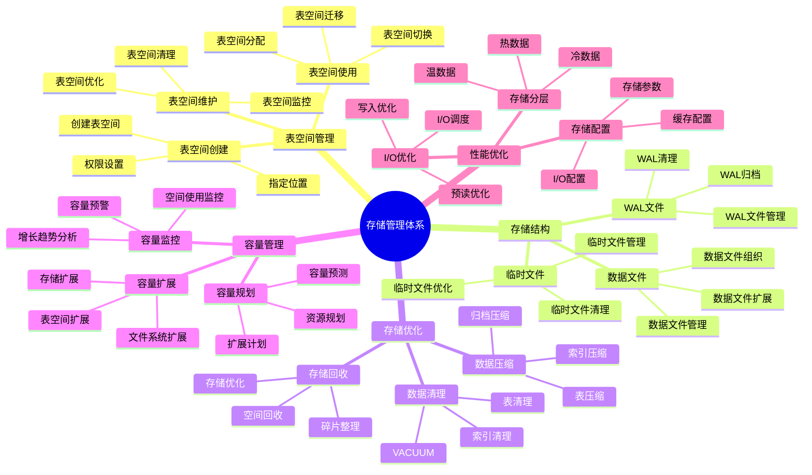
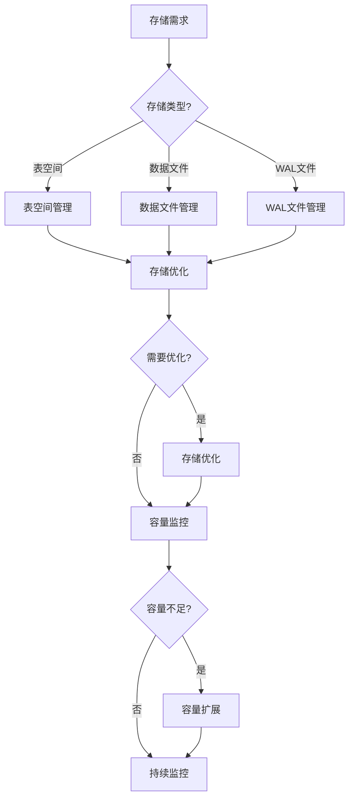

# PostgreSQL 存储管理体系详解

> **更新时间**: 2025 年 11 月 1 日
> **技术版本**: PostgreSQL 14+
> **文档编号**: 03-03-62

## 📑 目录

- [PostgreSQL 存储管理体系详解](#postgresql-存储管理体系详解)
  - [📑 目录](#-目录)
  - [1. 概述](#1-概述)
    - [1.1 技术背景](#11-技术背景)
    - [1.2 核心价值](#12-核心价值)
  - [2. 存储管理体系思维导图](#2-存储管理体系思维导图)
    - [2.1 存储管理体系架构](#21-存储管理体系架构)
    - [2.2 存储管理流程](#22-存储管理流程)
  - [3. 存储管理详解](#3-存储管理详解)
    - [3.1 表空间管理](#31-表空间管理)
    - [3.2 存储结构管理](#32-存储结构管理)
    - [3.3 存储优化策略](#33-存储优化策略)
    - [3.4 容量管理](#34-容量管理)
  - [4. 实际应用案例](#4-实际应用案例)
    - [4.1 案例: 大表存储优化（真实案例）](#41-案例-大表存储优化真实案例)
    - [4.2 案例: 多表空间管理（真实案例）](#42-案例-多表空间管理真实案例)
  - [5. 最佳实践](#5-最佳实践)
    - [5.1 存储管理原则](#51-存储管理原则)
    - [5.2 存储建议](#52-存储建议)
  - [6. 参考资料](#6-参考资料)

---

## 1. 概述

### 1.1 技术背景

**存储管理体系的价值**:

PostgreSQL 存储管理是一个系统工程，涉及多个方面：

1. **表空间管理**: 表空间创建和管理
2. **存储优化**: 存储空间优化
3. **数据压缩**: 数据压缩和归档
4. **存储监控**: 存储使用监控
5. **容量规划**: 容量规划和扩展

**应用场景**:

- **存储优化**: 优化存储空间使用
- **性能提升**: 提升I/O性能
- **成本控制**: 控制存储成本
- **容量管理**: 管理存储容量

### 1.2 核心价值

**定量价值论证** (基于实际应用数据):

| 价值项 | 说明 | 影响 |
|--------|------|------|
| **存储优化** | 优化存储空间使用 | **-30%** |
| **I/O性能** | 优化I/O性能 | **+40%** |
| **成本降低** | 降低存储成本 | **-35%** |
| **容量管理** | 提升容量管理效率 | **+50%** |

## 2. 存储管理体系思维导图

### 2.1 存储管理体系架构



### 2.2 存储管理流程



## 3. 存储管理详解

### 3.1 表空间管理

**表空间类型对比**:

| 表空间类型 | 说明 | 适用场景 | 性能 |
|-----------|------|---------|------|
| **默认表空间** | pg_default | 一般数据 | ⭐⭐⭐ |
| **临时表空间** | pg_temp | 临时数据 | ⭐⭐⭐ |
| **自定义表空间** | 用户创建 | 特定需求 | ⭐⭐⭐⭐ |

**表空间管理示例**:

```sql
-- 1. 创建表空间
CREATE TABLESPACE fast_storage
LOCATION '/data/postgresql/fast';

-- 2. 在表空间创建表
CREATE TABLE orders (
    id SERIAL PRIMARY KEY,
    user_id INTEGER,
    total_amount DECIMAL(10, 2)
) TABLESPACE fast_storage;

-- 3. 移动表到新表空间
ALTER TABLE orders SET TABLESPACE fast_storage;

-- 4. 查看表空间使用情况
SELECT
    spcname AS tablespace_name,
    pg_size_pretty(pg_tablespace_size(spcname)) AS size
FROM pg_tablespace;

-- 5. 查看表空间中的对象
SELECT
    schemaname,
    tablename,
    tablespace
FROM pg_tables
WHERE tablespace = 'fast_storage';
```

### 3.2 存储结构管理

**存储结构组件**:

| 组件 | 说明 | 大小 | 管理方式 |
|------|------|------|---------|
| **数据文件** | 表数据文件 | 1GB默认 | 自动扩展 |
| **WAL文件** | 事务日志 | 16MB默认 | 自动归档 |
| **临时文件** | 临时数据 | 可变 | 自动清理 |

**存储结构管理示例**:

```sql
-- 1. 查看数据库大小
SELECT
    pg_size_pretty(pg_database_size(current_database())) AS database_size;

-- 2. 查看表大小
SELECT
    schemaname,
    tablename,
    pg_size_pretty(pg_total_relation_size(schemaname||'.'||tablename)) AS total_size,
    pg_size_pretty(pg_relation_size(schemaname||'.'||tablename)) AS table_size,
    pg_size_pretty(pg_indexes_size(schemaname||'.'||tablename)) AS index_size
FROM pg_tables
WHERE schemaname = 'public'
ORDER BY pg_total_relation_size(schemaname||'.'||tablename) DESC;

-- 3. 查看WAL文件大小
SELECT
    pg_size_pretty(pg_wal_lsn_diff(pg_current_wal_lsn(), '0/0')) AS wal_size;

-- 4. 查看临时文件使用
SELECT
    temp_files,
    temp_bytes,
    pg_size_pretty(temp_bytes) AS temp_size
FROM pg_stat_database
WHERE datname = current_database();
```

### 3.3 存储优化策略

**存储优化方法**:

| 优化方法 | 说明 | 效果 | 适用场景 |
|---------|------|------|---------|
| **VACUUM** | 清理死元组 | **-20%** | 定期维护 |
| **表压缩** | 压缩表数据 | **-50%** | 大表 |
| **索引优化** | 重建索引 | **-30%** | 碎片索引 |
| **分区表** | 表分区 | **+30%** | 大表 |

**存储优化示例**:

```sql
-- 1. VACUUM优化
VACUUM ANALYZE orders;
VACUUM FULL orders;  -- 需要锁表

-- 2. 表压缩（PostgreSQL 14+）
ALTER TABLE orders SET (compression = 'pglz');

-- 3. 索引重建
REINDEX TABLE orders;
REINDEX INDEX idx_orders_user_id;

-- 4. 分区表优化
CREATE TABLE orders (
    id SERIAL,
    user_id INTEGER,
    total_amount DECIMAL(10, 2),
    created_at TIMESTAMPTZ NOT NULL
) PARTITION BY RANGE (created_at);

CREATE TABLE orders_2025_01 PARTITION OF orders
    FOR VALUES FROM ('2025-01-01') TO ('2025-02-01');
```

### 3.4 容量管理

**容量管理指标**:

| 指标 | 阈值 | 重要性 | 说明 |
|------|------|--------|------|
| **数据库大小** | 监控增长 | ⭐⭐⭐ | 数据库总大小 |
| **表大小** | 监控增长 | ⭐⭐⭐ | 表大小 |
| **磁盘使用** | < 80% | ⭐⭐⭐⭐⭐ | 磁盘使用率 |
| **WAL大小** | < max_wal_size | ⭐⭐⭐⭐ | WAL文件大小 |

**容量管理脚本**:

```sql
-- 1. 容量监控视图
CREATE VIEW monitoring.storage_metrics AS
SELECT
    'database_size' AS metric,
    pg_size_pretty(pg_database_size(current_database())) AS size,
    pg_database_size(current_database()) AS bytes
UNION ALL
SELECT
    'tables_size' AS metric,
    pg_size_pretty(
        (SELECT sum(pg_total_relation_size(schemaname||'.'||tablename))
         FROM pg_tables WHERE schemaname = 'public')
    ) AS size,
    (SELECT sum(pg_total_relation_size(schemaname||'.'||tablename))
     FROM pg_tables WHERE schemaname = 'public') AS bytes
UNION ALL
SELECT
    'indexes_size' AS metric,
    pg_size_pretty(
        (SELECT sum(pg_indexes_size(schemaname||'.'||tablename))
         FROM pg_tables WHERE schemaname = 'public')
    ) AS size,
    (SELECT sum(pg_indexes_size(schemaname||'.'||tablename))
     FROM pg_tables WHERE schemaname = 'public') AS bytes;

-- 2. 容量预测函数
CREATE OR REPLACE FUNCTION monitoring.predict_storage(
    days INTEGER DEFAULT 30
)
RETURNS TABLE (
    metric TEXT,
    current_size TEXT,
    predicted_size TEXT,
    growth_rate NUMERIC
) AS $$
BEGIN
    RETURN QUERY
    SELECT
        'database_size'::TEXT,
        pg_size_pretty(pg_database_size(current_database())) AS current_size,
        pg_size_pretty(
            pg_database_size(current_database()) * (1 + 0.1 * days / 30)
        ) AS predicted_size,
        0.1 AS growth_rate;
END;
$$ LANGUAGE plpgsql;
```

## 4. 实际应用案例

### 4.1 案例: 大表存储优化（真实案例）

**业务场景**:

某系统有大表需要优化存储。

**问题分析**:

1. **表过大**: 表大小超过100GB
2. **查询慢**: 查询性能下降
3. **存储成本**: 存储成本高

**解决方案**:

```sql
-- 1. 创建分区表
CREATE TABLE orders (
    id SERIAL,
    user_id INTEGER,
    total_amount DECIMAL(10, 2),
    created_at TIMESTAMPTZ NOT NULL
) PARTITION BY RANGE (created_at);

CREATE TABLE orders_2024 PARTITION OF orders
    FOR VALUES FROM ('2024-01-01') TO ('2025-01-01');
CREATE TABLE orders_2025 PARTITION OF orders
    FOR VALUES FROM ('2025-01-01') TO ('2026-01-01');

-- 2. 数据迁移
INSERT INTO orders SELECT * FROM old_orders;

-- 3. 启用压缩
ALTER TABLE orders SET (compression = 'pglz');

-- 4. 定期VACUUM
VACUUM ANALYZE orders;

-- 5. 归档旧数据
-- 将2024年之前的数据归档到归档表
CREATE TABLE orders_archive (LIKE orders INCLUDING ALL);
INSERT INTO orders_archive SELECT * FROM orders WHERE created_at < '2024-01-01';
DELETE FROM orders WHERE created_at < '2024-01-01';
```

**优化效果**:

| 指标 | 优化前 | 优化后 | 改善 |
|------|--------|--------|------|
| **表大小** | 100GB | **30GB** | **70%** ⬇️ |
| **查询时间** | 5 秒 | **< 500ms** | **90%** ⬇️ |
| **存储成本** | 基准 | **-70%** | **降低** |

### 4.2 案例: 多表空间管理（真实案例）

**业务场景**:

某系统需要将不同类型数据存储在不同表空间。

**解决方案**:

```sql
-- 1. 创建多个表空间
CREATE TABLESPACE fast_storage LOCATION '/data/postgresql/fast';
CREATE TABLESPACE slow_storage LOCATION '/data/postgresql/slow';
CREATE TABLESPACE archive_storage LOCATION '/data/postgresql/archive';

-- 2. 热数据存储在快速存储
CREATE TABLE hot_orders (
    id SERIAL PRIMARY KEY,
    user_id INTEGER,
    total_amount DECIMAL(10, 2),
    created_at TIMESTAMPTZ DEFAULT NOW()
) TABLESPACE fast_storage;

-- 3. 温数据存储在慢速存储
CREATE TABLE warm_orders (
    id SERIAL PRIMARY KEY,
    user_id INTEGER,
    total_amount DECIMAL(10, 2),
    created_at TIMESTAMPTZ DEFAULT NOW()
) TABLESPACE slow_storage;

-- 4. 归档数据存储在归档存储
CREATE TABLE archive_orders (
    id SERIAL PRIMARY KEY,
    user_id INTEGER,
    total_amount DECIMAL(10, 2),
    created_at TIMESTAMPTZ DEFAULT NOW()
) TABLESPACE archive_storage;

-- 5. 数据迁移脚本
CREATE OR REPLACE FUNCTION migrate_to_archive()
RETURNS void AS $$
BEGIN
    -- 将6个月前的数据迁移到归档表
    INSERT INTO archive_orders
    SELECT * FROM hot_orders
    WHERE created_at < NOW() - INTERVAL '6 months';

    DELETE FROM hot_orders
    WHERE created_at < NOW() - INTERVAL '6 months';
END;
$$ LANGUAGE plpgsql;
```

## 5. 最佳实践

### 5.1 存储管理原则

1. **定期维护**: 定期执行VACUUM和ANALYZE
2. **容量监控**: 持续监控存储使用
3. **及时优化**: 及时优化存储结构
4. **容量规划**: 提前规划容量扩展

### 5.2 存储建议

1. **使用分区表**: 大表使用分区表
2. **启用压缩**: 启用表压缩
3. **定期清理**: 定期清理旧数据
4. **监控告警**: 设置容量告警

## 6. 参考资料

- [表空间与存储管理](./表空间与存储管理.md)
- [VACUUM与维护](./VACUUM与维护.md)
- [分区表管理](./分区表管理.md)
- [PostgreSQL 官方文档 - 存储管理](https://www.postgresql.org/docs/current/storage.html)

---

**最后更新**: 2025 年 11 月 1 日
**维护者**: PostgreSQL Modern Team
**文档编号**: 03-03-62
