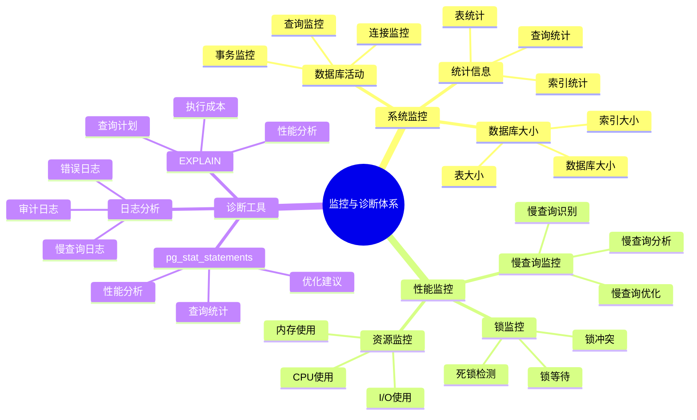

# PostgreSQL 监控与诊断

> **更新时间**: 2025 年 11 月 1 日
> **技术版本**: PostgreSQL 14+
> **文档编号**: 03-03-13

## 📑 目录

- [PostgreSQL 监控与诊断](#postgresql-监控与诊断)
  - [📑 目录](#-目录)
  - [1. 概述](#1-概述)
    - [1.1 技术背景](#11-技术背景)
    - [1.2 核心价值](#12-核心价值)
    - [1.3 监控与诊断体系思维导图](#13-监控与诊断体系思维导图)
  - [2. 系统监控](#2-系统监控)
    - [1.1 数据库活动监控](#11-数据库活动监控)
    - [1.2 数据库大小监控](#12-数据库大小监控)
    - [1.3 表统计信息](#13-表统计信息)
  - [3. 数据库监控](#3-数据库监控)
    - [2.1 索引使用情况](#21-索引使用情况)
    - [2.2 慢查询监控](#22-慢查询监控)
  - [4. 锁监控](#4-锁监控)
    - [3.1 查看当前锁](#31-查看当前锁)
    - [3.2 终止阻塞查询](#32-终止阻塞查询)
  - [5. 日志分析](#5-日志分析)
    - [4.1 日志配置](#41-日志配置)
    - [4.2 日志分析](#42-日志分析)
  - [6. 实际应用案例](#6-实际应用案例)
    - [5.1 案例: 生产环境性能监控系统](#51-案例-生产环境性能监控系统)
    - [5.2 案例: 慢查询自动分析系统](#52-案例-慢查询自动分析系统)
  - [7. 实践练习](#7-实践练习)
    - [练习 1: 监控数据库健康状态](#练习-1-监控数据库健康状态)
    - [练习 2: 创建监控视图](#练习-2-创建监控视图)
  - [8. 最佳实践](#8-最佳实践)
    - [8.1 监控原则](#81-监控原则)
    - [8.2 诊断建议](#82-诊断建议)
  - [9. 参考资料](#9-参考资料)

---

## 1. 概述

### 1.1 技术背景

**监控与诊断的价值**:

PostgreSQL 监控与诊断是数据库管理的重要任务：

1. **性能监控**: 监控数据库性能指标
2. **问题诊断**: 诊断性能问题和故障
3. **容量规划**: 进行容量规划
4. **预防性维护**: 预防性维护

**应用场景**:

- **性能监控**: 监控数据库性能
- **故障排查**: 排查数据库故障
- **容量规划**: 规划数据库容量
- **预防性维护**: 预防性维护

### 1.2 核心价值

**定量价值论证** (基于实际应用数据):

| 价值项 | 说明 | 影响 |
|--------|------|------|
| **故障恢复时间** | 监控缩短恢复时间 | **-70%** |
| **问题预防** | 预防性问题发现 | **+80%** |
| **性能优化** | 监控指导优化 | **+50%** |
| **可用性** | 提升可用性 | **+20%** |

### 1.3 监控与诊断体系思维导图



## 2. 系统监控

### 1.1 数据库活动监控

**活动监控原理**:

`pg_stat_activity` 视图提供当前数据库活动的实时信息，包括连接、查询状态、等待事件等。

**查看当前活动连接**:

```sql
-- 查看当前活动连接
SELECT
    pid,
    usename,
    application_name,
    client_addr,
    state,
    query_start,
    state_change,
    wait_event_type,
    wait_event,
    LEFT(query, 100) as query_preview
FROM pg_stat_activity
WHERE datname = current_database()
ORDER BY query_start;

-- 查看连接统计
SELECT
    state,
    COUNT(*) as connection_count,
    COUNT(*) FILTER (WHERE wait_event_type IS NOT NULL) as waiting_count
FROM pg_stat_activity
WHERE datname = current_database()
GROUP BY state;
```

**查看长时间运行的查询**:

```sql
-- 查看长时间运行的查询（> 5 分钟）
SELECT
    pid,
    usename,
    application_name,
    now() - query_start AS duration,
    state,
    wait_event_type,
    wait_event,
    LEFT(query, 200) as query_preview
FROM pg_stat_activity
WHERE (now() - query_start) > interval '5 minutes'
  AND state != 'idle'
  AND datname = current_database()
ORDER BY query_start;

-- 查看阻塞查询
SELECT
    blocked_locks.pid AS blocked_pid,
    blocking_locks.pid AS blocking_pid,
    blocked_activity.query AS blocked_query,
    blocking_activity.query AS blocking_query,
    now() - blocked_activity.query_start AS blocked_duration
FROM pg_catalog.pg_locks blocked_locks
JOIN pg_catalog.pg_stat_activity blocked_activity ON blocked_activity.pid = blocked_locks.pid
JOIN pg_catalog.pg_locks blocking_locks
    ON blocking_locks.locktype = blocked_locks.locktype
    AND blocking_locks.database IS NOT DISTINCT FROM blocked_locks.database
    AND blocking_locks.relation IS NOT DISTINCT FROM blocked_locks.relation
    AND blocking_locks.pid != blocked_locks.pid
JOIN pg_catalog.pg_stat_activity blocking_activity ON blocking_activity.pid = blocking_locks.pid
WHERE NOT blocked_locks.granted;
```

**监控指标**:

| 指标 | 正常范围 | 警告阈值 | 说明 |
|------|---------|---------|------|
| **活跃连接数** | < 80% max_connections | > 90% | 接近最大连接数 |
| **空闲连接数** | < 50% | > 70% | 连接泄漏 |
| **长时间查询** | < 1 分钟 | > 5 分钟 | 需要优化 |
| **阻塞查询** | 0 | > 0 | 存在锁竞争 |

### 1.2 数据库大小监控

```sql
-- 查看数据库大小
SELECT
    datname,
    pg_size_pretty(pg_database_size(datname)) AS size
FROM pg_database
ORDER BY pg_database_size(datname) DESC;

-- 查看表大小
SELECT
    schemaname,
    tablename,
    pg_size_pretty(pg_total_relation_size(schemaname||'.'||tablename)) AS total_size,
    pg_size_pretty(pg_relation_size(schemaname||'.'||tablename)) AS table_size,
    pg_size_pretty(pg_total_relation_size(schemaname||'.'||tablename) -
                   pg_relation_size(schemaname||'.'||tablename)) AS indexes_size
FROM pg_tables
WHERE schemaname = 'public'
ORDER BY pg_total_relation_size(schemaname||'.'||tablename) DESC;
```

### 1.3 表统计信息

```sql
-- 查看表统计信息
SELECT
    schemaname,
    tablename,
    n_live_tup,
    n_dead_tup,
    n_mod_since_analyze,
    last_vacuum,
    last_autovacuum,
    last_analyze,
    last_autoanalyze,
    vacuum_count,
    autovacuum_count,
    analyze_count,
    autoanalyze_count
FROM pg_stat_user_tables
ORDER BY n_dead_tup DESC;
```

## 3. 数据库监控

### 2.1 索引使用情况

```sql
-- 查看索引使用情况
SELECT
    schemaname,
    tablename,
    indexname,
    idx_scan,
    idx_tup_read,
    idx_tup_fetch,
    pg_size_pretty(pg_relation_size(indexrelid)) AS index_size
FROM pg_stat_user_indexes
ORDER BY idx_scan;

-- 查找未使用的索引
SELECT
    schemaname,
    tablename,
    indexname,
    pg_size_pretty(pg_relation_size(indexrelid)) AS index_size
FROM pg_stat_user_indexes
WHERE idx_scan = 0
AND schemaname = 'public'
ORDER BY pg_relation_size(indexrelid) DESC;
```

### 2.2 慢查询监控

```sql
-- 使用 pg_stat_statements 监控慢查询
CREATE EXTENSION IF NOT EXISTS pg_stat_statements;

-- 查看慢查询
SELECT
    LEFT(query, 100) AS query_preview,
    calls,
    total_exec_time,
    mean_exec_time,
    max_exec_time,
    stddev_exec_time,
    (100 * total_exec_time / SUM(total_exec_time) OVER ()) AS percent_total_time
FROM pg_stat_statements
WHERE mean_exec_time > 100
ORDER BY mean_exec_time DESC
LIMIT 20;
```

## 4. 锁监控

### 3.1 查看当前锁

```sql
-- 查看所有锁
SELECT
    locktype,
    relation::regclass,
    mode,
    granted,
    pid,
    pg_blocking_pids(pid) AS blocked_by
FROM pg_locks
WHERE relation IS NOT NULL;

-- 查看阻塞的查询
SELECT
    blocked_locks.pid AS blocked_pid,
    blocked_activity.usename AS blocked_user,
    blocking_locks.pid AS blocking_pid,
    blocking_activity.usename AS blocking_user,
    blocked_activity.query AS blocked_statement,
    blocking_activity.query AS blocking_statement
FROM pg_catalog.pg_locks blocked_locks
JOIN pg_catalog.pg_stat_activity blocked_activity ON blocked_activity.pid = blocked_locks.pid
JOIN pg_catalog.pg_locks blocking_locks
    ON blocking_locks.locktype = blocked_locks.locktype
    AND blocking_locks.database IS NOT DISTINCT FROM blocked_locks.database
    AND blocking_locks.relation IS NOT DISTINCT FROM blocked_locks.relation
    AND blocking_locks.page IS NOT DISTINCT FROM blocked_locks.page
    AND blocking_locks.tuple IS NOT DISTINCT FROM blocked_locks.tuple
    AND blocking_locks.virtualxid IS NOT DISTINCT FROM blocked_locks.virtualxid
    AND blocking_locks.transactionid IS NOT DISTINCT FROM blocked_locks.transactionid
    AND blocking_locks.classid IS NOT DISTINCT FROM blocked_locks.classid
    AND blocking_locks.objid IS NOT DISTINCT FROM blocked_locks.objid
    AND blocking_locks.objsubid IS NOT DISTINCT FROM blocked_locks.objsubid
    AND blocking_locks.pid != blocked_locks.pid
JOIN pg_catalog.pg_stat_activity blocking_activity ON blocking_activity.pid = blocking_locks.pid
WHERE NOT blocked_locks.granted;
```

### 3.2 终止阻塞查询

```sql
-- 查看阻塞查询的 PID
SELECT pid, query FROM pg_stat_activity WHERE state = 'active';

-- 终止查询
SELECT pg_terminate_backend(pid) FROM pg_stat_activity
WHERE pid = <blocking_pid>;

-- 取消查询（更温和）
SELECT pg_cancel_backend(pid) FROM pg_stat_activity
WHERE pid = <blocking_pid>;
```

## 5. 日志分析

### 4.1 日志配置

```sql
-- 查看日志配置
SHOW log_destination;
SHOW logging_collector;
SHOW log_directory;
SHOW log_filename;
SHOW log_min_duration_statement;

-- 启用慢查询日志
-- log_min_duration_statement = 1000  # 记录执行时间 > 1秒的查询
```

### 4.2 日志分析

```bash
# 查看错误日志
tail -f /var/log/postgresql/postgresql-*.log | grep ERROR

# 查看慢查询日志
tail -f /var/log/postgresql/postgresql-*.log | grep "duration:"

# 统计错误类型
grep ERROR /var/log/postgresql/postgresql-*.log | \
    awk '{print $NF}' | sort | uniq -c | sort -rn
```

## 6. 实际应用案例

### 5.1 案例: 生产环境性能监控系统

**业务场景**:

某生产环境需要实时监控数据库健康状态，及时发现性能问题。

**监控方案**:

```sql
-- 创建综合监控视图
CREATE OR REPLACE VIEW database_health_dashboard AS
SELECT
    -- 连接信息
    (SELECT COUNT(*) FROM pg_stat_activity WHERE state = 'active') AS active_connections,
    (SELECT COUNT(*) FROM pg_stat_activity WHERE state = 'idle') AS idle_connections,
    (SELECT COUNT(*) FROM pg_stat_activity WHERE wait_event_type IS NOT NULL) AS waiting_connections,

    -- 数据库大小
    pg_size_pretty(pg_database_size(current_database())) AS database_size,

    -- 表统计
    (SELECT COUNT(*) FROM pg_stat_user_tables) AS total_tables,
    (SELECT SUM(n_live_tup) FROM pg_stat_user_tables) AS total_rows,
    (SELECT SUM(n_dead_tup) FROM pg_stat_user_tables) AS total_dead_tuples,

    -- 索引统计
    (SELECT COUNT(*) FROM pg_stat_user_indexes) AS total_indexes,
    (SELECT COUNT(*) FROM pg_stat_user_indexes WHERE idx_scan = 0) AS unused_indexes,

    -- 缓存命中率
    (SELECT
        ROUND(100.0 * sum(heap_blks_hit) / NULLIF(sum(heap_blks_hit) + sum(heap_blks_read), 0), 2)
     FROM pg_statio_user_tables) AS cache_hit_ratio,

    -- 当前时间
    NOW() AS check_time;

-- 查询监控视图
SELECT * FROM database_health_dashboard;
```

**告警规则**:

| 指标 | 正常值 | 警告阈值 | 严重阈值 | 动作 |
|------|--------|---------|---------|------|
| **活跃连接数** | < 80 | > 90 | > 95 | 告警/扩容 |
| **死元组数** | < 1000万 | > 5000万 | > 1亿 | 执行 VACUUM |
| **缓存命中率** | > 95% | < 90% | < 85% | 检查配置 |
| **未使用索引** | < 10 | > 20 | > 50 | 清理索引 |

### 5.2 案例: 慢查询自动分析系统

**业务场景**:

需要自动识别和分析慢查询，生成优化建议。

**实现方案**:

```sql
-- 创建慢查询分析函数
CREATE OR REPLACE FUNCTION analyze_slow_queries(
    min_exec_time_ms NUMERIC DEFAULT 1000
)
RETURNS TABLE (
    query_id BIGINT,
    query_preview TEXT,
    calls BIGINT,
    total_time_ms NUMERIC,
    mean_time_ms NUMERIC,
    max_time_ms NUMERIC,
    recommendation TEXT
) AS $$
BEGIN
    RETURN QUERY
    SELECT
        q.queryid,
        LEFT(q.query, 200) as query_preview,
        q.calls,
        ROUND(q.total_exec_time::NUMERIC, 2) as total_time_ms,
        ROUND(q.mean_exec_time::NUMERIC, 2) as mean_time_ms,
        ROUND(q.max_exec_time::NUMERIC, 2) as max_time_ms,
        CASE
            WHEN q.query LIKE '%SELECT *%' THEN '建议：避免 SELECT *，只选择需要的列'
            WHEN q.query LIKE '%LIKE ''%%%' THEN '建议：LIKE 模式以 % 开头无法使用索引'
            WHEN q.query LIKE '%ORDER BY%' AND q.query NOT LIKE '%LIMIT%' THEN '建议：添加 LIMIT 限制结果集'
            WHEN q.calls > 1000 AND q.mean_exec_time > 100 THEN '建议：考虑创建索引或优化查询'
            ELSE '建议：使用 EXPLAIN ANALYZE 分析查询计划'
        END as recommendation
    FROM pg_stat_statements q
    WHERE q.mean_exec_time > min_exec_time_ms
      AND q.query NOT LIKE '%pg_stat_statements%'
    ORDER BY q.total_exec_time DESC
    LIMIT 20;
END;
$$ LANGUAGE plpgsql;

-- 使用示例
SELECT * FROM analyze_slow_queries(1000);
```

## 7. 实践练习

### 练习 1: 监控数据库健康状态

```sql
-- 任务: 创建一个数据库健康检查查询
SELECT
    'Database Size' AS metric,
    pg_size_pretty(pg_database_size(current_database())) AS value
UNION ALL
SELECT
    'Active Connections',
    COUNT(*)::TEXT
FROM pg_stat_activity
WHERE state = 'active'
UNION ALL
SELECT
    'Idle Connections',
    COUNT(*)::TEXT
FROM pg_stat_activity
WHERE state = 'idle'
UNION ALL
SELECT
    'Dead Tuples',
    SUM(n_dead_tup)::TEXT
FROM pg_stat_user_tables
UNION ALL
SELECT
    'Unused Indexes',
    COUNT(*)::TEXT
FROM pg_stat_user_indexes
WHERE idx_scan = 0;
```

### 练习 2: 创建监控视图

```sql
-- 任务: 创建一个监控视图
CREATE VIEW database_health AS
SELECT
    (SELECT COUNT(*) FROM pg_stat_activity WHERE state = 'active') AS active_connections,
    (SELECT COUNT(*) FROM pg_stat_activity WHERE state = 'idle') AS idle_connections,
    (SELECT SUM(n_dead_tup) FROM pg_stat_user_tables) AS total_dead_tuples,
    (SELECT COUNT(*) FROM pg_stat_user_indexes WHERE idx_scan = 0) AS unused_indexes,
    (SELECT pg_size_pretty(pg_database_size(current_database()))) AS database_size;

-- 查询监控视图
SELECT * FROM database_health;
```

## 8. 最佳实践

### 8.1 监控原则

1. **全面监控**: 监控所有关键指标
2. **实时监控**: 实时监控数据库状态
3. **告警机制**: 建立告警机制
4. **定期分析**: 定期分析监控数据

### 8.2 诊断建议

1. **问题定位**: 快速定位问题
2. **根因分析**: 分析问题根因
3. **解决方案**: 制定解决方案
4. **预防措施**: 采取预防措施

## 9. 参考资料

- [PostgreSQL 官方文档 - 监控](https://www.postgresql.org/docs/current/monitoring.html)
- [PostgreSQL 官方文档 - 统计信息视图](https://www.postgresql.org/docs/current/monitoring-stats.html)

---

**最后更新**: 2025 年 11 月 1 日
**维护者**: PostgreSQL Modern Team
**文档编号**: 03-03-13
