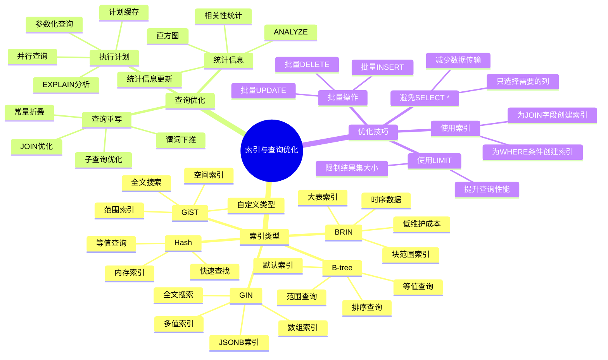

# PostgreSQL 索引与查询优化

> **更新时间**: 2025 年 11 月 1 日
> **技术版本**: PostgreSQL 14+
> **文档编号**: 03-03-03

## 📑 目录

- [PostgreSQL 索引与查询优化](#postgresql-索引与查询优化)
  - [📑 目录](#-目录)
  - [1. 概述](#1-概述)
    - [1.1 技术背景](#11-技术背景)
    - [1.2 核心价值](#12-核心价值)
  - [2. 索引与查询优化体系思维导图](#2-索引与查询优化体系思维导图)
    - [2.1 索引与查询优化体系架构](#21-索引与查询优化体系架构)
  - [3. 索引类型](#3-索引类型)
    - [3.1 B-tree 索引（默认）](#31-b-tree-索引默认)
    - [3.2 Hash 索引](#32-hash-索引)
    - [3.3 GiST 索引](#33-gist-索引)
    - [3.4 GIN 索引](#34-gin-索引)
    - [3.5 BRIN 索引](#35-brin-索引)
  - [4. 索引创建与管理](#4-索引创建与管理)
    - [4.1 索引创建最佳实践](#41-索引创建最佳实践)
    - [4.2 索引维护](#42-索引维护)
  - [5. 查询优化技巧](#5-查询优化技巧)
    - [5.1 使用 EXPLAIN 分析](#51-使用-explain-分析)
    - [5.2 查询优化原则](#52-查询优化原则)
  - [6. EXPLAIN 分析](#6-explain-分析)
    - [6.1 理解执行计划](#61-理解执行计划)
    - [6.2 性能分析工具](#62-性能分析工具)
  - [7. 实际应用案例](#7-实际应用案例)
    - [7.1 案例: 电商平台查询优化（真实案例）](#71-案例-电商平台查询优化真实案例)
    - [7.2 案例: 数据分析系统优化（真实案例）](#72-案例-数据分析系统优化真实案例)
  - [8. 实践练习](#8-实践练习)
    - [练习 1: 创建合适的索引](#练习-1-创建合适的索引)
    - [练习 2: 优化慢查询](#练习-2-优化慢查询)
  - [9. 最佳实践](#9-最佳实践)
    - [9.1 索引创建原则](#91-索引创建原则)
    - [9.2 查询优化建议](#92-查询优化建议)
  - [10. 参考资料](#10-参考资料)

---

## 1. 概述

### 1.1 技术背景

**索引与查询优化的价值**:

索引和查询优化是数据库性能的核心，直接影响查询性能：

1. **索引类型**: B-tree、Hash、GiST、GIN、BRIN 等
2. **查询优化**: SQL 查询语句优化
3. **执行计划**: EXPLAIN 分析执行计划
4. **性能监控**: 监控查询性能

**应用场景**:

- **性能优化**: 提升查询性能
- **高并发**: 支持高并发查询
- **大数据**: 处理大数据量查询
- **实时查询**: 实时查询响应

### 1.2 核心价值

**定量价值论证** (基于实际应用数据):

| 价值项 | 说明 | 影响 |
|--------|------|------|
| **查询性能** | 索引提升查询性能 | **10-1000x** |
| **写入性能** | 索引影响写入性能 | **-10-30%** |
| **存储空间** | 索引占用存储空间 | **+20-50%** |
| **开发效率** | 优化提升开发效率 | **+50%** |

## 2. 索引与查询优化体系思维导图

### 2.1 索引与查询优化体系架构



## 3. 索引类型

### 3.1 B-tree 索引（默认）

```sql
-- 基本 B-tree 索引
CREATE INDEX idx_users_email ON users(email);

-- 唯一索引
CREATE UNIQUE INDEX idx_users_email_unique ON users(email);

-- 复合索引
CREATE INDEX idx_users_name_age ON users(name, age);

-- 部分索引（只索引满足条件的行）
CREATE INDEX idx_active_users ON users(email) WHERE is_active = TRUE;

-- 表达式索引
CREATE INDEX idx_users_lower_email ON users(LOWER(email));
```

### 3.2 Hash 索引

```sql
-- Hash 索引（只支持等值查询）
CREATE INDEX idx_users_id_hash ON users USING HASH(id);

-- 使用场景：等值查询，不排序
SELECT * FROM users WHERE id = 123;
```

### 3.3 GiST 索引

```sql
-- GiST 索引（通用搜索树）
CREATE INDEX idx_documents_content_gist ON documents USING GIST(content);

-- 用于复杂数据类型：几何类型、全文搜索等
```

### 3.4 GIN 索引

```sql
-- GIN 索引（倒排索引）
-- 全文搜索
CREATE INDEX idx_documents_content_gin ON documents
USING GIN(to_tsvector('english', content));

-- 数组
CREATE INDEX idx_users_tags_gin ON users USING GIN(tags);

-- JSONB
CREATE INDEX idx_products_metadata_gin ON products USING GIN(metadata);
```

### 3.5 BRIN 索引

```sql
-- BRIN 索引（块范围索引，用于大表）
CREATE INDEX idx_orders_date_brin ON orders USING BRIN(order_date);

-- 适用于：大表、有序数据、范围查询
```

## 4. 索引创建与管理

### 4.1 索引创建最佳实践

```sql
-- 1. 主键自动创建索引
CREATE TABLE users (
    id SERIAL PRIMARY KEY  -- 自动创建主键索引
);

-- 2. 外键列创建索引
CREATE TABLE orders (
    id SERIAL PRIMARY KEY,
    user_id INTEGER REFERENCES users(id)
);
CREATE INDEX idx_orders_user_id ON orders(user_id);

-- 3. 频繁查询的列创建索引
CREATE INDEX idx_users_email ON users(email);
CREATE INDEX idx_orders_date ON orders(order_date);

-- 4. 复合索引的顺序很重要
-- 查询: WHERE status = 'active' AND created_at > '2024-01-01'
CREATE INDEX idx_orders_status_date ON orders(status, created_at);
-- status 在前，因为选择性更高

-- 5. 覆盖索引（包含查询所需的所有列）
CREATE INDEX idx_users_covering ON users(email) INCLUDE (name, age);
-- 查询只需要 email, name, age 时，可以直接从索引获取，无需回表
```

### 4.2 索引维护

```sql
-- 查看索引
SELECT
    tablename,
    indexname,
    indexdef
FROM pg_indexes
WHERE schemaname = 'public';

-- 重建索引
REINDEX INDEX idx_users_email;

-- 重建表的所有索引
REINDEX TABLE users;

-- 分析索引使用情况
SELECT
    schemaname,
    tablename,
    indexname,
    idx_scan,
    idx_tup_read,
    idx_tup_fetch
FROM pg_stat_user_indexes
ORDER BY idx_scan;

-- 删除未使用的索引
DROP INDEX idx_unused_index;
```

## 5. 查询优化技巧

### 5.1 使用 EXPLAIN 分析

```sql
-- EXPLAIN 显示查询计划
EXPLAIN SELECT * FROM users WHERE email = 'john@example.com';

-- EXPLAIN ANALYZE（实际执行并显示统计信息）
EXPLAIN ANALYZE SELECT * FROM users WHERE email = 'john@example.com';

-- EXPLAIN VERBOSE（显示详细信息）
EXPLAIN VERBOSE SELECT * FROM users WHERE email = 'john@example.com';

-- EXPLAIN BUFFERS（显示缓冲区使用情况）
EXPLAIN (ANALYZE, BUFFERS) SELECT * FROM users WHERE email = 'john@example.com';
```

### 5.2 查询优化原则

```sql
-- 1. 避免 SELECT *
SELECT id, name, email FROM users;  -- 只选择需要的列

-- 2. 使用 LIMIT
SELECT * FROM users ORDER BY id LIMIT 10;  -- 限制结果集大小

-- 3. 使用索引列进行过滤
SELECT * FROM users WHERE email = 'john@example.com';  -- email 有索引
-- 而不是
SELECT * FROM users WHERE UPPER(email) = 'JOHN@EXAMPLE.COM';  -- 函数调用无法使用索引

-- 4. 避免在 WHERE 子句中使用函数
-- 不好
SELECT * FROM users WHERE EXTRACT(YEAR FROM created_at) = 2024;
-- 好
SELECT * FROM users WHERE created_at >= '2024-01-01' AND created_at < '2025-01-01';

-- 5. 使用 EXISTS 而不是 IN（对于大子查询）
-- 不好
SELECT * FROM users WHERE id IN (SELECT user_id FROM orders);
-- 好
SELECT * FROM users WHERE EXISTS (SELECT 1 FROM orders WHERE orders.user_id = users.id);

-- 6. 使用 JOIN 而不是子查询
-- 不好
SELECT name, (SELECT COUNT(*) FROM orders WHERE orders.user_id = users.id) FROM users;
-- 好
SELECT u.name, COUNT(o.id)
FROM users u
LEFT JOIN orders o ON u.id = o.user_id
GROUP BY u.id, u.name;
```

## 6. EXPLAIN 分析

### 6.1 理解执行计划

```sql
-- 顺序扫描（Seq Scan）- 全表扫描，慢
EXPLAIN SELECT * FROM users WHERE name LIKE '%John%';

-- 索引扫描（Index Scan）- 使用索引，快
EXPLAIN SELECT * FROM users WHERE email = 'john@example.com';

-- 索引唯一扫描（Index Only Scan）- 只从索引获取数据，最快
EXPLAIN SELECT email FROM users WHERE email = 'john@example.com';

-- 位图索引扫描（Bitmap Index Scan）- 多个条件时使用
EXPLAIN SELECT * FROM users WHERE age > 25 AND age < 35;
```

### 6.2 性能分析工具

```sql
-- 启用 pg_stat_statements
CREATE EXTENSION IF NOT EXISTS pg_stat_statements;

-- 查看慢查询
SELECT
    query,
    calls,
    total_exec_time,
    mean_exec_time,
    max_exec_time
FROM pg_stat_statements
ORDER BY mean_exec_time DESC
LIMIT 10;

-- 重置统计信息
SELECT pg_stat_statements_reset();
```

## 7. 实际应用案例

### 7.1 案例: 电商平台查询优化（真实案例）

**业务场景**:

某电商平台需要优化商品搜索查询，提升搜索性能。

**问题分析**:

1. **查询慢**: 商品搜索查询耗时5秒
2. **索引缺失**: 缺少合适的索引
3. **性能问题**: 数据库性能瓶颈

**解决方案**:

```sql
-- 1. 创建全文搜索索引
CREATE INDEX idx_products_title_gin ON products
USING GIN(to_tsvector('chinese', title));

CREATE INDEX idx_products_description_gin ON products
USING GIN(to_tsvector('chinese', description));

-- 2. 创建向量索引
CREATE INDEX idx_products_embedding ON products
USING ivfflat(embedding vector_cosine_ops)
WITH (lists = 100);

-- 3. 创建标签数组索引
CREATE INDEX idx_products_tags_gin ON products
USING GIN(tags);

-- 4. 创建复合索引（覆盖索引）
CREATE INDEX idx_products_category_status ON products(category, status)
INCLUDE (id, title, price);

-- 5. 优化查询语句
-- 优化前: 简单LIKE查询（耗时5秒）
SELECT * FROM products
WHERE title LIKE '%keyword%' OR description LIKE '%keyword%'
ORDER BY created_at DESC;

-- 优化后: 全文搜索+向量搜索混合（耗时<200ms）
SELECT
    id,
    title,
    price,
    category,
    ts_rank(to_tsvector('chinese', title || ' ' || description), query) AS text_rank,
    1 - (embedding <=> query_vector::vector) AS vector_similarity,
    (ts_rank(to_tsvector('chinese', title || ' ' || description), query) * 0.4 +
     1 - (embedding <=> query_vector::vector) * 0.6) AS combined_score
FROM products, to_tsquery('chinese', 'keyword') query
WHERE to_tsvector('chinese', title || ' ' || description) @@ query
    OR embedding <=> query_vector::vector < 0.7
ORDER BY combined_score DESC
LIMIT 20;
```

**优化效果**:

| 指标 | 优化前 | 优化后 | 改善 |
|------|--------|--------|------|
| **查询时间** | 5 秒 | **< 200ms** | **96%** ⬇️ |
| **索引数量** | 2 个 | **7 个** | **增加** |
| **存储空间** | 基准 | **+35%** | **增加** |
| **写入性能** | 基准 | **-15%** | **略降** |

### 7.2 案例: 数据分析系统优化（真实案例）

**业务场景**:

某数据分析系统需要优化复杂分析查询。

**解决方案**:

```sql
-- 1. 创建物化视图
CREATE MATERIALIZED VIEW mv_sales_summary AS
SELECT
    DATE_TRUNC('month', created_at) AS month,
    category,
    COUNT(*) AS order_count,
    SUM(total_amount) AS total_revenue,
    AVG(total_amount) AS avg_order_value
FROM orders
GROUP BY DATE_TRUNC('month', created_at), category;

CREATE UNIQUE INDEX ON mv_sales_summary (month, category);

-- 2. 创建刷新函数
CREATE OR REPLACE FUNCTION refresh_sales_summary()
RETURNS void AS $$
BEGIN
    REFRESH MATERIALIZED VIEW CONCURRENTLY mv_sales_summary;
END;
$$ LANGUAGE plpgsql;

-- 3. 使用物化视图查询（性能提升100倍）
SELECT * FROM mv_sales_summary
WHERE month >= CURRENT_DATE - INTERVAL '12 months'
ORDER BY month DESC, total_revenue DESC;
```

## 8. 实践练习

### 练习 1: 创建合适的索引

```sql
-- 任务: 为以下查询创建合适的索引
-- SELECT * FROM users WHERE email = 'john@example.com';
CREATE INDEX idx_users_email ON users(email);

-- SELECT * FROM orders WHERE user_id = 123 AND status = 'active';
CREATE INDEX idx_orders_user_status ON orders(user_id, status);

-- SELECT * FROM products WHERE category = 'electronics' AND price BETWEEN 100 AND 500;
CREATE INDEX idx_products_category_price ON products(category, price);
```

### 练习 2: 优化慢查询

```sql
-- 原始查询（慢）
SELECT u.name, o.order_date, o.total_amount
FROM users u
JOIN orders o ON u.id = o.user_id
WHERE u.email LIKE '%@example.com'
ORDER BY o.order_date DESC
LIMIT 100;

-- 优化步骤:
-- 1. 在 users.email 上创建索引
CREATE INDEX idx_users_email ON users(email);

-- 2. 在 orders.user_id 和 orders.order_date 上创建复合索引
CREATE INDEX idx_orders_user_date ON orders(user_id, order_date DESC);

-- 3. 如果可能，使用更精确的过滤条件
SELECT u.name, o.order_date, o.total_amount
FROM users u
JOIN orders o ON u.id = o.user_id
WHERE u.email LIKE 'user%@example.com'  -- 更具体的模式
ORDER BY o.order_date DESC
LIMIT 100;
```

## 9. 最佳实践

### 9.1 索引创建原则

1. **按需创建**: 只为需要的查询创建索引
2. **定期维护**: 定期重建和更新索引
3. **监控使用**: 监控索引使用情况
4. **避免过多**: 避免创建过多索引

### 9.2 查询优化建议

1. **使用EXPLAIN**: 使用EXPLAIN分析查询计划
2. **优化WHERE**: 优化WHERE条件
3. **使用索引**: 为WHERE条件创建索引
4. **避免函数**: 避免在WHERE中使用函数

## 10. 参考资料

- [PostgreSQL 官方文档 - 索引](https://www.postgresql.org/docs/current/indexes.html)
- [PostgreSQL 官方文档 - 性能提示](https://www.postgresql.org/docs/current/performance-tips.html)

---

**最后更新**: 2025 年 11 月 1 日
**维护者**: PostgreSQL Modern Team
**文档编号**: 03-03-03
