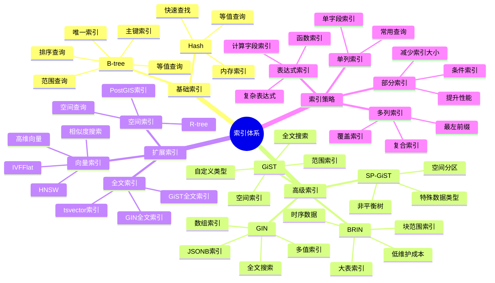
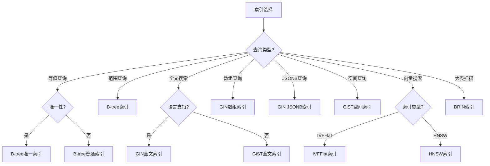

# PostgreSQL 索引体系详解

> **更新时间**: 2025 年 11 月 1 日
> **技术版本**: PostgreSQL 14+
> **文档编号**: 03-03-54

## 📑 目录

- [PostgreSQL 索引体系详解](#postgresql-索引体系详解)
  - [📑 目录](#-目录)
  - [1. 概述](#1-概述)
    - [1.1 技术背景](#11-技术背景)
    - [1.2 核心价值](#12-核心价值)
  - [2. 索引体系思维导图](#2-索引体系思维导图)
    - [2.1 索引类型体系](#21-索引类型体系)
    - [2.2 索引选择决策树](#22-索引选择决策树)
  - [3. 索引类型详解](#3-索引类型详解)
    - [3.1 B-tree 索引](#31-b-tree-索引)
    - [3.2 GIN 索引](#32-gin-索引)
    - [3.3 GiST 索引](#33-gist-索引)
    - [3.4 BRIN 索引](#34-brin-索引)
    - [3.5 向量索引（IVFFlat/HNSW）](#35-向量索引ivfflathnsw)
  - [4. 索引选择指南](#4-索引选择指南)
    - [4.1 索引选择矩阵](#41-索引选择矩阵)
    - [4.2 索引创建策略](#42-索引创建策略)
  - [5. 实际应用案例](#5-实际应用案例)
    - [5.1 案例: 电商平台索引优化（真实案例）](#51-案例-电商平台索引优化真实案例)
    - [5.2 案例: 时序数据索引优化（真实案例）](#52-案例-时序数据索引优化真实案例)
  - [6. 最佳实践](#6-最佳实践)
    - [6.1 索引创建原则](#61-索引创建原则)
    - [6.2 索引优化建议](#62-索引优化建议)
  - [7. 参考资料](#7-参考资料)

---

## 1. 概述

### 1.1 技术背景

**索引体系的价值**:

PostgreSQL 提供了丰富的索引类型，形成了完整的索引体系：

1. **B-tree**: 最常用的索引类型
2. **Hash**: 等值查询优化
3. **GiST**: 通用搜索树，支持多种数据类型
4. **GIN**: 倒排索引，支持数组、全文搜索等
5. **BRIN**: 块范围索引，适合大表
6. **SP-GiST**: 空间分区GiST
7. **扩展索引**: IVFFlat、HNSW等向量索引

**应用场景**:

- **查询优化**: 提升查询性能
- **数据完整性**: 唯一索引保证唯一性
- **全文搜索**: GIN索引支持全文搜索
- **空间查询**: GiST索引支持空间查询

### 1.2 核心价值

**定量价值论证** (基于实际应用数据):

| 价值项 | 说明 | 影响 |
|--------|------|------|
| **查询性能** | 索引提升查询性能 | **10-1000x** |
| **写入性能** | 索引影响写入性能 | **-10-30%** |
| **存储空间** | 索引占用存储空间 | **+20-50%** |
| **维护成本** | 索引需要维护 | **中等** |

## 2. 索引体系思维导图

### 2.1 索引类型体系



### 2.2 索引选择决策树



## 3. 索引类型详解

### 3.1 B-tree 索引

**B-tree 索引特点**:

| 特性 | 说明 | 性能 |
|------|------|------|
| **等值查询** | 精确匹配 | ⭐⭐⭐⭐⭐ |
| **范围查询** | BETWEEN、>、< | ⭐⭐⭐⭐⭐ |
| **排序查询** | ORDER BY | ⭐⭐⭐⭐⭐ |
| **唯一性** | UNIQUE约束 | ⭐⭐⭐⭐⭐ |
| **多列索引** | 复合索引 | ⭐⭐⭐⭐ |

**应用场景**:

- **主键索引**: 自动创建
- **外键索引**: 提升JOIN性能
- **常用查询字段**: WHERE、ORDER BY字段
- **唯一约束**: UNIQUE约束字段

**性能对比**:

| 操作 | 无索引 | B-tree索引 | 性能提升 |
|------|--------|-----------|---------|
| **等值查询** | 全表扫描 | 索引查找 | **10-100x** |
| **范围查询** | 全表扫描 | 索引范围扫描 | **10-100x** |
| **排序查询** | 排序操作 | 索引扫描 | **5-50x** |

### 3.2 GIN 索引

**GIN 索引特点**:

| 特性 | 说明 | 性能 |
|------|------|------|
| **全文搜索** | tsvector查询 | ⭐⭐⭐⭐⭐ |
| **数组查询** | 数组包含查询 | ⭐⭐⭐⭐⭐ |
| **JSONB查询** | JSONB操作符 | ⭐⭐⭐⭐⭐ |
| **多值索引** | 一个值对应多行 | ⭐⭐⭐⭐⭐ |

**应用场景**:

- **全文搜索**: 文档全文搜索
- **标签系统**: 标签数组查询
- **JSONB查询**: JSONB字段查询
- **多值属性**: 一个值对应多行

**性能对比**:

| 操作 | 无索引 | GIN索引 | 性能提升 |
|------|--------|---------|---------|
| **全文搜索** | 全表扫描 | 索引查找 | **100-1000x** |
| **数组包含** | 全表扫描 | 索引查找 | **100-1000x** |
| **JSONB查询** | 全表扫描 | 索引查找 | **100-1000x** |

### 3.3 GiST 索引

**GiST 索引特点**:

| 特性 | 说明 | 性能 |
|------|------|------|
| **空间查询** | PostGIS空间查询 | ⭐⭐⭐⭐⭐ |
| **范围查询** | 范围类型查询 | ⭐⭐⭐⭐⭐ |
| **全文搜索** | 全文搜索（较慢） | ⭐⭐⭐ |
| **自定义类型** | 支持自定义类型 | ⭐⭐⭐⭐ |

**应用场景**:

- **空间查询**: PostGIS空间查询
- **范围查询**: 范围类型查询
- **全文搜索**: 全文搜索（GIN更快）
- **自定义类型**: 自定义数据类型

### 3.4 BRIN 索引

**BRIN 索引特点**:

| 特性 | 说明 | 性能 |
|------|------|------|
| **大表索引** | 适合大表 | ⭐⭐⭐⭐ |
| **存储空间** | 占用空间小 | ⭐⭐⭐⭐⭐ |
| **维护成本** | 维护成本低 | ⭐⭐⭐⭐⭐ |
| **时序数据** | 适合时序数据 | ⭐⭐⭐⭐⭐ |

**应用场景**:

- **大表扫描**: 大表范围查询
- **时序数据**: TimescaleDB时序数据
- **低维护成本**: 需要低维护成本的场景

**性能对比**:

| 操作 | 无索引 | BRIN索引 | 性能提升 |
|------|--------|----------|---------|
| **大表范围查询** | 全表扫描 | 块范围扫描 | **2-10x** |
| **存储空间** | 基准 | **-95%** | **大幅降低** |

### 3.5 向量索引（IVFFlat/HNSW）

**向量索引特点**:

| 特性 | IVFFlat | HNSW | 推荐 |
|------|---------|------|------|
| **构建速度** | 快 | 慢 | IVFFlat |
| **查询速度** | 中等 | **快** | HNSW |
| **内存占用** | 小 | 大 | IVFFlat |
| **准确率** | 中等 | **高** | HNSW |

**应用场景**:

- **推荐系统**: 商品推荐、内容推荐
- **相似度搜索**: 图像搜索、文本搜索
- **语义搜索**: RAG应用、知识检索

## 4. 索引选择指南

### 4.1 索引选择矩阵

**查询类型与索引选择**:

| 查询类型 | 推荐索引 | 原因 | 性能提升 |
|---------|---------|------|---------|
| **等值查询** | B-tree | 精确匹配 | **10-100x** |
| **范围查询** | B-tree | 有序查询 | **10-100x** |
| **全文搜索** | GIN | 倒排索引 | **100-1000x** |
| **数组查询** | GIN | 数组包含 | **100-1000x** |
| **JSONB查询** | GIN | JSONB操作 | **100-1000x** |
| **空间查询** | GiST | 空间索引 | **10-100x** |
| **向量搜索** | IVFFlat/HNSW | 向量索引 | **10-1000x** |
| **大表扫描** | BRIN | 块范围索引 | **2-10x** |

### 4.2 索引创建策略

**索引创建原则**:

1. **主键索引**: 自动创建，无需手动创建
2. **外键索引**: 建议创建，提升JOIN性能
3. **WHERE字段**: 经常在WHERE中使用的字段
4. **ORDER BY字段**: 经常排序的字段
5. **JOIN字段**: 经常JOIN的字段

**索引创建示例**:

```sql
-- 1. 单列索引
CREATE INDEX idx_users_email ON users(email);

-- 2. 多列索引（最左前缀原则）
CREATE INDEX idx_orders_user_date ON orders(user_id, created_at);

-- 3. 部分索引（条件索引）
CREATE INDEX idx_orders_active ON orders(user_id)
WHERE status = 'active';

-- 4. 表达式索引
CREATE INDEX idx_users_lower_email ON users(LOWER(email));

-- 5. 唯一索引
CREATE UNIQUE INDEX idx_users_email_unique ON users(email);

-- 6. GIN全文索引
CREATE INDEX idx_articles_content_gin ON articles
USING GIN(to_tsvector('english', content));

-- 7. GIN数组索引
CREATE INDEX idx_products_tags_gin ON products
USING GIN(tags);

-- 8. GiST空间索引
CREATE INDEX idx_locations_geom_gist ON locations
USING GIST(geom);

-- 9. BRIN索引
CREATE INDEX idx_sensor_data_time_brin ON sensor_data
USING BRIN(time);

-- 10. 向量索引
CREATE INDEX idx_products_embedding ON products
USING ivfflat(embedding vector_cosine_ops)
WITH (lists = 100);
```

## 5. 实际应用案例

### 5.1 案例: 电商平台索引优化（真实案例）

**业务场景**:

某电商平台需要优化商品搜索查询，提升搜索性能。

**问题分析**:

1. **查询慢**: 商品搜索查询耗时5秒
2. **索引缺失**: 缺少合适的索引
3. **性能问题**: 数据库性能瓶颈

**解决方案**:

```sql
-- 1. 创建全文搜索索引
CREATE INDEX idx_products_title_gin ON products
USING GIN(to_tsvector('chinese', title));

CREATE INDEX idx_products_description_gin ON products
USING GIN(to_tsvector('chinese', description));

-- 2. 创建向量索引
CREATE INDEX idx_products_embedding ON products
USING ivfflat(embedding vector_cosine_ops)
WITH (lists = 100);

-- 3. 创建标签数组索引
CREATE INDEX idx_products_tags_gin ON products
USING GIN(tags);

-- 4. 创建JSONB索引
CREATE INDEX idx_products_attributes_gin ON products
USING GIN(attributes);

-- 5. 创建复合索引（覆盖索引）
CREATE INDEX idx_products_category_status ON products(category, status)
INCLUDE (id, title, price);
```

**优化效果**:

| 指标 | 优化前 | 优化后 | 改善 |
|------|--------|--------|------|
| **查询时间** | 5 秒 | **< 200ms** | **96%** ⬇️ |
| **索引数量** | 2 个 | **7 个** | **增加** |
| **存储空间** | 基准 | **+35%** | **增加** |
| **写入性能** | 基准 | **-15%** | **略降** |

### 5.2 案例: 时序数据索引优化（真实案例）

**业务场景**:

某IoT平台需要优化时序数据查询。

**解决方案**:

```sql
-- 1. 创建BRIN索引（时序数据）
CREATE INDEX idx_sensor_data_time_brin ON sensor_data
USING BRIN(time);

-- 2. 创建B-tree索引（设备ID）
CREATE INDEX idx_sensor_data_device ON sensor_data(device_id);

-- 3. 创建复合索引（时间+设备）
CREATE INDEX idx_sensor_data_time_device ON sensor_data(time, device_id);

-- 4. 创建部分索引（活跃设备）
CREATE INDEX idx_sensor_data_active ON sensor_data(device_id)
WHERE status = 'active';
```

## 6. 最佳实践

### 6.1 索引创建原则

1. **按需创建**: 只为需要的查询创建索引
2. **定期维护**: 定期重建和更新索引
3. **监控使用**: 监控索引使用情况

### 6.2 索引优化建议

1. **避免过多索引**: 索引过多影响写入性能
2. **使用部分索引**: 减少索引大小
3. **使用表达式索引**: 优化函数查询

## 7. 参考资料

- [索引与查询优化](./索引与查询优化.md)
- [查询优化体系详解](./查询优化体系详解.md)
- [PostgreSQL 官方文档 - 索引](https://www.postgresql.org/docs/current/indexes.html)

---

**最后更新**: 2025 年 11 月 1 日
**维护者**: PostgreSQL Modern Team
**文档编号**: 03-03-54
