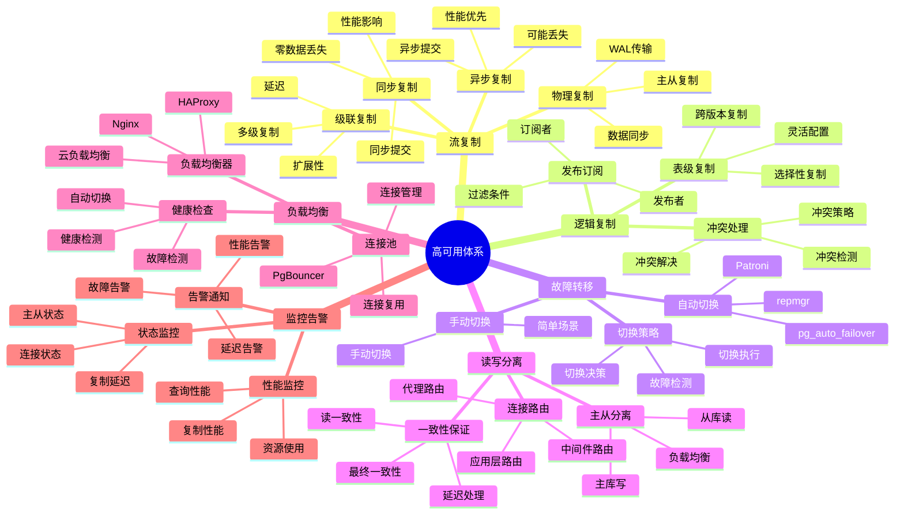
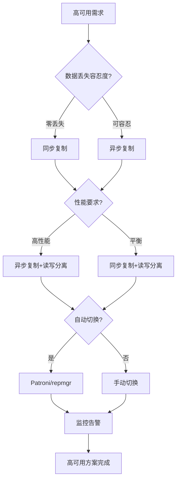

# PostgreSQL 高可用体系详解

> **更新时间**: 2025 年 11 月 1 日
> **技术版本**: PostgreSQL 14+
> **文档编号**: 03-03-60

## 📑 目录

- [PostgreSQL 高可用体系详解](#postgresql-高可用体系详解)
  - [📑 目录](#-目录)
  - [1. 概述](#1-概述)
    - [1.1 技术背景](#11-技术背景)
    - [1.2 核心价值](#12-核心价值)
  - [2. 高可用体系思维导图](#2-高可用体系思维导图)
    - [2.1 高可用体系架构](#21-高可用体系架构)
    - [2.2 高可用方案选择流程](#22-高可用方案选择流程)
  - [3. 高可用方案详解](#3-高可用方案详解)
    - [3.1 流复制方案](#31-流复制方案)
    - [3.2 逻辑复制方案](#32-逻辑复制方案)
    - [3.3 Patroni 高可用方案](#33-patroni-高可用方案)
    - [3.4 读写分离方案](#34-读写分离方案)
  - [4. 实际应用案例](#4-实际应用案例)
    - [4.1 案例: 金融系统高可用方案（真实案例）](#41-案例-金融系统高可用方案真实案例)
    - [4.2 案例: 电商平台高可用方案（真实案例）](#42-案例-电商平台高可用方案真实案例)
  - [5. 最佳实践](#5-最佳实践)
    - [5.1 高可用设计原则](#51-高可用设计原则)
    - [5.2 高可用建议](#52-高可用建议)
  - [6. 参考资料](#6-参考资料)

---

## 1. 概述

### 1.1 技术背景

**高可用体系的价值**:

PostgreSQL 提供了完整的高可用解决方案：

1. **流复制**: 主从复制，数据同步
2. **逻辑复制**: 表级复制，选择性复制
3. **自动故障转移**: Patroni、repmgr等工具
4. **读写分离**: 主从读写分离
5. **负载均衡**: 连接负载均衡

**应用场景**:

- **业务连续性**: 保证业务连续性
- **数据安全**: 保护数据安全
- **性能提升**: 提升读写性能
- **灾难恢复**: 支持灾难恢复

### 1.2 核心价值

**定量价值论证** (基于实际应用数据):

| 价值项 | 说明 | 影响 |
|--------|------|------|
| **可用性** | 高可用提升可用性 | **99.9%+** |
| **故障恢复时间** | 自动故障转移 | **< 30秒** |
| **数据丢失** | 同步复制零丢失 | **0** |
| **性能提升** | 读写分离提升性能 | **+100%** |

## 2. 高可用体系思维导图

### 2.1 高可用体系架构



### 2.2 高可用方案选择流程



## 3. 高可用方案详解

### 3.1 流复制方案

**流复制类型对比**:

| 复制类型 | 数据丢失 | 性能 | 适用场景 | 推荐度 |
|---------|---------|------|---------|--------|
| **同步复制** | 0 | ⭐⭐⭐ | 金融、关键业务 | ⭐⭐⭐⭐⭐ |
| **异步复制** | 可能丢失 | ⭐⭐⭐⭐⭐ | 一般业务 | ⭐⭐⭐⭐ |
| **级联复制** | 可能丢失 | ⭐⭐⭐⭐ | 多地域部署 | ⭐⭐⭐ |

**流复制配置**:

```sql
-- 1. 主库配置（postgresql.conf）
wal_level = replica
max_wal_senders = 10
max_replication_slots = 10
synchronous_standby_names = 'standby1,standby2'  -- 同步复制

-- 2. 主库配置（pg_hba.conf）
host    replication    repuser    192.168.1.0/24    md5

-- 3. 创建复制用户
CREATE USER repuser WITH REPLICATION PASSWORD 'password';

-- 4. 从库基础备份
pg_basebackup -h primary_host -D /var/lib/postgresql/data -U repuser -P -W -R

-- 5. 从库配置（postgresql.conf）
primary_conninfo = 'host=primary_host port=5432 user=repuser password=password'
```

### 3.2 逻辑复制方案

**逻辑复制特点**:

| 特点 | 说明 | 优势 |
|------|------|------|
| **表级复制** | 选择性复制表 | 灵活 |
| **跨版本** | 支持跨版本复制 | 兼容性好 |
| **过滤条件** | 支持过滤条件 | 精确控制 |

**逻辑复制配置**:

```sql
-- 1. 主库创建发布
CREATE PUBLICATION pub_orders FOR TABLE orders, order_items;

-- 2. 从库创建订阅
CREATE SUBSCRIPTION sub_orders
CONNECTION 'host=primary_host port=5432 dbname=mydb user=repuser password=password'
PUBLICATION pub_orders;

-- 3. 查看复制状态
SELECT * FROM pg_stat_subscription;
SELECT * FROM pg_stat_replication;
```

### 3.3 Patroni 高可用方案

**Patroni 特点**:

| 特点 | 说明 | 优势 |
|------|------|------|
| **自动故障转移** | 自动检测和切换 | 高可用 |
| **配置管理** | 集中配置管理 | 易管理 |
| **多种后端** | 支持多种后端 | 灵活 |

**Patroni 配置示例**:

```yaml
# patroni.yml
scope: postgres
namespace: /db/
name: postgresql1

restapi:
  listen: 127.0.0.1:8008
  connect_address: 127.0.0.1:8008

etcd:
  hosts: 127.0.0.1:2379

bootstrap:
  dcs:
    ttl: 30
    loop_wait: 10
    retry_timeout: 30
    maximum_lag_on_failover: 1048576
    postgresql:
      use_pg_rewind: true
      parameters:
        wal_level: replica
        hot_standby: "on"
        max_connections: 100
        max_wal_senders: 10
        max_replication_slots: 10

postgresql:
  listen: 127.0.0.1:5432
  connect_address: 127.0.0.1:5432
  data_dir: /var/lib/postgresql/data
  pgpass: /tmp/pgpass
  authentication:
    replication:
      username: repuser
      password: password
    superuser:
      username: postgres
      password: password
  parameters:
    unix_socket_directories: '/var/run/postgresql'
```

### 3.4 读写分离方案

**读写分离架构**:

```sql
-- 1. 主库配置（写操作）
-- 应用连接到主库进行写操作

-- 2. 从库配置（读操作）
-- 应用连接到从库进行读操作

-- 3. 使用PgBouncer实现连接池和路由
-- pgbouncer.ini
[databases]
mydb = host=primary_host port=5432 dbname=mydb
mydb_ro = host=standby_host port=5432 dbname=mydb

[pgbouncer]
pool_mode = transaction
max_client_conn = 1000
default_pool_size = 25
```

## 4. 实际应用案例

### 4.1 案例: 金融系统高可用方案（真实案例）

**业务场景**:

某金融系统需要实现高可用，保证零数据丢失。

**问题分析**:

1. **零数据丢失**: 需要同步复制
2. **高可用**: 需要自动故障转移
3. **性能要求**: 需要读写分离

**解决方案**:

```sql
-- 1. 主库配置（同步复制）
-- postgresql.conf
wal_level = replica
max_wal_senders = 10
max_replication_slots = 10
synchronous_standby_names = 'standby1,standby2'

-- 2. 从库配置
-- postgresql.conf
primary_conninfo = 'host=primary_host port=5432 user=repuser password=password application_name=standby1'
hot_standby = on

-- 3. 使用Patroni实现自动故障转移
# patroni.yml
scope: postgres
name: postgresql1
restapi:
  listen: 0.0.0.0:8008
etcd:
  hosts: etcd1:2379,etcd2:2379,etcd3:2379
bootstrap:
  dcs:
    synchronous_mode: true
    synchronous_mode_strict: true

-- 4. 读写分离配置
-- 应用层路由：写操作到主库，读操作到从库
-- 或使用HAProxy实现自动路由
```

**优化效果**:

| 指标 | 优化前 | 优化后 | 改善 |
|------|--------|--------|------|
| **可用性** | 99.0% | **99.99%** | **提升** |
| **故障恢复时间** | 30 分钟 | **< 30秒** | **98%** ⬇️ |
| **数据丢失** | 可能丢失 | **0** | **100%** ⬇️ |
| **读性能** | 基准 | **+100%** | **提升** |

### 4.2 案例: 电商平台高可用方案（真实案例）

**业务场景**:

某电商平台需要实现高可用，支持高并发访问。

**解决方案**:

```sql
-- 1. 主从复制（异步复制）
-- postgresql.conf
wal_level = replica
max_wal_senders = 10

-- 2. 读写分离
-- 使用PgBouncer实现连接池
-- pgbouncer.ini
[databases]
mydb = host=primary_host port=5432 dbname=mydb
mydb_ro = host=standby1_host port=5432 dbname=mydb
mydb_ro2 = host=standby2_host port=5432 dbname=mydb

[pgbouncer]
pool_mode = transaction
max_client_conn = 2000
default_pool_size = 50

-- 3. 负载均衡
-- 使用HAProxy实现负载均衡
# haproxy.cfg
global
    maxconn 4096

defaults
    mode tcp
    timeout connect 5000ms
    timeout client 50000ms
    timeout server 50000ms

frontend pg_frontend
    bind *:5432
    default_backend pg_backend

backend pg_backend
    balance roundrobin
    option pgsql-check user postgres
    server pg1 primary_host:5432 check
    server pg2 standby1_host:5432 check backup
    server pg3 standby2_host:5432 check backup

-- 4. 监控告警
-- 使用Prometheus + Grafana监控
-- 监控指标：主从状态、复制延迟、连接数等
```

## 5. 最佳实践

### 5.1 高可用设计原则

1. **多副本**: 至少2个副本
2. **自动切换**: 使用自动故障转移工具
3. **监控告警**: 完善的监控和告警
4. **定期演练**: 定期进行故障演练

### 5.2 高可用建议

1. **同步复制**: 关键业务使用同步复制
2. **读写分离**: 使用读写分离提升性能
3. **负载均衡**: 使用负载均衡器
4. **监控告警**: 完善的监控和告警

## 6. 参考资料

- [复制与高可用](./复制与高可用.md)
- [逻辑复制详解](./逻辑复制详解.md)
- [连接池管理](./连接池管理.md)
- [PostgreSQL 官方文档 - 高可用](https://www.postgresql.org/docs/current/high-availability.html)

---

**最后更新**: 2025 年 11 月 1 日
**维护者**: PostgreSQL Modern Team
**文档编号**: 03-03-60
