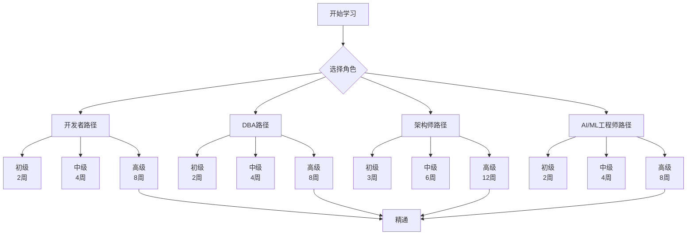

# 🎓 完整学习地图：PostgreSQL 18 + AI 从入门到精通

> **更新日期**: 2025年12月4日
> **适用人群**: 所有技术人员
> **学习周期**: 2-12周（根据目标调整）

---

## 🗺️ 学习路径总览



---

## 📊 学习等级定义

### Level 1：初级（入门）

**目标**：掌握基础概念和基本操作
**时间**：2-3周
**评估**：能完成简单的CRUD操作和基础配置

### Level 2：中级（熟练）

**目标**：掌握核心技术和常见场景
**时间**：4-6周
**评估**：能独立完成常见项目开发

### Level 3：高级（精通）

**目标**：掌握高级特性和复杂场景
**时间**：8-12周
**评估**：能解决复杂问题并进行架构设计

---

## 🎯 按角色的完整学习路径

### 1️⃣ 开发者学习路径

#### **Level 1：初级开发者**（2周，每天2-3小时）

**第1周：PostgreSQL基础**

| 天 | 主题 | 学习资源 | 实践任务 | 时间 |
|----|------|---------|---------|------|
| 1 | PostgreSQL安装与配置 | 基础入门章节 | 安装配置PostgreSQL | 2h |
| 2 | SQL基础（DDL/DML） | 基础语法章节 | 创建表、插入数据 | 2h |
| 3 | 查询基础 | 查询章节 | SELECT、JOIN查询 | 3h |
| 4 | 索引基础 | 索引章节 | 创建和使用索引 | 2h |
| 5 | 数据类型 | 数据类型章节 | 使用各种数据类型 | 2h |
| 6-7 | 综合练习 | - | 构建简单博客系统 | 6h |

**第2周：AI集成基础**

| 天 | 主题 | 学习资源 | 实践任务 | 时间 |
|----|------|---------|---------|------|
| 1 | 向量数据库基础 | pgvector指南（前半部分） | 安装pgvector | 2h |
| 2 | 向量存储与检索 | pgvector指南（后半部分） | 实现相似度搜索 | 3h |
| 3 | Python集成 | psycopg2文档 | Python操作PostgreSQL | 2h |
| 4 | JSON数据处理 | JSON指南 | 存储和查询JSON | 2h |
| 5 | 全文搜索 | FTS指南 | 实现搜索功能 | 3h |
| 6-7 | 项目实战 | - | 构建简单搜索系统 | 6h |

**Level 1 考核项目**：构建一个支持向量搜索的文档管理系统

---

#### **Level 2：中级开发者**（4周，每天2-3小时）

**第1周：RAG应用开发**

| 天 | 主题 | 学习资源 | 实践任务 |
|----|------|---------|---------|
| 1-2 | LangChain基础 | LangChain指南（第1-3章） | 搭建RAG环境 |
| 3-4 | 检索策略 | LangChain指南（第4-5章） | 实现多种检索 |
| 5-6 | Agent开发 | LangChain指南（第6-7章） | 构建智能Agent |
| 7 | 综合实践 | - | 完整RAG系统 |

**第2周：性能优化**

| 天 | 主题 | 学习资源 | 实践任务 |
|----|------|---------|---------|
| 1-2 | 查询优化 | 查询优化器指南（前半） | EXPLAIN分析 |
| 3-4 | 索引优化 | 向量索引调优指南 | HNSW调优 |
| 5-6 | 连接池与缓存 | 性能调优章节 | 配置连接池 |
| 7 | 性能测试 | - | 基准测试 |

**第3周：多模态AI**

| 天 | 主题 | 学习资源 | 实践任务 |
|----|------|---------|---------|
| 1-2 | CLIP模型 | 多模态指南（第1-3章） | 文本图像编码 |
| 3-4 | 跨模态检索 | 多模态指南（第4-5章） | 实现跨模态搜索 |
| 5-6 | 多模态融合 | 多模态指南（第6章） | 融合查询 |
| 7 | 综合实践 | - | 智能相册系统 |

**第4周：项目实战**

构建一个完整的AI驱动的智能搜索平台：

- 支持文本、图像多模态输入
- RAG驱动的智能问答
- 性能优化的向量检索
- 完整的监控和日志

**Level 2 考核项目**：智能搜索平台（多模态 + RAG + 性能优化）

---

#### **Level 3：高级开发者**（8周，每天2-3小时）

**第1-2周：高级AI集成**

- LlamaIndex深度集成（6种索引类型）
- HuggingFace本地模型部署
- 模型微调（LoRA）
- AI驱动的查询优化器

**第3-4周：安全与隐私**

- 同态加密查询处理
- 联邦学习与隐私计算
- 数据溯源与血缘分析
- RLS行级安全

**第5-6周：分布式与边缘**

- Citus分布式PostgreSQL
- WASM边缘计算
- Istio服务网格
- Kubernetes云原生部署

**第7-8周：知识图谱与概率**

- Apache AGE图数据库
- 知识图谱本体建模
- 概率数据库
- 混合查询系统

**Level 3 考核项目**：构建企业级AI平台（包含上述所有技术）

---

### 2️⃣ DBA学习路径

#### **Level 1：初级DBA**（2周）

**第1周：基础运维**

- PostgreSQL安装部署
- 配置文件管理
- 用户权限管理
- 备份恢复基础
- 日志管理

**第2周：监控与维护**

- 监控指标收集
- 慢查询分析
- 表膨胀处理
- VACUUM管理
- 索引维护

---

#### **Level 2：中级DBA**（4周）

**第1周：高可用架构**

- 流复制配置
- Patroni自动故障转移
- 读写分离
- 连接池（PgBouncer）

**第2周：性能调优**

- 参数调优
- 查询优化
- 索引策略
- 分区表管理

**第3周：备份恢复**

- PITR（时间点恢复）
- pg_basebackup
- 逻辑备份
- 灾备演练

**第4周：AI辅助运维**

- AI自治数据库配置
- 自动故障预测
- 智能索引推荐
- 容量规划

---

#### **Level 3：高级DBA**（8周）

**第1-2周：分布式架构**

- Citus集群部署
- 分片策略
- 数据再平衡
- 分布式事务

**第3-4周：云原生部署**

- Kubernetes StatefulSet
- PostgreSQL Operator
- Istio服务网格
- 多云部署

**第5-6周：高级优化**

- AI驱动查询优化器
- 向量索引深度调优
- 慢查询自动优化
- 成本模型调整

**第7-8周：安全与合规**

- 同态加密部署
- 数据溯源系统
- 审计日志分析
- 合规性管理

---

### 3️⃣ 架构师学习路径

#### **Level 1：初级架构师**（3周）

**第1周：架构基础**

- PostgreSQL架构原理
- MVCC与事务隔离
- 查询执行流程
- 存储引擎

**第2周：数据模型设计**

- 关系模型设计
- JSON半结构化数据
- 向量数据建模
- 图数据建模

**第3周：基础架构设计**

- 高可用架构
- 读写分离
- 备份策略
- 监控体系

---

#### **Level 2：中级架构师**（6周）

**第1-2周：混合数据库架构**

- 多模型融合设计
- 关系+JSON+向量
- 图+时序+空间
- 统一查询接口

**第3-4周：分布式架构**

- Citus分布式设计
- 分片策略选择
- 分布式事务
- CAP权衡

**第5-6周：AI应用架构**

- RAG架构设计
- 向量检索架构
- 混合检索策略
- 多模态架构

---

#### **Level 3：高级架构师**（12周）

**第1-3周：云原生架构**

- Kubernetes架构
- 服务网格（Istio）
- 边缘计算架构
- 多云/混合云

**第4-6周：安全架构**

- 同态加密架构
- 联邦学习架构
- 零信任架构
- 数据主权

**第7-9周：知识图谱架构**

- 本体建模
- 知识融合
- 语义推理
- 知识问答

**第10-12周：行业架构实践**

- 金融行业架构
- 医疗行业架构
- 电商架构
- IoT架构

---

### 4️⃣ AI/ML工程师学习路径

#### **Level 1：初级AI工程师**（2周）

**第1周：向量数据库**

- pgvector基础
- 向量存储
- 相似度搜索
- Python集成

**第2周：RAG基础**

- LangChain入门
- 文档加载与分割
- 向量存储与检索
- 简单问答系统

---

#### **Level 2：中级AI工程师**（4周）

**第1周：高级RAG**

- 多种检索策略
- Chain开发
- Agent开发
- 记忆管理

**第2周：LlamaIndex**

- 6种索引类型
- 查询引擎
- 响应合成
- SQL集成

**第3周：本地模型**

- HuggingFace集成
- 模型选择
- LoRA微调
- 模型优化

**第4周：多模态AI**

- CLIP模型
- 跨模态检索
- 模态融合
- 应用实践

---

#### **Level 3：高级AI工程师**（8周）

**第1-2周：AI优化器**

- 神经网络基数估计
- Tree-LSTM成本预测
- 强化学习JOIN优化
- 生产部署

**第2-3周：隐私计算**

- 同态加密查询
- 联邦学习
- 差分隐私
- 安全多方计算

**第4-5周：知识图谱**

- 图数据库（AGE）
- 本体建模（OWL）
- 语义推理
- 知识问答

**第6-7周：概率AI**

- 概率数据库
- 不确定性管理
- 概率查询
- ProvSQL

**第8周：综合项目**

- 构建完整AI系统
- 集成所有技术
- 性能优化
- 部署上线

---

## 📚 推荐学习顺序

### 顺序A：由浅入深（适合新手）

```text
基础入门 → 数据类型 → 查询 → 索引 →
向量数据库 → RAG → 性能优化 →
高级特性 → 分布式 → 云原生
```

### 顺序B：目标驱动（适合有经验者）

```text
确定目标 → 选择核心技术 → 深入学习 →
扩展相关技术 → 系统集成 → 优化部署
```

### 顺序C：项目驱动（适合实战派）

```text
选择项目 → 学习所需技术 → 边学边做 →
遇到问题深入研究 → 完成项目 → 总结提升
```

---

## 🎯 学习检查清单

### PostgreSQL基础 ✅

- [ ] SQL基础（DDL、DML、DCL）
- [ ] 数据类型（基础、JSON、数组等）
- [ ] 查询（JOIN、子查询、CTE等）
- [ ] 索引（B-tree、GIN、GiST等）
- [ ] 事务与锁
- [ ] 函数与存储过程

### AI/ML集成 ✅

- [ ] pgvector安装与使用
- [ ] 向量相似度搜索
- [ ] LangChain集成
- [ ] LlamaIndex使用
- [ ] HuggingFace模型集成
- [ ] RAG应用开发

### 性能优化 ✅

- [ ] EXPLAIN查询分析
- [ ] 索引优化策略
- [ ] 向量索引调优
- [ ] AI驱动优化器
- [ ] 慢查询优化
- [ ] 连接池配置

### 高可用与分布式 ✅

- [ ] 流复制配置
- [ ] 自动故障转移
- [ ] 读写分离
- [ ] Citus分布式
- [ ] Kubernetes部署
- [ ] Istio服务网格

### 安全与隐私 ✅

- [ ] RLS行级安全
- [ ] 同态加密
- [ ] 联邦学习
- [ ] 数据溯源
- [ ] 审计日志

### 知识图谱 ✅

- [ ] Apache AGE使用
- [ ] Cypher查询语言
- [ ] 本体建模（OWL）
- [ ] SPARQL查询
- [ ] 知识推理

---

## 📖 推荐阅读顺序

### 第一阶段：入门（17份必读）

1. [PostgreSQL混合数据库能力图谱](./PostgreSQL培训/01-基础入门/【综合】PostgreSQL混合数据库完整能力图谱.md)
2. [pgvector向量数据库](./PostgreSQL培训/14-AI与机器学习/【深入】pgvector向量数据库与AI集成完整指南.md)
3. [JSON/JSONB高级查询](./PostgreSQL培训/03-数据类型/【深入】JSON-JSONB高级查询完整指南.md)
4. [全文搜索](./PostgreSQL培训/04-查询/【深入】PostgreSQL全文搜索完整实战指南.md)
5. [LangChain集成](./PostgreSQL培训/14-AI与机器学习/【深入】LangChain+PostgreSQL完整集成指南.md)

### 第二阶段：进阶（12份深入）

6. [LlamaIndex集成](./PostgreSQL培训/14-AI与机器学习/【深入】LlamaIndex+PostgreSQL完整实战指南.md)
7. [多模型融合查询](./PostgreSQL培训/04-查询/【深入】多模型融合查询完整指南.md)
8. [向量索引调优](./PostgreSQL培训/11-性能调优/【深入】向量索引高级调优指南.md)
9. [AI驱动查询优化器](./PostgreSQL培训/11-性能调优/【深入】AI驱动的查询优化器完整指南.md)
10. [HuggingFace集成](./PostgreSQL培训/14-AI与机器学习/【深入】HuggingFace+PostgreSQL集成指南.md)

### 第三阶段：高级（10份前沿）

11. [同态加密查询](./PostgreSQL培训/07-安全/【深入】同态加密查询处理完整指南.md)
12. [联邦学习](./PostgreSQL培训/07-安全/【深入】联邦学习与隐私计算完整指南.md)
13. [数据溯源](./PostgreSQL培训/07-安全/【深入】数据溯源与血缘分析完整指南.md)
14. [AI自治数据库](./PostgreSQL培训/13-运维管理/【深入】AI驱动的自治数据库完整指南.md)
15. [知识图谱本体](./PostgreSQL培训/12-扩展开发/【深入】知识图谱本体建模与推理指南.md)
16. [多模态向量学习](./PostgreSQL培训/14-AI与机器学习/【深入】多模态向量表示学习完整指南.md)
17. [WASM边缘计算](./PostgreSQL培训/18-新技术趋势/【深入】WASM+PostgreSQL边缘计算完整指南.md)

---

## 🏆 学习成果评估

### 初级水平

- ✅ 能使用PostgreSQL进行基础开发
- ✅ 能实现简单的向量搜索
- ✅ 能使用LangChain构建RAG应用
- ✅ 能进行基础的性能优化

### 中级水平

- ✅ 能设计复杂的数据模型
- ✅ 能优化复杂查询性能
- ✅ 能构建完整的AI应用
- ✅ 能进行高可用部署

### 高级水平

- ✅ 能进行复杂系统架构设计
- ✅ 能解决疑难性能问题
- ✅ 能实施企业级安全方案
- ✅ 能指导团队技术选型

---

**祝学习顺利！** 🎉

---

**最后更新**: 2025年12月4日
**维护者**: PostgreSQL Modern Team
**文档编号**: LEARNING-MAP-2025-12
