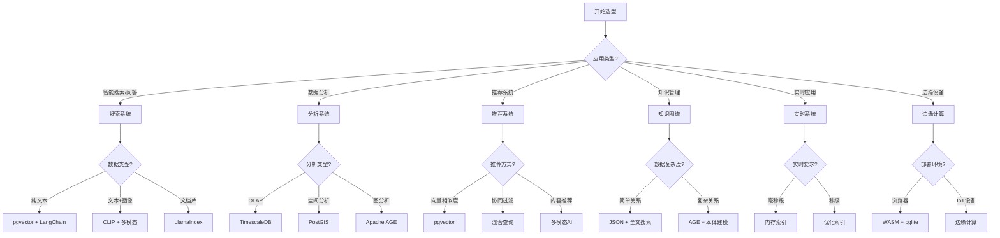
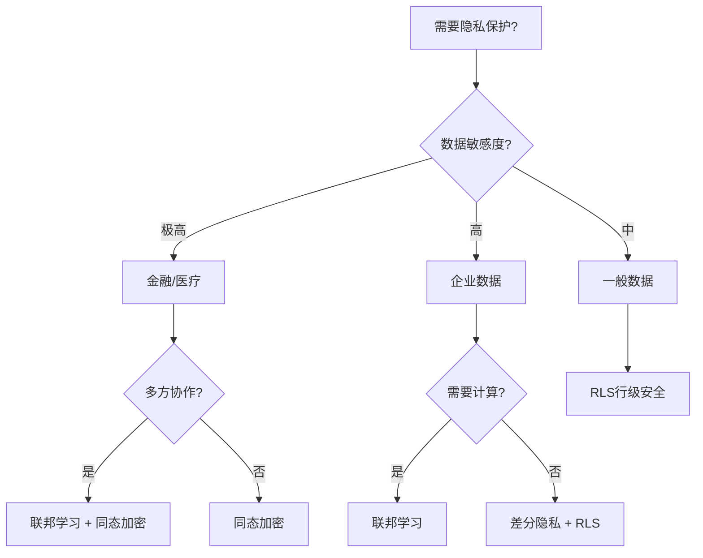
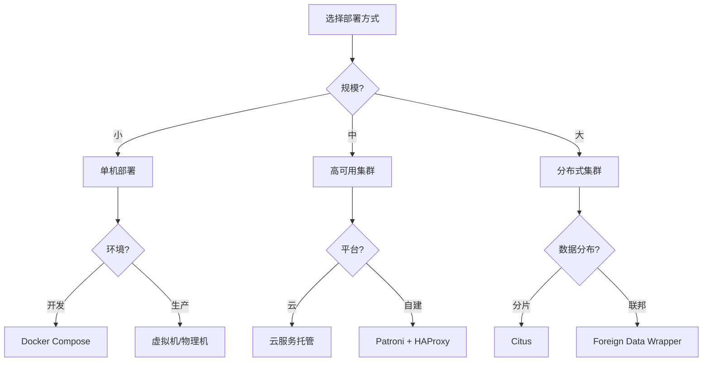

# 🎯 技术选型决策指南：PostgreSQL 18 + AI 技术栈

> **更新日期**: 2025年12月4日
> **适用场景**: 技术选型、架构设计、方案评估
> **阅读时间**: 15分钟

---

## 🎯 快速决策树

### 场景1：我要构建什么类型的应用？



---

## 📊 核心技术选型矩阵

### 向量数据库选型

| 场景 | 推荐方案 | 原因 | 性能 |
|------|---------|------|------|
| **小数据量**（<10万） | pgvector + 暴力搜索 | 简单、准确 | 100% 召回 |
| **中数据量**（10万-100万） | pgvector + HNSW | 平衡性能和精度 | 95%+ 召回 |
| **大数据量**（>100万） | pgvector + IVFFlat | 高性能 | 90%+ 召回 |
| **超大数据量**（>1000万） | pgvector + 分布式 | 水平扩展 | 可调 |
| **实时更新频繁** | pgvector + HNSW | 支持增量 | 优秀 |
| **精度要求极高** | 混合检索 | 向量+关键词 | 98%+ 召回 |

### RAG框架选型

| 场景 | LangChain | LlamaIndex | 自定义 |
|------|-----------|-----------|--------|
| **快速原型** | ✅ 首选 | ✅ 备选 | ❌ |
| **生产环境** | ✅ 推荐 | ✅ 推荐 | ⚠️ 看情况 |
| **简单问答** | ✅ 最佳 | ✅ | ❌ |
| **复杂推理** | ✅ Agent | ⚠️ 限制 | ✅ |
| **文档分析** | ✅ | ✅ 最佳 | ❌ |
| **SQL集成** | ⚠️ 需插件 | ✅ 原生 | ✅ |
| **自定义流程** | ✅ Chain | ⚠️ 限制 | ✅ 最佳 |

**推荐策略**：

- **新手 / 快速开发**：LangChain
- **文档管理 / SQL查询**：LlamaIndex
- **复杂业务 / 极致性能**：自定义

### 模型选型

| 需求 | OpenAI API | HuggingFace本地 | 自训练 |
|------|-----------|----------------|--------|
| **开发速度** | ⚡⚡⚡ 最快 | ⚡⚡ 快 | ⚡ 慢 |
| **成本（小规模）** | 💰 低 | 💰💰 中 | 💰💰💰 高 |
| **成本（大规模）** | 💰💰💰 极高 | 💰 低 | 💰💰 中 |
| **数据隐私** | ❌ 数据外传 | ✅ 完全控制 | ✅ 完全控制 |
| **定制能力** | ❌ 无 | ⚠️ LoRA微调 | ✅ 完全定制 |
| **性能控制** | ❌ 受限 | ✅ 可优化 | ✅ 完全优化 |

**推荐策略**：

- **原型 / 小规模**：OpenAI API
- **生产 / 中大规模 / 敏感数据**：HuggingFace本地
- **特定领域 / 极致性能**：自训练

---

## 🔐 安全与隐私选型

### 隐私保护技术选型

| 场景 | 推荐技术 | 性能损耗 | 安全级别 |
|------|---------|---------|---------|
| **多方协作训练** | 联邦学习 | 20-30% | ⭐⭐⭐⭐ |
| **密文计算** | 同态加密 | 100-1000x | ⭐⭐⭐⭐⭐ |
| **查询隐私** | 差分隐私 | 5-10% | ⭐⭐⭐ |
| **数据追溯** | 数据溯源 | <5% | ⭐⭐⭐⭐ |
| **访问控制** | RLS | 1-5% | ⭐⭐⭐ |

**选型决策**：



---

## 🚀 性能优化技术选型

### 查询优化选型

| 场景 | 技术方案 | 提升幅度 | 复杂度 |
|------|---------|---------|--------|
| **简单查询慢** | 添加索引 | 10-100x | ⭐ |
| **复杂JOIN慢** | AI查询优化器 | 2-5x | ⭐⭐⭐ |
| **向量查询慢** | HNSW调优 | 5-10x | ⭐⭐ |
| **全表扫描** | 分区表 | 5-50x | ⭐⭐⭐ |
| **聚合查询慢** | 物化视图 | 10-100x | ⭐⭐ |
| **高并发慢** | 连接池 | 2-3x | ⭐ |

### 扩展性选型

| 数据量 | 推荐方案 | 成本 | 复杂度 |
|--------|---------|------|--------|
| **<100GB** | 单机 | 💰 | ⭐ |
| **100GB-1TB** | 读写分离 | 💰💰 | ⭐⭐ |
| **1TB-10TB** | 分区表 | 💰💰 | ⭐⭐⭐ |
| **10TB-100TB** | Citus分布式 | 💰💰💰 | ⭐⭐⭐⭐ |
| **>100TB** | 分片+归档 | 💰💰💰💰 | ⭐⭐⭐⭐⭐ |

---

## 🏗️ 架构模式选型

### 部署架构选型



### 服务架构选型

| 架构模式 | 适用场景 | 优势 | 劣势 |
|---------|---------|------|------|
| **单体** | 小型应用 | 简单、快速 | 难扩展 |
| **微服务** | 大型应用 | 易扩展、独立部署 | 复杂、运维难 |
| **Serverless** | 突发流量 | 弹性、按需付费 | 冷启动、限制多 |
| **边缘计算** | 低延迟 | 就近服务 | 数据同步难 |

---

## 💡 常见场景技术栈推荐

### 场景A：智能客服系统

**技术栈**：

- **数据库**: PostgreSQL 18 + pgvector
- **RAG框架**: LangChain
- **模型**: HuggingFace本地（BAAI/bge-large-zh）
- **检索**: HNSW索引 + 混合检索
- **部署**: Kubernetes + 读写分离

**优势**：

- ✅ 成本低（本地模型）
- ✅ 响应快（<100ms）
- ✅ 数据安全
- ✅ 易扩展

### 场景B：金融风控系统

**技术栈**：

- **数据库**: PostgreSQL 18 + Citus
- **AI**: 自训练模型（XGBoost/LightGBM）
- **安全**: 同态加密 + 联邦学习
- **溯源**: ProvSQL数据溯源
- **部署**: 多活架构 + 灾备

**优势**：

- ✅ 极致安全
- ✅ 高可用（99.99%）
- ✅ 可追溯
- ✅ 合规

### 场景C：电商搜索推荐

**技术栈**：

- **数据库**: PostgreSQL 18 + pgvector
- **搜索**: 全文搜索 + 向量搜索 + 多模态
- **推荐**: 协同过滤 + 内容推荐
- **缓存**: Redis
- **部署**: 读写分离 + CDN

**优势**：

- ✅ 搜索精准
- ✅ 推荐相关
- ✅ 响应快
- ✅ 易维护

### 场景D：医疗AI辅助诊断

**技术栈**：

- **数据库**: PostgreSQL 18 + pgvector
- **知识图谱**: Apache AGE
- **影像**: 多模态AI（ResNet + CLIP）
- **安全**: 同态加密 + RLS + 审计
- **隐私**: 联邦学习（多医院协作）
- **部署**: 私有云 + 数据不出域

**优势**：

- ✅ HIPAA合规
- ✅ 隐私保护
- ✅ 诊断辅助
- ✅ 知识共享

### 场景E：IoT边缘智能

**技术栈**：

- **边缘**: WASM + pglite
- **云端**: PostgreSQL 18 + TimescaleDB
- **同步**: 增量同步 + 冲突解决
- **AI**: 边缘推理（轻量模型）
- **部署**: 边缘节点 + 云端中心

**优势**：

- ✅ 低延迟（<10ms）
- ✅ 离线可用
- ✅ 节省带宽
- ✅ 数据本地

---

## 🎯 决策检查清单

### 功能需求

- [ ] 需要向量搜索？ → pgvector
- [ ] 需要全文搜索？ → FTS
- [ ] 需要图查询？ → Apache AGE
- [ ] 需要时序数据？ → TimescaleDB
- [ ] 需要空间数据？ → PostGIS
- [ ] 需要JSON数据？ → JSONB
- [ ] 需要多模态？ → CLIP

### 非功能需求

- [ ] 数据量多大？ → 选择扩展方案
- [ ] QPS要求？ → 选择优化策略
- [ ] 延迟要求？ → 选择部署方案
- [ ] 可用性要求？ → 选择高可用方案
- [ ] 安全要求？ → 选择安全方案
- [ ] 成本预算？ → 选择成本优化方案

### 团队能力

- [ ] 团队规模？
- [ ] PostgreSQL经验？
- [ ] AI/ML经验？
- [ ] 运维能力？
- [ ] 学习意愿？

---

## 📊 成本对比分析

### OpenAI API vs 本地模型

**假设场景**：每天100万次嵌入生成

| 方案 | 初始成本 | 月运行成本 | 年总成本 |
|------|---------|-----------|---------|
| **OpenAI API** | $0 | $6,000 | **$72,000** |
| **本地GPU**（RTX 4090） | $2,000 | $50（电费） | **$2,600** |
| **云GPU**（A100） | $0 | $1,500 | **$18,000** |

**结论**：**大规模使用时，本地部署节省97%成本**

### 单机 vs 分布式

**假设场景**：10TB数据，1000 QPS

| 方案 | 硬件成本 | 运维成本 | 复杂度 |
|------|---------|---------|--------|
| **单机**（高配） | $10,000 | 低 | ⭐ |
| **读写分离**（1主2从） | $20,000 | 中 | ⭐⭐ |
| **Citus**（5节点） | $50,000 | 高 | ⭐⭐⭐⭐ |

**结论**：**根据实际需求选择，避免过度设计**

---

## 🚀 快速决策工具

### 三步决策法

**步骤1：明确目标**（1分钟）

- 什么应用？
- 核心功能？
- 关键指标？

**步骤2：选择核心技术**（5分钟）

- 数据类型 → 选数据模型
- 功能需求 → 选AI技术
- 性能要求 → 选优化方案

**步骤3：验证可行性**（10分钟）

- 团队能力？
- 成本预算？
- 时间要求？

### 决策模板

```markdown
## 技术选型决策

**项目**：[项目名称]
**日期**：[决策日期]

### 需求分析
- 应用类型：
- 核心功能：
- 性能要求：QPS、延迟、数据量
- 非功能要求：安全、可用性、成本

### 技术选型
- 数据库：PostgreSQL 18
- 数据模型：[关系/JSON/向量/图/...]
- AI技术：[pgvector/LangChain/...]
- 优化方案：[索引/分区/分布式/...]
- 安全方案：[RLS/加密/...]
- 部署方案：[单机/集群/云原生/...]

### 风险评估
- 技术风险：
- 团队风险：
- 成本风险：

### 实施计划
- 原型验证：1-2周
- 开发实施：4-8周
- 测试优化：2-4周
- 上线部署：1-2周
```

---

**祝您选型顺利！** 🎉

---

**最后更新**: 2025年12月4日
**维护者**: PostgreSQL Modern Team
**文档编号**: TECH-DECISION-2025-12
