# 🔧 故障排查指南：PostgreSQL 18 + AI 问题诊断与解决

> **更新日期**: 2025年12月4日
> **适用场景**: 线上故障、性能问题、系统异常
> **紧急程度**: ⚠️ 关键参考文档

---

## 🚨 紧急故障处理流程

### 1分钟快速诊断

```bash
# 1. 检查数据库是否运行
pg_isready

# 2. 检查活跃连接
psql -c "SELECT count(*) FROM pg_stat_activity WHERE state = 'active';"

# 3. 检查慢查询
psql -c "SELECT pid, query, now() - query_start AS duration
         FROM pg_stat_activity
         WHERE state = 'active' AND query_start < NOW() - INTERVAL '1 minute'
         ORDER BY duration DESC LIMIT 5;"

# 4. 检查系统资源
top -b -n 1 | head -20
df -h
```

---

## 📊 故障分类决策树

```mermaid
graph TD
    Start[故障发生] --> Q1{服务可访问?}

    Q1 -->|否| Down[数据库宕机]
    Q1 -->|是| Q2{响应慢?}

    Down --> D1[检查进程]
    Down --> D2[检查日志]
    Down --> D3[尝试重启]

    Q2 -->|是| Slow[性能问题]
    Q2 -->|否| Q3{错误信息?}

    Slow --> S1[查看慢查询]
    Slow --> S2[检查资源]
    Slow --> S3[分析查询计划]

    Q3 -->|有| Error[错误处理]
    Q3 -->|无| Other[其他问题]

    Error --> E1[查看错误日志]
    Error --> E2[检查权限]
    Error --> E3[检查配置]
```



---

## 🔥 常见故障及解决方案

### 故障1：数据库无法启动

**症状**：

```bash
$ sudo systemctl start postgresql
Job for postgresql.service failed...
```

**诊断步骤**：

1. **查看日志**

    ```bash
    tail -100 /var/log/postgresql/postgresql-18-main.log
    ```

2. **常见原因及解决**

    **原因A：端口被占用**

    ```bash
    # 检查端口
    sudo lsof -i :5432

    # 解决：杀死占用进程或更改端口
    sudo kill -9 <PID>
    # 或修改 postgresql.conf
    port = 5433
    ```

    **原因B：数据目录权限错误**

    ```bash
    # 检查权限
    ls -la /var/lib/postgresql/18/main

    # 解决：修正权限
    sudo chown -R postgres:postgres /var/lib/postgresql/18/main
    sudo chmod 700 /var/lib/postgresql/18/main
    ```

    **原因C：配置文件错误**

    ```bash
    # 检查配置
    sudo -u postgres /usr/lib/postgresql/18/bin/postgres --config-file=/etc/postgresql/18/main/postgresql.conf -C config_file

    # 解决：修复配置错误
    sudo nano /etc/postgresql/18/main/postgresql.conf
    ```

    **原因D：磁盘空间不足**

    ```bash
    # 检查磁盘空间
    df -h

    # 解决：清理空间
    sudo -u postgres vacuumdb --all --full
    # 或删除旧WAL文件
    ```

---

### 故障2：查询极慢

**症状**：

- 原本几秒的查询现在要几分钟
- 用户反馈系统卡顿

**5步诊断法**：

**步骤1：识别慢查询**:

```sql
-- 查看当前执行的慢查询
SELECT pid, usename, query, now() - query_start AS duration
FROM pg_stat_activity
WHERE state = 'active' AND query_start < NOW() - INTERVAL '1 minute'
ORDER BY duration DESC;

-- 查看历史慢查询
SELECT query, calls, mean_exec_time, total_exec_time
FROM pg_stat_statements
ORDER BY mean_exec_time DESC
LIMIT 10;
```

**步骤2：分析查询计划**:

```sql
EXPLAIN (ANALYZE, BUFFERS, VERBOSE)
SELECT * FROM orders WHERE customer_id = 123;
```

**步骤3：检查索引**:

```sql
-- 检查是否缺少索引（Seq Scan）
-- 检查索引使用情况
SELECT schemaname, tablename, indexname, idx_scan
FROM pg_stat_user_indexes
WHERE idx_scan < 100
ORDER BY idx_scan;
```

**步骤4：检查统计信息**:

```sql
-- 检查统计信息更新时间
SELECT schemaname, tablename, last_analyze, last_autoanalyze
FROM pg_stat_user_tables
WHERE last_analyze < NOW() - INTERVAL '7 days';

-- 更新统计信息
ANALYZE table_name;
```

**步骤5：检查表膨胀**:

```sql
-- 检查死元组
SELECT schemaname, tablename, n_dead_tup, n_live_tup,
       n_dead_tup::float / NULLIF(n_live_tup, 0) AS dead_ratio
FROM pg_stat_user_tables
WHERE n_dead_tup > 10000
ORDER BY n_dead_tup DESC;

-- 清理
VACUUM ANALYZE table_name;
```

**常见解决方案**：

```sql
-- 解决方案A：添加索引
CREATE INDEX idx_orders_customer ON orders(customer_id);

-- 解决方案B：优化查询
-- ❌ 慢
SELECT * FROM orders WHERE customer_id IN (SELECT id FROM customers WHERE active = true);

-- ✅ 快
SELECT o.* FROM orders o
JOIN customers c ON o.customer_id = c.id
WHERE c.active = true;

-- 解决方案C：增加work_mem
SET work_mem = '256MB';

-- 解决方案D：使用分区表
-- 对大表进行分区
```

---

### 故障3：向量搜索性能差

**症状**：

- 向量搜索需要几秒钟
- QPS很低

**诊断步骤**：

**步骤1：检查索引**:

```sql
-- 检查是否使用索引
EXPLAIN ANALYZE
SELECT * FROM documents
ORDER BY embedding <=> '[0.1, 0.2, ...]'::vector
LIMIT 10;

-- 应该看到 "Index Scan using ... hnsw"
```

**步骤2：检查索引参数**:

```sql
-- 查看索引信息
SELECT indexname, indexdef
FROM pg_indexes
WHERE tablename = 'documents' AND indexdef LIKE '%hnsw%';
```

**步骤3：检查数据量**:

```sql
SELECT COUNT(*) FROM documents;
```

**解决方案**：

```sql
-- 解决方案A：创建/重建索引
-- 小数据量（<10万）：不需要索引
-- 中数据量（10万-100万）：HNSW
CREATE INDEX ON documents USING hnsw (embedding vector_cosine_ops)
WITH (m = 16, ef_construction = 64);

-- 大数据量（>100万）：IVFFlat
CREATE INDEX ON documents USING ivfflat (embedding vector_cosine_ops)
WITH (lists = 1000);

-- 解决方案B：调整查询参数
-- HNSW
SET hnsw.ef_search = 100;  -- 默认40，增加提升精度但降低速度

-- IVFFlat
SET ivfflat.probes = 10;  -- 默认1，增加提升精度但降低速度

-- 解决方案C：使用过滤条件
SELECT * FROM documents
WHERE category = 'tech'  -- 先过滤
ORDER BY embedding <=> '[0.1, 0.2, ...]'::vector
LIMIT 10;

-- 解决方案D：增加shared_buffers
ALTER SYSTEM SET shared_buffers = '8GB';
```

---

### 故障4：连接数耗尽

**症状**：

```text
FATAL: sorry, too many clients already
```

**诊断步骤**：

```sql
-- 检查当前连接数
SELECT count(*) AS total_connections,
       count(*) FILTER (WHERE state = 'active') AS active,
       count(*) FILTER (WHERE state = 'idle') AS idle,
       count(*) FILTER (WHERE state = 'idle in transaction') AS idle_in_transaction
FROM pg_stat_activity;

-- 检查最大连接数
SHOW max_connections;

-- 检查长时间idle连接
SELECT pid, usename, application_name, client_addr, state,
       now() - state_change AS idle_time
FROM pg_stat_activity
WHERE state = 'idle' AND state_change < NOW() - INTERVAL '1 hour'
ORDER BY idle_time DESC;
```

**解决方案**：

```sql
-- 解决方案A：增加最大连接数（治标）
ALTER SYSTEM SET max_connections = 500;
-- 重启生效

-- 解决方案B：使用连接池（治本，推荐）
```

**PgBouncer配置**：

```ini
[databases]
mydb = host=localhost port=5432 dbname=mydb

[pgbouncer]
pool_mode = transaction
max_client_conn = 1000
default_pool_size = 20
reserve_pool_size = 5
reserve_pool_timeout = 3
```

```sql
-- 解决方案C：杀死长时间idle连接
SELECT pg_terminate_backend(pid)
FROM pg_stat_activity
WHERE state = 'idle' AND state_change < NOW() - INTERVAL '1 hour';

-- 解决方案D：设置idle超时
ALTER SYSTEM SET idle_in_transaction_session_timeout = '5min';
```

---

### 故障5：内存不足（OOM）

**症状**：

```bash
Out of memory: Kill process <PID> (postgres)
```

**诊断步骤**：

```bash
# 检查内存使用
free -h
ps aux | grep postgres | awk '{sum+=$6} END {print sum/1024 " MB"}'

# 检查配置
psql -c "SHOW shared_buffers;"
psql -c "SHOW work_mem;"
psql -c "SHOW maintenance_work_mem;"
```

```sql
-- 检查大查询
SELECT pid, usename, query, now() - query_start AS duration,
       pg_size_pretty(pg_backend_memory_contexts_total_bytes(pid)) AS mem_usage
FROM pg_stat_activity
WHERE state = 'active'
ORDER BY pg_backend_memory_contexts_total_bytes(pid) DESC;
```

**解决方案**：

```sql
-- 解决方案A：减少work_mem
ALTER SYSTEM SET work_mem = '64MB';  -- 默认4MB，不要设太大

-- 解决方案B：优化查询
-- 避免大量排序、JOIN

-- 解决方案C：使用流式处理
```

```python
# Python流式处理
cur = conn.cursor('cursor_name')
cur.execute("SELECT * FROM large_table")
for row in cur:
    process(row)  # 逐行处理
```

```sql
-- 解决方案D：增加物理内存
-- 或使用swap（不推荐）
```

---

### 故障6：磁盘空间不足

**症状**：

```text
ERROR: could not extend file ... No space left on device
```

**诊断步骤**：

```bash
# 检查磁盘空间
df -h

# 检查数据库大小
psql -c "SELECT pg_size_pretty(pg_database_size(current_database()));"

# 检查大表
psql -c "SELECT schemaname, tablename,
                pg_size_pretty(pg_total_relation_size(schemaname||'.'||tablename)) AS size
         FROM pg_tables
         WHERE schemaname = 'public'
         ORDER BY pg_total_relation_size(schemaname||'.'||tablename) DESC
         LIMIT 10;"

# 检查WAL文件
du -sh /var/lib/postgresql/18/main/pg_wal/
```

**解决方案**：

```bash
# 解决方案A：清理WAL文件
# 检查WAL配置
psql -c "SHOW wal_keep_size;"
psql -c "SHOW max_wal_size;"

# 强制checkpoint
psql -c "CHECKPOINT;"

# 解决方案B：VACUUM FULL
psql -c "VACUUM FULL table_name;"

# 解决方案C：删除旧数据
psql -c "DELETE FROM logs WHERE created_at < NOW() - INTERVAL '90 days';"
psql -c "VACUUM ANALYZE logs;"

# 解决方案D：归档旧数据
# 导出到文件或另一个数据库

# 解决方案E：扩容磁盘
# 添加新磁盘并迁移数据目录
```

---

### 故障7：复制延迟

**症状**：

- 从库数据延迟
- 主从数据不一致

**诊断步骤**：

```sql
-- 主库查看复制状态
SELECT client_addr, state, sent_lsn, write_lsn, flush_lsn, replay_lsn,
       pg_wal_lsn_diff(sent_lsn, replay_lsn) AS replication_lag_bytes
FROM pg_stat_replication;

-- 从库查看延迟
SELECT now() - pg_last_xact_replay_timestamp() AS replication_delay;
```

**解决方案**：

```sql
-- 解决方案A：优化网络
-- 检查网络延迟
ping <slave_ip>

-- 解决方案B：减少主库写入压力
-- 批量操作、减少不必要的更新

-- 解决方案C：调整WAL参数
ALTER SYSTEM SET wal_sender_timeout = '60s';
ALTER SYSTEM SET wal_receiver_status_interval = '10s';

-- 解决方案D：增加从库资源
-- CPU、内存、磁盘IO

-- 解决方案E：使用同步复制
ALTER SYSTEM SET synchronous_commit = 'on';
ALTER SYSTEM SET synchronous_standby_names = 'standby1';
```

---

## 🔍 诊断工具箱

### 1. pg_stat_activity（活跃会话）

```sql
-- 当前活跃查询
SELECT pid, usename, application_name, client_addr,
       state, query, now() - query_start AS duration
FROM pg_stat_activity
WHERE state != 'idle'
ORDER BY duration DESC;

-- 长时间等待的查询
SELECT pid, wait_event_type, wait_event, query
FROM pg_stat_activity
WHERE wait_event IS NOT NULL;

-- 杀死慢查询
SELECT pg_terminate_backend(pid)
FROM pg_stat_activity
WHERE query_start < NOW() - INTERVAL '5 minutes'
  AND state = 'active';
```

### 2. pg_stat_statements（慢查询统计）

```sql
-- Top 10慢查询
SELECT query, calls, mean_exec_time, total_exec_time,
       stddev_exec_time, min_exec_time, max_exec_time
FROM pg_stat_statements
ORDER BY mean_exec_time DESC
LIMIT 10;

-- Top 10耗时查询
SELECT query, calls, mean_exec_time, total_exec_time
FROM pg_stat_statements
ORDER BY total_exec_time DESC
LIMIT 10;

-- 重置统计
SELECT pg_stat_statements_reset();
```

### 3. EXPLAIN ANALYZE（查询计划）

```sql
EXPLAIN (ANALYZE, BUFFERS, VERBOSE, FORMAT JSON)
SELECT * FROM orders WHERE customer_id = 123;
```

### 4. 锁监控

```sql
-- 查看锁等待
SELECT l.pid, a.usename, a.query, l.mode, l.granted
FROM pg_locks l
JOIN pg_stat_activity a ON l.pid = a.pid
WHERE NOT l.granted
ORDER BY a.query_start;

-- 查看阻塞链
SELECT blocking.pid AS blocking_pid,
       blocking.query AS blocking_query,
       blocked.pid AS blocked_pid,
       blocked.query AS blocked_query
FROM pg_stat_activity blocked
JOIN pg_locks blocked_locks ON blocked.pid = blocked_locks.pid
JOIN pg_locks blocking_locks ON blocked_locks.locktype = blocking_locks.locktype
JOIN pg_stat_activity blocking ON blocking.pid = blocking_locks.pid
WHERE NOT blocked_locks.granted AND blocking_locks.granted;
```

---

## 📋 预防性维护清单

### 日常检查（每天）

- [ ] 检查慢查询日志
- [ ] 检查错误日志
- [ ] 检查磁盘空间（>20%剩余）
- [ ] 检查连接数（<80%）
- [ ] 检查复制延迟（<10秒）

### 每周检查

- [ ] 检查表膨胀
- [ ] 检查未使用的索引
- [ ] 检查长时间运行的事务
- [ ] 检查锁等待
- [ ] 执行VACUUM ANALYZE

### 每月检查

- [ ] 审查慢查询优化效果
- [ ] 检查备份有效性
- [ ] 测试恢复流程
- [ ] 审查安全日志
- [ ] 更新统计信息

---

**遇到问题？查看此指南！** 🔧

---

**最后更新**: 2025年12月4日
**维护者**: PostgreSQL Modern Team
**文档编号**: TROUBLESHOOTING-2025-12
