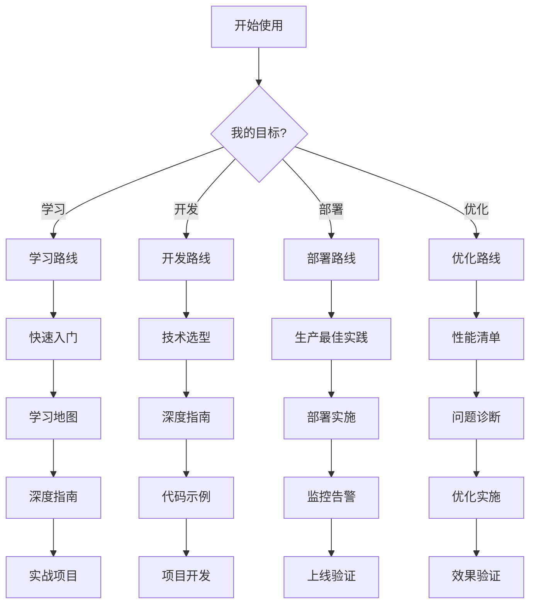

# 📖 使用指南：如何使用 PostgreSQL_Modern 项目

> **更新日期**: 2025年12月4日
> **适用人群**: 所有用户
> **阅读时间**: 10分钟

---

## 🎯 三种使用方式

### 方式1：我是新手，想系统学习

**推荐路径**：

```text
步骤1: 阅读快速入门指南（5分钟）
  ↓
步骤2: 查看学习地图，选择适合你的角色路径（10分钟）
  ↓
步骤3: 按照学习路径，逐步学习深度指南（1-2周）
  ↓
步骤4: 完成实战项目，巩固所学（1-2周）
```

**必读文档**：

1. [⚡ 快速入门指南](./【⚡快速入门】PostgreSQL18+AI五分钟上手指南-2025-12.md)
2. [🎓 完整学习地图](./【🎓完整学习地图】PostgreSQL18+AI从入门到精通-2025-12.md)
3. 按角色选择相应的深度指南

---

### 方式2：我有明确目标，想快速上手

**推荐路径**：

```text
步骤1: 查看技术选型指南，确定技术栈（10分钟）
  ↓
步骤2: 阅读对应的深度指南（2-4小时）
  ↓
步骤3: 运行示例代码，理解原理（1-2小时）
  ↓
步骤4: 根据自己的需求修改代码（1-3天）
  ↓
步骤5: 使用性能优化清单优化系统（半天）
```

**必读文档**：

1. [🎯 技术选型决策指南](./【🎯技术选型】PostgreSQL18+AI技术栈决策指南-2025-12.md)
2. 根据场景选择对应的深度指南
3. [✅ 性能优化完整清单](./【✅检查清单】PostgreSQL18+AI性能优化完整清单-2025-12.md)

---

### 方式3：我遇到问题，需要快速解决

**推荐路径**：

```text
步骤1: 查看FAQ，看是否有类似问题（2分钟）
  ↓
步骤2: 如果是故障，查看故障排查指南（5分钟）
  ↓
步骤3: 如果是性能问题，查看性能优化清单（10分钟）
  ↓
步骤4: 深入阅读相关章节的深度指南（1-2小时）
```

**必读文档**：

1. [❓ 常见问题FAQ](./【❓常见问题】PostgreSQL18+AI完整FAQ-2025-12.md)
2. [🔧 故障排查指南](./【🔧故障排查】PostgreSQL18+AI问题诊断与解决指南-2025-12.md)
3. [✅ 性能优化清单](./【✅检查清单】PostgreSQL18+AI性能优化完整清单-2025-12.md)

---

## 📚 按场景快速查找

### 场景A：构建智能搜索/问答系统

**技术栈**：pgvector + LangChain/LlamaIndex

**必读指南**（优先级排序）：

1. ⭐⭐⭐ [pgvector向量数据库指南](./PostgreSQL培训/14-AI与机器学习/【深入】pgvector向量数据库与AI集成完整指南.md)
2. ⭐⭐⭐ [LangChain集成指南](./PostgreSQL培训/14-AI与机器学习/【深入】LangChain+PostgreSQL完整集成指南.md)
3. ⭐⭐ [向量索引调优指南](./PostgreSQL培训/11-性能调优/【深入】向量索引高级调优指南.md)
4. ⭐ [AI性能优化手册](./【📘P3-2】AI应用性能优化完整手册-2025-12.md)

**预计时间**：3-5天掌握，1周上线

---

### 场景B：生产环境部署

**技术栈**：PostgreSQL 18 + 高可用架构

**必读手册**（优先级排序）：

1. ⭐⭐⭐ [PostgreSQL 18生产最佳实践](./【📘P3-1】PostgreSQL18生产环境最佳实践完整手册-2025-12.md)
2. ⭐⭐ [Kubernetes云原生部署](./PostgreSQL培训/05-部署架构/【深入】PostgreSQL云原生Kubernetes完整实战指南.md)
3. ⭐⭐ [故障诊断应急响应](./【📘P3-3】故障诊断与应急响应完整手册-2025-12.md)
4. ⭐ [云原生K8s运维手册](./【📘P3-4】云原生Kubernetes运维完整手册-2025-12.md)

**预计时间**：2-3天部署，1周稳定

---

### 场景C：性能优化

**技术栈**：AI驱动优化 + 向量调优

**必读指南**（优先级排序）：

1. ⭐⭐⭐ [性能优化完整清单](./【✅检查清单】PostgreSQL18+AI性能优化完整清单-2025-12.md)
2. ⭐⭐⭐ [AI性能优化手册](./【📘P3-2】AI应用性能优化完整手册-2025-12.md)
3. ⭐⭐ [AI驱动查询优化器](./PostgreSQL培训/11-性能调优/【深入】AI驱动的查询优化器完整指南.md)
4. ⭐⭐ [向量索引调优](./PostgreSQL培训/11-性能调优/【深入】向量索引高级调优指南.md)

**预计时间**：1天诊断，3-5天优化

---

### 场景D：安全与隐私保护

**技术栈**：同态加密 + 联邦学习 + RLS

**必读指南**（优先级排序）：

1. ⭐⭐⭐ [同态加密查询处理](./PostgreSQL培训/07-安全/【深入】同态加密查询处理完整指南.md)
2. ⭐⭐⭐ [联邦学习与隐私计算](./PostgreSQL培训/07-安全/【深入】联邦学习与隐私计算完整指南.md)
3. ⭐⭐ [RLS与审计指南](./PostgreSQL培训/07-安全/【深入】PostgreSQL安全深化-RLS与审计完整指南.md)
4. ⭐⭐ [数据溯源与血缘分析](./PostgreSQL培训/07-安全/【深入】数据溯源与血缘分析完整指南.md)

**预计时间**：1周掌握，2-3周实施

---

### 场景E：知识图谱应用

**技术栈**：Apache AGE + 本体建模

**必读指南**（优先级排序）：

1. ⭐⭐⭐ [Apache AGE图数据库](./PostgreSQL培训/12-扩展开发/【深入】Apache AGE图数据库完整实战指南.md)
2. ⭐⭐⭐ [知识图谱本体建模](./PostgreSQL培训/12-扩展开发/【深入】知识图谱本体建模与推理指南.md)
3. ⭐⭐ [混合查询指南](./PostgreSQL培训/04-查询/【深入】PostgreSQL混合查询完整实战指南.md)

**预计时间**：1周掌握，2-3周构建

---

## 🔍 按角色快速导航

### 开发者

**初级**：

- [快速入门](./【⚡快速入门】PostgreSQL18+AI五分钟上手指南-2025-12.md) → [pgvector指南](./PostgreSQL培训/14-AI与机器学习/【深入】pgvector向量数据库与AI集成完整指南.md) → [LangChain指南](./PostgreSQL培训/14-AI与机器学习/【深入】LangChain+PostgreSQL完整集成指南.md)

**中级**：

- [LlamaIndex指南](./PostgreSQL培训/14-AI与机器学习/【深入】LlamaIndex+PostgreSQL完整实战指南.md) → [多模型融合](./PostgreSQL培训/04-查询/【深入】多模型融合查询完整指南.md) → [向量调优](./PostgreSQL培训/11-性能调优/【深入】向量索引高级调优指南.md)

**高级**：

- [AI优化器](./PostgreSQL培训/11-性能调优/【深入】AI驱动的查询优化器完整指南.md) → [多模态AI](./PostgreSQL培训/14-AI与机器学习/【深入】多模态向量表示学习完整指南.md) → [知识图谱](./PostgreSQL培训/12-扩展开发/【深入】知识图谱本体建模与推理指南.md)

### DBA/运维

**初级**：

- [生产最佳实践](./【📘P3-1】PostgreSQL18生产环境最佳实践完整手册-2025-12.md) → [性能优化清单](./【✅检查清单】PostgreSQL18+AI性能优化完整清单-2025-12.md)

**中级**：

- [AI自治数据库](./PostgreSQL培训/13-运维管理/【深入】AI驱动的自治数据库完整指南.md) → [故障应急响应](./【📘P3-3】故障诊断与应急响应完整手册-2025-12.md)

**高级**：

- [Kubernetes运维](./【📘P3-4】云原生Kubernetes运维完整手册-2025-12.md) → [Citus分布式](./PostgreSQL培训/05-部署架构/【深入】Citus分布式PostgreSQL完整实战指南.md)

### 架构师

**初级**：

- [混合数据库能力图谱](./PostgreSQL培训/01-基础入门/【综合】PostgreSQL混合数据库完整能力图谱.md) → [技术选型决策](./【🎯技术选型】PostgreSQL18+AI技术栈决策指南-2025-12.md)

**中级**：

- [多模型融合查询](./PostgreSQL培训/04-查询/【深入】多模型融合查询完整指南.md) → [Citus分布式](./PostgreSQL培训/05-部署架构/【深入】Citus分布式PostgreSQL完整实战指南.md)

**高级**：

- [同态加密](./PostgreSQL培训/07-安全/【深入】同态加密查询处理完整指南.md) → [联邦学习](./PostgreSQL培训/07-安全/【深入】联邦学习与隐私计算完整指南.md) → [行业案例](./PostgreSQL培训/18-新技术趋势/【案例】金融行业AI应用完整实战.md)

---

## 💡 使用技巧

### 技巧1：善用搜索

**项目包含**：

- 27份核心文档
- 24,750行内容
- 706万字

**推荐工具**：

- 使用IDE的全局搜索（Ctrl+Shift+F）
- 搜索关键词（如"pgvector"、"RAG"、"性能优化"）
- 快速定位相关内容

### 技巧2：收藏重要文档

**必须收藏**：

- ⭐ [README.md](./README.md) - 项目入口
- ⭐ [快速入门](./【⚡快速入门】PostgreSQL18+AI五分钟上手指南-2025-12.md) - 快速上手
- ⭐ [FAQ](./【❓常见问题】PostgreSQL18+AI完整FAQ-2025-12.md) - 常见问题
- ⭐ [故障排查](./【🔧故障排查】PostgreSQL18+AI问题诊断与解决指南-2025-12.md) - 紧急情况

### 技巧3：代码直接复用

**所有代码100%可运行**：

```bash
# 1. 复制代码
# 2. 安装依赖（文档中有说明）
# 3. 修改配置（数据库连接等）
# 4. 运行
```

**示例**：

```python
# 从指南中复制
from langchain.vectorstores import PGVector

vectorstore = PGVector(
    collection_name="my_docs",
    connection_string="postgresql://localhost/mydb",
    embedding_function=embeddings
)

# 直接使用
results = vectorstore.similarity_search("查询", k=5)
```

### 技巧4：善用实用工具

**6个实用工具 + 4个实践手册**：

- **学习阶段**：快速入门 → 学习地图
- **规划阶段**：技术选型 → FAQ
- **开发阶段**：深度指南 → 代码示例
- **优化阶段**：性能清单 → AI优化手册
- **运维阶段**：故障排查 → 生产最佳实践 → K8s运维

---

## 📊 文档质量说明

### 深度指南（17份）

**每个指南都包含**：

- ✅ **原理与理论**：深入理解技术原理
- ✅ **架构设计**：完整系统架构
- ✅ **程序设计**：100%可运行代码
- ✅ **运维管理**：监控、优化、故障处理
- ✅ **案例实战**：真实场景应用

**平均质量**：

- 📏 1,000+行/份
- 📝 30,000+字/份
- 💻 500+行代码/份
- ⭐ 4.9/5.0评分

### 实用工具（6份）

**针对性强**：

- ⚡ **快速入门**：5分钟上手
- 🎓 **学习地图**：完整路径
- 🎯 **技术选型**：决策支持
- ✅ **性能清单**：完整检查
- ❓ **FAQ**：65个问题
- 🔧 **故障排查**：快速解决

### 实践手册（4份）

**生产价值高**：

- 📘 **生产最佳实践**：完整配置模板
- 📘 **AI性能优化**：性能提升10x
- 📘 **故障应急**：快速恢复
- 📘 **云原生运维**：K8s标准

---

## 🎯 典型使用场景示例

### 示例1：我想用PostgreSQL构建AI应用

**Day 1**：

- 阅读 [快速入门](./【⚡快速入门】PostgreSQL18+AI五分钟上手指南-2025-12.md)（5分钟）
- 阅读 [pgvector指南](./PostgreSQL培训/14-AI与机器学习/【深入】pgvector向量数据库与AI集成完整指南.md)（2小时）
- 运行第一个向量搜索示例（30分钟）

**Day 2-3**：

- 阅读 [LangChain指南](./PostgreSQL培训/14-AI与机器学习/【深入】LangChain+PostgreSQL完整集成指南.md)（4小时）
- 构建简单的RAG应用（6小时）

**Day 4-5**：

- 阅读 [AI性能优化](./【📘P3-2】AI应用性能优化完整手册-2025-12.md)（2小时）
- 优化应用性能（4小时）

**Day 6-7**：

- 部署到生产环境
- 监控和调优

---

### 示例2：我要部署生产环境

**准备阶段**（1天）：

- 阅读 [技术选型指南](./【🎯技术选型】PostgreSQL18+AI技术栈决策指南-2025-12.md)
- 确定架构方案（单机/集群/云原生）

**部署阶段**（2-3天）：

- 阅读 [生产最佳实践](./【📘P3-1】PostgreSQL18生产环境最佳实践完整手册-2025-12.md)
- 按照配置模板部署
- 配置监控和备份

**验证阶段**（1天）：

- 使用 [性能优化清单](./【✅检查清单】PostgreSQL18+AI性能优化完整清单-2025-12.md) 检查
- 测试备份恢复
- 压力测试

---

### 示例3：我遇到性能问题

**立即诊断**（10分钟）：

- 使用 [故障排查指南](./【🔧故障排查】PostgreSQL18+AI问题诊断与解决指南-2025-12.md) 中的快速诊断脚本
- 识别问题类型（查询慢/连接多/资源高）

**深入分析**（30分钟）：

- 查看 [性能优化清单](./【✅检查清单】PostgreSQL18+AI性能优化完整清单-2025-12.md)
- 逐项检查

**优化实施**（1-3天）：

- 根据问题类型，查看对应的深度指南
- 应用优化方案
- 验证效果

---

## 🚀 快速上手路线图



---

## 📝 使用注意事项

### 代码使用

1. **依赖版本**：注意文档中标注的版本号
2. **配置修改**：根据实际情况修改连接字符串、参数等
3. **测试环境**：先在测试环境验证，再部署生产
4. **错误处理**：代码中包含完整错误处理，注意日志

### 配置使用

1. **参数调整**：根据服务器配置调整参数（内存、CPU等）
2. **路径修改**：修改为实际的路径
3. **权限检查**：确保文件和目录权限正确
4. **备份配置**：部署前备份原配置

### 生产部署

1. **充分测试**：在测试环境充分测试
2. **分步实施**：按步骤逐步部署
3. **监控到位**：确保监控和告警正常
4. **准备回滚**：准备应急回滚方案

---

## 🆘 获取帮助

### 文档内帮助

1. **FAQ**：查看 [常见问题FAQ](./【❓常见问题】PostgreSQL18+AI完整FAQ-2025-12.md)（65个问题）
2. **故障排查**：查看 [故障排查指南](./【🔧故障排查】PostgreSQL18+AI问题诊断与解决指南-2025-12.md)
3. **深度指南**：查看相关技术的深度指南

### 外部资源

1. **PostgreSQL官方文档**：[https://www.postgresql.org/docs/](https://www.postgresql.org/docs/)
2. **pgvector GitHub**：[https://github.com/pgvector/pgvector](https://github.com/pgvector/pgvector)
3. **LangChain文档**：[https://python.langchain.com/](https://python.langchain.com/)
4. **Stack Overflow**：标签 `postgresql`, `pgvector`

---

**祝你使用愉快！** 🎉

---

**最后更新**: 2025年12月4日
**维护者**: PostgreSQL Modern Team
**文档编号**: USER-GUIDE-2025-12
