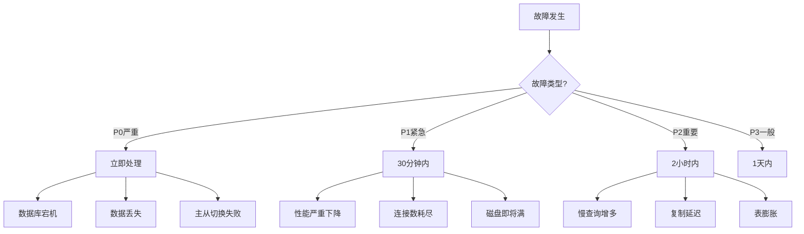

# 📘 故障诊断与应急响应完整手册

> **更新日期**: 2025年12月4日
> **紧急级别**: ⚠️ 关键参考
> **文档类型**: P3持续实践手册
> **配合使用**: [故障排查指南](./【🔧故障排查】PostgreSQL18+AI问题诊断与解决指南-2025-12.md)

---

## 🚨 紧急响应流程

### 1分钟快速响应

```bash
#!/bin/bash
# emergency_check.sh - 紧急检查脚本

echo "=== PostgreSQL紧急健康检查 ==="
echo "时间: $(date)"

# 1. 数据库可用性
echo -n "数据库状态: "
pg_isready && echo "✅ 正常" || echo "❌ 异常"

# 2. 连接数
echo -n "当前连接数: "
psql -t -c "SELECT count(*) FROM pg_stat_activity;" 2>/dev/null || echo "❌ 无法连接"

# 3. 活跃查询
echo "活跃查询(>1分钟):"
psql -c "SELECT pid, now()-query_start AS duration, query
         FROM pg_stat_activity
         WHERE state='active' AND query_start < NOW()-INTERVAL '1 minute';" 2>/dev/null

# 4. 锁等待
echo "锁等待:"
psql -c "SELECT count(*) FROM pg_locks WHERE NOT granted;" 2>/dev/null

# 5. 复制延迟(如有)
echo "复制延迟:"
psql -c "SELECT client_addr, state, replay_lag
         FROM pg_stat_replication;" 2>/dev/null

# 6. 磁盘空间
echo "磁盘使用:"
df -h | grep -E '(Filesystem|pgdata|pgwal)'

# 7. 系统负载
echo "系统负载:"
uptime
```

### 故障分类决策树



---

## 📋 故障应急手册

### P0级故障：数据库宕机

**影响**：服务完全不可用
**SLA**：5分钟内恢复

**Step 1：快速诊断**（1分钟）

```bash
# 检查进程
ps aux | grep postgres

# 检查日志（最后100行）
tail -100 /var/log/postgresql/postgresql-18-main.log

# 检查端口
netstat -tlnp | grep 5432
```

**Step 2：尝试启动**（2分钟）

```bash
# 启动PostgreSQL
sudo systemctl start postgresql

# 检查状态
sudo systemctl status postgresql

# 如果失败，查看详细日志
journalctl -xe -u postgresql
```

**Step 3：常见原因及解决**

**原因A：磁盘空间满**

```bash
# 检查磁盘
df -h

# 紧急清理
## 删除旧WAL（谨慎！）
cd /var/lib/postgresql/18/main/pg_wal
ls -lt | tail -n +100 | awk '{print $NF}' | xargs rm -f

## 或启用归档清理
psql -c "SELECT pg_switch_wal();"
```

**原因B：配置文件错误**

```bash
# 验证配置
sudo -u postgres /usr/lib/postgresql/18/bin/postgres \
  --config-file=/etc/postgresql/18/main/postgresql.conf -C config_file

# 恢复默认配置
cp /etc/postgresql/18/main/postgresql.conf.bak \
   /etc/postgresql/18/main/postgresql.conf
```

**原因C：数据目录损坏**

```bash
# 从备份恢复（最后手段）
## 1. 停止PostgreSQL
sudo systemctl stop postgresql

## 2. 恢复数据目录
rm -rf /var/lib/postgresql/18/main
tar -xzf /backup/pgdata_latest.tar.gz -C /var/lib/postgresql/18/

## 3. 恢复WAL
cp /backup/wal/* /var/lib/postgresql/18/main/pg_wal/

## 4. 启动
sudo systemctl start postgresql
```

**Step 4：切换到从库**（如有高可用）

```bash
# Patroni自动切换
patronictl failover postgres-cluster

# 手动切换
## 提升从库为主库
sudo -u postgres /usr/lib/postgresql/18/bin/pg_ctl promote \
  -D /var/lib/postgresql/18/main
```

---

### P1级故障：性能严重下降

**影响**：响应时间>10秒
**SLA**：30分钟内恢复

**诊断流程**：

**Step 1：识别慢查询**

```sql
-- 当前慢查询
SELECT pid, usename, query, now()-query_start AS duration
FROM pg_stat_activity
WHERE state = 'active'
  AND query_start < NOW()-INTERVAL '10 seconds'
ORDER BY duration DESC;

-- 杀死慢查询（如必要）
SELECT pg_terminate_backend(pid)
FROM pg_stat_activity
WHERE pid = <slow_query_pid>;
```

**Step 2：检查锁等待**

```sql
-- 查看阻塞链
SELECT
    blocking.pid AS blocking_pid,
    blocking.query AS blocking_query,
    blocked.pid AS blocked_pid,
    blocked.query AS blocked_query,
    now()-blocked.query_start AS blocked_duration
FROM pg_stat_activity blocked
JOIN pg_locks blocked_locks ON blocked.pid = blocked_locks.pid
JOIN pg_locks blocking_locks ON
    blocked_locks.locktype = blocking_locks.locktype AND
    blocked_locks.relation = blocking_locks.relation
JOIN pg_stat_activity blocking ON blocking.pid = blocking_locks.pid
WHERE NOT blocked_locks.granted AND blocking_locks.granted;

-- 杀死阻塞查询
SELECT pg_terminate_backend(<blocking_pid>);
```

**Step 3：检查资源瓶颈**

```bash
# CPU
top -b -n 1 | head -20

# 内存
free -h

# 磁盘I/O
iostat -x 1 3

# 网络
iftop
```

---

## 🔧 自动化监控与告警

### 监控脚本

```python
#!/usr/bin/env python3
# monitor.py - PostgreSQL监控脚本

import psycopg2
import time
import requests  # 发送告警

def check_health():
    conn = psycopg2.connect("dbname=postgres")
    cur = conn.cursor()

    alerts = []

    # 1. 连接数检查
    cur.execute("SELECT count(*) FROM pg_stat_activity;")
    conn_count = cur.fetchone()[0]
    cur.execute("SHOW max_connections;")
    max_conn = int(cur.fetchone()[0])

    if conn_count > max_conn * 0.8:
        alerts.append(f"⚠️ 连接数告警: {conn_count}/{max_conn} (>80%)")

    # 2. 慢查询检查
    cur.execute("""
        SELECT count(*) FROM pg_stat_activity
        WHERE state = 'active' AND query_start < NOW()-INTERVAL '1 minute';
    """)
    slow_queries = cur.fetchone()[0]

    if slow_queries > 5:
        alerts.append(f"⚠️ 慢查询告警: {slow_queries}个查询超过1分钟")

    # 3. 复制延迟检查
    cur.execute("""
        SELECT EXTRACT(EPOCH FROM (now() - pg_last_xact_replay_timestamp()))
        FROM pg_stat_replication;
    """)
    result = cur.fetchone()
    if result and result[0] > 10:
        alerts.append(f"⚠️ 复制延迟告警: {result[0]:.1f}秒")

    # 4. 磁盘空间检查
    cur.execute("SELECT pg_database_size(current_database());")
    db_size = cur.fetchone()[0]
    # 检查磁盘空间...

    cur.close()
    conn.close()

    # 发送告警
    if alerts:
        send_alert("\n".join(alerts))

    return len(alerts) == 0

def send_alert(message):
    # 发送到钉钉/企业微信/邮件等
    requests.post("https://webhook.example.com", json={"text": message})

if __name__ == "__main__":
    while True:
        check_health()
        time.sleep(60)  # 每分钟检查一次
```

---

## 📊 故障统计与分析

### 故障报告模板

```markdown
# 故障报告

**故障时间**: 2025-12-01 14:30:00
**恢复时间**: 2025-12-01 14:45:00
**故障时长**: 15分钟
**影响范围**: 全部用户

## 故障现象
- 数据库连接超时
- 查询响应时间>30秒

## 根本原因
- 某慢查询导致锁等待
- 连接数耗尽

## 解决措施
1. 杀死慢查询进程
2. 增加连接池大小
3. 优化问题查询

## 预防措施
1. 添加查询超时限制
2. 增加慢查询监控
3. 优化相关索引

## 后续行动
- [ ] 代码优化（2天内）
- [ ] 增加监控告警（1天内）
- [ ] 复盘会议（1周内）
```

---

**🚨 关键时刻，这份手册能救命！** 🔧

---

**最后更新**: 2025年12月4日
**维护者**: PostgreSQL Modern Team
**文档编号**: P3-3-TROUBLESHOOTING-2025-12
