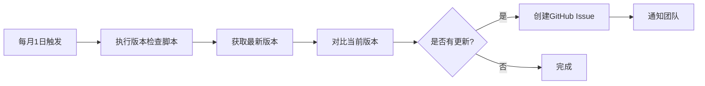

# PostgreSQL_modern 版本追踪机制

> **最后更新**：2025-10-03  
> **追踪范围**：PostgreSQL 17 + 4大核心扩展  
> **追踪周期**：每月1日自动检查

---

## 📋 版本追踪概述

本项目建立了自动化版本追踪机制，确保文档内容与PostgreSQL及其生态扩展的最新版本保持同步。

### 追踪内容

| 组件 | 当前版本 | 发布日期 | 最后验证日期 |
|------|---------|---------|-------------|
| **PostgreSQL** | 17.0 | 2024-09-26 | 2025-10-03 |
| **pgvector** | v0.8.0 | 2024-12 | 2025-10-03 |
| **TimescaleDB** | 2.17.2 | 2024-10 | 2025-10-03 |
| **PostGIS** | 3.5.0 | 2024-11 | 2025-10-03 |
| **Citus** | 12.1.4 | 2024-08 | 2025-10-03 |

---

## 🤖 自动化机制

### 1. GitHub Actions工作流

**文件**：`.github/workflows/monthly-version-check.yml`

**触发方式**：

- ⏰ **自动触发**：每月1日 UTC 00:00（北京时间08:00）
- 🖱️ **手动触发**：在GitHub Actions页面点击"Run workflow"

**执行流程**：



**输出**：

- 自动创建Issue：`[VERSION] 月度版本检查 2025-XX`
- Issue包含：版本对比表、需要更新的文件清单、执行检查清单

---

### 2. 版本检查脚本

**文件**：`tools/check_versions.sh`

**功能**：

- ✅ 检查PostgreSQL核心版本
- ✅ 检查pgvector最新Release
- ✅ 检查TimescaleDB最新Release
- ✅ 检查PostGIS最新Release
- ✅ 检查Citus最新Release
- ✅ 生成版本对比报告

**使用方法**：

```bash
# 方法1：直接运行脚本
cd PostgreSQL_modern
bash tools/check_versions.sh

# 方法2：给予执行权限后运行
chmod +x tools/check_versions.sh
./tools/check_versions.sh
```

**输出示例**：

```text
================================================
PostgreSQL_modern 版本检查工具
检查日期: 2025-10-03 14:30:00
================================================

[1/5] 检查 PostgreSQL 核心版本...
  当前追踪版本: 17.0
  检查地址: <https://www.postgresql.org/download/>
  ✓ 手动检查建议: 访问官网确认最新版本

[2/5] 检查 pgvector（向量检索）...
  当前追踪版本: v0.8.0
  最新版本:     v0.8.0
  ✓ 版本最新

[3/5] 检查 TimescaleDB（时序数据）...
  当前追踪版本: 2.17.2
  最新版本:     2.17.2
  ✓ 版本最新

[4/5] 检查 PostGIS（地理空间）...
  当前追踪版本: 3.5.0
  最新版本:     3.5.0
  ✓ 版本最新

[5/5] 检查 Citus（分布式）...
  当前追踪版本: v12.1.4
  最新版本:     v12.1.4
  ✓ 版本最新

================================================
检查完成！
================================================
```

---

## 📝 手动触发版本检查

### 方法1：通过GitHub Actions界面

1. 访问项目的GitHub页面
2. 点击顶部菜单栏的 `Actions`
3. 在左侧选择 `月度版本检查 / Monthly Version Check`
4. 点击右侧的 `Run workflow` 按钮
5. 选择branch（通常是`main`）
6. 点击绿色的 `Run workflow` 按钮

### 方法2：本地运行脚本

```bash
# 在项目根目录执行
bash tools/check_versions.sh
```

---

## 📋 版本更新流程

当发现新版本时，按以下流程更新：

### Step 1：验证兼容性

- [ ] 访问扩展的Release页面，查看Release Notes
- [ ] 确认与PostgreSQL 17的兼容性
- [ ] 识别Breaking Changes（不兼容变更）
- [ ] 评估影响范围

### Step 2：更新文档

需要更新的文件清单：

#### 核心版本文档

- [ ] `00_overview/README.md`（版本对标部分）
- [ ] `04_modern_features/version_diff_16_to_17.md`（扩展版本矩阵）
- [ ] `README.md`（生态组件版本）

#### 扩展专门文档

- [ ] `05_ai_vector/pgvector/README.md`（pgvector）
- [ ] `06_timeseries/timescaledb/README.md`（TimescaleDB）
- [ ] `07_extensions/postgis/README.md`（PostGIS）
- [ ] `07_extensions/citus/README.md`（Citus）

#### 实战案例

- [ ] `08_ecosystem_cases/ai_vector/rag_minimal/README.md`（pgvector API）
- [ ] `08_ecosystem_cases/distributed_db/citus_demo/README.md`（Citus配置）
- [ ] `06_timeseries/timescaledb/continuous_aggregate_example.sql`（TimescaleDB语法）

#### 版本追踪脚本

- [ ] `tools/check_versions.sh`（更新current版本）
- [ ] `.github/workflows/monthly-version-check.yml`（更新Issue模板版本）

#### 变更日志

- [ ] `CHANGELOG.md`（记录版本更新）

### Step 3：更新格式

在文档中按以下格式更新版本信息：

```markdown
**<扩展名称>（<用途说明>）**：

- **推荐版本**：<新版本号>（<发布年月>发布）
- **最低版本**：<最低兼容版本>
- **新特性**：<主要新特性列表>
- **验证方法**：`<SQL验证命令>`
- **下载地址**：<GitHub Release链接>

> **最后验证日期**：<验证日期>  
> **下次验证计划**：<下次验证日期>
```

### Step 4：验证变更

```bash
# 1. 运行所有测试（如果有测试环境）
python tests/scripts/run_all_tests.py

# 2. 检查链接有效性
# （手动点击文档中的下载链接）

# 3. 再次运行版本检查脚本
bash tools/check_versions.sh
```

### Step 5：提交更新

```bash
# 1. 提交变更
git add .
git commit -m "chore: 更新扩展版本信息（<扩展名> <旧版本> → <新版本>）"

# 2. 推送到远程
git push origin main

# 3. 关闭对应的版本检查Issue
# 在Issue中评论："已完成版本更新，关闭Issue"
```

---

## 🔔 通知机制

### GitHub Issue通知

- ✅ 自动创建Issue时，会通知所有Watch项目的成员
- ✅ Issue标签：`version-check`
- ✅ Issue自动分配：根据`.github/CODEOWNERS`文件

### 手动订阅

如果您想第一时间收到版本更新通知：

1. 访问项目GitHub页面
2. 点击右上角的 `Watch` 按钮
3. 选择 `Custom` → 勾选 `Issues`
4. 点击 `Apply`

---

## 📊 版本历史

| 更新日期 | 组件 | 旧版本 | 新版本 | 备注 |
|---------|------|--------|--------|------|
| 2025-10-03 | pgvector | v0.5.1 | v0.8.0 | 修复版本滞后问题 |
| 2025-10-03 | TimescaleDB | 2.13.0 | 2.17.2 | 修复版本滞后问题 |
| 2025-10-03 | PostGIS | 3.4.0 | 3.5.0 | 修复版本滞后问题 |
| 2025-10-03 | Citus | v12.1 | v12.1.4 | 精确小版本号 |
| 2025-10-03 | PostgreSQL | 17（9月） | 17.0（9月26日） | 精确发布日期 |

---

## 🛠️ 故障排查

### 问题1：GitHub Actions无法运行

**症状**：工作流显示失败，错误信息"Permission denied"

**解决方案**：

1. 检查仓库设置 → Actions → General
2. 确保"Workflow permissions"设置为"Read and write permissions"
3. 勾选"Allow GitHub Actions to create and approve pull requests"

### 问题2：版本检查脚本报错"command not found: jq"

**症状**：脚本执行失败，提示缺少依赖

**解决方案**：

```bash
# Ubuntu/Debian
sudo apt-get install curl jq git

# macOS
brew install curl jq git

# Windows（使用Git Bash或WSL）
# Git Bash已自带curl和git，只需安装jq
# 下载jq：<https://stedolan.github.io/jq/download/>
```

### 问题3：无法获取最新版本（显示"unknown"）

**原因**：GitHub API rate limit（限流）

**解决方案**：

```bash
# 方法1：等待1小时后重试（GitHub API限制：未认证60次/小时）

# 方法2：使用GitHub Token（提升到5000次/小时）
export GITHUB_TOKEN="your_token_here"
bash tools/check_versions.sh
```

---

## 📚 参考资源

- **PostgreSQL版本策略**：<https://www.postgresql.org/support/versioning/>
- **GitHub Actions文档**：<https://docs.github.com/en/actions>
- **jq手册**：<https://stedolan.github.io/jq/manual/>

---

**维护者**：PostgreSQL_modern Project Team  
**最后更新**：2025-10-03  
**下次审查**：2025-11-01
