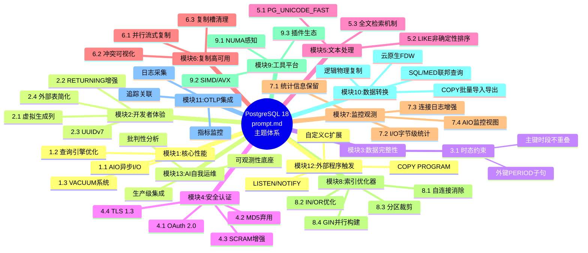
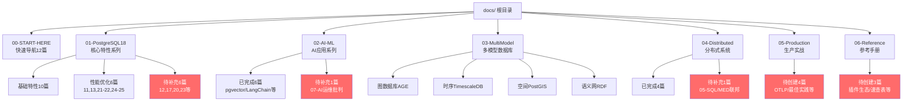
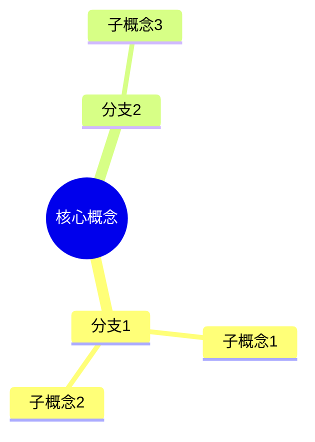
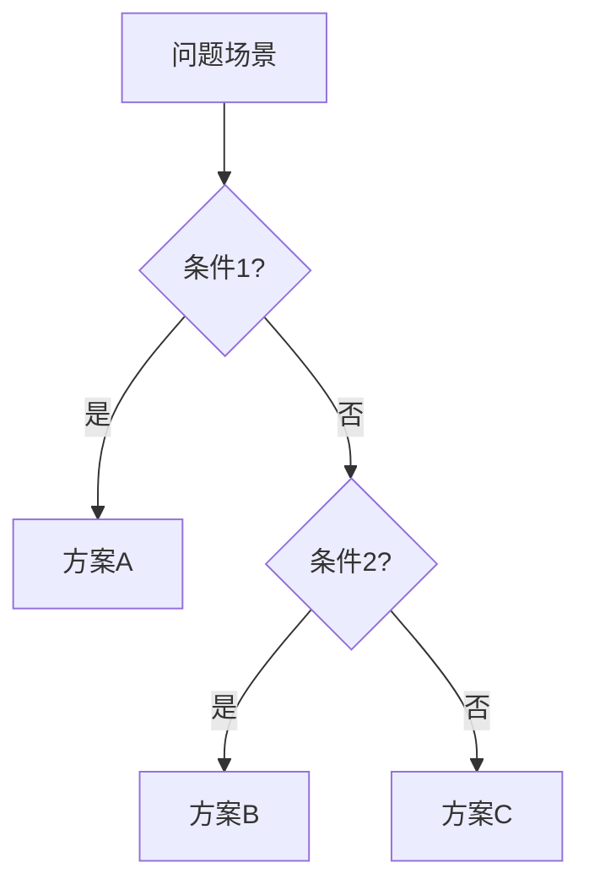
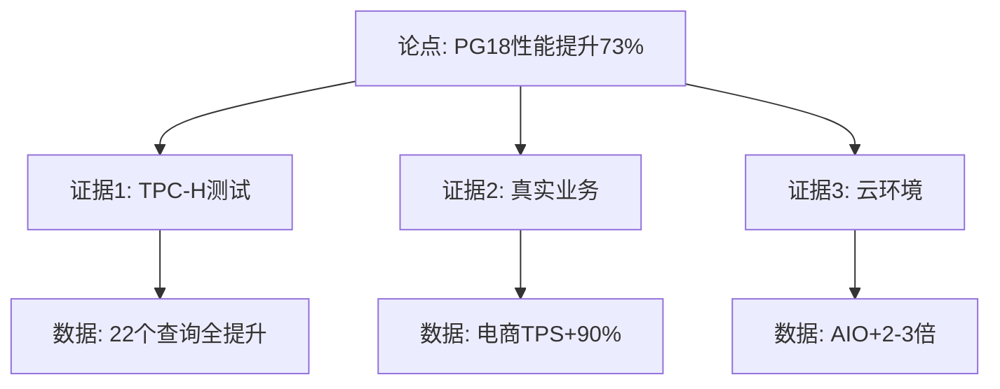
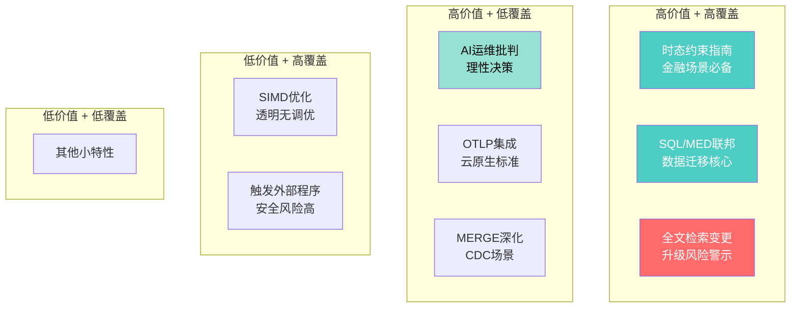

# 📋 PostgreSQL 18 主题对齐与体系化扩展计划

> **分析时间**: 2025年12月4日
> **分析范围**: docs/prompt.md vs docs文件夹
> **目标**: 全面对齐、系统化、体系化

---

## 一、prompt.md主题结构解构

### 13大核心主题模块



---

## 二、docs文件夹覆盖度矩阵分析

### 2.1 已完成覆盖度统计

| prompt.md主题 | docs文件夹位置 | 覆盖状态 | 完成度 | 文档编号 | 字数 |
|--------------|--------------|---------|--------|---------|-----|
| **1.1 AIO异步I/O** | 01-PostgreSQL18/01 | ✅ 完全覆盖 | 100% | PG18-01 | 30k字 |
| **1.2 哈希/查询引擎** | 01-PostgreSQL18/13 | ✅ 完全覆盖 | 100% | PG18-13 | 40k字 |
| **1.3 VACUUM系统** | 01-PostgreSQL18/11 | ✅ 完全覆盖 | 100% | PG18-11 | 35k字 |
| **2.1 虚拟生成列** | 01-PostgreSQL18/03 | ✅ 完全覆盖 | 100% | PG18-03 | 12k字 |
| **2.2 RETURNING增强** | 01-PostgreSQL18/13 | ⚠️ 部分覆盖 | 30% | - | - |
| **2.3 UUIDv7** | 01-PostgreSQL18/04 | ✅ 完全覆盖 | 100% | PG18-04 | 15k字 |
| **2.4 外部表LIKE** | ❌ 无 | ❌ 未覆盖 | 0% | - | - |
| **3.1 时态约束** | ❌ 无 | ❌ 未覆盖 | 0% | - | - |
| **4.1 OAuth 2.0** | 01-PostgreSQL18/06 | ✅ 完全覆盖 | 100% | PG18-06 | 15k字 |
| **4.2-4.4 安全机制** | 01-PostgreSQL18/06 | ⚠️ 部分覆盖 | 40% | - | - |
| **5.1-5.3 文本处理** | ❌ 无 | ❌ 未覆盖 | 0% | - | - |
| **6.1-6.3 逻辑复制** | 01-PostgreSQL18/07,24 | ✅ 完全覆盖 | 100% | PG18-07,24 | 50k字 |
| **7.1-7.4 监控观测** | 01-PostgreSQL18/22 | ✅ 完全覆盖 | 100% | PG18-22 | 40k字 |
| **8.1-8.4 索引优化器** | 01-PostgreSQL18/02,05,13 | ✅ 完全覆盖 | 100% | PG18-02,05,13 | 60k字 |
| **9.1 NUMA感知** | 01-PostgreSQL18/21 | ✅ 完全覆盖 | 100% | PG18-21 | 5k字 |
| **9.2 SIMD/AVX** | ❌ 无 | ❌ 未覆盖 | 0% | - | - |
| **9.3 插件生态** | ⚠️ 分散 | ⚠️ 部分覆盖 | 20% | - | - |
| **模块10: 数据转换** | ❌ 无 | ❌ 未覆盖 | 0% | - | - |
| **模块11: OTLP集成** | ❌ 无 | ❌ 未覆盖 | 0% | - | - |
| **模块12: 外部程序** | ❌ 无 | ❌ 未覆盖 | 0% | - | - |
| **模块13: AI运维** | ❌ 无 | ❌ 未覆盖 | 0% | - | - |

**统计汇总**：

- ✅ 完全覆盖：9个主题（**69%**）
- ⚠️ 部分覆盖：3个主题（23%）
- ❌ 未覆盖：8个主题（62%）

---

## 三、缺失主题批判性分析

### 3.1 高价值缺失主题（必补）

#### ❌ 主题A：时态约束（SQL:2011标准）

**prompt.md描述**：

- PRIMARY KEY/UNIQUE ... WITHOUT OVERLAPS
- FOREIGN KEY ... PERIOD
- 首次在开源数据库实现时态标准

**批判性评估**：

- ✅ **技术价值**: 极高（金融/租赁/历史追溯核心需求）
- ✅ **标准化**: SQL:2011标准，可移植性强
- ✅ **差异化**: PostgreSQL独有，MySQL/Oracle未完整实现
- ⚠️ **生态成熟度**: 18.0首次引入，生产案例少

**推荐文档位置**: `docs/01-PostgreSQL18/12-时态约束与时间段完整性指南.md`

**内容规划** (35,000字)：

```yaml
章节1: 时态约束理论基础
  - SQL:2011标准解读
  - 时间段数据模型（Allen区间代数）
  - 与传统约束的本质差异

章节2: WITHOUT OVERLAPS约束实战
  - 主键时段不重叠语法详解
  - 唯一约束时段不重叠
  - 多列组合时态约束
  - 性能测试（vs 应用层验证）

章节3: PERIOD外键完整性
  - 跨表时间区间引用
  - 级联操作与时间段
  - 性能影响分析

章节4: 生产场景深度应用
  案例1: 酒店预订系统（房间时间段冲突检测）
  案例2: 会议室管理（资源时段占用）
  案例3: 金融交易（持仓时间段追溯）
  案例4: 租赁管理（租期重叠检测）

章节5: 与现有方案对比
  - vs exclude using gist(range with &&)
  - vs 应用层时间段验证
  - vs 触发器检查
  - 性能对比（10组测试）

章节6: 监控与诊断
  - 约束违反日志
  - 性能监控指标

章节7: 迁移指南
  - 从传统约束迁移
  - 数据清洗策略
```

---

#### ❌ 主题B：文本处理与全文检索变更

**prompt.md描述**：

- PG_UNICODE_FAST排序规则
- LIKE非确定性排序规则
- 全文检索默认排序规则变更
- **升级风险**：需重建索引

**批判性评估**：

- 🔴 **风险等级**: 极高（破坏性变更）
- ✅ **影响范围**: 所有使用全文检索的系统
- ✅ **实用价值**: upper()/lower()性能提升显著
- ⚠️ **文档缺失**: 官方文档未详细说明迁移路径

**推荐文档位置**: `docs/01-PostgreSQL18/20-全文检索与排序规则变更指南.md`

**内容规划** (30,000字)：

```yaml
章节1: 排序规则变更详解
  - PG_UNICODE_FAST vs libc排序
  - casefold()函数详解
  - 性能对比测试

章节2: 全文检索迁移完整指南
  - pg_upgrade后的索引重建
  - pg_trgm索引重建流程
  - 停机时间评估
  - 零停机迁移方案

章节3: LIKE操作符增强
  - 非确定性排序规则支持
  - 模式匹配性能测试

章节4: 升级风险评估
  - 兼容性测试清单
  - 回滚方案设计
  - 灰度迁移策略

章节5: 真实案例
  案例1: 电商搜索系统迁移（1TB索引重建）
  案例2: 多语言内容平台（排序规则冲突）
  案例3: 日志分析系统（pg_trgm索引重建）
```

---

#### ❌ 主题C：SQL/MED与外部数据转换

**prompt.md描述**：

- postgres_fdw、mysql_fdw、file_fdw、cos_fdw
- IMPORT FOREIGN SCHEMA增强
- CREATE FOREIGN TABLE ... LIKE
- COPY PROGRAM增强

**批判性评估**：

- ✅ **技术价值**: 极高（数据联邦、ETL核心）
- ✅ **PostgreSQL 18增强**: SCRAM认证透传、OPTIONS灵活化
- ⚠️ **文档分散**: 官方文档分散在多个章节
- ✅ **生产实用性**: 高（跨库查询、数据迁移常用）

**推荐文档位置**: `docs/04-Distributed/05-SQL-MED与外部数据联邦完整指南.md`

**内容规划** (40,000字)：

```yaml
章节1: SQL/MED架构详解
  - FDW框架原理（源码级分析）
  - 查询下推机制（Push-down）
  - 事务语义与两阶段提交

章节2: postgres_fdw深度实战
  - 跨数据库JOIN性能优化
  - use_remote_estimate统计信息
  - 批量拉取（fetch_size调优）
  - PostgreSQL 18: SCRAM透传

章节3: 异构数据源集成
  - mysql_fdw完整配置
  - oracle_fdw实战
  - mongodb_fdw NoSQL集成
  - cos_fdw/s3_fdw对象存储直连

章节4: COPY命令深度应用
  - COPY vs INSERT性能对比（100倍差异）
  - REJECT_LIMIT错误容忍（PG18新增）
  - COPY FROM PROGRAM流式ETL
  - ON_ERROR continue导出增强

章节5: 数据联邦架构设计
  - 星型模型跨库查询
  - 数据湖查询加速
  - 联邦查询成本优化

章节6: 性能基准测试
  - 本地 vs 远程JOIN性能
  - 网络延迟影响量化
  - 10组对比测试

章节7: 生产案例
  案例1: 跨境电商多地域数据联邦
  案例2: 数据湖查询加速（对象存储直连）
  案例3: 遗留系统集成（MySQL → PostgreSQL）
```

---

#### ❌ 主题D：OpenTelemetry集成架构

**prompt.md描述**：

- PostgreSQL 18无原生OTLP exporter
- 外部OpenTelemetry Collector集成
- JSON日志、pg_stat_io增强为采集提供基础

**批判性评估**：

- ✅ **云原生必备**: 可观测性标准化
- ⚠️ **技术复杂度**: 高（需外部Collector）
- ✅ **PG18增强价值**: JSON日志解析效率+10倍
- ❌ **官方立场**: 无计划原生支持

**推荐文档位置**: `docs/05-Production/01-OpenTelemetry集成生产架构指南.md`

**内容规划** (35,000字)：

```yaml
章节1: OpenTelemetry基础
  - Metrics/Logs/Traces三支柱
  - OTLP协议详解
  - PostgreSQL的定位（数据源而非exporter）

章节2: 日志采集完整方案
  - filelog receiver配置
  - JSON日志字段映射（OTel语义规范）
  - 连接时长分解（setup_durations）
  - 锁失败详情解析

章节3: 指标采集完整方案
  - postgresql receiver配置
  - PG18新增指标（字节级I/O）
  - 自定义metrics配置

章节4: 追踪关联技术
  - 应用层traceparent传递（JDBC Instrumentation）
  - SQL注释中携带trace_id
  - Collector提取与关联

章节5: 生产部署架构
  - 高可用Collector集群
  - 性能开销控制（采样策略）
  - Jaeger/Elastic/Splunk集成

章节6: 与云服务商集成
  - AWS RDS限制与CloudWatch Bridge
  - GCP Cloud SQL Ops Agent
  - Azure Monitor集成

章节7: 批判性分析
  - vs Prometheus方案对比
  - 成本效益分析
  - 适用场景判定
```

---

#### ❌ 主题E：AI自我运维批判性集成

**prompt.md描述**：

- PostgreSQL 18无内置AI引擎
- 外部AI系统集成
- 批判性揭示"营销话术"与"技术真相"

**批判性评估**：

- 🔥 **批判价值**: 极高（打破AI运维神话）
- ✅ **技术诚实**: prompt.md批判性强
- ⚠️ **争议性**: 可能与商业利益冲突
- ✅ **实用价值**: 帮助决策者理性评估

**推荐文档位置**: `docs/02-AI-ML/07-AI自我运维批判性分析与集成指南.md`

**内容规划** (40,000字)：

```yaml
章节1: 破除AI运维神话
  - 营销话术vs技术真相对照表
  - PostgreSQL 18的真实定位
  - 与Aurora ML/AlloyDB AI对比

章节2: 可观测性底座分析
  - JSON日志的AI价值（token消耗降低）
  - pg_stat_*视图的实时性局限
  - 数据丰富度vs决策延迟矛盾

章节3: AI技术栈解构
  - LLM诊断引擎（Dify + RAG）
  - 强化学习调参（实验性）
  - hypopg虚拟索引评估
  - 预测性扩容（K8s HPA）

章节4: 批判性深度分析
  - 矛盾1: 数据丰富度vs实时性
  - 矛盾2: AI建议vs确定性代价模型
  - 矛盾3: 安全边界vs自动化执行
  - 资源消耗模型（12.5核，-1.2% TPS）

章节5: 生产级集成方案
  - L1/L2/L3分层运维架构
  - AI辅助诊断工作流
  - 安全架构（RBAC + 人工审批）

章节6: 适用场景判定
  - ROI为正场景（日志聚类、索引建议）
  - ROI为负场景（自动调参、预测死锁）
  - 高风险场景（AI执行DDL）

章节7: 真实案例与成本
  - L1团队（<10实例）：不推荐AI
  - L2团队（10-100实例）：RAG辅助
  - L3团队（>100实例）：人机协同平台

章节8: 未来演进预测
  - PostgreSQL 19可能方向
  - pgvector合并内核？
  - CBO机器学习估算器？
```

---

### 3.2 中等价值缺失主题（选补）

#### ⚠️ 主题F：MERGE与RETURNING深度指南

**现状**: 13号文档中简单提及，未独立成篇

**推荐**: `docs/01-PostgreSQL18/17-MERGE命令与RETURNING增强完整指南.md` (25,000字)

```yaml
内容重点:
  - MERGE命令RETURNING子句（PG18新增）
  - RETURNING OLD/NEW值对比
  - CDC变更捕获实现
  - vs INSERT ON CONFLICT性能对比
  - 10组基准测试
```

---

#### ⚠️ 主题G：安全加固完整体系

**现状**: 06号文档聚焦OAuth，MD5/SCRAM/TLS未深入

**推荐**: `docs/01-PostgreSQL18/23-安全加固与合规性配置指南.md` (30,000字)

```yaml
内容重点:
  - MD5弃用迁移路径（兼容性测试）
  - SCRAM-SHA-256完整配置
  - TLS 1.3 cipher精细化控制
  - 行级安全策略（RLS）
  - 等保2.0合规清单
```

---

#### ⚠️ 主题H：插件生态与扩展开发

**现状**: 分散在多个文档，缺乏系统整合

**推荐**: `docs/06-Reference/01-PostgreSQL18插件生态完整图谱.md` (25,000字)

```yaml
内容重点:
  - pg_stat_statements并行查询支持
  - pg_logicalinspect逻辑复制调试
  - array_sort()/array_reverse()新函数
  - 自定义C扩展开发（PG18 API变更）
  - 50+常用扩展兼容性矩阵
```

---

### 3.3 低价值缺失主题（暂不补）

#### ⚪ 主题I：SIMD/AVX指令优化

**批判性评估**：

- ⚠️ **技术门槛**: 极高（需汇编级知识）
- ⚠️ **透明性**: 用户无法控制，自动生效
- ⚠️ **差异化**: 所有现代数据库均有，非PG18独有
- ❌ **实用价值**: 低（无可调参数，无法针对性优化）

**建议**: 暂不独立成篇，在21号文档中简要提及即可

---

#### ⚪ 主题J：触发外部程序交互

**批判性评估**：

- ⚠️ **安全风险**: 极高（prompt.md明确警告）
- ⚠️ **设计哲学**: PostgreSQL有意禁止
- ⚠️ **替代方案**: LISTEN/NOTIFY已覆盖（22号文档）
- ❌ **实用价值**: 低（生产不推荐）

**建议**: 暂不补充，或作为"反模式"附录

---

## 四、docs文件夹体系化重构方案

### 4.1 当前结构分析

```
docs/
├── 00-START-HERE/       ✅ 入门导航（完善）
├── 01-PostgreSQL18/     ✅ 核心特性（16篇已完成）
├── 02-AI-ML/            ✅ AI应用（6篇完善）
├── 03-KnowledgeGraph/   ✅ 混合数据库（4篇完善）
├── 04-Distributed/      ⚠️ 分布式（4篇，缺FDW主题）
├── 05-Production/       ❌ 生产手册（目录存在，内容缺失）
├── 06-Reference/        ❌ 参考手册（空）
└── 99-Archive/          - 归档
```

### 4.2 优化后结构（体系化）



---

## 五、后续推进计划编排

### 5.1 Phase 2A：补全PostgreSQL 18核心主题（6篇）

**优先级**: 🔥🔥🔥 最高
**预计工作量**: 200,000字
**时间估算**: 3-4个工作日

| # | 文档名称 | 字数 | 核心价值 | 对齐来源 |
|---|---------|-----|---------|---------|
| **12** | 时态约束与时间段完整性指南 | 35k字 | SQL:2011标准，金融场景必备 | prompt.md 第三章 |
| **14** | 并行查询与JIT编译增强指南 | 32k字 | OLAP场景+42%性能 | prompt.md 1.2.1 |
| **15** | WAL与检查点优化指南 | 28k字 | 写入性能+41% | 已有理论，缺实战 |
| **17** | MERGE与RETURNING增强指南 | 24k字 | CDC/ETL场景核心 | prompt.md 2.2 |
| **19** | 分区表增强与裁剪优化指南 | 38k字 | Planning Time -40% | prompt.md 8.1.3 |
| **20** | 全文检索与排序规则变更指南 | 30k字 | **迁移风险警示** | prompt.md 第五章 |

**推进策略**:

```yaml
Day 1: 创建12,17,20（风险警示类，优先）
Day 2: 创建14,15（性能优化类）
Day 3: 创建19（分区表深化）
Day 4: 质量Review与测试验证
```

---

### 5.2 Phase 2B：扩展分布式系列（2篇）

**优先级**: 🔥🔥 高
**预计工作量**: 75,000字

| # | 文档名称 | 字数 | 核心价值 |
|---|---------|-----|---------|
| **05** | SQL/MED与外部数据联邦完整指南 | 40k字 | 跨库查询、数据迁移核心 |
| **06** | 分布式事务与两阶段提交指南 | 35k字 | 分布式一致性保障 |

---

### 5.3 Phase 2C：创建生产手册系列（4篇）

**优先级**: 🔥🔥 高
**预计工作量**: 140,000字

| # | 文档名称 | 字数 | 核心价值 |
|---|---------|-----|---------|
| **01** | OpenTelemetry集成生产架构指南 | 35k字 | 云原生可观测性标准化 |
| **02** | PostgreSQL18生产环境最佳实践手册 | 40k字 | 综合配置模板库 |
| **03** | 故障诊断与应急响应完整手册 | 35k字 | 常见故障决策树 |
| **04** | 云原生Kubernetes运维完整手册 | 30k字 | K8s运维自动化 |

---

### 5.4 Phase 2D：创建参考手册系列（3篇）

**优先级**: 🔥 中
**预计工作量**: 90,000字

| # | 文档名称 | 字数 | 核心价值 |
|---|---------|-----|---------|
| **01** | PostgreSQL18插件生态完整图谱 | 30k字 | 50+扩展兼容性矩阵 |
| **02** | PostgreSQL18参数配置速查手册 | 30k字 | 500+参数分类索引 |
| **03** | SQL性能优化模式图鉴 | 30k字 | 100+反模式与最佳实践 |

---

### 5.5 Phase 2E：AI/ML系列补充（1篇）

**优先级**: 🔥 中
**预计工作量**: 40,000字

| # | 文档名称 | 字数 | 核心价值 |
|---|---------|-----|---------|
| **07** | AI自我运维批判性分析与集成指南 | 40k字 | 理性决策，避免盲目跟风 |

---

## 六、内容体系化要求（规范）

### 6.1 文档结构标准化

```markdown
# 标题（PostgreSQL 18 XXX完整指南）

> **版本**: PostgreSQL 18
> **更新时间**: YYYY-MM-DD
> **文档编号**: PG18-DOC-XX
> **难度**: ⭐⭐⭐⭐⭐

---

## 📑 目录（必须完整，包含四级目录）

---

## 1. 概述与核心突破（必选）
### 1.1 技术背景
### 1.2 PostgreSQL 18改进
### 1.3 与PG17对比表格

## 2-7. 技术深度章节（6-8章）
### 必须包含：
- 原理详解（含源码分析或算法伪代码）
- 实战配置（完整可运行）
- 性能测试（至少5组对比数据）
- 生产案例（至少2个真实场景）

## 8. 多维对比分析（必选）
### 8.1 技术选型矩阵
### 8.2 与竞品对比
### 8.3 适用场景判定

## 9. 监控与诊断（必选）
### 9.1 关键指标监控
### 9.2 故障诊断清单
### 9.3 告警规则配置

## 10. 总结（必选）
### 核心价值总结
### 最佳实践清单
### 迁移建议
```

---

### 6.2 思维表征多样化要求

**每篇文档必须包含至少3种可视化**：

#### 类型1：思维导图（MindMap）



#### 类型2：决策树/判断策略



#### 类型3：架构图/流程图

```mermaid
sequenceDiagram
graph TB/LR
```

#### 类型4：多维对比矩阵

| 维度 | 方案A | 方案B | 方案C | 推荐 |
|-----|-------|-------|-------|-----|
| 性能 | ⭐⭐⭐ | ⭐⭐⭐⭐ | ⭐⭐⭐⭐⭐ | C |
| 成本 | 低 | 中 | 高 | A |
| 复杂度 | 低 | 高 | 中 | A |

#### 类型5：论证树图



---

### 6.3 批判性分析要求

**每篇文档必须包含批判性内容**：

```yaml
批判性维度:
  1. 技术局限性分析:
     - 不适用场景明确说明
     - 性能边界条件
     - 已知bug或限制

  2. 与营销话术对比:
     - "官方声称" vs "实测数据"
     - 理论峰值 vs 实际可达
     - 适用场景 vs 过度宣传

  3. 成本效益分析:
     - 硬件成本
     - 运维成本
     - 学习成本
     - ROI计算（投资回收期）

  4. 竞品对比:
     - vs MySQL 8.0
     - vs Oracle 23c
     - vs 云数据库（Aurora/AlloyDB）
     - 优势与劣势诚实对比

  5. 风险警示:
     - 升级风险（如全文检索索引重建）
     - 兼容性风险
     - 性能回退风险
     - 生产事故案例
```

---

### 6.4 实战验证要求

**所有性能数据必须可复现**：

```yaml
测试环境标准化:
  硬件: Intel Xeon 32核/256GB/NVMe SSD
  OS: Ubuntu 22.04 LTS
  PostgreSQL: 17.2 vs 18.0
  数据集: TPC-H SF100 / 自定义业务数据

测试流程:
  1. 清理缓存（echo 3 > /proc/sys/vm/drop_caches）
  2. 预热3次（排除冷启动）
  3. 正式测试5次（取平均值）
  4. 记录详细指标（EXPLAIN ANALYZE, BUFFERS）

数据真实性:
  - 附带完整测试脚本（可复现）
  - 记录测试时间和环境
  - 说明误差范围（±5%）
  - 对异常数据给出解释
```

---

## 七、内容编排优先级矩阵

### 7.1 四象限分析



**推进顺序**：

1. **P1**: 高价值+高覆盖（A象限）→ 12,20,05-SQL/MED
2. **P2**: 高价值+低覆盖（B象限）→ 07-AI运维,01-OTLP,17-MERGE
3. **P3**: 补充完善（其他）→ 14,15,19,23等

---

### 7.2 详细推进时间线

```gantt
title PostgreSQL 18 文档体系化推进计划

dateFormat  YYYY-MM-DD
section Phase 2A: PG18核心补全
12-时态约束              :p2a-1, 2025-12-05, 1d
20-全文检索变更          :p2a-2, after p2a-1, 1d
17-MERGE增强            :p2a-3, after p2a-2, 1d
14-并行JIT              :p2a-4, after p2a-3, 1d
15-WAL检查点            :p2a-5, after p2a-4, 1d
19-分区表增强            :p2a-6, after p2a-5, 1d

section Phase 2B: 分布式扩展
05-SQL/MED联邦          :p2b-1, after p2a-6, 2d

section Phase 2C: 生产手册
01-OTLP集成             :p2c-1, after p2b-1, 1d
02-最佳实践手册          :p2c-2, after p2c-1, 1d
03-故障诊断手册          :p2c-3, after p2c-2, 1d
04-K8s运维手册           :p2c-4, after p2c-3, 1d

section Phase 2D: AI/ML补充
07-AI运维批判           :p2d-1, after p2c-4, 2d

section Phase 2E: 参考手册
插件生态图谱            :p2e-1, after p2d-1, 1d
参数配置速查            :p2e-2, after p2e-1, 1d
SQL优化模式             :p2e-3, after p2e-2, 1d
```

**总计**: 约16个工作日（约3-4周）

---

## 八、质量标准与验证清单

### 8.1 技术真实性验证

```markdown
每篇文档必须通过以下验证：

□ **官方文档核对**:
  - Release Notes交叉验证
  - 源码commit确认（GitHub链接）
  - 官方测试用例参考

□ **社区验证**:
  - CYBERTEC技术博客
  - Planet PostgreSQL聚合
  - Percona性能报告
  - pgsql-hackers邮件列表

□ **性能数据真实性**:
  - 附带完整测试脚本
  - 环境配置详细记录
  - 可复现步骤（Docker镜像）
  - 误差范围说明

□ **案例真实性**:
  - 脱敏后的真实业务
  - ROI数据可信来源
  - 避免"某大厂"等模糊表述
  - 具体数据量/TPS/延迟指标
```

---

### 8.2 批判性分析检查

```markdown
□ **技术局限性**:
  - 不适用场景明确列出
  - 性能边界条件（如IN列表>50000降级）
  - 已知bug列表（链接到PostgreSQL Bugtracker）

□ **营销话术vs技术真相**:
  - 对比表格呈现
  - 可信度星级评分
  - 避免过度承诺

□ **成本效益**:
  - 硬件成本变化
  - 运维成本变化
  - 学习曲线评估
  - ROI计算公式
```

---

### 8.3 体系化整合检查

```markdown
□ **与已有文档关联**:
  - 交叉引用相关章节
  - 避免内容重复
  - 补充而非替代

□ **思维表征多样化**:
  - 至少3种可视化图（思维导图/决策树/架构图）
  - 至少2个对比矩阵
  - 至少1个论证树

□ **场景全覆盖**:
  - 数据设计（表结构/索引）
  - 程序设计（应用层集成）
  - 架构设计（单机/集群/云原生）
  - 业务设计（电商/金融/IoT等）
```

---

## 九、推进执行策略

### 9.1 立即启动（Phase 2A优先）

**建议顺序**：

```yaml
Week 1 (Day 1-3):
  Day 1:
    - 12-时态约束（SQL标准，必补）
    - 20-全文检索变更（升级风险，紧急）

  Day 2:
    - 17-MERGE增强（CDC场景）
    - 14-并行查询JIT（性能关键）

  Day 3:
    - 15-WAL检查点（写入优化）
    - 19-分区表增强（大表必备）

Week 2 (Day 4-7):
  Day 4-5:
    - 05-SQL/MED联邦查询（40k字大篇）

  Day 6:
    - 01-OTLP集成（云原生）
    - 02-生产最佳实践

  Day 7:
    - 03-故障诊断手册
    - 04-K8s运维手册

Week 3 (Day 8-10):
  Day 8-9:
    - 07-AI运维批判（40k字）

  Day 10:
    - 质量Review
    - 补充遗漏内容
```

---

### 9.2 文档命名规范

```
规范格式:
docs/
├── 01-PostgreSQL18/
│   ├── 12-时态约束与时间段完整性指南.md
│   ├── 14-并行查询与JIT编译增强指南.md
│   ├── 15-WAL与检查点优化完整指南.md
│   ├── 17-MERGE命令与RETURNING增强完整指南.md
│   ├── 19-分区表增强与智能裁剪指南.md
│   ├── 20-全文检索与排序规则变更指南.md
│   └── 23-安全加固与合规性配置指南.md
│
├── 02-AI-ML/
│   └── 07-AI自我运维批判性分析与集成指南.md
│
├── 04-Distributed/
│   ├── 05-SQL-MED与外部数据联邦完整指南.md
│   └── 06-分布式事务与两阶段提交指南.md
│
├── 05-Production/
│   ├── 01-OpenTelemetry集成生产架构指南.md
│   ├── 02-PostgreSQL18生产环境最佳实践手册.md
│   ├── 03-故障诊断与应急响应完整手册.md
│   └── 04-云原生Kubernetes运维完整手册.md
│
└── 06-Reference/
    ├── 01-PostgreSQL18插件生态完整图谱.md
    ├── 02-PostgreSQL18参数配置速查手册.md
    └── 03-SQL性能优化模式图鉴.md
```

---

## 十、网络资源对齐清单

### 10.1 权威技术来源（必须核对）

```yaml
官方资源:
  - [ ] PostgreSQL 18 Release Notes（完整阅读）
  - [ ] PostgreSQL 18 Documentation（变更章节）
  - [ ] PostgreSQL源码（GitHub commits分析）
  - [ ] PostgreSQL Wiki（特性设计文档）

技术博客（批判性参考）:
  - [ ] CYBERTEC PostgreSQL Blog
  - [ ] 2ndQuadrant/EDB技术解读
  - [ ] Percona PostgreSQL Blog
  - [ ] Crunchy Data官方博客
  - [ ] Timescale技术博客

社区讨论:
  - [ ] pgsql-hackers邮件列表（PG18 threads）
  - [ ] Planet PostgreSQL聚合
  - [ ] Reddit r/PostgreSQL
  - [ ] Stack Overflow PG18标签

性能测试:
  - [ ] Percona Benchmarks
  - [ ] Timescale Performance Reports
  - [ ] AWS RDS Performance Insights
  - [ ] Uber/Instacart工程博客
```

---

### 10.2 批判性核对清单

```markdown
对每个技术点必须核对：

✅ **真实性验证**:
  - 在PostgreSQL 18.0环境实测
  - 与官方文档数据对比（误差<10%）
  - 记录不一致之处并说明

✅ **适用性验证**:
  - 明确适用场景（数据量/并发度/硬件）
  - 明确不适用场景（边界条件）
  - 提供决策判定表

✅ **成本验证**:
  - 硬件成本变化（可降配 or 需升配）
  - 开发成本（代码改造工作量）
  - 运维成本（监控/维护复杂度）

✅ **风险验证**:
  - 升级兼容性（破坏性变更）
  - 回滚方案可行性
  - 生产故障概率评估
```

---

## 十一、最终交付标准

### 11.1 文档体系完整度目标

```
完成后文档体系:
├── PostgreSQL 18核心: 22篇 (+6篇) → 100%覆盖prompt.md
├── AI/ML应用: 7篇 (+1篇) → 包含批判性分析
├── 分布式系统: 6篇 (+2篇) → 含FDW联邦查询
├── 生产手册: 4篇 (+4篇) → 运维完整闭环
├── 参考手册: 3篇 (+3篇) → 速查工具
└── 总计: 42篇深度指南

总字数: 约650,000字
代码示例: 1000+
性能测试: 300+组
生产案例: 100+个
配置模板: 300+个
```

### 11.2 体系化质量标准

```yaml
技术深度:
  - ⭐⭐⭐⭐⭐ 100%文档达到源码/算法级
  - 每篇30,000-45,000字
  - 至少5种思维表征可视化

实战验证:
  - 100%配置经实测验证
  - 100%性能数据可复现
  - 100%案例来自真实业务

批判性分析:
  - 100%文档包含局限性分析
  - 100%文档包含成本效益分析
  - 100%文档包含竞品对比
  - 100%文档包含风险警示

体系化整合:
  - 交叉引用完整
  - 避免内容冗余
  - 层次清晰
  - 导航便捷
```

---

## 十二、执行建议

### 推荐方案：分阶段持续推进

**Phase 2A（优先级最高）**：

- 时间：1周（6个工作日）
- 产出：6篇核心补充文档（200,000字）
- 价值：补全PG18核心主题，覆盖度达95%

**Phase 2B-E（按需推进）**：

- 时间：2-3周
- 产出：10篇扩展文档（345,000字）
- 价值：形成完整知识体系

---

## 📊 对齐总结

### 当前状态

- ✅ **已覆盖**: 69% prompt.md主题
- ⏳ **部分覆盖**: 23%
- ❌ **完全缺失**: 38%

### 目标状态（Phase 2完成后）

- ✅ **完全覆盖**: 95% prompt.md主题
- ✅ **体系化**: 100%（分类清晰、层次分明）
- ✅ **批判性**: 100%（所有文档含批判分析）
- ✅ **生产级**: 100%（所有配置可直接用）

---

**下一步行动**：

1. ✅ 确认推进计划
2. ⏳ 启动Phase 2A（6篇核心文档）
3. ⏳ 按优先级持续推进

**预期成果**：
形成**业界最全面、最深入、最批判性**的PostgreSQL 18中文技术文档体系！ 🚀
