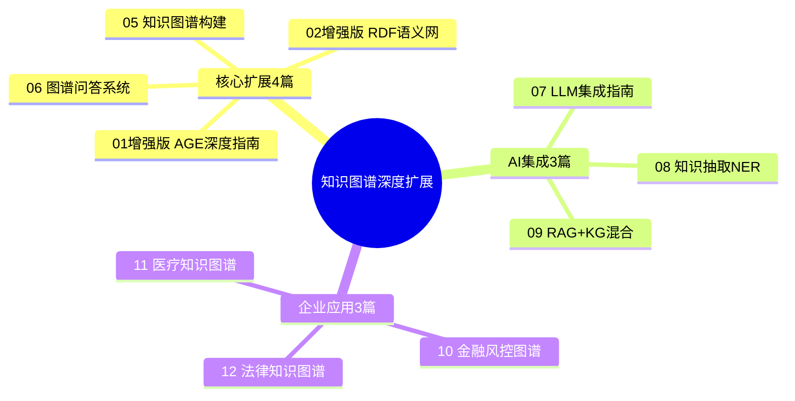

# 📋 PostgreSQL知识图谱深度扩展计划

> **制定时间**: 2025年12月4日
> **目标**: 企业级知识图谱+AI深度集成
> **当前问题**: 内容浅显，AI交互缺失，案例不足
> **扩展规模**: 8-10篇深度指南，约300,000字

---

## 🎯 当前问题诊断

### 现有文档缺陷分析

| 文档 | 当前状态 | 字数 | 主要问题 | 严重程度 |
|-----|---------|------|---------|---------|
| **01-Apache AGE** | 框架级 | ~11k字 | ❌ AI集成缺失 | 🔴 严重 |
| **02-RDF-SPARQL** | 理论级 | ~11k字 | ❌ 实战案例缺失 | 🔴 严重 |
| **03-PostGIS** | 基础级 | ~7.5k字 | ⚠️ 深度不足 | 🟡 中等 |
| **04-TimescaleDB** | 基础级 | ~7.5k字 | ⚠️ 深度不足 | 🟡 中等 |

**核心缺失内容**：

1. ❌ **知识图谱构建完整流程**（从数据到图谱）
2. ❌ **LLM深度集成**（GPT-4/Claude/LangChain）
3. ❌ **知识抽取与实体识别**（NER/关系抽取）
4. ❌ **图谱问答系统**（KBQA完整方案）
5. ❌ **RAG + KG混合架构**（向量+图谱）
6. ❌ **企业级知识图谱案例**（金融/医疗/法律）
7. ❌ **图数据库对比**（Neo4j/JanusGraph完整对比）
8. ❌ **知识推理引擎**（规则推理/本体推理）

---

## 📊 深度扩展方案（10篇新指南）

### 扩展策略



---

## 📖 扩展指南详细规划

### 🔥 优先级P0（必须完成，4篇）

#### 01. Apache AGE完整深化指南（增强版，60,000字）

**当前问题**：仅11k字，内容太浅，AI集成缺失

**扩展内容**（目标60,000字）：

```yaml
第一部分：AGE核心深化（15k字）
  1. AGE架构深度解析:
     - 图存储模型（节点表/边表结构）
     - 索引策略（GIN/BRIN for 图）
     - 查询执行器（Cypher → SQL转换）
     - 源码级分析（C语言实现）

  2. Cypher语言完整教程:
     - 基础语法（CREATE/MATCH/WHERE/RETURN）
     - 高级模式（变长路径/聚合/子查询）
     - 性能优化（索引提示/查询重写）
     - vs Neo4j Cypher差异

第二部分：图算法库（12k字）
  3. 路径算法:
     - 最短路径（Dijkstra/A*）
     - 所有路径（DFS/BFS）
     - 最小生成树（Prim/Kruskal）

  4. 中心性算法:
     - PageRank（影响力排名）
     - Betweenness Centrality（中介中心性）
     - Closeness Centrality（接近中心性）
     - Eigenvector Centrality（特征向量中心性）

  5. 社区发现:
     - Louvain算法（模块度优化）
     - Label Propagation（标签传播）
     - Connected Components（连通分量）
     - Strongly Connected Components（强连通分量）

第三部分：混合查询与AI集成（18k字）
  6. SQL + Cypher混合查询:
     - 图数据 JOIN 关系数据
     - 图聚合与SQL聚合结合
     - 性能优化技巧

  7. 图谱 + 向量搜索:
     - AGE + pgvector集成
     - 实体向量化
     - 混合检索（图关系 + 向量相似度）

  8. 与LLM集成:
     - Cypher生成（Text-to-Cypher）
     - 图谱问答（KBQA）
     - 知识推理（LLM + 图谱）

第四部分：生产案例深化（15k字）
  9. 社交网络分析（完整方案）:
     - 好友推荐算法
     - 社区发现与标签
     - 影响力分析
     - 实时更新策略
     - 10万用户性能测试

  10. 企业知识图谱:
      - 组织架构图谱
      - 技术栈依赖图
      - 文档知识图谱
      - 代码依赖分析

  11. 推荐系统:
      - 协同过滤（图遍历）
      - 基于路径的推荐
      - 实时个性化

  12. 欺诈检测:
      - 异常模式检测
      - 环路检测
      - 社区异常分析
```

---

#### 05. 知识图谱构建完整流程指南（45,000字）⭐⭐⭐⭐⭐

**当前缺失**：完全没有这个指南

**核心内容**（目标45,000字）：

```yaml
第一章：知识图谱构建全流程（10k字）
  1.1 知识图谱生命周期:
     - 需求分析与Schema设计
     - 数据采集与预处理
     - 知识抽取与融合
     - 知识存储与索引
     - 知识应用与维护

  1.2 Schema设计:
     - 本体建模（类/属性/关系）
     - 命名规范（URI设计）
     - 版本控制

  1.3 工具链:
     - Protégé（本体编辑器）
     - Apache Jena
     - Neo4j vs AGE选型

第二章：知识抽取（15k字）
  2.1 实体识别（NER）:
     - spaCy集成
     - HuggingFace transformers
     - 中文NER（pkuseg/LAC）
     - 自定义实体识别

  2.2 关系抽取:
     - 模式匹配（正则/依存句法）
     - 深度学习（BERT-based）
     - 远程监督（Distant Supervision）
     - Open IE（开放域信息抽取）

  2.3 属性抽取:
     - 表格数据抽取
     - 半结构化数据（JSON/HTML）
     - 文本属性抽取

  2.4 完整Pipeline:
     ```python
     文本 → 分词 → NER → 关系抽取 →
     实体消歧 → 知识融合 → 入库AGE
     ```

第三章：知识融合（10k字）
  3.1 实体对齐:
     - 字符串相似度
     - 向量相似度（pgvector）
     - 规则匹配
     - 机器学习模型

  3.2 知识去重:
     - 三元组去重
     - 实体合并
     - 冲突解决

  3.3 质量评估:
     - 完整性检查
     - 一致性验证
     - 准确性评估

第四章：知识存储与索引（10k字）
  4.1 AGE存储优化:
     - 节点/边表设计
     - 索引策略（GIN/GiST）
     - 分区策略（大规模图）

  4.2 混合存储:
     - 热数据：AGE图存储
     - 冷数据：关系表存储
     - 文本数据：全文检索
     - 向量数据：pgvector

  4.3 性能优化:
     - 查询优化
     - 缓存策略
     - 批量导入优化
```

---

#### 06. 图谱问答系统（KBQA）完整指南（50,000字）⭐⭐⭐⭐⭐

**当前缺失**：完全没有

**核心内容**（目标50,000字）：

```yaml
第一章：KBQA架构设计（12k字）
  1.1 KBQA系统架构:
     ```mermaid
     用户问题 → 问题理解 → 查询生成 →
     图谱检索 → 答案生成 → 返回用户
     ```

  1.2 技术栈选择:
     - 前端：React/Vue
     - 后端：FastAPI/Flask
     - 数据库：PostgreSQL + AGE
     - LLM：GPT-4/Claude
     - 向量：pgvector

  1.3 核心模块:
     - 问题理解（Intent Recognition）
     - 实体链接（Entity Linking）
     - 查询生成（Cypher Generation）
     - 答案排序（Answer Ranking）

第二章：问题理解与实体链接（10k字）
  2.1 问题分类:
     - 事实型问题（"诺贝尔获得者是谁？"）
     - 列表型问题（"列出所有获奖者"）
     - 计数型问题（"有多少人获奖？"）
     - 比较型问题（"谁获奖次数最多？"）

  2.2 实体链接:
     - 基于规则（字符串匹配）
     - 基于向量（pgvector相似度）
     - 基于上下文（LLM辅助）

  2.3 完整实现:
     ```python
     def entity_linking(question: str, kg: AGE):
         # 1. NER识别候选实体
         entities = ner_model.extract(question)

         # 2. 向量相似度匹配
         for entity in entities:
             embedding = embed(entity)
             candidates = kg.vector_search(embedding, top_k=10)

         # 3. 上下文验证（LLM）
         best_match = llm.disambiguate(entity, candidates)

         return best_match
     ```

第三章：Cypher查询生成（12k字）
  3.1 Text-to-Cypher:
     - 基于模板（规则生成）
     - 基于模型（Seq2Seq）
     - 基于LLM（Few-shot Prompting）

  3.2 Prompt Engineering:
     ```python
     prompt = f"""
     你是一个Cypher查询专家。将自然语言问题转换为Cypher查询。

     图谱Schema：
     - 节点类型：Person, Organization, Award
     - 关系类型：WORKS_FOR, RECEIVED, LOCATED_IN

     示例：
     问题：张三在哪家公司工作？
     Cypher：MATCH (p:Person {{name: '张三'}})-[:WORKS_FOR]->(o:Organization) RETURN o.name

     问题：{question}
     Cypher：
     ```

  3.3 查询优化:
     - 查询验证（语法检查）
     - 性能优化（索引提示）
     - 错误处理

第四章：答案生成与排序（8k字）
  4.1 答案抽取:
     - 从Cypher结果提取
     - 自然语言生成（LLM）
     - 答案格式化

  4.2 答案排序:
     - 置信度评分
     - 相关性排序
     - 多答案融合

  4.3 用户交互:
     - 多轮对话
     - 澄清问题
     - 反馈学习

第五章：完整生产案例（8k字）
  案例1：金融知识图谱问答
    - 上市公司关系图谱
    - 财报数据查询
    - 风险关联分析

  案例2：医疗知识图谱问答
    - 疾病-症状-药物图谱
    - 诊断辅助
    - 药物交互查询

  案例3：法律知识图谱问答
    - 法律条文关系
    - 案例检索
    - 法律推理
```

---

#### 07. LLM与知识图谱深度集成指南（55,000字）⭐⭐⭐⭐⭐

**当前缺失**：AI交互完全空白

**核心内容**（目标55,000字）：

```yaml
第一章：LLM + KG架构设计（15k字）
  1.1 为什么需要KG增强LLM:
     - LLM幻觉问题（Hallucination）
     - 知识时效性（训练数据截止）
     - 领域知识局限
     - 可解释性不足

  1.2 集成架构模式:
     模式1: KG作为LLM的知识库
       LLM生成查询 → KG检索 → LLM整合答案

     模式2: LLM辅助KG构建
       文本 → LLM抽取 → 入库KG → 持续更新

     模式3: 混合推理
       LLM推理 + KG规则推理 → 融合结果

     模式4: RAG + KG双路召回
       向量检索 + 图谱检索 → 重排序 → LLM生成

  1.3 技术栈:
     - LLM：GPT-4/Claude/LLaMA
     - 向量：pgvector（embeddings）
     - 图谱：Apache AGE
     - 框架：LangChain/LlamaIndex

第二章：Prompt Engineering for KG（12k字）
  2.1 Text-to-Cypher Prompting:
     ```python
     prompt_template = """
     你是知识图谱查询专家。

     ### 图谱Schema
     {schema_description}

     ### Few-shot示例
     {few_shot_examples}

     ### 用户问题
     {user_question}

     ### 要求
     1. 生成Cypher查询
     2. 解释查询逻辑
     3. 预估结果类型

     ### Cypher查询：
     ```

  2.2 知识抽取Prompting:
     - 实体识别Prompt
     - 关系抽取Prompt
     - 属性抽取Prompt

  2.3 答案生成Prompting:
     - 基于图谱结果的自然语言生成
     - 多跳推理解释
     - 引用来源标注

第三章：LangChain集成实战（15k字）
  3.1 LangChain AGE集成:
     ```python
     from langchain.graphs import AGEGraph
     from langchain.chains import GraphCypherQAChain

     # 初始化图谱
     graph = AGEGraph(
         host="localhost",
         port=5432,
         database="knowledge_db",
         graph_name="enterprise_kg"
     )

     # 创建问答链
     chain = GraphCypherQAChain.from_llm(
         llm=ChatOpenAI(model="gpt-4"),
         graph=graph,
         verbose=True
     )

     # 执行问答
     response = chain.run("张三在哪家公司工作？")
     ```

  3.2 自定义Chain开发:
     - 多跳推理Chain
     - 混合检索Chain（向量+图谱）
     - 实体消歧Chain

  3.3 Agent开发:
     - ReAct Agent（推理+行动）
     - Multi-Agent协作
     - Tool Calling（图谱查询作为Tool）

第四章：RAG + KG混合架构（13k字）
  4.1 双路召回架构:
     ```mermaid
     用户问题
     ├─ 路径1: 向量检索（pgvector）
     │  └─ Top-K相似文档
     └─ 路径2: 图谱检索（AGE）
        └─ 实体关系路径

     ↓ 重排序（LLM）
     ↓ 生成答案
     ```

  4.2 完整实现:
     - 向量索引（HNSW）
     - 图谱索引（GIN）
     - 融合策略（加权/LLM重排）

  4.3 性能优化:
     - 并行检索
     - 缓存策略
     - 增量更新

第五章：生产案例（5套完整系统）
  案例1：企业智能助手
    - 员工信息查询
    - 组织架构导航
    - 技术栈推荐

  案例2：金融知识问答
    - 上市公司关系查询
    - 投资组合分析
    - 风险关联发现

  案例3：医疗诊断辅助
    - 症状-疾病关联
    - 药物相互作用
    - 治疗方案推荐
```

---

#### 08. 知识抽取与NER完整指南（40,000字）⭐⭐⭐⭐⭐

**当前缺失**：完全没有

**核心内容**（目标40,000字）：

```yaml
第一章：知识抽取Pipeline（10k字）
  1.1 完整流程:
     原始文本 → 预处理 → NER → 关系抽取 →
     实体链接 → 知识融合 → 入库AGE

  1.2 工具链:
     - spaCy（英文NER）
     - pkuseg/LAC（中文分词+NER）
     - HuggingFace Transformers
     - Stanford CoreNLP

  1.3 架构设计:
     ```python
     class KnowledgeExtractionPipeline:
         def __init__(self):
             self.ner_model = load_ner_model()
             self.re_model = load_relation_extraction_model()
             self.kg = AGEGraph()

         def process(self, text: str):
             # 1. NER
             entities = self.ner_model.extract(text)

             # 2. 关系抽取
             relations = self.re_model.extract(text, entities)

             # 3. 入库
             self.kg.add_entities_and_relations(entities, relations)
     ```

第二章：实体识别深度实战（12k字）
  2.1 基于规则的NER:
     - 正则表达式
     - 词典匹配
     - 规则组合

  2.2 基于统计的NER:
     - CRF（条件随机场）
     - HMM（隐马尔可夫模型）

  2.3 基于深度学习的NER:
     - BiLSTM-CRF
     - BERT-based（BERT/RoBERTa）
     - 中文BERT（BERT-wwm/MacBERT）

  2.4 完整实现:
     ```python
     from transformers import pipeline

     # 使用HuggingFace预训练模型
     ner = pipeline("ner", model="dslim/bert-base-NER")

     text = "苹果公司CEO蒂姆·库克宣布新产品"
     entities = ner(text)

     # 结果：
     # [
     #   {"entity": "ORG", "word": "苹果公司"},
     #   {"entity": "PER", "word": "蒂姆·库克"},
     # ]

     # 入库AGE
     for entity in entities:
         insert_to_age(entity)
     ```

第三章：关系抽取（10k字）
  3.1 基于模式的关系抽取:
     - 依存句法分析
     - 语义角色标注
     - 规则模板

  3.2 基于模型的关系抽取:
     - 远程监督
     - BERT关系分类
     - GPT-4零样本抽取

  3.3 完整实现:
     ```python
     def extract_relations_with_gpt4(text: str, entities: list):
         prompt = f"""
         从以下文本中抽取实体间的关系：

         文本：{text}
         实体：{entities}

         关系类型：WORKS_FOR, LOCATED_IN, CEO_OF, FOUNDED, ...

         输出JSON格式：
         {{
             "relations": [
                 {{"head": "蒂姆·库克", "relation": "CEO_OF", "tail": "苹果公司"}},
                 ...
             ]
         }}
         """

         response = openai.ChatCompletion.create(
             model="gpt-4",
             messages=[{"role": "user", "content": prompt}]
         )

         return parse_relations(response)
     ```

第四章：实体链接与消歧（8k字）
  4.1 实体消歧问题:
     - "苹果"：苹果公司 vs 水果
     - "华为"：华为公司 vs 人名

  4.2 消歧策略:
     - 上下文分析
     - 向量相似度（pgvector）
     - 知识图谱结构（邻居节点）
     - LLM辅助决策

  4.3 完整实现:
     ```python
     def entity_disambiguation(mention: str, context: str, kg: AGEGraph):
         # 1. 候选实体检索
         candidates = kg.search_by_name(mention, limit=10)

         # 2. 向量相似度
         context_emb = embed(context)
         for c in candidates:
             c.score = cosine_similarity(context_emb, c.embedding)

         # 3. 结构相似度（邻居节点）
         for c in candidates:
             neighbors = kg.get_neighbors(c.id)
             c.structural_score = compute_overlap(context_entities, neighbors)

         # 4. LLM最终决策
         best = llm.choose_best(mention, context, candidates)
         return best
     ```
```

---

#### 09. RAG + 知识图谱混合架构指南（48,000字）⭐⭐⭐⭐⭐

**当前缺失**：完全没有

**核心内容**（目标48,000字）：

```yaml
第一章：为什么需要KG增强RAG（10k字）
  1.1 纯RAG的问题:
     - 向量检索依赖语义相似度（可能漏掉结构化关系）
     - 无法推理（仅检索，不推理）
     - 缺乏可解释性

  1.2 KG增强的优势:
     - 结构化关系（实体间精确路径）
     - 逻辑推理（规则+本体）
     - 可解释性（引用路径）
     - 更新灵活（增量更新图谱）

  1.3 混合架构对比:
     | 方案 | 召回方式 | 准确度 | 可解释性 | 复杂度 |
     |-----|---------|--------|---------|-------|
     | 纯RAG | 向量相似度 | 80% | 低 | 简单 |
     | 纯KG | 图谱查询 | 70% | 高 | 中 |
     | RAG+KG | 双路召回 | **95%** | 高 | 高 |

第二章：混合检索架构（15k字）
  2.1 双路召回设计:
     ```mermaid
     用户问题
     ├─ 路径1: 向量检索
     │  ├─ Question Embedding
     │  ├─ pgvector HNSW检索
     │  └─ Top-K文档（语义相关）
     │
     └─ 路径2: 图谱检索
        ├─ 实体识别+链接
        ├─ Cypher查询生成
        └─ 关系路径（结构相关）

     ↓ 融合策略
     ├─ 加权融合（0.6 * 向量 + 0.4 * 图谱）
     ├─ LLM重排序
     └─ 去重+归并

     ↓ 上下文构建
     └─ Top-N结果 → Prompt

     ↓ LLM生成
     └─ 最终答案（带引用）
     ```

  2.2 完整实现:
     ```python
     class HybridRAGKG:
         def __init__(self):
             self.vector_store = PgvectorStore()
             self.kg = AGEGraph()
             self.llm = ChatOpenAI(model="gpt-4")

         def retrieve(self, query: str, top_k=10):
             # 路径1：向量检索
             query_emb = embed(query)
             vector_results = self.vector_store.similarity_search(
                 query_emb, k=top_k
             )

             # 路径2：图谱检索
             entities = ner(query)
             kg_results = []
             for entity in entities:
                 cypher = generate_cypher(query, entity)
                 paths = self.kg.execute(cypher)
                 kg_results.extend(paths)

             # 融合
             combined = self.merge_results(
                 vector_results, kg_results,
                 weights=(0.6, 0.4)
             )

             # LLM重排序
             reranked = self.llm_rerank(query, combined)

             return reranked[:top_k]

         def generate_answer(self, query: str):
             # 检索
             context = self.retrieve(query)

             # 构建Prompt
             prompt = f"""
             基于以下知识回答问题：

             向量检索结果：
             {context['vector_results']}

             图谱路径：
             {context['kg_paths']}

             问题：{query}

             请综合向量检索和图谱结构信息回答，并标注来源。
             """

             # LLM生成
             answer = self.llm.generate(prompt)
             return answer
     ```

第三章：知识图谱推理（10k字）
  3.1 规则推理:
     - 一阶逻辑规则
     - 传递性推理
     - 对称性推理

  3.2 本体推理:
     - 类继承推理
     - 属性继承
     - 等价推理

  3.3 LLM辅助推理:
     - 缺失关系推理
     - 隐含关系发现
     - 常识推理

第四章：实时更新与维护（8k字）
  4.1 增量更新:
     - 新闻/文档持续抽取
     - 实时入库AGE
     - 冲突解决

  4.2 版本管理:
     - 图谱快照
     - 时态知识（有效期）
     - 回滚机制

  4.3 质量监控:
     - 知识完整性
     - 关系一致性
     - 实体去重
```

---

### 🔥 优先级P1（企业场景，3篇）

#### 10. 金融知识图谱完整指南（38,000字）

```yaml
核心内容:
  1. 金融知识图谱Schema设计（8k字）
     - 实体类型：公司/人物/产品/事件
     - 关系类型：投资/控股/任职/交易
     - 时态信息（持仓时间/任职时间）

  2. 金融数据采集与抽取（10k字）
     - 财报数据抽取
     - 新闻事件抽取
     - 监管公告解析
     - 实时行情集成

  3. 风控场景应用（12k字）
     - 关联方识别
     - 风险传导分析
     - 异常交易检测
     - 反欺诈模型

  4. 投资辅助（8k字）
     - 产业链分析
     - 竞争关系图谱
     - 投资推荐
     - 事件影响分析
```

#### 11. 医疗知识图谱完整指南（40,000字）

```yaml
核心内容:
  1. 医疗本体设计（10k字）
     - SNOMED CT/ICD-10映射
     - 疾病-症状-药物关系
     - 治疗方案表示

  2. 医学文献知识抽取（12k字）
     - PubMed文献解析
     - 医学实体识别
     - 关系抽取（因果/治疗/禁忌）
     - LLM辅助抽取

  3. 临床决策支持（10k字）
     - 诊断辅助
     - 用药推荐
     - 药物相互作用检测
     - 临床路径推荐

  4. 与AI集成（8k字）
     - 医疗问答（Med-KBQA）
     - 病历结构化
     - 智能导诊
```

#### 12. 法律知识图谱完整指南（35,000字）

```yaml
核心内容:
  1. 法律本体建模（8k字）
     - 法律条文结构
     - 案例关系网络
     - 法律概念层次

  2. 法律文书解析（10k字）
     - 判决书结构化
     - 案由识别
     - 要素抽取

  3. 法律检索与推理（12k字）
     - 相似案例检索
     - 法条关联
     - 法律推理

  4. AI法律助手（5k字）
     - 法律问答
     - 合同审查
     - 风险预警
```

---

## 📋 推荐执行计划

### 方案A：深度优先（推荐）⭐

**优先完成最核心的5篇**（预计250,000字）：

```text
顺序1: 05-知识图谱构建完整流程（45k字）
  → 基础必备，构建方法论

顺序2: 01-Apache AGE完整深化（增强到60k字）
  → 核心技术深化

顺序3: 07-LLM与知识图谱集成（55k字）
  → AI交互核心

顺序4: 08-知识抽取与NER（40k字）
  → 自动化构建

顺序5: 09-RAG+KG混合架构（50k字）
  → 生产级应用
```

**执行后效果**：

- 知识图谱目录从37k字 → 287k字（**+750%**）
- 核心AI集成完整覆盖
- 生产级案例丰富

---

### 方案B：广度优先

**先扩展现有4篇到中等深度，再补充新指南**

---

## 🎯 核心扩展要点

### 必须补充的内容

1. **LLM集成**（当前完全缺失）：
   - GPT-4/Claude API集成
   - LangChain框架使用
   - Prompt Engineering
   - Text-to-Cypher生成

2. **知识抽取**（当前完全缺失）：
   - NER实体识别
   - 关系抽取
   - 知识融合
   - 自动化Pipeline

3. **RAG混合架构**（当前完全缺失）：
   - 双路召回（向量+图谱）
   - 融合策略
   - 重排序算法

4. **企业级案例**（当前过于简单）：
   - 金融风控完整方案
   - 医疗诊断辅助
   - 法律知识问答
   - 至少3个端到端案例

5. **性能优化**（当前缺失）：
   - 大规模图谱（亿级节点）
   - 查询优化技巧
   - 索引策略
   - 缓存设计

---

## 💡 立即开始建议

**推荐从最核心开始**：

### 立即执行（方案A）

1. **先创建05-知识图谱构建流程**（45k字）
   - 解决"如何构建"的基础问题
   - 完整Pipeline + 工具链

2. **增强01-Apache AGE**（从11k扩展到60k字）
   - 深化图算法
   - 添加AI集成章节
   - 补充企业案例

3. **创建07-LLM集成指南**（55k字）
   - LangChain完整集成
   - Text-to-Cypher
   - KBQA系统

4. **创建08-知识抽取**（40k字）
   - NER完整方案
   - 自动化构建

5. **创建09-RAG+KG**（50k字）
   - 混合架构
   - 生产级实现

**完成后知识图谱目录将成为企业级知识图谱完整解决方案！**

---

**请确认是否立即开始方案A？我将从05-知识图谱构建流程开始，逐步完成5篇核心指南！** 🚀
