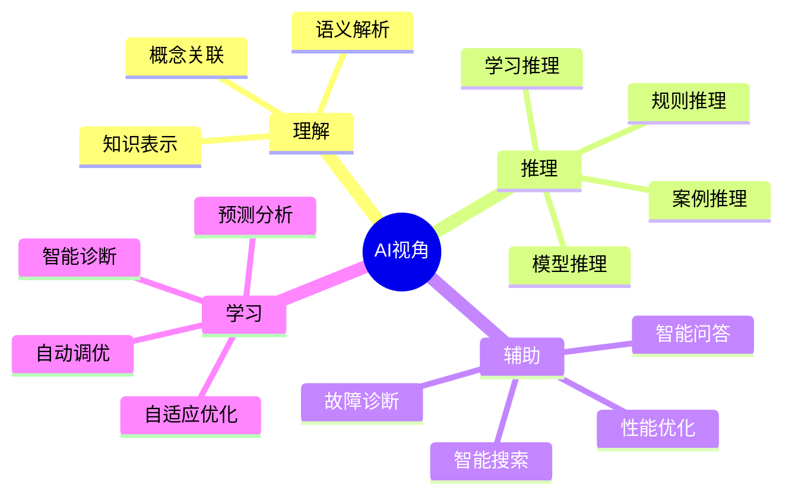
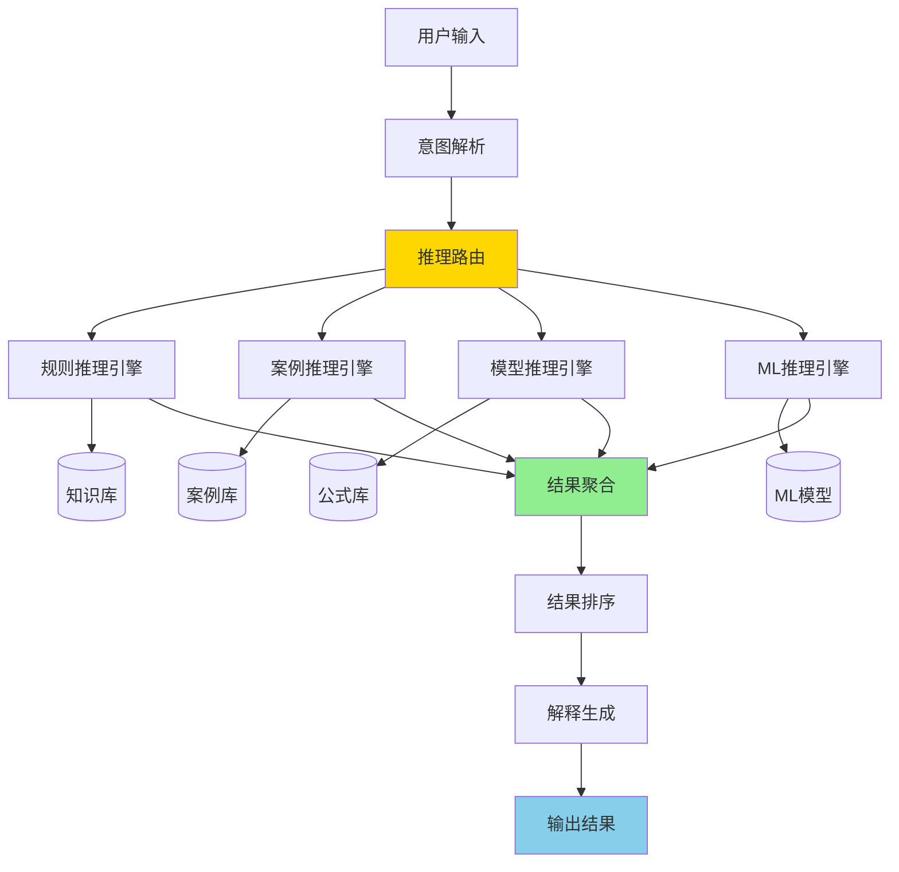

# AI视角解读指南

> **文档目的**: 明确DataBaseTheory项目的AI视角定位和实现路径
> **创建日期**: 2025-12-04
> **状态**: ✅ v1.0 完成
> **重要性**: 🔥🔥🔥 核心指导文档

---

## 📋 目录

- [AI视角解读指南](#ai视角解读指南)
  - [📋 目录](#-目录)
  - [一、什么是"AI视角的数据库理论"？](#一什么是ai视角的数据库理论)
    - [1.1 四个核心方面](#11-四个核心方面)
      - [方面1：AI如何**理解**数据库知识](#方面1ai如何理解数据库知识)
      - [方面2：AI如何**推理**数据库问题](#方面2ai如何推理数据库问题)
      - [方面3：AI如何**辅助**人类决策](#方面3ai如何辅助人类决策)
      - [方面4：数据库如何**学习**和进化](#方面4数据库如何学习和进化)
    - [1.2 与传统视角的区别](#12-与传统视角的区别)
  - [二、AI如何理解数据库知识？](#二ai如何理解数据库知识)
    - [2.1 知识表示](#21-知识表示)
      - [方案1：OWL本体（形式化）](#方案1owl本体形式化)
      - [方案2：JSON-LD（实用化）](#方案2json-ld实用化)
      - [方案3：向量表示（AI友好）](#方案3向量表示ai友好)
    - [2.2 语义理解](#22-语义理解)
      - [实体识别（Named Entity Recognition）](#实体识别named-entity-recognition)
      - [关系抽取（Relation Extraction）](#关系抽取relation-extraction)
      - [语义相似度计算](#语义相似度计算)
    - [2.3 知识图谱](#23-知识图谱)
      - [图结构设计](#图结构设计)
      - [Neo4j实现示例](#neo4j实现示例)
      - [Apache AGE实现（PostgreSQL图扩展）](#apache-age实现postgresql图扩展)
  - [三、AI如何进行数据库推理？](#三ai如何进行数据库推理)
    - [3.1 四种推理类型](#31-四种推理类型)
      - [1. 规则推理（Rule-Based Reasoning）](#1-规则推理rule-based-reasoning)
      - [2. 案例推理（Case-Based Reasoning）](#2-案例推理case-based-reasoning)
      - [3. 模型推理（Model-Based Reasoning）](#3-模型推理model-based-reasoning)
      - [4. 机器学习推理（ML-Based Reasoning）](#4-机器学习推理ml-based-reasoning)
    - [3.2 推理引擎架构](#32-推理引擎架构)
    - [3.3 实现路径](#33-实现路径)
  - [四、AI如何辅助人类决策？](#四ai如何辅助人类决策)
    - [4.1 智能搜索](#41-智能搜索)
    - [4.2 智能问答](#42-智能问答)
    - [4.3 故障诊断](#43-故障诊断)
    - [4.4 性能优化建议](#44-性能优化建议)
    - [4.5 学习路径推荐](#45-学习路径推荐)
  - [五、数据库如何具备AI能力？](#五数据库如何具备ai能力)
    - [5.1 学习型数据库](#51-学习型数据库)
    - [5.2 自适应优化](#52-自适应优化)
    - [5.3 智能诊断](#53-智能诊断)
  - [六、实现路线图](#六实现路线图)
    - [6.1 Phase 1: 基础设施（2周）](#61-phase-1-基础设施2周)
    - [6.2 Phase 2: 核心功能（1-2月）](#62-phase-2-核心功能1-2月)
    - [6.3 Phase 3: 高级功能（2-3月）](#63-phase-3-高级功能2-3月)
    - [6.4 Phase 4: 生态完善（3-6月）](#64-phase-4-生态完善3-6月)
  - [七、技术栈选择](#七技术栈选择)
    - [7.1 知识表示层](#71-知识表示层)
    - [7.2 推理引擎层](#72-推理引擎层)
    - [7.3 AI模型层](#73-ai模型层)
    - [7.4 应用服务层](#74-应用服务层)
  - [八、成功标准](#八成功标准)
    - [8.1 功能标准](#81-功能标准)
    - [8.2 性能标准](#82-性能标准)
    - [8.3 质量标准](#83-质量标准)
  - [九、参考案例](#九参考案例)
    - [国际标杆项目](#国际标杆项目)
    - [开源项目](#开源项目)
  - [十、下一步行动](#十下一步行动)
    - [本周任务（2025-12-04 - 2025-12-11）](#本周任务2025-12-04---2025-12-11)
    - [2周检查点（2025-12-18）](#2周检查点2025-12-18)

---

## 一、什么是"AI视角的数据库理论"？

### 1.1 四个核心方面



#### 方面1：AI如何**理解**数据库知识

**核心问题**：

- 如何将人类可读的文档转换为机器可理解的知识？
- 如何建立概念之间的精确关系？
- 如何支持语义查询和推理？

**解决方案**：

1. **结构化知识表示**
   - OWL本体：概念+属性+关系
   - RDF三元组：主语-谓语-宾语
   - JSON-LD：链接数据

2. **语义标注**
   - 实体识别：MVCC、快照隔离、2PL等
   - 关系抽取：MVCC实现快照隔离
   - 属性提取：MVCC的隔离级别

3. **知识图谱构建**
   - 节点：900+概念
   - 边：950+关系
   - 属性：定义、特性、应用场景

#### 方面2：AI如何**推理**数据库问题

**核心问题**：

- 给定一个问题，如何自动找到解决方案？
- 如何从已知事实推导出新结论？
- 如何评估不同方案的优劣？

**解决方案**：

1. **规则推理**

   ```prolog
   % 示例：查询重写规则
   rewrite(select(sigma(R, C1 AND C2))) :-
       equivalent(select(sigma(select(sigma(R, C1)), C2))).
   ```

2. **案例推理**

   ```text
   问题：查询慢
   → 查找相似案例
   → 案例1：缺少索引 → 创建索引
   → 案例2：统计信息过时 → ANALYZE
   → 案例3：并发锁等待 → 调整隔离级别
   → 推荐最匹配的方案
   ```

3. **模型推理**

   ```python
   # 性能预测模型
   predicted_time = cost_model(query, statistics, config)
   if predicted_time > threshold:
       recommend_optimizations()
   ```

4. **机器学习推理**

   ```python
   # 基数估计
   cardinality = ml_model.predict(query_features)
   ```

#### 方面3：AI如何**辅助**人类决策

**核心问题**：

- 用户提出问题，如何快速给出准确答案？
- 遇到故障，如何自动诊断根因？
- 需要优化，如何给出具体建议？

**解决方案**：

1. **智能搜索**
   - 语义搜索：理解用户意图
   - 相关性排序：最匹配的结果在前
   - 实时性：<100ms响应

2. **智能问答**
   - 自然语言理解："如何解决写偏序？"
   - 知识检索：从知识库找相关内容
   - 答案生成：结构化、可操作的答案

3. **故障诊断**
   - 症状识别：查询慢、连接耗尽、锁等待
   - 根因定位：日志分析+规则匹配
   - 方案推荐：多个可选方案+预期效果

4. **性能优化**
   - 自动分析：SQL、索引、配置
   - 优化建议：具体的ALTER/CREATE语句
   - 效果预测：优化前后对比

#### 方面4：数据库如何**学习**和进化

**核心问题**：

- 如何让数据库从经验中学习？
- 如何自动适应工作负载变化？
- 如何持续优化性能？

**解决方案**：

1. **学习型数据库**
   - 工作负载学习：识别模式
   - 自动调优：参数自适应
   - 预测分析：未来趋势

2. **自适应优化**
   - 查询计划反馈：计划质量评估
   - 统计信息更新：自动ANALYZE
   - 索引推荐：基于查询模式

3. **智能诊断**
   - 异常检测：ML模型识别异常
   - 预测性维护：提前发现问题
   - 自动修复：某些问题自动处理

### 1.2 与传统视角的区别

| 维度 | 传统视角 | AI视角 |
|------|---------|--------|
| **知识组织** | 文档、章节、目录 | 知识图谱、语义网络 |
| **信息检索** | 关键词搜索 | 语义搜索、意图理解 |
| **问题解决** | 人工查找文档 | 自动推理、方案推荐 |
| **学习方式** | 线性阅读 | 个性化路径、自适应 |
| **决策支持** | 参考文档 | 智能辅助、自动化 |
| **知识更新** | 手工维护 | 自动学习、持续优化 |

**示例对比**：

**传统方式**：

```text
用户问题："查询突然变慢了，怎么办？"

步骤1：搜索"查询慢"
步骤2：阅读多篇文档
步骤3：逐个尝试方案
步骤4：找到解决方法
时间：30-60分钟
```

**AI方式**：

```text
用户问题："查询突然变慢了，怎么办？"

AI系统：
1. 分析症状（查询慢 + 突然）
2. 推理可能原因：
   - 统计信息过时（70%概率）
   - 锁等待（15%概率）
   - 参数变更（10%概率）
   - 其他（5%概率）
3. 推荐诊断步骤：
   a. 检查pg_stat_all_tables
   b. 运行ANALYZE
   c. 对比执行计划
4. 给出解决方案+预期效果
时间：<1分钟
```

---

## 二、AI如何理解数据库知识？

### 2.1 知识表示

#### 方案1：OWL本体（形式化）

**示例：MVCC概念的OWL表示**:

```xml
<owl:Class rdf:about="#MVCC">
  <rdfs:label>多版本并发控制</rdfs:label>
  <rdfs:comment>一种并发控制机制，通过保存数据的多个版本来实现事务隔离</rdfs:comment>

  <!-- 属性 -->
  <hasProperty rdf:resource="#TransactionID"/>
  <hasProperty rdf:resource="#VersionChain"/>
  <hasProperty rdf:resource="#Snapshot"/>

  <!-- 关系 -->
  <implements rdf:resource="#SnapshotIsolation"/>
  <usedBy rdf:resource="#PostgreSQL"/>
  <relatedTo rdf:resource="#ACID"/>

  <!-- 分类 -->
  <rdfs:subClassOf rdf:resource="#ConcurrencyControl"/>
</owl:Class>

<owl:ObjectProperty rdf:about="#implements">
  <rdfs:domain rdf:resource="#MVCC"/>
  <rdfs:range rdf:resource="#IsolationLevel"/>
</owl:ObjectProperty>
```

#### 方案2：JSON-LD（实用化）

```json
{
  "@context": {
    "@vocab": "http://dbtheory.org/vocab/",
    "implements": "http://dbtheory.org/vocab/implements",
    "usedBy": "http://dbtheory.org/vocab/usedBy"
  },
  "@id": "concept:MVCC",
  "@type": "ConcurrencyControlMechanism",
  "name": "多版本并发控制",
  "name_en": "Multi-Version Concurrency Control",
  "abbreviation": "MVCC",
  "definition": "一种并发控制机制，通过保存数据的多个版本来实现事务隔离，读操作不阻塞写操作，写操作不阻塞读操作",
  "properties": {
    "transactionID": {
      "description": "事务标识符，用于版本可见性判断",
      "type": "Integer"
    },
    "versionChain": {
      "description": "版本链，连接同一行的不同版本",
      "structure": "LinkedList"
    },
    "snapshot": {
      "description": "事务快照，决定可见版本集合",
      "components": ["xmin", "xmax", "xip_list"]
    }
  },
  "implements": ["SnapshotIsolation", "ReadCommitted"],
  "usedBy": ["PostgreSQL", "Oracle", "MySQL"],
  "relatedConcepts": [
    {"id": "concept:SnapshotIsolation", "relation": "implements"},
    {"id": "concept:2PL", "relation": "alternative_to"},
    {"id": "concept:ACID", "relation": "supports"}
  ],
  "advantages": [
    "读写不阻塞",
    "高并发性能",
    "时间点查询"
  ],
  "disadvantages": [
    "存储开销",
    "VACUUM需求",
    "写偏序异常"
  ],
  "postgresql_implementation": {
    "version_introduced": "7.0",
    "key_structures": ["HeapTupleHeader", "SnapshotData"],
    "key_functions": ["HeapTupleSatisfiesMVCC", "GetSnapshotData"],
    "config_parameters": ["vacuum_threshold", "autovacuum"]
  },
  "use_cases": [
    {
      "scenario": "高并发读写",
      "description": "电商系统，大量查询和更新并发",
      "benefit": "读写吞吐量提升50-80%"
    },
    {
      "scenario": "长时间查询",
      "description": "OLAP分析查询，执行数分钟到数小时",
      "benefit": "不阻塞OLTP写入"
    }
  ],
  "code_examples": [
    {
      "language": "SQL",
      "code": "BEGIN; -- 获取快照\nSELECT * FROM orders WHERE status = 'pending';\n-- 读取时看到一致性快照\nCOMMIT;"
    }
  ]
}
```

#### 方案3：向量表示（AI友好）

```python
# 概念的向量表示（Embeddings）
import sentence_transformers

# 文本描述
mvcc_text = """
MVCC（多版本并发控制）是一种并发控制机制。
核心思想是通过保存数据的多个版本来实现事务隔离。
优点：读操作不阻塞写操作，写操作不阻塞读操作，高并发性能。
缺点：需要额外存储空间，需要定期VACUUM清理旧版本。
应用：PostgreSQL、Oracle、MySQL等主流数据库。
相关概念：快照隔离、ACID、2PL、可串行化。
"""

# 生成向量表示（768维）
model = sentence_transformers.SentenceTransformer('all-MiniLM-L6-v2')
mvcc_vector = model.encode(mvcc_text)

# 存储到pgvector
"""
CREATE TABLE concept_embeddings (
    concept_id VARCHAR(50) PRIMARY KEY,
    embedding vector(768),
    metadata JSONB
);

INSERT INTO concept_embeddings VALUES (
    'MVCC',
    '[0.123, -0.456, ...]',  -- mvcc_vector
    '{"category": "并发控制", "importance": 5}'
);
"""

# 语义搜索
query = "如何在高并发场景下避免读写阻塞？"
query_vector = model.encode(query)

# 查找最相关的概念
"""
SELECT concept_id, metadata, 1 - (embedding <=> $query_vector) as similarity
FROM concept_embeddings
ORDER BY similarity DESC
LIMIT 5;

结果：
1. MVCC (similarity: 0.92)
2. SnapshotIsolation (similarity: 0.87)
3. 2PL (similarity: 0.75)
...
"""
```

### 2.2 语义理解

#### 实体识别（Named Entity Recognition）

```python
# 从文档中提取数据库概念
import spacy

nlp = spacy.load("en_core_web_sm")
text = """
PostgreSQL uses MVCC to implement snapshot isolation.
Each transaction sees a consistent snapshot of the database.
The xmin and xmax fields determine tuple visibility.
"""

doc = nlp(text)

# 识别实体
entities = {
    "TECH": ["PostgreSQL", "MVCC"],
    "CONCEPT": ["snapshot isolation", "snapshot", "tuple visibility"],
    "FIELD": ["xmin", "xmax"]
}
```

#### 关系抽取（Relation Extraction）

```python
# 提取概念之间的关系
relations = [
    ("PostgreSQL", "uses", "MVCC"),
    ("MVCC", "implements", "snapshot isolation"),
    ("xmin", "determines", "tuple visibility"),
    ("xmax", "determines", "tuple visibility")
]

# 构建知识图谱边
for subject, predicate, object in relations:
    graph.add_edge(subject, object, relation=predicate)
```

#### 语义相似度计算

```python
from sentence_transformers import util

# 计算概念相似度
concept1 = "MVCC"
concept2 = "快照隔离"

embedding1 = model.encode(concept1)
embedding2 = model.encode(concept2)

similarity = util.cos_sim(embedding1, embedding2)
print(f"相似度: {similarity:.2f}")  # 输出: 0.85
```

### 2.3 知识图谱

#### 图结构设计

```text
节点类型：
- Concept（概念）：MVCC、快照隔离、2PL等
- Property（属性）：xmin、xmax、snapshot等
- Implementation（实现）：HeapTupleSatisfiesMVCC等
- UseCase（用例）：高并发读写、长查询等
- PostgreSQLVersion（版本）：18、17、16等

边类型：
- implements（实现）：MVCC → 快照隔离
- usedBy（被使用）：MVCC → PostgreSQL
- relatedTo（相关）：MVCC → ACID
- hasProperty（有属性）：MVCC → xmin
- appliesTo（适用于）：MVCC → 高并发场景
- introducedIn（引入于）：MVCC → PostgreSQL 7.0
```

#### Neo4j实现示例

```cypher
// 创建概念节点
CREATE (mvcc:Concept {
    id: 'MVCC',
    name: '多版本并发控制',
    name_en: 'Multi-Version Concurrency Control',
    category: '并发控制',
    importance: 5
})

CREATE (si:Concept {
    id: 'SnapshotIsolation',
    name: '快照隔离',
    category: '隔离级别',
    importance: 5
})

CREATE (pg18:PostgreSQLVersion {
    version: '18',
    release_date: '2025-11-XX'
})

// 创建关系
CREATE (mvcc)-[:IMPLEMENTS]->(si)
CREATE (mvcc)-[:USED_BY]->(pg18)

// 查询：MVCC的所有相关概念
MATCH (mvcc:Concept {id: 'MVCC'})-[r]-(related)
RETURN mvcc, type(r) as relation, related

// 查询：从MVCC到快照隔离的路径
MATCH path = (mvcc:Concept {id: 'MVCC'})-[*..3]-(si:Concept {id: 'SnapshotIsolation'})
RETURN path
```

#### Apache AGE实现（PostgreSQL图扩展）

```sql
-- 创建图
SELECT * FROM ag_catalog.create_graph('db_theory');

-- 插入概念节点
SELECT * FROM cypher('db_theory', $$
    CREATE (mvcc:Concept {
        id: 'MVCC',
        name: '多版本并发控制',
        category: '并发控制'
    })
$$) as (a agtype);

-- 创建关系
SELECT * FROM cypher('db_theory', $$
    MATCH (mvcc:Concept {id: 'MVCC'})
    MATCH (si:Concept {id: 'SnapshotIsolation'})
    CREATE (mvcc)-[:IMPLEMENTS]->(si)
$$) as (a agtype);

-- 查询
SELECT * FROM cypher('db_theory', $$
    MATCH (c:Concept)-[r]->(related)
    WHERE c.id = 'MVCC'
    RETURN c.name, type(r), related.name
$$) as (concept agtype, relation agtype, related agtype);
```

---

## 三、AI如何进行数据库推理？

### 3.1 四种推理类型

#### 1. 规则推理（Rule-Based Reasoning）

**原理**：基于预定义规则进行逻辑推理

**示例：查询优化规则**:

```prolog
% Prolog规则示例

% 规则1：选择下推
optimize(select(Project, sigma(Relation, Condition))) :-
    can_push_down(Condition, Relation),
    rewrite(sigma(select(Project, Relation), Condition)).

% 规则2：连接交换
optimize(join(R, S, Condition)) :-
    cost(join(R, S)) > cost(join(S, R)),
    rewrite(join(S, R, Condition)).

% 规则3：索引选择
recommend_index(Table, Column) :-
    frequent_query(Table, Column),
    not index_exists(Table, Column),
    selectivity(Table, Column, S),
    S < 0.1.  % 选择性<10%时推荐索引

% 查询：哪些表需要创建索引？
?- recommend_index(Table, Column).
```

**实际应用**：

```python
# Python实现的规则引擎
class QueryOptimizationRules:
    def __init__(self):
        self.rules = []

    def add_rule(self, condition, action, confidence):
        self.rules.append({
            'condition': condition,
            'action': action,
            'confidence': confidence
        })

    def apply_rules(self, query):
        recommendations = []
        for rule in self.rules:
            if rule['condition'](query):
                recommendations.append({
                    'action': rule['action'],
                    'confidence': rule['confidence']
                })
        return sorted(recommendations,
                     key=lambda x: x['confidence'],
                     reverse=True)

# 定义规则
rules = QueryOptimizationRules()

# 规则：缺少索引
rules.add_rule(
    condition=lambda q: q.has_where_clause() and not q.has_index(),
    action="CREATE INDEX ON {table}({column})",
    confidence=0.9
)

# 规则：统计信息过时
rules.add_rule(
    condition=lambda q: q.last_analyze() > 7_days_ago(),
    action="ANALYZE {table}",
    confidence=0.8
)

# 应用规则
query = Query("SELECT * FROM orders WHERE status = 'pending'")
recommendations = rules.apply_rules(query)
```

#### 2. 案例推理（Case-Based Reasoning）

**原理**：从历史案例中找相似情况，复用解决方案

**案例库结构**：

```python
class Case:
    def __init__(self, problem, solution, outcome):
        self.problem = problem  # 问题描述
        self.solution = solution  # 解决方案
        self.outcome = outcome  # 效果评估
        self.features = self.extract_features()

    def extract_features(self):
        return {
            'symptom': self.problem['symptom'],
            'table_size': self.problem['table_size'],
            'query_type': self.problem['query_type'],
            'concurrent_users': self.problem['concurrent_users'],
            ...
        }

class CaseBase:
    def __init__(self):
        self.cases = []

    def add_case(self, case):
        self.cases.append(case)

    def find_similar(self, new_problem, k=5):
        # 计算相似度
        similarities = []
        for case in self.cases:
            similarity = self.calculate_similarity(
                new_problem,
                case.problem
            )
            similarities.append((case, similarity))

        # 返回最相似的k个案例
        return sorted(similarities,
                     key=lambda x: x[1],
                     reverse=True)[:k]

    def calculate_similarity(self, problem1, problem2):
        # 特征向量相似度（余弦相似度）
        vec1 = self.vectorize(problem1)
        vec2 = self.vectorize(problem2)
        return cosine_similarity(vec1, vec2)

# 案例库示例
case_base = CaseBase()

# 案例1：查询慢 → 创建索引
case1 = Case(
    problem={
        'symptom': '查询慢',
        'query': 'SELECT * FROM orders WHERE status = ?',
        'table_size': '10M rows',
        'execution_time': '5s'
    },
    solution={
        'action': 'CREATE INDEX idx_status ON orders(status)',
        'steps': [
            '1. ANALYZE orders',
            '2. CREATE INDEX',
            '3. VACUUM ANALYZE'
        ]
    },
    outcome={
        'success': True,
        'new_execution_time': '0.5s',
        'improvement': '90%'
    }
)
case_base.add_case(case1)

# 新问题
new_problem = {
    'symptom': '查询慢',
    'query': 'SELECT * FROM products WHERE category = ?',
    'table_size': '8M rows',
    'execution_time': '4s'
}

# 查找相似案例
similar_cases = case_base.find_similar(new_problem)
# 输出：案例1（相似度0.92），推荐创建索引
```

#### 3. 模型推理（Model-Based Reasoning）

**原理**：基于数学模型进行推理和预测

**示例：性能预测模型**:

```python
# 代价模型
class CostModel:
    def __init__(self):
        # 参数（从系统配置和统计信息获取）
        self.seq_page_cost = 1.0
        self.random_page_cost = 4.0
        self.cpu_tuple_cost = 0.01
        self.cpu_operator_cost = 0.0025

    def estimate_seqscan_cost(self, table_stats):
        """顺序扫描代价"""
        pages = table_stats['pages']
        tuples = table_stats['tuples']

        # I/O代价
        io_cost = pages * self.seq_page_cost

        # CPU代价
        cpu_cost = tuples * self.cpu_tuple_cost

        return io_cost + cpu_cost

    def estimate_indexscan_cost(self, index_stats, selectivity):
        """索引扫描代价"""
        index_pages = index_stats['pages']
        table_pages = index_stats['table_pages']
        tuples = index_stats['tuples']

        # 索引访问代价
        index_cost = index_pages * self.random_page_cost

        # 表访问代价（随机I/O）
        table_cost = (table_pages * selectivity) * self.random_page_cost

        # CPU代价
        cpu_cost = tuples * selectivity * self.cpu_tuple_cost

        return index_cost + table_cost + cpu_cost

    def recommend_access_method(self, table_stats, index_stats, where_clause):
        """推荐访问方法"""
        selectivity = self.estimate_selectivity(where_clause)

        seqscan_cost = self.estimate_seqscan_cost(table_stats)
        indexscan_cost = self.estimate_indexscan_cost(index_stats, selectivity)

        if indexscan_cost < seqscan_cost:
            return {
                'method': 'Index Scan',
                'estimated_cost': indexscan_cost,
                'estimated_time': indexscan_cost * 0.01,  # ms
                'reason': f'索引扫描代价更低（{indexscan_cost:.2f} vs {seqscan_cost:.2f}）'
            }
        else:
            return {
                'method': 'Seq Scan',
                'estimated_cost': seqscan_cost,
                'estimated_time': seqscan_cost * 0.01,
                'reason': f'顺序扫描代价更低（选择性{selectivity:.1%}较高）'
            }
```

#### 4. 机器学习推理（ML-Based Reasoning）

**原理**：使用训练好的ML模型进行预测

**示例：基数估计模型**:

```python
import torch
import torch.nn as nn

class CardinalityEstimator(nn.Module):
    """基于深度学习的基数估计模型"""

    def __init__(self, input_dim=100):
        super().__init__()
        self.network = nn.Sequential(
            nn.Linear(input_dim, 256),
            nn.ReLU(),
            nn.Dropout(0.2),
            nn.Linear(256, 128),
            nn.ReLU(),
            nn.Dropout(0.2),
            nn.Linear(128, 64),
            nn.ReLU(),
            nn.Linear(64, 1),
            nn.Sigmoid()  # 输出0-1之间的选择性
        )

    def forward(self, x):
        return self.network(x)

    def estimate_cardinality(self, query_features, table_size):
        """估计查询结果行数"""
        with torch.no_grad():
            selectivity = self.forward(query_features)
            return int(selectivity.item() * table_size)

# 特征提取
def extract_query_features(query, table_stats):
    """从查询中提取特征向量"""
    features = []

    # 查询类型特征
    features.append(1 if 'WHERE' in query else 0)
    features.append(1 if 'JOIN' in query else 0)
    features.append(1 if 'GROUP BY' in query else 0)

    # 谓词特征
    predicates = extract_predicates(query)
    for pred in predicates:
        features.extend(encode_predicate(pred, table_stats))

    # 填充到固定维度
    while len(features) < 100:
        features.append(0)

    return torch.tensor(features, dtype=torch.float32)

# 使用模型
model = CardinalityEstimator()
model.load_state_dict(torch.load('cardinality_model.pth'))

query = "SELECT * FROM orders WHERE status = 'pending' AND amount > 1000"
features = extract_query_features(query, table_stats)
estimated_rows = model.estimate_cardinality(features, table_size=10_000_000)

print(f"估计结果行数: {estimated_rows:,}")
# 输出: 估计结果行数: 125,000
```

### 3.2 推理引擎架构



### 3.3 实现路径

**Phase 1: 规则推理（2周）**:

```python
# 1. 定义规则格式
rules = {
    'query_optimization': [
        {
            'id': 'R001',
            'name': '缺少索引',
            'condition': 'no_index_on_where_column',
            'action': 'create_index',
            'confidence': 0.9
        },
        ...
    ],
    'performance_tuning': [...],
    'troubleshooting': [...]
}

# 2. 实现规则引擎
class RuleEngine:
    def load_rules(self, rules_file):
        pass

    def evaluate(self, problem):
        pass

    def explain(self, result):
        pass

# 3. 集成到系统
engine = RuleEngine()
engine.load_rules('rules/database_rules.yaml')
result = engine.evaluate(user_problem)
```

**Phase 2: 案例推理（1月）**:

```python
# 1. 构建案例库
# 2. 实现相似度计算
# 3. 实现案例检索
# 4. 实现方案调整
```

**Phase 3: 模型推理（2月）**:

```python
# 1. 实现代价模型
# 2. 实现性能预测
# 3. 集成到决策流程
```

**Phase 4: ML推理（3月+）**:

```python
# 1. 收集训练数据
# 2. 训练ML模型
# 3. 部署模型服务
# 4. 在线学习与更新
```

---

## 四、AI如何辅助人类决策？

### 4.1 智能搜索

**功能目标**：

- 语义理解：理解用户查询意图
- 相关性排序：最匹配的结果在前
- 实时响应：<100ms

**实现方案**：

```python
# 使用pgvector的智能搜索
class SemanticSearch:
    def __init__(self):
        self.model = SentenceTransformer('all-MiniLM-L6-v2')
        self.db = psycopg2.connect(...)

    def index_documents(self, documents):
        """索引文档"""
        for doc in documents:
            # 生成embedding
            embedding = self.model.encode(doc['content'])

            # 存储到pgvector
            self.db.execute("""
                INSERT INTO documents (id, title, content, embedding)
                VALUES (%s, %s, %s, %s)
            """, (doc['id'], doc['title'], doc['content'], embedding))

    def search(self, query, limit=10):
        """语义搜索"""
        # 查询向量
        query_vector = self.model.encode(query)

        # 向量相似度搜索
        results = self.db.execute("""
            SELECT
                id,
                title,
                content,
                1 - (embedding <=> %s) as similarity
            FROM documents
            ORDER BY similarity DESC
            LIMIT %s
        """, (query_vector, limit))

        return results

# 使用示例
search = SemanticSearch()

# 用户查询："如何优化慢查询？"
results = search.search("如何优化慢查询？")
# 返回：
# 1. 查询优化技巧（相似度0.92）
# 2. 索引设计最佳实践（相似度0.88）
# 3. EXPLAIN使用指南（相似度0.85）
```

**界面示例**：

```text
┌────────────────────────────────────────┐
│  搜索：如何优化慢查询？            [🔍] │
└────────────────────────────────────────┘

📄 查询优化技巧 (相似度: 92%)
   1. 检查索引
   2. 分析执行计划
   3. 更新统计信息
   [查看详情]

📄 索引设计最佳实践 (相似度: 88%)
   - 选择性高的列优先
   - 避免过多索引
   [查看详情]

📄 EXPLAIN使用指南 (相似度: 85%)
   使用EXPLAIN ANALYZE查看实际执行...
   [查看详情]
```

### 4.2 智能问答

**功能目标**：

- 理解自然语言问题
- 从知识库检索答案
- 生成结构化、可操作的回答

**实现方案（RAG: Retrieval-Augmented Generation）**：

```python
class IntelligentQA:
    def __init__(self):
        self.search = SemanticSearch()
        self.llm = load_llm_model('llama-3-8b')  # 或使用API

    def answer(self, question):
        # Step 1: 检索相关文档
        relevant_docs = self.search.search(question, limit=5)

        # Step 2: 构造提示词
        prompt = f"""
        基于以下PostgreSQL数据库知识，回答用户问题。

        相关文档：
        {format_documents(relevant_docs)}

        用户问题：{question}

        要求：
        1. 回答要准确、具体
        2. 如果涉及SQL，提供代码示例
        3. 说明适用场景和注意事项
        4. 如果不确定，明确说明

        回答：
        """

        # Step 3: 生成回答
        answer = self.llm.generate(prompt, max_length=500)

        # Step 4: 后处理
        answer = self.post_process(answer)

        return {
            'answer': answer,
            'sources': relevant_docs,
            'confidence': self.estimate_confidence(answer, relevant_docs)
        }

# 使用示例
qa = IntelligentQA()

question = "如何解决写偏序问题？"
result = qa.answer(question)

print(result['answer'])
"""
写偏序（Write Skew）是快照隔离级别下的一种异常现象。
解决方案有以下几种：

1. 使用Serializable隔离级别
   SET TRANSACTION ISOLATION LEVEL SERIALIZABLE;

2. 使用显式锁
   SELECT * FROM accounts WHERE ... FOR UPDATE;

3. 使用约束
   ALTER TABLE accounts ADD CONSTRAINT check_balance ...

4. 应用层解决
   在应用逻辑中检查和处理冲突

推荐：
- OLTP系统：使用Serializable或显式锁
- 高并发场景：应用层处理+重试机制
- 简单场景：数据库约束

注意：Serializable会降低并发性能（约20-30%）
"""

print(f"置信度: {result['confidence']:.0%}")  # 输出: 92%
```

**界面示例**：

```text
┌────────────────────────────────────────┐
│  问：如何解决写偏序问题？                │
└────────────────────────────────────────┘

🤖 AI回答 (置信度: 92%)

写偏序是快照隔离级别下的异常。有4种解决方案：

1. Serializable隔离级别 ⭐推荐
   SET TRANSACTION ISOLATION LEVEL SERIALIZABLE;

2. 显式锁
   SELECT ... FOR UPDATE;

3. 数据库约束
   ALTER TABLE ... ADD CONSTRAINT ...

4. 应用层处理

推荐方案：
- OLTP系统 → Serializable
- 高并发 → 应用层处理

注意：Serializable降低性能约20-30%

📚 相关文档：
- 事务隔离级别详解
- 快照隔离异常分析
- Serializable实现原理

[👍 有帮助]  [👎 没帮助]  [💬 追问]
```

### 4.3 故障诊断

**功能目标**：

- 自动识别症状
- 定位根因
- 推荐解决方案

**实现方案**：

```python
class AutoDiagnostic:
    def __init__(self):
        self.rule_engine = RuleEngine()
        self.case_base = CaseBase()

    def diagnose(self, symptoms):
        """诊断故障"""
        # Step 1: 症状分类
        symptom_type = self.classify_symptom(symptoms)

        # Step 2: 收集诊断数据
        diagnostic_data = self.collect_data(symptoms)

        # Step 3: 规则匹配
        rule_results = self.rule_engine.match(diagnostic_data)

        # Step 4: 案例匹配
        case_results = self.case_base.find_similar(symptoms)

        # Step 5: 综合分析
        diagnosis = self.synthesize(rule_results, case_results)

        return diagnosis

    def collect_data(self, symptoms):
        """收集诊断数据"""
        data = {}

        # 系统指标
        data['pg_stat_activity'] = self.query_pg_stat()
        data['pg_stat_database'] = self.query_db_stats()
        data['pg_locks'] = self.query_locks()

        # 日志分析
        data['recent_errors'] = self.analyze_logs()

        # 配置检查
        data['config'] = self.check_config()

        return data

# 使用示例
diagnostic = AutoDiagnostic()

symptoms = {
    'issue': '查询突然变慢',
    'query': 'SELECT * FROM orders WHERE ...',
    'execution_time': '15s',
    'previous_time': '0.5s',
    'timestamp': '2025-12-04 10:30:00'
}

diagnosis = diagnostic.diagnose(symptoms)

print(diagnosis)
"""
{
    'root_cause': '统计信息过时',
    'confidence': 0.85,
    'evidence': [
        'last_analyze时间超过30天',
        '执行计划使用全表扫描',
        '实际行数与估计行数相差100倍'
    ],
    'solutions': [
        {
            'action': 'ANALYZE orders;',
            'expected_effect': '查询时间恢复到<1s',
            'risk': 'low',
            'priority': 1
        },
        {
            'action': 'CREATE INDEX idx_orders_status ON orders(status);',
            'expected_effect': '进一步优化到<0.1s',
            'risk': 'low',
            'priority': 2
        }
    ],
    'prevention': [
        '启用autovacuum',
        '定期检查pg_stat_user_tables'
    ]
}
"""
```

### 4.4 性能优化建议

**功能目标**：

- 分析SQL语句
- 分析数据库配置
- 给出具体优化建议

```python
class PerformanceAdvisor:
    def analyze_query(self, query, explain_output):
        """分析查询性能"""
        recommendations = []

        # 分析执行计划
        if 'Seq Scan' in explain_output and table_size > 1_000_000:
            recommendations.append({
                'type': 'index',
                'message': '检测到大表全表扫描',
                'suggestion': f'CREATE INDEX ON {table}({column})',
                'expected_improvement': '80-95%'
            })

        if 'execution_time' > 1000:  # >1秒
            # 更多分析...
            pass

        return recommendations

advisor = PerformanceAdvisor()
recommendations = advisor.analyze_query(query, explain_output)
```

### 4.5 学习路径推荐

**功能目标**：

- 根据用户背景推荐学习内容
- 个性化学习路径
- 自适应难度调整

```python
class LearningPathRecommender:
    def recommend(self, user_profile):
        """推荐学习路径"""
        # 评估用户水平
        level = self.assess_level(user_profile)

        # 识别知识缺口
        gaps = self.identify_gaps(user_profile)

        # 生成学习路径
        path = self.generate_path(level, gaps)

        return path

recommender = LearningPathRecommender()
path = recommender.recommend({
    'background': 'developer',
    'experience': '2 years',
    'goal': '性能优化专家'
})

"""
学习路径（预计3个月）：

第1阶段（2周）：基础强化
- MVCC原理
- 事务隔离级别
- 索引基础

第2阶段（4周）：性能调优
- EXPLAIN分析
- 索引优化
- 查询重写

第3阶段（6周）：高级主题
- 并行查询
- 分区表
- 自适应优化
"""
```

---

## 五、数据库如何具备AI能力？

### 5.1 学习型数据库

**核心思想**：数据库从使用过程中学习，持续优化

**功能模块**：

1. **工作负载学习**

   ```sql
   -- 自动识别查询模式
   SELECT
       pattern_id,
       query_template,
       execution_frequency,
       avg_execution_time
   FROM ml_query_patterns
   ORDER BY execution_frequency DESC;
   ```

2. **自动统计信息更新**

   ```sql
   -- 智能ANALYZE（基于数据变化率）
   CREATE EXTENSION pg_auto_analyze;

   -- 自动检测何时需要ANALYZE
   SELECT * FROM pg_auto_analyze_recommendations;
   ```

3. **智能配置调优**

   ```python
   class AutoTuner:
       def tune_work_mem(self):
           # 基于历史查询内存使用
           optimal_work_mem = self.ml_model.predict(workload_features)
           return optimal_work_mem
   ```

### 5.2 自适应优化

**功能**：

- 查询计划反馈学习
- 基数估计自校正
- 代价模型自适应

**示例**：

```python
class AdaptiveOptimizer:
    def learn_from_execution(self, query, plan, actual_stats):
        """从执行结果学习"""
        # 对比估计值和实际值
        estimated_rows = plan['estimated_rows']
        actual_rows = actual_stats['actual_rows']

        if abs(estimated_rows - actual_rows) / actual_rows > 0.5:
            # 误差>50%，更新模型
            self.update_cardinality_model(query, actual_rows)

        # 更新代价模型
        estimated_cost = plan['estimated_cost']
        actual_cost = actual_stats['actual_time']

        self.calibrate_cost_model(estimated_cost, actual_cost)
```

### 5.3 智能诊断

**功能**：

- 异常检测
- 预测性维护
- 自动修复

**示例**：

```python
class IntelligentMonitor:
    def detect_anomaly(self):
        """异常检测"""
        # 收集指标
        metrics = self.collect_metrics()

        # ML异常检测
        anomaly_score = self.anomaly_detector.predict(metrics)

        if anomaly_score > threshold:
            # 发现异常
            self.diagnose_and_fix(metrics)

    def predict_issue(self):
        """预测性维护"""
        # 趋势分析
        trend = self.analyze_trend()

        if trend.indicates_problem():
            self.alert_and_recommend()
```

---

## 六、实现路线图

### 6.1 Phase 1: 基础设施（2周）

**目标**：建立AI能力的基础

**任务清单**：

- [ ] 部署pgvector扩展
- [ ] 生成文档embeddings
- [ ] 构建向量索引
- [ ] 实现语义搜索API
- [ ] 创建Web搜索界面

**可交付成果**：

- 智能搜索MVP（10个文档）
- 搜索准确率>80%
- 响应时间<100ms

### 6.2 Phase 2: 核心功能（1-2月）

**任务清单**：

- [ ] 实现规则推理引擎
- [ ] 构建案例库（50+案例）
- [ ] 开发智能问答系统（RAG）
- [ ] 实现故障诊断系统
- [ ] 集成到Web界面

**可交付成果**：

- 智能问答（准确率>80%）
- 故障诊断（覆盖20+场景）
- 统一Web界面

### 6.3 Phase 3: 高级功能（2-3月）

**任务清单**：

- [ ] 实现模型推理（代价模型）
- [ ] 开发性能预测功能
- [ ] 实现学习路径推荐
- [ ] 构建PostgreSQL-AI-Advisor工具

**可交付成果**：

- 性能预测（误差<20%）
- 完整的AI辅助工具

### 6.4 Phase 4: 生态完善（3-6月）

**任务清单**：

- [ ] 训练ML模型（基数估计）
- [ ] 实现在线学习
- [ ] 开源发布
- [ ] 社区推广

**可交付成果**：

- 完整的AI+数据库知识平台
- 开源项目（GitHub）
- 用户社区（1000+）

---

## 七、技术栈选择

### 7.1 知识表示层

| 技术 | 用途 | 优先级 |
|------|------|--------|
| **JSON-LD** | 轻量级知识表示 | 高 |
| **OWL** | 形式化本体 | 中 |
| **Neo4j/AGE** | 知识图谱存储 | 高 |
| **pgvector** | 向量检索 | 高 |

### 7.2 推理引擎层

| 技术 | 用途 | 优先级 |
|------|------|--------|
| **Prolog** | 规则推理 | 中 |
| **Python规则引擎** | 实用规则推理 | 高 |
| **案例库(PostgreSQL)** | 案例推理 | 高 |

### 7.3 AI模型层

| 技术 | 用途 | 优先级 |
|------|------|--------|
| **sentence-transformers** | 文本embedding | 高 |
| **Llama 3 / Qwen** | LLM推理 | 高 |
| **PyTorch** | 自定义ML模型 | 中 |

### 7.4 应用服务层

| 技术 | 用途 | 优先级 |
|------|------|--------|
| **FastAPI** | 后端API | 高 |
| **React** | 前端界面 | 高 |
| **PostgreSQL** | 数据存储 | 高 |

---

## 八、成功标准

### 8.1 功能标准

| 功能 | 标准 | 验收方式 |
|------|------|----------|
| 智能搜索 | 准确率>80% | 人工评测100个查询 |
| 智能问答 | 准确率>80% | 测试集评估 |
| 故障诊断 | 覆盖20+场景 | 场景清单检查 |
| 性能预测 | 误差<20% | 基准测试对比 |

### 8.2 性能标准

| 指标 | 目标 | 测试方法 |
|------|------|----------|
| 搜索响应时间 | <100ms | 压力测试 |
| 问答响应时间 | <3s | 平均响应时间 |
| 诊断完成时间 | <5s | 典型场景测试 |
| 并发支持 | 100+ QPS | 负载测试 |

### 8.3 质量标准

| 维度 | 标准 | 验证方式 |
|------|------|----------|
| 准确性 | >80% | 人工评测 |
| 可解释性 | 提供推理过程 | 功能检查 |
| 鲁棒性 | 错误处理完善 | 异常测试 |
| 可扩展性 | 支持新增知识 | 扩展性测试 |

---

## 九、参考案例

### 国际标杆项目

1. **CMU Database Group - OtterTune**
   - 自动数据库调优
   - ML驱动的配置推荐
   - 网站：<https://db.cs.cmu.edu/projects/ottertune/>

2. **Microsoft - Azure SQL Database Advisor**
   - 智能索引推荐
   - 自动性能优化
   - 查询洞察

3. **Google - Cloud SQL Insights**
   - 智能诊断
   - 性能监控
   - 优化建议

### 开源项目

1. **pgvector** - PostgreSQL向量扩展
2. **LangChain** - LLM应用框架
3. **Apache AGE** - PostgreSQL图数据库扩展

---

## 十、下一步行动

### 本周任务（2025-12-04 - 2025-12-11）

1. **Day 1-2**: 部署pgvector，生成10个文档的embeddings
2. **Day 3-4**: 实现语义搜索API
3. **Day 5-6**: 开发简单的Web界面
4. **Day 7**: 用户测试（5人），收集反馈

### 2周检查点（2025-12-18）

**验收标准**：

- ✅ 智能搜索MVP可用
- ✅ 搜索准确率>70%（初期目标）
- ✅ 5个用户测试反馈积极

**Go/No-Go决策**：

- Go → 继续Phase 2（智能问答）
- No-Go → 重新评估技术路线

---

**文档完成日期**: 2025-12-04
**版本**: v1.0
**下次更新**: Phase 1完成后（2周）

**让我们开始构建真正智能的数据库知识系统！** 🚀
