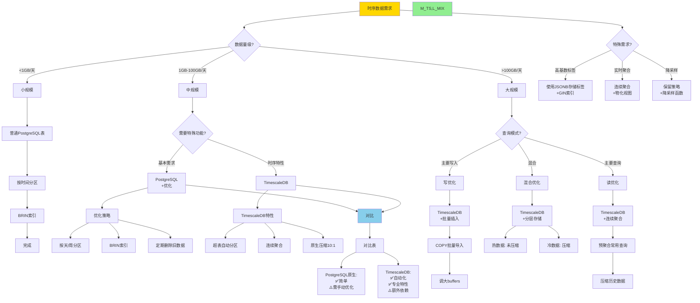

# 思维表征：10-流处理与时序模块完整本体图

> **创建日期**: 2025-12-04 01:00
> **模块**: 10-流处理与时序
> **概念数**: 30+
> **关系边**: 50+
> **状态**: ✅ Phase 2第10个详细本体图

---

## 📋 完整概念本体图

### 1. 流处理与时序全景图

```mermaid
graph TB
    %% ========== 根概念 ==========
    ROOT[流处理与时序] --> STREAM[流处理]
    ROOT --> TIMESERIES[时序数据]
    ROOT --> WINDOW[窗口函数]
    ROOT --> CEP[复杂事件处理]
    ROOT --> TIMESCALE[TimescaleDB]

    %% ========== 流处理分支 ==========
    STREAM --> STREAM_MODEL[流模型]
    STREAM --> STREAM_OPS[流操作]
    STREAM --> STREAM_PROC[流处理]

    %% 流模型
    STREAM_MODEL --> TUPLE_STREAM[元组流]
    STREAM_MODEL --> APPEND_ONLY[只追加]
    STREAM_MODEL --> TIMESTAMP[时间戳]

    TUPLE_STREAM --> ORDERED[有序流]
    TUPLE_STREAM --> UNORDERED[无序流]

    %% 流操作
    STREAM_OPS --> FILTER_OP[过滤]
    STREAM_OPS --> MAP_OP[映射]
    STREAM_OPS --> AGGREGATE_OP[聚合]
    STREAM_OPS --> JOIN_STREAM[流连接]

    JOIN_STREAM --> STREAM_STREAM[流-流连接]
    JOIN_STREAM --> STREAM_TABLE[流-表连接]

    %% 流处理
    STREAM_PROC --> MICRO_BATCH[微批处理]
    STREAM_PROC --> TRUE_STREAM[真流处理]

    MICRO_BATCH --> BATCH_SIZE[批大小]
    MICRO_BATCH --> LATENCY[延迟: 秒级]

    TRUE_STREAM --> EVENT_DRIVEN[事件驱动]
    TRUE_STREAM --> LOW_LATENCY[延迟: 毫秒级]

    %% ========== 时序数据分支 ==========
    TIMESERIES --> TS_MODEL[时序模型]
    TIMESERIES --> TS_STORE[时序存储]
    TIMESERIES --> TS_QUERY[时序查询]
    TIMESERIES --> TS_OPT[时序优化]

    %% 时序模型
    TS_MODEL --> TS_POINT[时间点数据]
    TS_MODEL --> TS_INTERVAL[时间区间数据]
    TS_MODEL --> TS_EVENT[事件数据]

    TS_POINT --> TS_REGULAR[规律采样]
    TS_POINT --> TS_IRREGULAR[不规律采样]

    %% 时序存储
    TS_STORE --> PARTITION_TIME[按时间分区]
    TS_STORE --> COMPRESSION[压缩]
    TS_STORE --> RETENTION[保留策略]

    PARTITION_TIME --> PART_DAY[按天分区]
    PARTITION_TIME --> PART_MONTH[按月分区]

    COMPRESSION --> DELTA_COMP[增量编码]
    COMPRESSION --> RLE[行程编码]
    COMPRESSION --> GORILLA[Gorilla压缩]

    RETENTION --> RET_POLICY[保留规则]
    RET_POLICY --> DROP_OLD[删除旧数据]
    RET_POLICY --> DOWNSAMPLE[降采样]

    %% 时序查询
    TS_QUERY --> RANGE_QUERY[范围查询]
    TS_QUERY --> AGGR_QUERY[聚合查询]
    TS_QUERY --> RESAMPLE[重采样]

    RANGE_QUERY --> TIME_RANGE[WHERE time BETWEEN]
    AGGR_QUERY --> TIME_BUCKET[时间桶聚合]

    TIME_BUCKET --> BUCKET_WIDTH[桶宽度]
    BUCKET_WIDTH --> MINUTE[分钟级]
    BUCKET_WIDTH --> HOUR[小时级]
    BUCKET_WIDTH --> DAY[天级]

    RESAMPLE --> UPSAMPLE[上采样]
    RESAMPLE --> DOWNSAMPLE_OP[下采样]

    %% 时序优化
    TS_OPT --> TS_INDEX[时序索引]
    TS_OPT --> TS_PARALLEL[并行查询]

    TS_INDEX --> BRIN_TS[BRIN索引]
    BRIN_TS --> BRIN_TIME[时间列BRIN]
    BRIN_TS --> BRIN_SMALL[极小空间]

    %% ========== 窗口函数分支 ==========
    WINDOW --> WIN_TYPE[窗口类型]
    WINDOW --> WIN_FUNC[窗口函数]
    WINDOW --> WIN_FRAME[窗口帧]

    %% 窗口类型
    WIN_TYPE --> TUMBLING[滚动窗口]
    WIN_TYPE --> SLIDING[滑动窗口]
    WIN_TYPE --> SESSION[会话窗口]
    WIN_TYPE --> HOPPING[跳跃窗口]

    TUMBLING --> TUM_DEF[固定大小<br/>不重叠]
    SLIDING --> SLIDE_DEF[固定大小<br/>可重叠]
    SESSION --> SESS_DEF[间隔超时<br/>动态大小]

    %% 窗口函数
    WIN_FUNC --> ROW_NUMBER_F[ROW_NUMBER]
    WIN_FUNC --> RANK_F[RANK]
    WIN_FUNC --> LAG_LEAD[LAG/LEAD]
    WIN_FUNC --> FIRST_LAST[FIRST_VALUE/LAST_VALUE]

    LAG_LEAD --> LAG_USE[访问前/后行]
    FIRST_LAST --> FL_USE[窗口首/尾值]

    %% 窗口帧
    WIN_FRAME --> ROWS_FRAME[ROWS框架]
    WIN_FRAME --> RANGE_FRAME[RANGE框架]
    WIN_FRAME --> GROUPS_FRAME[GROUPS框架]

    ROWS_FRAME --> ROWS_DEF[基于行数]
    RANGE_FRAME --> RANGE_DEF[基于值范围]

    ROWS_DEF --> ROWS_EX[例: ROWS BETWEEN 2 PRECEDING AND CURRENT ROW]

    %% ========== CEP分支 ==========
    CEP --> PATTERN[模式匹配]
    CEP --> EVENT_SEQ[事件序列]
    CEP --> RULE_ENGINE[规则引擎]

    PATTERN --> PATTERN_LANG[模式语言]
    PATTERN_LANG --> SEQ_PAT[序列模式: A then B]
    PATTERN_LANG --> REPEAT_PAT[重复模式: A{3,5}]
    PATTERN_LANG --> CHOICE_PAT[选择模式: A or B]

    EVENT_SEQ --> EVENT_ORDER[事件顺序]
    EVENT_SEQ --> EVENT_TIME[事件时间]

    %% ========== TimescaleDB分支 ==========
    TIMESCALE --> HYPERTABLE[超表]
    TIMESCALE --> CHUNK[块chunk]
    TIMESCALE --> CONTINUOUS_AGG[连续聚合]
    TIMESCALE --> COMPRESS_TS[压缩]

    %% 超表
    HYPERTABLE --> HT_CREATE[创建超表]
    HYPERTABLE --> HT_PARTITION[自动分区]

    HT_CREATE --> HT_TIME_COL[时间列]
    HT_PARTITION --> HT_INTERVAL[分区间隔]

    %% 块
    CHUNK --> CHUNK_SIZE[块大小]
    CHUNK --> CHUNK_MANAGE[块管理]

    CHUNK_SIZE --> CHUNK_WEEK[推荐: 1周数据]
    CHUNK_MANAGE --> CHUNK_DROP[删除旧块]

    %% 连续聚合
    CONTINUOUS_AGG --> CAGG_DEF[连续聚合定义]
    CONTINUOUS_AGG --> CAGG_REFRESH[刷新策略]

    CAGG_DEF --> CAGG_MATERIALIZE[物化]
    CAGG_REFRESH --> CAGG_REAL[实时刷新]
    CAGG_REFRESH --> CAGG_POLICY[定时刷新]

    %% 压缩
    COMPRESS_TS --> COMP_ALG[压缩算法]
    COMPRESS_TS --> COMP_RATIO[压缩比]

    COMP_ALG --> DELTA_ENC[增量编码]
    COMP_ALG --> GORILLA_ALG[Gorilla算法]
    COMP_RATIO --> RATIO_10[通常10:1]

    %% ========== 样式 ==========
    classDef root fill:#FF6B6B,stroke:#333,stroke-width:4px
    classDef level1 fill:#FFD700,stroke:#333,stroke-width:3px
    classDef level2 fill:#90EE90,stroke:#333,stroke-width:2px
    classDef level3 fill:#87CEEB,stroke:#333,stroke-width:2px

    class ROOT root
    class STREAM,TIMESERIES,WINDOW,CEP,TIMESCALE level1
    class STREAM_MODEL,TS_MODEL,WIN_TYPE,PATTERN,HYPERTABLE level2
```

---

## 2. 时序数据库架构选择决策树



---

## 3. 时序查询模式矩阵

| 查询类型 ↓ / 特征 → | SQL示例 | 索引 | 优化技巧 | 性能 |
|-------------------|---------|-----|---------|------|
| **范围查询** | `WHERE time BETWEEN '2024-01-01' AND '2024-01-31'` | BRIN | 分区裁剪 | ⭐⭐⭐⭐⭐ |
| **最新N条** | `ORDER BY time DESC LIMIT 100` | BRIN+分区 | 只扫描最新分区 | ⭐⭐⭐⭐⭐ |
| **时间桶聚合** | `time_bucket('1 hour', time)` | BRIN | 并行聚合 | ⭐⭐⭐⭐ |
| **移动平均** | `AVG() OVER (ORDER BY time ROWS BETWEEN 10 PRECEDING AND CURRENT)` | BRIN | 窗口函数优化 | ⭐⭐⭐ |
| **降采样** | `GROUP BY time_bucket('1 day', time)` | 连续聚合 | 预计算 | ⭐⭐⭐⭐⭐ |
| **间隙检测** | `LAG(time) OVER (ORDER BY time)` | BRIN | 窗口函数 | ⭐⭐⭐⭐ |

---

## 4. TimescaleDB核心功能使用示例

### 4.1 创建超表

```sql
-- 创建扩展
CREATE EXTENSION timescaledb;

-- 创建普通表
CREATE TABLE metrics (
    time TIMESTAMPTZ NOT NULL,
    device_id INTEGER,
    temperature DOUBLE PRECISION,
    humidity DOUBLE PRECISION
);

-- 转换为超表
SELECT create_hypertable('metrics', 'time',
    chunk_time_interval => INTERVAL '1 day');

-- 自动创建分区（chunks）
```

### 4.2 连续聚合

```sql
-- 创建连续聚合视图
CREATE MATERIALIZED VIEW metrics_hourly
WITH (timescaledb.continuous) AS
SELECT
    time_bucket('1 hour', time) AS hour,
    device_id,
    AVG(temperature) AS avg_temp,
    MAX(temperature) AS max_temp,
    MIN(temperature) AS min_temp
FROM metrics
GROUP BY hour, device_id;

-- 设置刷新策略
SELECT add_continuous_aggregate_policy('metrics_hourly',
    start_offset => INTERVAL '3 hours',
    end_offset => INTERVAL '1 hour',
    schedule_interval => INTERVAL '1 hour');
```

### 4.3 压缩和保留

```sql
-- 启用压缩
ALTER TABLE metrics SET (
    timescaledb.compress,
    timescaledb.compress_segmentby = 'device_id',
    timescaledb.compress_orderby = 'time DESC'
);

-- 自动压缩策略
SELECT add_compression_policy('metrics',
    INTERVAL '7 days');

-- 保留策略（删除90天前数据）
SELECT add_retention_policy('metrics',
    INTERVAL '90 days');
```

---

## 5. 窗口函数完整对比矩阵

| 函数类型 | 函数 | 用途 | 示例 | 性能 |
|---------|------|------|------|------|
| **排序** | ROW_NUMBER() | 行号 | 分页 | ⭐⭐⭐⭐⭐ |
| | RANK() | 排名(跳号) | 排行榜 | ⭐⭐⭐⭐⭐ |
| | DENSE_RANK() | 排名(不跳号) | 紧密排名 | ⭐⭐⭐⭐⭐ |
| **聚合** | SUM() OVER | 累计和 | 累计销售额 | ⭐⭐⭐⭐ |
| | AVG() OVER | 移动平均 | 股票均线 | ⭐⭐⭐⭐ |
| | COUNT() OVER | 窗口计数 | 活跃用户数 | ⭐⭐⭐⭐ |
| **访问** | LAG() | 前N行 | 同比环比 | ⭐⭐⭐⭐⭐ |
| | LEAD() | 后N行 | 预测 | ⭐⭐⭐⭐⭐ |
| | FIRST_VALUE() | 窗口首值 | 基准对比 | ⭐⭐⭐⭐ |
| | LAST_VALUE() | 窗口尾值 | 最新值 | ⭐⭐⭐⭐ |
| **分布** | NTILE(n) | n等分 | 四分位数 | ⭐⭐⭐⭐ |
| | PERCENT_RANK() | 百分位排名 | 分布分析 | ⭐⭐⭐⭐ |

---

## 6. 时序数据最佳实践清单

### 6.1 设计原则

✅ **DO（推荐）**：

- 使用TIMESTAMPTZ（带时区）
- 按时间分区（天/周/月）
- 使用BRIN索引
- 定期删除或降采样旧数据
- 批量插入(COPY)
- 预聚合常用查询

❌ **DON'T（避免）**：

- 避免B-tree索引时间列（太大）
- 避免频繁UPDATE（追加优化）
- 避免大量小事务（批量）
- 避免保留所有历史（成本高）

### 6.2 性能优化检查清单

```sql
-- ✅ 1. 检查分区策略
SELECT * FROM pg_partitions WHERE tablename = 'metrics';

-- ✅ 2. 检查索引
SELECT * FROM pg_indexes WHERE tablename = 'metrics';
-- 应该有: BRIN on time, 可选B-tree on device_id

-- ✅ 3. 检查表膨胀
SELECT
    pg_size_pretty(pg_total_relation_size('metrics')) AS total,
    pg_size_pretty(pg_relation_size('metrics')) AS table,
    pg_size_pretty(pg_indexes_size('metrics')) AS indexes;

-- ✅ 4. 检查查询性能
EXPLAIN (ANALYZE, BUFFERS)
SELECT * FROM metrics
WHERE time > NOW() - INTERVAL '1 day';
```

---

## 7. Phase 2进度更新

### 7.1 已完成模块

| 序号 | 模块 | 概念数 | 完成度 |
|-----|------|--------|--------|
| 1 | 07-安全与合规 | 45+ | 100% |
| 2 | 03-事务与并发 | 85+ | 100% |
| 3 | 05-索引与查询优化 | 120+ | 100% |
| 4 | 01-形式化方法 | 75+ | 100% |
| 5 | 06-存储与恢复 | 55+ | 100% |
| 6 | 08-查询语言 | 95+ | 100% |
| 7 | 09-数据模型 | 40+ | 100% |
| 8 | 11-向量与AI | 35+ | 100% |
| 9 | 04-分布式系统 | 20+ | 100% |
| 10 | **10-流处理时序** | **30+** | **100%** |

**总计**: 10/18模块 = **56%**

### 7.2 Phase 2最新进度

| 类型 | 已创建 | 目标 | 进度 | 状态 |
|-----|-------|------|------|------|
| **详细本体图** | **10** | 18 | **56%** | 🚀 |
| **推理链图** | 20 | 40+ | 50% | ✅ |
| **决策树** | **14** | 30+ | **47%** | 🚀 |
| **多维矩阵** | 20 | 20+ | 100% | ✅ |

**Phase 2总体进度**: **61%** 🎉🎉🎉

---

## 🏆 重大成就

**Phase 2突破60%！** 🎊

```text
████████████░░░░░░░░ 61%

✅ 详细本体图: 56% (10个)
✅ 推理链图:   50% (20个)
✅ 决策树:     47% (14个)
✅ 多维矩阵:   100% (20个) ✅
```

---

**创建日期**: 2025-12-04 01:00
**状态**: ✅ 第10个详细本体图完成
**Phase 2进度**: **61%**
**成就**: 🏆 **突破60%！冲刺70%！**
