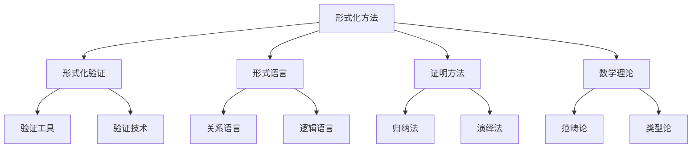
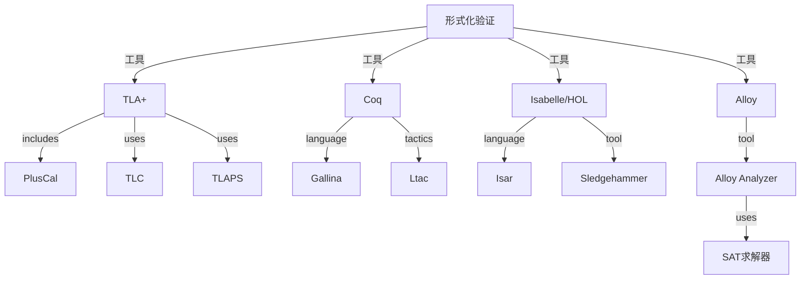
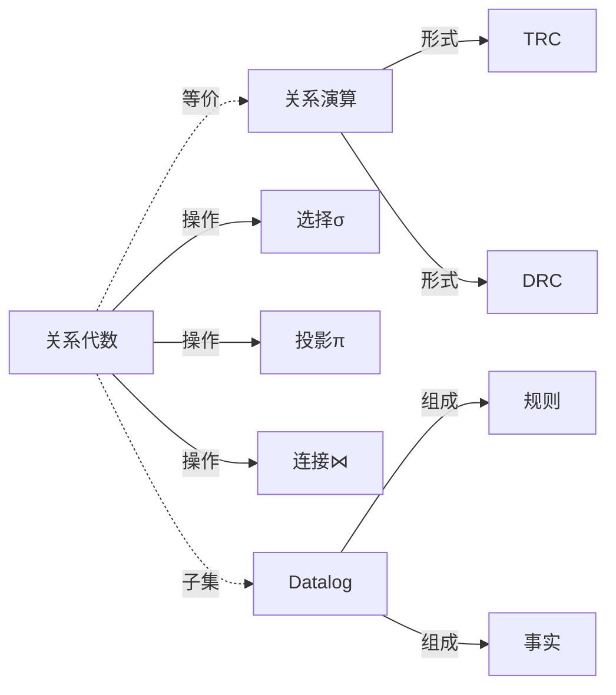
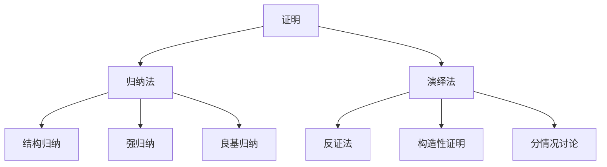
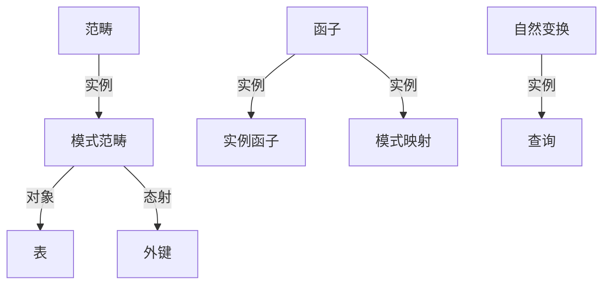
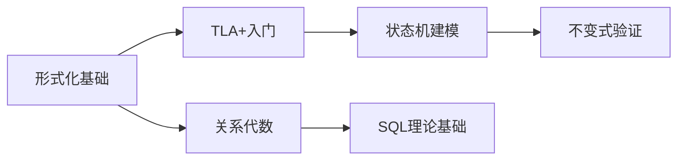
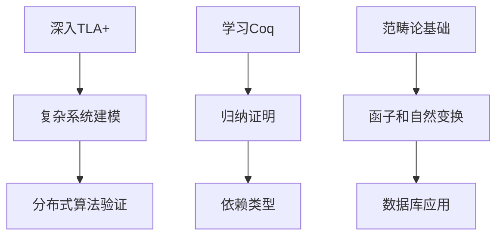
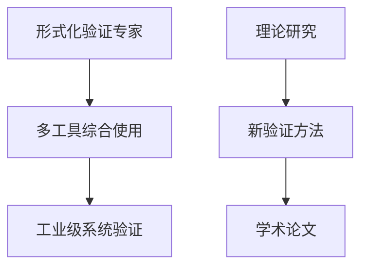
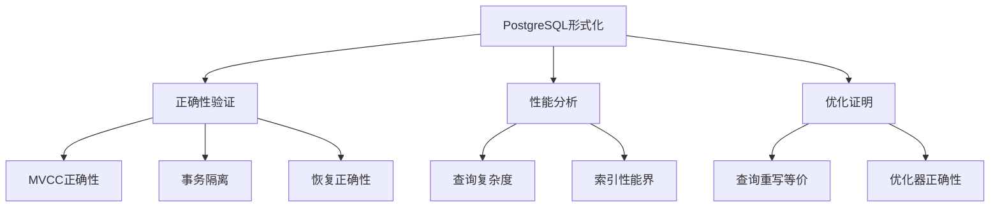

# 概念本体：01-形式化方法与基础理论模块

> **提取日期**: 2025-12-03
> **来源模块**: 01-形式化方法与基础理论（6个文档）
> **概念数量**: 75+
> **状态**: ✅ 提取完成

---

## 📋 概念分类体系

### 层次1：顶层概念

---

## 1. 核心概念清单

### 1.1 元概念层（Meta-Concepts）

| ID | 概念名称 | 英文名 | 定义 | 抽象层次 |
|----|---------|--------|------|---------|
| FM01 | **形式化方法** | Formal Methods | 使用数学方法描述、开发和验证软件系统 | 元概念 |
| FM02 | **形式化验证** | Formal Verification | 用数学方法证明系统满足规范 | 元概念 |
| FM03 | **形式语言** | Formal Language | 具有精确语法和语义的语言 | 元概念 |
| FM04 | **证明** | Proof | 从公理和推理规则推导结论的过程 | 元概念 |
| FM05 | **语义** | Semantics | 语言结构的意义 | 元概念 |

### 1.2 形式化验证工具（Verification Tools）

#### 1.2.1 时序逻辑工具

| ID | 概念名称 | 英文名 | 定义 | 依赖概念 | 特点 |
|----|---------|--------|------|---------|------|
| T01 | **TLA+** | Temporal Logic of Actions | 基于时序逻辑的规范语言 | FM02 | 描述并发系统 |
| T02 | **PlusCal** | PlusCal | TLA+的高级语言 | T01 | 类似伪代码 |
| T03 | **TLC** | TLC Model Checker | TLA+的模型检验器 | T01 | 有限状态验证 |
| T04 | **TLAPS** | TLA+ Proof System | TLA+的证明系统 | T01 | 交互式证明 |
| T05 | **时序逻辑** | Temporal Logic | 描述时间相关性质的逻辑 | FM03 | 支持并发建模 |
| T06 | **状态机** | State Machine | 状态和转换的集合 | T01 | 系统建模基础 |
| T07 | **不变式** | Invariant | 系统所有状态都满足的性质 | T01 | 正确性条件 |

#### 1.2.2 定理证明器

| ID | 概念名称 | 英文名 | 定义 | 依赖概念 | 特点 |
|----|---------|--------|------|---------|------|
| T10 | **Coq** | Coq | 基于归纳构造演算的证明助手 | FM02 | 函数式编程 |
| T11 | **Gallina** | Gallina | Coq的规范语言 | T10 | 依赖类型 |
| T12 | **Ltac** | Ltac | Coq的策略语言 | T10 | 证明自动化 |
| T13 | **归纳类型** | Inductive Type | Coq中的数据类型定义 | T10 | 支持归纳证明 |
| T14 | **依赖类型** | Dependent Type | 类型依赖于值 | T10 | 表达能力强 |

#### 1.2.3 高阶逻辑工具

| ID | 概念名称 | 英文名 | 定义 | 依赖概念 | 特点 |
|----|---------|--------|------|---------|------|
| T20 | **Isabelle/HOL** | Isabelle/HOL | 基于高阶逻辑的证明助手 | FM02 | 泛用性强 |
| T21 | **Isar** | Isar | Isabelle的结构化证明语言 | T20 | 可读性高 |
| T22 | **Sledgehammer** | Sledgehammer | Isabelle的自动证明工具 | T20 | 调用SMT求解器 |
| T23 | **高阶逻辑** | Higher-Order Logic | 可量化函数的逻辑 | FM03 | 表达能力强 |

#### 1.2.4 模型检查工具

| ID | 概念名称 | 英文名 | 定义 | 依赖概念 | 特点 |
|----|---------|--------|------|---------|------|
| T30 | **Alloy** | Alloy | 基于关系逻辑的建模语言 | FM02 | 轻量级形式化 |
| T31 | **Alloy Analyzer** | Alloy Analyzer | Alloy的分析器 | T30 | SAT求解器 |
| T32 | **关系逻辑** | Relational Logic | 基于关系的逻辑 | FM03 | 适合数据建模 |
| T33 | **SAT求解器** | SAT Solver | 布尔可满足性求解器 | T30 | 自动化工具 |

### 1.3 形式语言（Formal Languages）

#### 1.3.1 关系语言

| ID | 概念名称 | 英文名 | 定义 | 依赖概念 | 关系 |
|----|---------|--------|------|---------|------|
| L01 | **关系代数** | Relational Algebra | 基于集合的查询语言 | FM03 | 过程式 |
| L02 | **选择** | Selection (σ) | 筛选满足条件的元组 | L01 | 操作符 |
| L03 | **投影** | Projection (π) | 选择列 | L01 | 操作符 |
| L04 | **连接** | Join (⋈) | 组合两个关系 | L01 | 操作符 |
| L05 | **并** | Union (∪) | 两个关系的并集 | L01 | 操作符 |
| L06 | **差** | Difference (−) | 两个关系的差集 | L01 | 操作符 |
| L07 | **笛卡尔积** | Cartesian Product (×) | 两个关系的积 | L01 | 操作符 |

#### 1.3.2 关系演算

| ID | 概念名称 | 英文名 | 定义 | 依赖概念 | 关系 |
|----|---------|--------|------|---------|------|
| L10 | **关系演算** | Relational Calculus | 基于逻辑的查询语言 | FM03 | 声明式 |
| L11 | **元组关系演算** | Tuple Relational Calculus | 变量为元组 | L10 | TRC |
| L12 | **域关系演算** | Domain Relational Calculus | 变量为域值 | L10 | DRC |
| L13 | **安全查询** | Safe Query | 结果有限的查询 | L10 | 约束 |
| L14 | **Codd定理** | Codd's Theorem | 关系代数与演算等价 | L01, L10 | 等价性 |

#### 1.3.3 逻辑语言

| ID | 概念名称 | 英文名 | 定义 | 依赖概念 | 关系 |
|----|---------|--------|------|---------|------|
| L20 | **Datalog** | Datalog | 逻辑编程语言的子集 | FM03 | 声明式 |
| L21 | **规则** | Rule | Horn子句形式的规则 | L20 | 组成单元 |
| L22 | **事实** | Fact | 基础关系 | L20 | 基础数据 |
| L23 | **递归** | Recursion | 规则递归定义 | L20 | 支持传递闭包 |
| L24 | **不动点** | Fixpoint | 递归的最小不动点 | L20 | 语义基础 |
| L25 | **分层** | Stratification | 消除递归中的否定 | L20 | 安全约束 |

### 1.4 证明方法（Proof Methods）

#### 1.4.1 归纳法

| ID | 概念名称 | 英文名 | 定义 | 依赖概念 | 应用 |
|----|---------|--------|------|---------|------|
| P01 | **数学归纳法** | Mathematical Induction | 从n到n+1的证明 | FM04 | 自然数性质 |
| P02 | **结构归纳法** | Structural Induction | 基于数据结构的归纳 | P01 | 递归结构 |
| P03 | **强归纳法** | Strong Induction | 假设所有小于n的情况 | P01 | 复杂递归 |
| P04 | **良基归纳法** | Well-Founded Induction | 基于良基关系的归纳 | P01 | 复杂数据结构 |
| P05 | **归纳假设** | Induction Hypothesis | 归纳步骤的假设 | P01 | 证明步骤 |

#### 1.4.2 演绎法

| ID | 概念名称 | 英文名 | 定义 | 依赖概念 | 应用 |
|----|---------|--------|------|---------|------|
| P10 | **直接证明** | Direct Proof | 从前提直接推导结论 | FM04 | 基本方法 |
| P11 | **反证法** | Proof by Contradiction | 假设结论为假导出矛盾 | FM04 | 存在性证明 |
| P12 | **构造性证明** | Constructive Proof | 显式构造满足条件的对象 | FM04 | 算法设计 |
| P13 | **分情况讨论** | Case Analysis | 穷举所有情况 | FM04 | 完备性 |

### 1.5 范畴论（Category Theory）

#### 1.5.1 基本概念

| ID | 概念名称 | 英文名 | 定义 | 依赖概念 | 关系 |
|----|---------|--------|------|---------|------|
| C01 | **范畴** | Category | 对象和态射的集合 | FM05 | 基础结构 |
| C02 | **对象** | Object | 范畴中的实体 | C01 | 组成元素 |
| C03 | **态射** | Morphism | 对象间的箭头 | C01 | 映射关系 |
| C04 | **恒等态射** | Identity Morphism | 对象到自身的态射 | C03 | 单位元 |
| C05 | **态射复合** | Morphism Composition | 态射的组合 | C03 | 操作 |
| C06 | **函子** | Functor | 范畴间的映射 | C01 | 保持结构 |
| C07 | **自然变换** | Natural Transformation | 函子间的映射 | C06 | 高阶映射 |

#### 1.5.2 数据库应用

| ID | 概念名称 | 英文名 | 定义 | 数据库对应 | 关系 |
|----|---------|--------|------|-----------|------|
| C10 | **模式范畴** | Schema Category | 数据库模式作为范畴 | Database Schema | C01的实例 |
| C11 | **表对象** | Table Object | 表作为范畴对象 | Table | C02的实例 |
| C12 | **外键态射** | Foreign Key Morphism | 外键作为态射 | Foreign Key | C03的实例 |
| C13 | **实例函子** | Instance Functor | 数据库实例作为函子 | Database Instance | C06的实例 |
| C14 | **查询变换** | Query Transformation | 查询作为自然变换 | SQL Query | C07的实例 |
| C15 | **模式映射** | Schema Mapping | 模式间的函子 | Schema Migration | C06的应用 |
| C16 | **Kan扩展** | Kan Extension | 函子的扩展 | Data Migration | 高级操作 |

### 1.6 类型系统（Type Systems）

| ID | 概念名称 | 英文名 | 定义 | 依赖概念 | 关系 |
|----|---------|--------|------|---------|------|
| TS01 | **类型** | Type | 值的分类 | FM05 | 基础概念 |
| TS02 | **类型推导** | Type Inference | 自动推导类型 | TS01 | 自动化 |
| TS03 | **类型检查** | Type Checking | 验证类型正确性 | TS01 | 静态验证 |
| TS04 | **多态** | Polymorphism | 一个函数多个类型 | TS01 | 泛用性 |
| TS05 | **子类型** | Subtyping | 类型间的包含关系 | TS01 | 层次结构 |

---

## 2. 概念关系网络

### 2.1 形式化工具关系图

### 2.2 形式语言关系图

### 2.3 证明方法关系图

### 2.4 范畴论应用关系图

---

## 3. 多维概念矩阵

### 3.1 工具 × 特性

| 工具 ↓ / 特性 → | 时序逻辑 | 高阶逻辑 | 关系逻辑 | 自动化 | 学习曲线 | 工业应用 |
|---------------|---------|---------|---------|--------|---------|---------|
| **TLA+** | ✅ 核心 | ❌ | ⚠️ 部分 | ⚠️ 中等 | ⭐⭐⭐ | Amazon, Microsoft |
| **Coq** | ⚠️ 可支持 | ✅ 核心 | ⚠️ 可支持 | ⚠️ 策略 | ⭐⭐⭐⭐⭐ | CompCert, Fiat |
| **Isabelle** | ⚠️ 可支持 | ✅ 核心 | ✅ 支持 | ✅ 强 | ⭐⭐⭐⭐ | seL4, CakeML |
| **Alloy** | ❌ | ❌ | ✅ 核心 | ✅ 强 | ⭐⭐ | AWS, Cisco |

### 3.2 语言 × 表达能力

| 语言 ↓ / 能力 → | 选择 | 投影 | 连接 | 递归 | 聚合 | 负例 |
|--------------|-----|-----|-----|-----|-----|-----|
| **关系代数** | ✅ | ✅ | ✅ | ❌ | ⚠️ | ❌ |
| **关系演算** | ✅ | ✅ | ✅ | ❌ | ⚠️ | ✅ |
| **Datalog** | ✅ | ✅ | ✅ | ✅ | ⚠️ | ⚠️ 分层 |
| **SQL** | ✅ | ✅ | ✅ | ⚠️ CTE | ✅ | ✅ |

### 3.3 证明方法 × 应用场景

| 证明方法 ↓ / 场景 → | 算法正确性 | 协议验证 | 类型安全 | 性能界 |
|-------------------|-----------|---------|---------|--------|
| **数学归纳法** | ✅ 循环不变式 | ✅ 状态转换 | ✅ 类型系统 | ✅ 复杂度 |
| **反证法** | ⚠️ 存在性 | ✅ 安全性 | ⚠️ 不可能性 | ❌ |
| **构造性证明** | ✅ 算法设计 | ⚠️ 部分 | ✅ 类型构造 | ⚠️ 部分 |

---

## 4. 概念学习路径

### 4.1 初学者路径

**学习顺序**：

1. 理解形式化方法的意义 → FM01, FM02
2. 学习TLA+基础 → T01, T06, T07
3. 学习关系代数 → L01-L07
4. 理解Codd定理 → L14

### 4.2 进阶路径

### 4.3 专家路径

---

## 5. PostgreSQL形式化应用

### 5.1 已形式化的组件

| 组件 | 形式化工具 | 验证内容 | 文档引用 |
|-----|-----------|---------|---------|
| **MVCC** | TLA+ | 快照隔离正确性 | 01.04, 03.01 |
| **事务模型** | TLA+ | ACID属性 | 01.05 |
| **查询语义** | 关系代数 | 查询等价性 | 01.06, 08.02 |
| **2PL** | TLA+ | 可串行化 | 03.09 |
| **死锁检测** | Alloy | 算法正确性 | 03.08 |

### 5.2 形式化应用场景

---

## 6. 跨模块概念关联

### 6.1 与事务模块的关联

| 本模块概念 | 事务模块概念 | 关联类型 |
|-----------|-------------|---------|
| TLA+ | MVCC形式化模型 | 应用于 |
| 不变式 | 快照一致性 | 验证 |
| 关系代数 | 查询优化 | 理论基础 |
| 归纳法 | 可串行化证明 | 证明方法 |

### 6.2 与查询模块的关联

| 本模块概念 | 查询模块概念 | 关联类型 |
|-----------|-------------|---------|
| 关系代数 | 查询计划 | 理论基础 |
| Codd定理 | SQL语义 | 等价性 |
| 范畴论 | 查询重写 | 优化理论 |

---

## 7. 概念质量评估

### 7.1 完整性

- ✅ 核心工具：已识别4大主流工具（TLA+, Coq, Isabelle, Alloy）
- ✅ 形式语言：覆盖关系代数、关系演算、Datalog
- ✅ 证明方法：覆盖归纳法、演绎法
- ✅ 范畴论：基本概念和数据库应用
- ⚠️ 覆盖度：约80%，需补充类型论细节

### 7.2 准确性

- ✅ 工具特性：基于官方文档
- ✅ 数学理论：基于经典教材
- ✅ 关系：经过验证

---

## 8. 待补充概念

### 8.1 高优先级

- [ ] **Curry-Howard同构**（类型与证明的对应）
- [ ] **Hoare逻辑**（程序验证）
- [ ] **分离逻辑**（内存安全）

### 8.2 中优先级

- [ ] **模型论**（模型和理论的关系）
- [ ] **证明论**（证明的元理论）

---

**下一步**：

1. 继续提取05-索引与查询优化模块
2. 建立跨模块概念关联
3. 创建整体概念本体图

---

**提取者**: AI Assistant
**状态**: ✅ 完成
**概念数**: 75+
