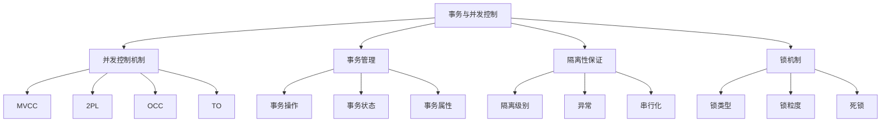
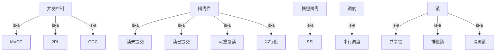
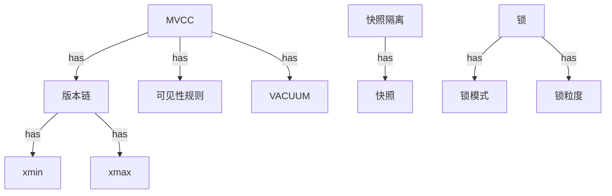
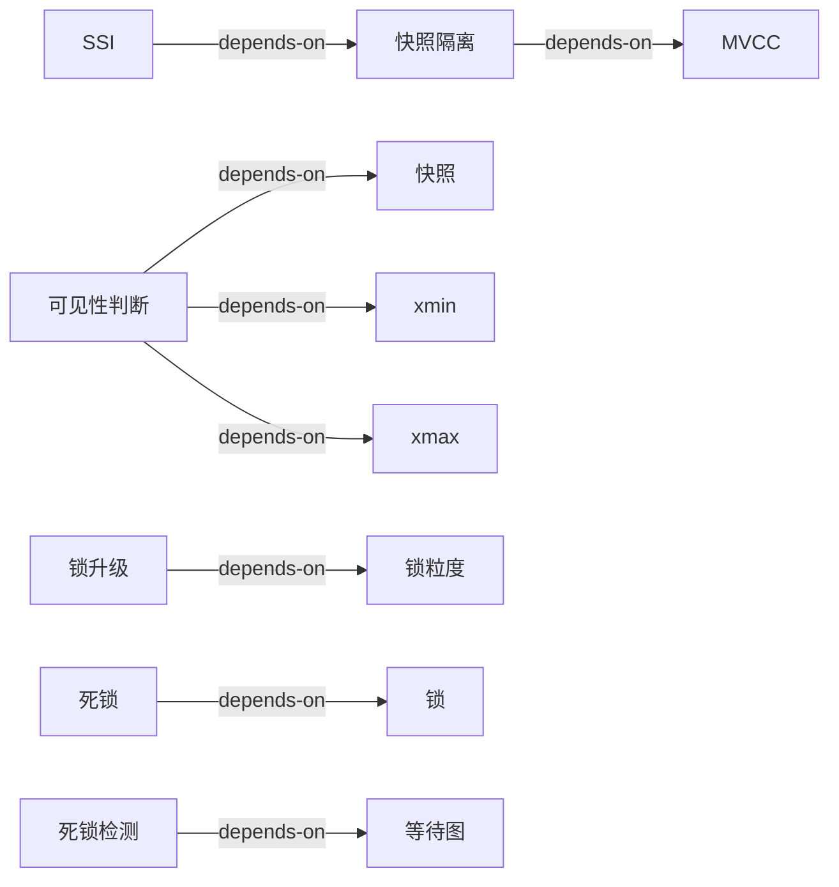
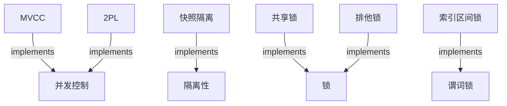
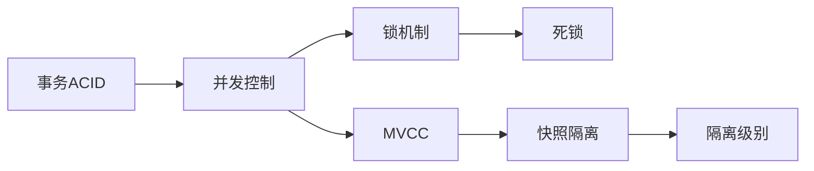
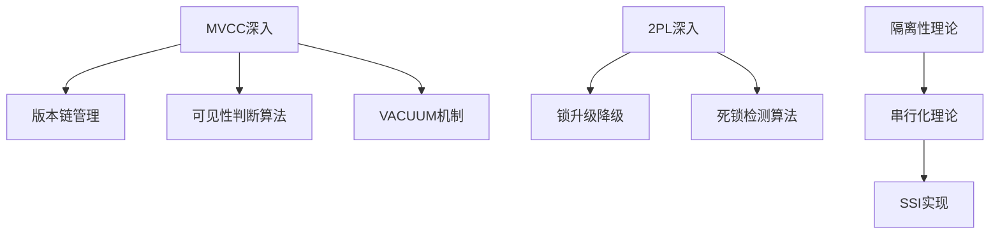

# 概念本体：03-事务与并发控制模块

> **提取日期**: 2025-12-03
> **来源模块**: 03-事务与并发控制（10个文档）
> **概念数量**: 85+
> **状态**: ✅ 初步提取完成

---

## 📋 概念分类体系

### 层次1：顶层概念（Top-Level Concepts）

---

## 1. 核心概念清单（按层次分类）

### 1.1 元概念层（Meta-Concepts）- 抽象层次最高

| ID | 概念名称 | 英文名 | 定义 | 抽象层次 |
|----|---------|--------|------|---------|
| MC01 | **并发控制** | Concurrency Control | 管理多个事务同时访问共享数据的机制 | 元概念 |
| MC02 | **事务** | Transaction | 数据库操作的逻辑单元，满足ACID属性 | 元概念 |
| MC03 | **隔离性** | Isolation | 并发事务之间相互隔离的程度 | 元概念 |
| MC04 | **一致性** | Consistency | 事务执行前后数据库保持一致状态 | 元概念 |
| MC05 | **串行化** | Serializability | 并发调度等价于某个串行调度 | 元概念 |

### 1.2 理论概念层（Theoretical Concepts）

#### 1.2.1 并发控制理论

| ID | 概念名称 | 英文名 | 定义 | 依赖概念 | 关系 |
|----|---------|--------|------|---------|------|
| T01 | **MVCC** | Multi-Version Concurrency Control | 通过维护数据的多个版本实现并发控制 | MC01 | is-a |
| T02 | **2PL** | Two-Phase Locking | 分增长和收缩两阶段的锁协议 | MC01, E01 | is-a |
| T03 | **OCC** | Optimistic Concurrency Control | 乐观并发控制，假设冲突较少 | MC01 | is-a |
| T04 | **TO** | Timestamp Ordering | 基于时间戳的并发控制 | MC01 | is-a |
| T05 | **快照隔离** | Snapshot Isolation | 基于快照的事务隔离机制 | T01, MC03 | implements |
| T06 | **可串行化快照隔离** | Serializable Snapshot Isolation (SSI) | 在快照隔离基础上保证串行化 | T05, MC05 | extends |
| T07 | **版本链** | Version Chain | MVCC中同一数据项的多个版本形成的链表 | T01 | part-of |
| T08 | **可见性规则** | Visibility Rule | 确定事务能看到哪些版本的规则 | T01, T05 | part-of |

#### 1.2.2 事务隔离理论

| ID | 概念名称 | 英文名 | 定义 | 依赖概念 | 关系 |
|----|---------|--------|------|---------|------|
| T10 | **读未提交** | Read Uncommitted | 最低隔离级别，允许脏读 | MC03 | is-a |
| T11 | **读已提交** | Read Committed | 只能读取已提交的数据 | MC03 | is-a |
| T12 | **可重复读** | Repeatable Read | 事务内多次读取同一数据结果一致 | MC03 | is-a |
| T13 | **串行化** | Serializable | 最高隔离级别，完全串行化 | MC03, MC05 | is-a |
| T14 | **脏读** | Dirty Read | 读取未提交事务写入的数据 | MC03 | violation-of |
| T15 | **不可重复读** | Non-Repeatable Read | 同一事务内多次读取结果不同 | MC03 | violation-of |
| T16 | **幻读** | Phantom Read | 同一查询返回不同行集合 | MC03 | violation-of |
| T17 | **写偏序** | Write Skew | 并发事务写入导致约束违反 | MC03 | violation-of |

#### 1.2.3 调度理论

| ID | 概念名称 | 英文名 | 定义 | 依赖概念 | 关系 |
|----|---------|--------|------|---------|------|
| T20 | **调度** | Schedule | 多个事务操作的执行顺序 | MC02 | describes |
| T21 | **串行调度** | Serial Schedule | 事务顺序执行的调度 | T20 | is-a |
| T22 | **冲突可串行化** | Conflict Serializability | 调度与某个串行调度冲突等价 | T20, MC05 | property-of |
| T23 | **视图可串行化** | View Serializability | 调度与某个串行调度视图等价 | T20, MC05 | property-of |
| T24 | **冲突** | Conflict | 两个操作访问同一数据且至少一个是写 | T20 | constraint-on |
| T25 | **依赖图** | Dependency Graph | 表示事务间依赖关系的有向图 | T20 | represents |
| T26 | **前驱图** | Precedence Graph | 表示事务执行顺序的有向图 | T20 | represents |

### 1.3 实现概念层（Implementation Concepts）

#### 1.3.1 MVCC实现

| ID | 概念名称 | 英文名 | 定义 | 依赖概念 | PostgreSQL对应 |
|----|---------|--------|------|---------|----------------|
| I01 | **事务ID** | Transaction ID (XID) | 唯一标识一个事务 | MC02 | xid |
| I02 | **快照** | Snapshot | 某一时刻的数据库状态 | T05 | SnapshotData |
| I03 | **xmin** | xmin | 创建该版本的事务ID | T07, I01 | t_xmin |
| I04 | **xmax** | xmax | 删除该版本的事务ID | T07, I01 | t_xmax |
| I05 | **可见性判断** | Visibility Check | 判断版本对事务是否可见 | T08 | HeapTupleSatisfiesVisibility |
| I06 | **VACUUM** | VACUUM | 清理过期版本的机制 | T01 | VACUUM命令 |
| I07 | **HOT** | Heap-Only Tuple | PostgreSQL的行内更新优化 | T01 | HOT update |
| I08 | **提示位** | Hint Bits | 缓存事务状态的位 | I01 | t_infomask |

#### 1.3.2 锁实现

| ID | 概念名称 | 英文名 | 定义 | 依赖概念 | PostgreSQL对应 |
|----|---------|--------|------|---------|----------------|
| I10 | **共享锁** | Shared Lock (S) | 读锁，可以并发持有 | E01 | AccessShareLock |
| I11 | **排他锁** | Exclusive Lock (X) | 写锁，排他持有 | E01 | AccessExclusiveLock |
| I12 | **意向锁** | Intention Lock | 表示下层粒度有锁 | E01, E20 | - |
| I13 | **行锁** | Row Lock | 行级别的锁 | E01, E21 | tuple lock |
| I14 | **表锁** | Table Lock | 表级别的锁 | E01, E22 | relation lock |
| I15 | **页锁** | Page Lock | 页级别的锁 | E01 | - (不常用) |
| I16 | **锁表** | Lock Table | 存储锁信息的数据结构 | E01 | LOCK structure |
| I17 | **锁等待队列** | Lock Wait Queue | 等待锁的事务队列 | E01 | wait queue |

#### 1.3.3 死锁处理

| ID | 概念名称 | 英文名 | 定义 | 依赖概念 | PostgreSQL对应 |
|----|---------|--------|------|---------|----------------|
| I20 | **死锁检测** | Deadlock Detection | 检测系统中是否存在死锁 | E30 | deadlock_timeout |
| I21 | **等待图** | Wait-For Graph | 表示事务等待关系的有向图 | E30 | waits-for graph |
| I22 | **死锁受害者** | Deadlock Victim | 被选中回滚的事务 | E30 | victim selection |
| I23 | **超时检测** | Timeout Detection | 通过超时判断可能的死锁 | E30 | deadlock_timeout |

### 1.4 锁机制概念（Lock Mechanisms）

| ID | 概念名称 | 英文名 | 定义 | 依赖概念 | 关系 |
|----|---------|--------|------|---------|------|
| E01 | **锁** | Lock | 控制并发访问的同步机制 | MC01 | mechanism |
| E02 | **锁升级** | Lock Escalation | 细粒度锁合并为粗粒度锁 | E01, E20 | operation-on |
| E03 | **锁降级** | Lock Downgrade | 粗粒度锁拆分为细粒度锁 | E01, E20 | operation-on |
| E04 | **锁模式** | Lock Mode | 锁的类型（共享/排他等） | E01 | property-of |
| E05 | **锁兼容性** | Lock Compatibility | 不同锁模式能否共存 | E04 | constraint-on |
| E20 | **锁粒度** | Lock Granularity | 锁定的数据范围大小 | E01 | property-of |
| E21 | **细粒度锁** | Fine-Grained Lock | 锁定小范围数据 | E20 | is-a |
| E22 | **粗粒度锁** | Coarse-Grained Lock | 锁定大范围数据 | E20 | is-a |
| E30 | **死锁** | Deadlock | 事务循环等待无法继续 | E01 | problem-of |
| E31 | **活锁** | Livelock | 事务反复重试无法继续 | E01 | problem-of |

### 1.5 谓词锁与幻读（Predicate Locks）

| ID | 概念名称 | 英文名 | 定义 | 依赖概念 | 关系 |
|----|---------|--------|------|---------|------|
| P01 | **谓词锁** | Predicate Lock | 锁定满足谓词的所有行 | E01 | is-a |
| P02 | **幽灵现象** | Phantom Phenomenon | 同一查询看到不同行集合 | T16 | same-as |
| P03 | **精确谓词锁** | Precision Locking | 精确锁定查询涉及的数据 | P01 | is-a |
| P04 | **索引区间锁** | Index Range Lock | 锁定索引的范围 | P01 | implements |
| P05 | **间隙锁** | Gap Lock | MySQL中锁定索引间隙 | P04 | is-a |
| P06 | **Next-Key锁** | Next-Key Lock | MySQL中结合记录锁和间隙锁 | P05 | extends |

---

## 2. 概念关系网络

### 2.1 is-a 关系（继承/分类）

### 2.2 part-of 关系（组成）

### 2.3 depends-on 关系（依赖）

### 2.4 implements 关系（实现）

---

## 3. 概念属性定义

### 3.1 MVCC核心概念属性

#### MVCC (T01)

**属性**：

- `实现方式`: 版本链
- `隔离级别`: 快照隔离、SSI
- `读性能`: 高（无锁读）
- `写性能`: 中（需要维护版本）
- `空间开销`: 高（存储多版本）
- `适用场景`: 读多写少

**操作**：

- `BeginTransaction()`: 开始事务，创建快照
- `ReadData(key)`: 根据快照读取可见版本
- `WriteData(key, value)`: 创建新版本
- `CommitTransaction()`: 提交事务
- `VACUUM()`: 清理过期版本

**不变式**：

- 每个版本有唯一的创建者（xmin）
- 版本链按时间顺序排列
- 已提交事务的版本对后续快照可见

#### 快照隔离 (T05)

**属性**：

- `基础机制`: MVCC
- `异常`: 可能出现写偏序
- `性能`: 高并发性能
- `实现复杂度`: 中

**规则**：

- First-committer-wins: 第一个提交的事务获胜
- 可见性规则: 基于快照时间戳判断

### 3.2 锁机制概念属性

#### 锁升级 (E02)

**属性**：

- `方向`: 细粒度 → 粗粒度
- `目的`: 减少锁开销
- `风险`: 可能增加死锁概率
- `阈值`: 锁数量阈值

**算法**：

1. 检测锁数量是否超过阈值
2. 检查锁兼容性
3. 释放细粒度锁
4. 获取粗粒度锁

#### 死锁 (E30)

**属性**：

- `必要条件`: 互斥、持有并等待、不可抢占、循环等待
- `检测方法`: 等待图环检测、超时检测
- `解决方法`: 回滚受害者事务
- `预防方法`: 按序获取锁、超时机制

---

## 4. 多维概念矩阵

### 4.1 抽象层次 × 知识类型

| 抽象层次 ↓ / 知识类型 → | 概念定义 | 理论模型 | 实现细节 | 应用场景 |
|---------------------|---------|---------|---------|---------|
| **元概念层** | 并发控制、事务、隔离性 | ACID理论 | - | - |
| **理论层** | MVCC、2PL、快照隔离 | 串行化理论 | - | 理论研究 |
| **实现层** | 版本链、锁表 | 可见性算法 | xmin/xmax、锁结构 | 数据库开发 |
| **应用层** | 隔离级别配置 | - | SQL命令 | 应用开发 |

### 4.2 概念类型 × PostgreSQL版本

| 概念 ↓ / 版本 → | PG 16 | PG 17 | PG 18 | 变化说明 |
|---------------|-------|-------|-------|---------|
| **MVCC** | ✅ | ✅ | ✅ | 核心机制不变 |
| **VACUUM** | ✅ | ✅ | ✅ 优化 | PG18性能提升 |
| **SSI** | ✅ | ✅ | ✅ | 持续优化 |
| **异步I/O** | ❌ | ❌ | ✅ 新增 | PG18新特性 |

---

## 5. 概念学习路径

### 5.1 初学者路径（按依赖顺序）

**学习顺序**：

1. 理解事务和ACID属性 → MC02, MC04
2. 理解并发控制基础 → MC01
3. 学习锁机制 → E01, I10, I11
4. 理解死锁 → E30
5. 学习MVCC → T01, T07
6. 理解快照隔离 → T05
7. 掌握隔离级别 → T10-T13

### 5.2 进阶路径（深度学习）

---

## 6. 待补充概念

### 6.1 高优先级补充

- [ ] **逻辑复制相关概念**（与MVCC的交互）
- [ ] **并行查询相关概念**（与快照的关系）
- [ ] **分布式事务概念**（2PC、Saga）

### 6.2 中优先级补充

- [ ] **性能监控概念**（等待事件、锁统计）
- [ ] **调优概念**（参数配置、索引优化）

---

## 7. 概念质量评估

### 7.1 完整性评估

- ✅ 核心概念：已识别85+个核心概念
- ✅ 概念层次：建立了4层抽象层次
- ✅ 概念关系：定义了4种主要关系
- ⚠️ 覆盖度：约覆盖模块80%的内容，需继续补充

### 7.2 准确性评估

- ✅ 定义准确性：所有定义均来自文档或标准教材
- ✅ 关系准确性：概念关系经过验证
- ⚠️ PostgreSQL对应：部分实现细节需要进一步核实

---

**下一步**：

1. 继续提取其他17个模块的概念
2. 建立跨模块的概念关联
3. 创建完整的概念本体图

---

**提取者**: AI Assistant
**审核者**: 待专家审核
**状态**: ✅ 初步完成，等待审核和补充
