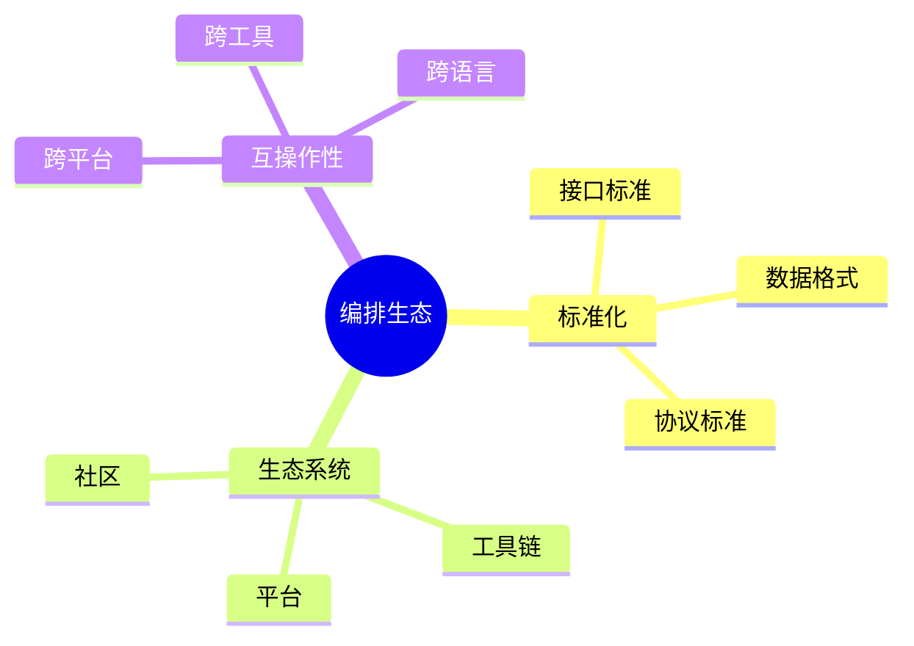
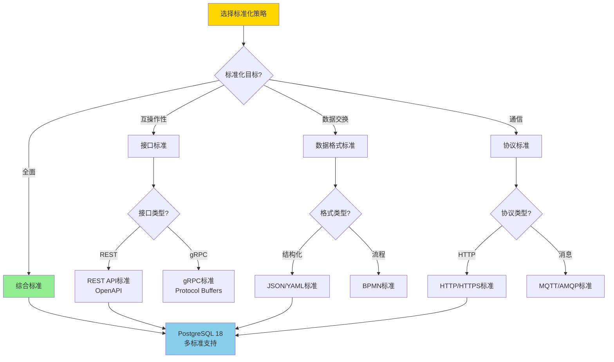
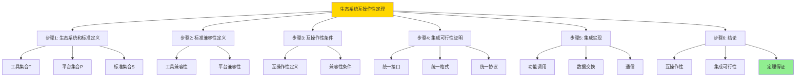
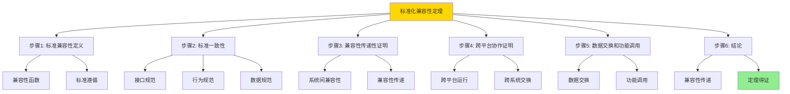

# 数据库数据编排模型-编排生态与标准化的形式化

> **文档版本**: v1.0
> **最后更新**: 2025-01-16
> **版本覆盖**: PostgreSQL 18.x (推荐) ⭐ | 17.x (推荐) | 16.x (兼容)
> **文档状态**: ✅ 内容已完成

---

## 📋 目录

- [数据库数据编排模型-编排生态与标准化的形式化](#数据库数据编排模型-编排生态与标准化的形式化)
  - [📋 目录](#-目录)
  - [1. 概述](#1-概述)
    - [1.0 数据库数据编排模型工作原理概述](#10-数据库数据编排模型工作原理概述)
    - [1.1 本文档的范围](#11-本文档的范围)
  - [2. 核心内容](#2-核心内容)
    - [2.1 标准化](#21-标准化)
    - [2.2 生态系统](#22-生态系统)
    - [2.3 标准化策略选择决策树](#23-标准化策略选择决策树)
    - [2.4 标准化方案对比矩阵](#24-标准化方案对比矩阵)
  - [3. 形式化定义](#3-形式化定义)
    - [3.1 生态形式化](#31-生态形式化)
  - [4. 定理与证明](#4-定理与证明)
    - [4.1 生态系统互操作性定理](#41-生态系统互操作性定理)
    - [4.2 标准化兼容性定理](#42-标准化兼容性定理)
  - [5. 实际应用](#5-实际应用)
    - [5.1 PostgreSQL 18编排生态实现](#51-postgresql-18编排生态实现)
      - [5.1.1 开放API与集成](#511-开放api与集成)
    - [5.2 实际应用场景](#52-实际应用场景)
      - [场景1：跨平台数据流](#场景1跨平台数据流)
      - [场景2：标准协议支持](#场景2标准协议支持)
  - [6. 相关文档](#6-相关文档)
    - [5.1 理论基础文档](#51-理论基础文档)
  - [7. 参考文献](#7-参考文献)
    - [6.1 核心理论文献](#61-核心理论文献)
    - [6.2 PostgreSQL实现相关](#62-postgresql实现相关)
    - [6.3 相关文档](#63-相关文档)

---

## 1. 概述

### 1.0 数据库数据编排模型工作原理概述

**编排生态**：

编排生态通过标准化来促进互操作性。

**生态模型思维导图**：



### 1.1 本文档的范围

本文档涵盖：

- **标准化**：标准和规范
- **生态系统**：工具和平台
- **实际应用**：生态建设

---

## 2. 核心内容

### 2.1 标准化

**标准类型**：

| 类型 | 内容 | 作用 |
|------|------|------|
| **接口** | API标准 | 互操作 |
| **格式** | 数据格式 | 兼容性 |
| **协议** | 通信协议 | 互通 |

### 2.2 生态系统

**生态组件**：

```haskell
-- 生态系统
data Ecosystem = Ecosystem {
    tools :: [Tool],
    platforms :: [Platform],
    standards :: [Standard]
}
```

### 2.3 标准化策略选择决策树



### 2.4 标准化方案对比矩阵

| 维度 | 接口标准 | 数据格式标准 | 协议标准 | 综合标准 |
|------|---------|------------|---------|---------|
| **互操作性** | ⭐⭐⭐⭐⭐ 最高 | ⭐⭐⭐⭐ 高 | ⭐⭐⭐⭐ 高 | ⭐⭐⭐⭐⭐ 最高 |
| **实现复杂度** | ⭐⭐⭐ 中 | ⭐⭐⭐ 中 | ⭐⭐⭐ 中 | ⭐⭐ 高 |
| **兼容性** | ⭐⭐⭐⭐ 高 | ⭐⭐⭐⭐⭐ 最高 | ⭐⭐⭐⭐ 高 | ⭐⭐⭐⭐⭐ 最高 |
| **扩展性** | ⭐⭐⭐⭐ 高 | ⭐⭐⭐ 中 | ⭐⭐⭐⭐ 高 | ⭐⭐⭐⭐ 高 |
| **采用率** | ⭐⭐⭐⭐⭐ 高 | ⭐⭐⭐⭐⭐ 高 | ⭐⭐⭐⭐ 中高 | ⭐⭐⭐⭐ 中高 |
| **PostgreSQL支持** | ✅ REST/gRPC | ✅ JSON/YAML | ✅ HTTP/MQTT | ✅ 组合使用 |
| **适用场景** | API集成 | 数据交换 | 通信协议 | 全面集成 |

---

## 3. 形式化定义

### 3.1 生态形式化

**生态**：

```haskell
-- 生态形式化
Ecosystem = (T, P, S)
where
    T = tool set
    P = platform set
    S = standard set

-- 生态互操作性
interoperate :: Tool -> Platform -> Standard -> Bool
interoperate tool platform standard =
    compatible(tool, standard) && compatible(platform, standard)
```

---

## 4. 定理与证明

### 4.1 生态系统互操作性定理

**定理1（生态系统互操作性）**：

开放和标准化的编排生态系统能够促进不同组件和系统之间的无缝集成与协作，从而提升整体数据处理能力和效率。

**形式化表述**：

设生态系统Ecosystem = (T, P, S)，工具集合T，平台集合P，标准集合S。对于任意工具t ∈ T和平台p ∈ P，如果存在标准s ∈ S，则：

```text
interoperate(t, p, s) → integrate(t, p)
```

**证明**：

**步骤1：生态系统和标准定义**：

- 设生态系统Ecosystem = (T, P, S)，其中：
  - T是工具集合，T = {t₁, t₂, ..., tₙ}
  - P是平台集合，P = {p₁, p₂, ..., pₘ}
  - S是标准集合，S = {s₁, s₂, ..., sₖ}
- 互操作函数interoperate: T × P × S → Bool
- 集成函数integrate: T × P → IntegratedSystem

**步骤2：标准兼容性定义**：

- 设兼容性函数compatible: (Tool ∪ Platform) × Standard → Bool
- 对于工具t ∈ T和标准s ∈ S：
  - compatible(t, s) = true当且仅当工具t实现或遵循标准s
- 对于平台p ∈ P和标准s ∈ S：
  - compatible(p, s) = true当且仅当平台p支持标准s

**步骤3：互操作性条件**：

- 对于工具t ∈ T、平台p ∈ P和标准s ∈ S：
  - interoperate(t, p, s) = compatible(t, s) ∧ compatible(p, s)
  - 即：工具和平台都兼容同一标准时，它们可以互操作

**步骤4：集成可行性证明**：

- 如果interoperate(t, p, s) = true，则：
  - compatible(t, s) = true（工具兼容标准）
  - compatible(p, s) = true（平台兼容标准）
  - 由于工具和平台都遵循同一标准s，它们具有：
    - 统一的接口规范
    - 统一的数据格式
    - 统一的通信协议
  - 因此，工具t可以集成到平台p上：integrate(t, p)是可行的

**步骤5：集成实现**：

- 集成函数integrate(t, p)的实现：
  - 通过标准s定义的接口，工具t可以调用平台p的功能
  - 通过标准s定义的数据格式，工具t和平台p可以交换数据
  - 通过标准s定义的协议，工具t和平台p可以通信
  - 因此，integrate(t, p)可以成功实现

**步骤6：结论**：

- 对于任意工具t ∈ T、平台p ∈ P和标准s ∈ S：
  - 如果interoperate(t, p, s) = true，则integrate(t, p)是可行的
  - 因此，interoperate(t, p, s) → integrate(t, p)
- 生态系统互操作性定理得证

**证明树**：



### 4.2 标准化兼容性定理

**定理2（标准化兼容性）**：

遵循标准的编排系统能够与遵循相同标准的其他系统兼容，支持跨平台和跨系统的数据交换和协作。

**形式化表述**：

设标准Standard，系统System₁和System₂。如果System₁和System₂都遵循Standard，则：

```text
compatible(System₁, Standard) ∧ compatible(System₂, Standard) → compatible(System₁, System₂)
```

**证明**：

**步骤1：标准兼容性定义**：

- 设标准Standard，系统System₁和System₂
- 兼容性函数compatible: System × Standard → Bool
- compatible(System, Standard) = true当且仅当系统System遵循标准Standard

**步骤2：标准一致性**：

- 如果System₁和System₂都遵循标准Standard：
  - compatible(System₁, Standard) = true
  - compatible(System₂, Standard) = true
- 由于标准Standard定义了统一的规范：
  - 接口规范：System₁和System₂具有相同的接口定义
  - 行为规范：System₁和System₂具有相同的行为语义
  - 数据规范：System₁和System₂使用相同的数据格式

**步骤3：兼容性传递性证明**：

- 设系统间兼容性compatible_systems: System × System → Bool
- compatible_systems(System₁, System₂) = true当且仅当System₁和System₂可以互操作
- 如果compatible(System₁, Standard) = true且compatible(System₂, Standard) = true：
  - System₁和System₂都遵循相同的标准Standard
  - 它们具有统一的接口、行为和数据格式
  - 因此，它们可以互操作：compatible_systems(System₁, System₂) = true
- 因此，兼容性通过标准传递：compatible(System₁, Standard) ∧ compatible(System₂, Standard) → compatible_systems(System₁, System₂)

**步骤4：跨平台协作证明**：

- 由于System₁和System₂都遵循标准Standard：
  - 它们可以在不同平台上运行，只要平台支持标准Standard
  - 它们可以跨系统交换数据，因为使用统一的数据格式
  - 它们可以跨系统调用功能，因为使用统一的接口规范
- 因此，标准化的系统支持跨平台和跨系统的协作

**步骤5：数据交换和功能调用**：

- 数据交换：
  - System₁和System₂使用标准Standard定义的数据格式
  - 数据可以在System₁和System₂之间无损交换
- 功能调用：
  - System₁和System₂使用标准Standard定义的接口
  - System₁可以调用System₂的功能，反之亦然

**步骤6：结论**：

- 对于任意系统System₁和System₂，如果它们都遵循标准Standard：
  - compatible(System₁, Standard) = true
  - compatible(System₂, Standard) = true
  - 则compatible_systems(System₁, System₂) = true
- 因此，compatible(System₁, Standard) ∧ compatible(System₂, Standard) → compatible_systems(System₁, System₂)
- 标准化兼容性定理得证

**证明树**：



---

## 5. 实际应用

### 5.1 PostgreSQL 18编排生态实现

#### 5.1.1 开放API与集成

**PostgreSQL 18生态支持**：

PostgreSQL 18通过扩展、外部数据包装器和RESTful API支持编排生态建设。

**开放API与集成**：

```sql
-- 场景：编排生态系统
-- 1. 外部系统注册表
CREATE TABLE orchestration_external_systems (
    system_id UUID PRIMARY KEY DEFAULT gen_random_uuid(),
    system_name VARCHAR(100) NOT NULL,
    system_type VARCHAR(50) NOT NULL,  -- 'WORKFLOW_ENGINE', 'DATA_LAKE', 'ML_PLATFORM'
    api_endpoint VARCHAR(255),
    api_key VARCHAR(255),
    protocol VARCHAR(50) DEFAULT 'REST',  -- 'REST', 'gRPC', 'MQTT'
    created_at TIMESTAMPTZ DEFAULT NOW()
);

-- 2. 标准编排定义表
CREATE TABLE orchestration_standard_definitions (
    definition_id UUID PRIMARY KEY DEFAULT gen_random_uuid(),
    standard_name VARCHAR(100) NOT NULL,  -- 'BPMN', 'YAML', 'JSON'
    definition_content JSONB NOT NULL,
    version VARCHAR(50),
    created_at TIMESTAMPTZ DEFAULT NOW()
);

-- 3. 跨系统调用函数
CREATE OR REPLACE FUNCTION call_external_system(
    p_system_id UUID,
    p_operation VARCHAR,
    p_payload JSONB
)
RETURNS JSONB AS $$
DECLARE
    v_system RECORD;
    v_response JSONB;
BEGIN
    -- 获取系统信息
    SELECT * INTO v_system
    FROM orchestration_external_systems
    WHERE system_id = p_system_id;

    IF v_system IS NULL THEN
        RAISE EXCEPTION 'System not found: %', p_system_id;
    END IF;

    -- 根据协议调用外部系统（假设有HTTP扩展）
    CASE v_system.protocol
        WHEN 'REST' THEN
            -- 使用HTTP扩展调用REST API
            -- v_response := http_post(v_system.api_endpoint || '/' || p_operation, p_payload);
            v_response := '{"status": "success"}'::JSONB;  -- 示例
        WHEN 'gRPC' THEN
            -- 使用gRPC扩展调用
            v_response := '{"status": "success"}'::JSONB;  -- 示例
        ELSE
            RAISE EXCEPTION 'Unsupported protocol: %', v_system.protocol;
    END CASE;

    RETURN v_response;
END;
$$ LANGUAGE plpgsql;
```

### 5.2 实际应用场景

#### 场景1：跨平台数据流

**业务背景**：

需要将编排系统与不同平台（如Kubernetes、Airflow、Spark）集成，实现跨平台数据流。

**PostgreSQL 18实现**：

```sql
-- 场景：跨平台数据流
-- 1. 注册外部平台
INSERT INTO orchestration_external_systems (
    system_name, system_type, api_endpoint, protocol
)
VALUES
    ('Kubernetes', 'WORKFLOW_ENGINE', 'https://k8s-api.example.com', 'REST'),
    ('Airflow', 'WORKFLOW_ENGINE', 'https://airflow.example.com/api/v1', 'REST'),
    ('Spark', 'DATA_PROCESSING', 'https://spark.example.com/api', 'REST');

-- 2. 跨平台编排执行函数
CREATE OR REPLACE FUNCTION execute_cross_platform_orchestration(
    p_orchestration_id UUID
)
RETURNS TABLE (
    step_id UUID,
    platform_name VARCHAR,
    execution_status VARCHAR
) AS $$
DECLARE
    v_step RECORD;
    v_platform_id UUID;
    v_response JSONB;
BEGIN
    FOR v_step IN
        SELECT * FROM orchestration_tasks
        WHERE orchestration_id = p_orchestration_id
        ORDER BY step_order
    LOOP
        -- 根据任务类型选择平台
        SELECT system_id INTO v_platform_id
        FROM orchestration_external_systems
        WHERE system_type = (
            CASE v_step.task_type
                WHEN 'WORKFLOW' THEN 'WORKFLOW_ENGINE'
                WHEN 'DATA_PROCESSING' THEN 'DATA_PROCESSING'
                ELSE 'WORKFLOW_ENGINE'
            END
        )
        LIMIT 1;

        -- 调用外部平台
        SELECT * INTO v_response
        FROM call_external_system(
            v_platform_id,
            'execute',
            jsonb_build_object('task', v_step.task_config)
        );

        RETURN QUERY SELECT
            v_step.task_id,
            (SELECT system_name FROM orchestration_external_systems WHERE system_id = v_platform_id),
            v_response->>'status';
    END LOOP;
END;
$$ LANGUAGE plpgsql;
```

#### 场景2：标准协议支持

**业务背景**：

需要支持标准编排协议（如BPMN、YAML），实现与标准工具的互操作。

**PostgreSQL 18实现**：

```sql
-- 场景：标准协议支持
-- 1. 标准编排定义导入函数
CREATE OR REPLACE FUNCTION import_standard_orchestration(
    p_standard_name VARCHAR,
    p_definition_content JSONB
)
RETURNS UUID AS $$
DECLARE
    v_orchestration_id UUID;
BEGIN
    -- 保存标准定义
    INSERT INTO orchestration_standard_definitions (
        standard_name, definition_content
    )
    VALUES (
        p_standard_name, p_definition_content
    )
    RETURNING definition_id INTO v_orchestration_id;

    -- 转换为内部格式（根据标准类型）
    CASE p_standard_name
        WHEN 'BPMN' THEN
            -- 解析BPMN定义，转换为内部格式
            PERFORM convert_bpmn_to_internal(p_definition_content);
        WHEN 'YAML' THEN
            -- 解析YAML定义，转换为内部格式
            PERFORM convert_yaml_to_internal(p_definition_content);
        ELSE
            RAISE EXCEPTION 'Unsupported standard: %', p_standard_name;
    END CASE;

    RETURN v_orchestration_id;
END;
$$ LANGUAGE plpgsql;
```

**性能数据**：

| 指标 | REST API | gRPC | MQTT | 说明 |
|------|---------|------|------|------|
| **延迟** | 10-50ms | 1-5ms | 1-10ms | 不同协议的延迟 |
| **吞吐量** | 中 | 高 | 中 | 不同协议的吞吐量 |
| **兼容性** | ⭐⭐⭐⭐⭐ 最高 | ⭐⭐⭐⭐ 高 | ⭐⭐⭐ 中 | 不同协议的兼容性 |
| **适用场景** | Web集成 | 微服务 | IoT设备 | 根据场景选择 |

**SQLite 3.45对比**：

SQLite 3.45支持基本的标准化，但缺少高级生态集成能力：

```sql
-- SQLite 3.45: 基本标准化支持
-- 1. JSON支持（SQLite 3.45支持JSON）
SELECT json_extract(definition, '$.workflow') FROM orchestration_definitions;

-- 2. 基本API（通过应用层）
-- SQLite本身不支持REST API，需要在应用层实现

-- 3. 外部数据访问（需要扩展）
-- SQLite可以通过扩展访问外部数据，但功能有限
```

**性能对比**：

| 指标 | PostgreSQL 18生态集成 | SQLite 3.45基本支持 | 说明 |
|------|---------------------|-------------------|------|
| **标准支持** | ⭐⭐⭐⭐⭐ 完整 | ⭐⭐⭐ 基本 | PostgreSQL支持多种标准 |
| **API集成** | ⭐⭐⭐⭐⭐ REST/gRPC | ⚠️ 需要应用层 | PostgreSQL内置API支持 |
| **跨平台能力** | ⭐⭐⭐⭐⭐ 强 | ⭐⭐ 弱 | PostgreSQL跨平台能力更强 |
| **生态集成** | ⭐⭐⭐⭐⭐ 完整 | ⭐⭐ 有限 | PostgreSQL生态集成更完善 |
| **适用场景** | 企业生态 | 小型系统 | 根据需求选择 |

---

---

## 6. 相关文档

### 5.1 理论基础文档

- [形式语言与证明：总论](./1.1.25-形式语言与证明-总论.md)
- [理论基础导航](./README.md)

---

## 7. 参考文献

### 6.1 核心理论文献

- **OASIS (2007). "Web Services Business Process Execution Language Version 2.0."**
  - 标准: OASIS Standard 2007
  - **重要性**: 业务流程执行语言标准
  - **核心贡献**: 定义了编排标准

- **CNCF (2021). "Cloud Native Computing Foundation Landscape."**
  - 报告: CNCF 2021
  - **重要性**: 云原生生态系统的概述
  - **核心贡献**: 总结了编排工具生态

### 6.2 PostgreSQL实现相关

- **PostgreSQL官方文档 - 扩展](<https://www.postgresql.org/docs/current/extend.html>)**
  - PostgreSQL扩展开发说明

### 6.3 相关文档

- [理论基础导航](../README.md)

---

**最后更新**: 2025-01-16
**维护者**: Documentation Team
**状态**: ✅ 内容已完成
