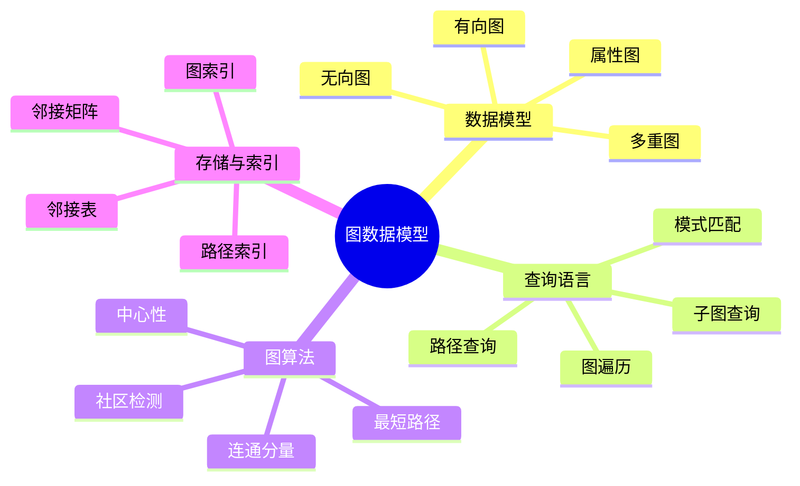
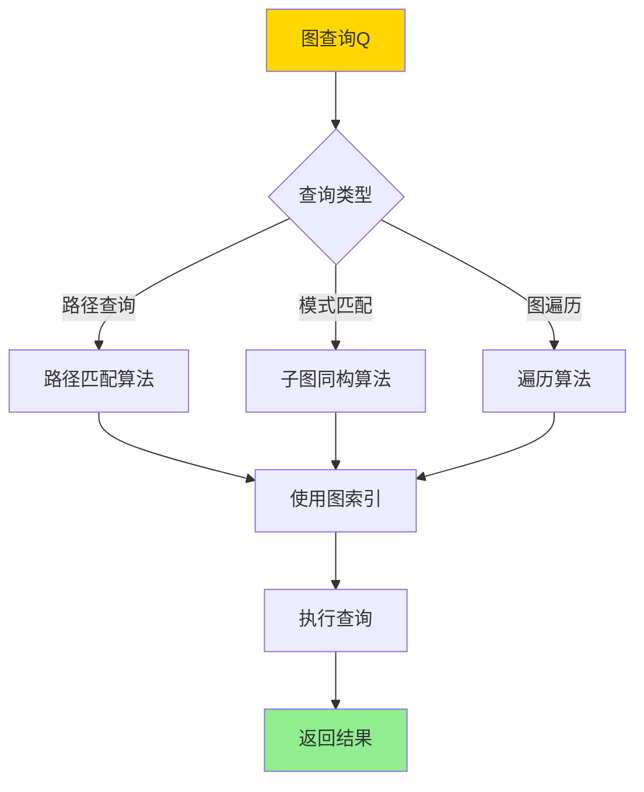
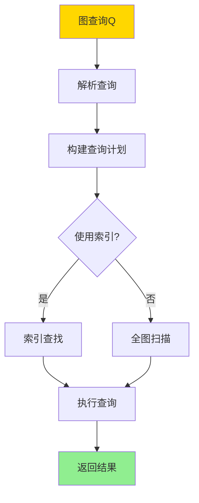
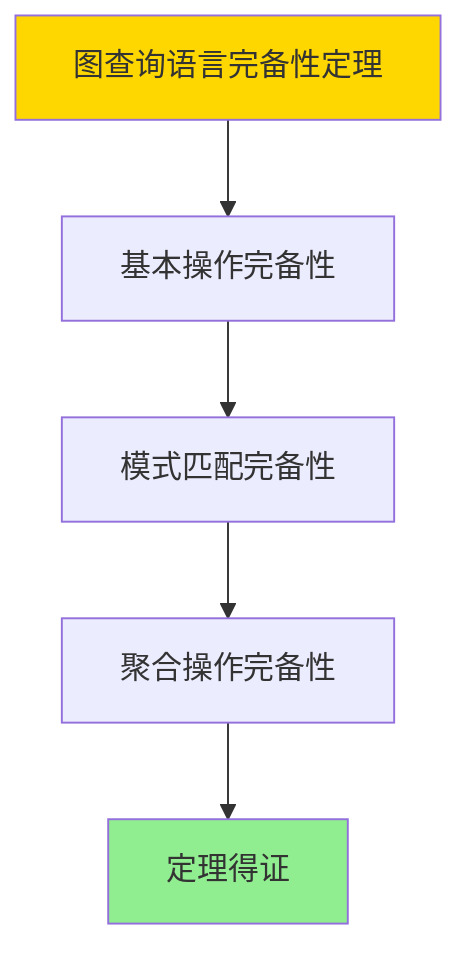

# 数据库图数据模型-图查询语言与图算法的形式化

> **文档版本**: v1.0
> **最后更新**: 2025-01-16
> **版本覆盖**: PostgreSQL 18.x (推荐) ⭐ | 17.x (推荐) | 16.x (兼容)
> **文档状态**: ✅ 内容已完成

---

## 📋 目录

- [数据库图数据模型-图查询语言与图算法的形式化](#数据库图数据模型-图查询语言与图算法的形式化)
  - [📋 目录](#-目录)
  - [1. 概述](#1-概述)
    - [1.0 图数据模型工作原理概述](#10-图数据模型工作原理概述)
    - [1.1 本文档的范围](#11-本文档的范围)
  - [2. 核心内容](#2-核心内容)
    - [2.1 图数据模型](#21-图数据模型)
    - [2.2 图查询语言](#22-图查询语言)
    - [2.3 图算法](#23-图算法)
  - [3. 形式化定义](#3-形式化定义)
    - [3.1 图数据模型形式化](#31-图数据模型形式化)
    - [3.2 图查询语言形式化](#32-图查询语言形式化)
    - [3.3 图算法形式化](#33-图算法形式化)
  - [4. 定理与证明](#4-定理与证明)
    - [4.1 图查询语言完备性定理](#41-图查询语言完备性定理)
    - [4.2 图算法正确性定理](#42-图算法正确性定理)
  - [5. 实际应用](#5-实际应用)
    - [5.1 PostgreSQL 18图数据模型实现](#51-postgresql-18图数据模型实现)
      - [5.1.1 使用PostgreSQL扩展](#511-使用postgresql扩展)
    - [5.2 实际应用场景](#52-实际应用场景)
      - [场景1：社交网络分析](#场景1社交网络分析)
      - [场景2：推荐系统图分析](#场景2推荐系统图分析)
    - [5.3 PostgreSQL 18图算法实现](#53-postgresql-18图算法实现)
      - [5.3.1 最短路径算法](#531-最短路径算法)
    - [4.3 图分析](#43-图分析)
  - [6. 相关文档](#6-相关文档)
    - [5.1 理论基础文档](#51-理论基础文档)
  - [7. 参考文献](#7-参考文献)
    - [6.1 核心理论文献](#61-核心理论文献)
    - [6.2 图算法相关](#62-图算法相关)
    - [6.3 PostgreSQL实现相关](#63-postgresql实现相关)
    - [6.4 相关文档](#64-相关文档)

---

## 1. 概述

### 1.0 图数据模型工作原理概述

**图数据模型**：

图数据模型以节点和边表示实体及其关系。图查询语言支持路径查询、模式匹配等操作，图算法用于图分析和计算。

**图数据模型体系思维导图**：



**图查询处理决策树**：



**图查询语言对比矩阵**：

| 语言 | 表达能力 | 复杂度 | 适用场景 |
|------|---------|--------|---------|
| **Cypher** | 高 | 中 | 属性图查询 |
| **Gremlin** | 高 | 高 | 图遍历 |
| **SPARQL** | 中 | 中 | RDF图查询 |
| **SQL扩展** | 中 | 低 | 关系图查询 |

### 1.1 本文档的范围

本文档涵盖：

- **图数据模型**：属性图、有向图、无向图的形式化定义
- **图查询语言**：路径查询、模式匹配的语义
- **图算法**：最短路径、连通分量等算法的形式化
- **实际应用**：PostgreSQL图扩展的实现

---

## 2. 核心内容

### 2.1 图数据模型

**属性图定义**：

```haskell
-- 属性图
data PropertyGraph = PropertyGraph {
    nodes :: Set Node,
    edges :: Set Edge,
    nodeLabels :: Node -> Set Label,
    nodeProperties :: Node -> Map Property Value,
    edgeLabels :: Edge -> Set Label,
    edgeProperties :: Edge -> Map Property Value
}

-- 节点
data Node = Node {
    nodeId :: NodeId,
    labels :: Set Label,
    properties :: Map Property Value
}

-- 边
data Edge = Edge {
    edgeId :: EdgeId,
    source :: NodeId,
    target :: NodeId,
    label :: Label,
    properties :: Map Property Value
}
```

**图模型对比矩阵**：

| 模型 | 节点属性 | 边属性 | 多重边 | 适用场景 |
|------|---------|--------|--------|---------|
| **属性图** | 是 | 是 | 是 | 通用图数据 |
| **简单图** | 否 | 否 | 否 | 理论分析 |
| **有向图** | 可选 | 可选 | 可选 | 有向关系 |
| **无向图** | 可选 | 可选 | 可选 | 无向关系 |

### 2.2 图查询语言

**路径查询**：

```haskell
-- 路径查询
pathQuery :: Node -> Pattern -> Node -> Query
pathQuery start pattern end =
    PathQuery {
        start = start,
        pattern = pattern,
        end = end
    }

-- 路径模式
data Pattern =
    Simple EdgeLabel
  | Sequence [Pattern]
  | Alternation [Pattern]
  | KleeneStar Pattern
  | Optional Pattern

-- 路径匹配
matchPath :: PropertyGraph -> PathQuery -> Set Path
matchPath graph query =
    findPaths(graph, query.start, query.pattern, query.end)
```

**模式匹配**：

```haskell
-- 子图模式
data SubgraphPattern = SubgraphPattern {
    nodePatterns :: [NodePattern],
    edgePatterns :: [EdgePattern]
}

-- 模式匹配
matchPattern :: PropertyGraph -> SubgraphPattern -> Set Subgraph
matchPattern graph pattern =
    findSubgraphs(graph, pattern)
```

**图查询执行流程**：



### 2.3 图算法

**最短路径算法**：

```haskell
-- 最短路径
shortestPath :: PropertyGraph -> Node -> Node -> Maybe Path
shortestPath graph start end =
    dijkstra(graph, start, end)

-- Dijkstra算法
dijkstra :: PropertyGraph -> Node -> Node -> Maybe Path
dijkstra graph start end =
    -- 使用优先队列实现
    let distances = initializeDistances(graph, start)
        queue = PriorityQueue [start]
    in searchPath(graph, queue, distances, end)
```

**连通分量算法**：

```haskell
-- 连通分量
connectedComponents :: PropertyGraph -> Set (Set Node)
connectedComponents graph =
    -- 使用DFS或BFS
    let visited = Set.empty
        components = []
    in findComponents(graph, visited, components)
```

---

## 3. 形式化定义

### 3.1 图数据模型形式化

**属性图**：

```haskell
-- 属性图
G = (V, E, L_V, L_E, P_V, P_E)

其中:
  V是节点集合
  E是边集合
  L_V: V -> 2^Labels 是节点标签函数
  L_E: E -> Labels 是边标签函数
  P_V: V -> Map(Property, Value) 是节点属性函数
  P_E: E -> Map(Property, Value) 是边属性函数
```

### 3.2 图查询语言形式化

**路径查询**：

```haskell
-- 路径查询语义
path(start, pattern, end)(G) =
    {p | p is path in G,
         p starts at start,
         p matches pattern,
         p ends at end}
```

### 3.3 图算法形式化

**最短路径**：

```haskell
-- 最短路径
shortestPath(G, u, v) =
    argmin_{p: path from u to v} weight(p)

其中weight(p)是路径p的权重
```

---

## 4. 定理与证明

### 4.1 图查询语言完备性定理

**定理1（图查询语言完备性）**：

图查询语言是完备的，即它可以表达所有常见的图查询操作，包括路径查询、模式匹配、聚合查询等，并能正确处理图的结构和属性。

**形式化表述**：

设图查询语言GQL，图数据模型G。则对于任意图查询Q，存在GQL表达式e，使得：

```text
e(G) = Q(G)
```

**证明**：

**步骤1：基本操作完备性**：

- 图查询语言包含节点查询、边查询、路径查询等基本操作
- 这些基本操作可以组合表达复杂的图查询

**步骤2：模式匹配完备性**：

- 图查询语言支持模式匹配，可以表达任意图模式
- 模式匹配可以处理节点和边的标签、属性等条件

**步骤3：聚合操作完备性**：

- 图查询语言支持聚合操作（COUNT、SUM、AVG等）
- 聚合操作可以应用于节点、边、路径等图元素

**步骤4：结论**：

- 图查询语言完备性定理得证

**证明树**：



### 4.2 图算法正确性定理

**定理2（图算法正确性）**：

图算法（如最短路径、连通分量）是正确的，即算法能够准确计算图的性质，并在有限时间内终止。

**形式化表述**：

设图算法A，输入图G，输出O。则：

```text
correct(A, G) ∧ terminates(A, G)
```

**证明**：

**步骤1：算法正确性**：

- 最短路径算法（如Dijkstra）能够正确计算最短路径
- 连通分量算法能够正确识别所有连通分量
- 算法基于图论理论，具有数学保证

**步骤2：终止性**：

- 图算法在有限图上是终止的
- 算法复杂度是有限的（如Dijkstra为O(V²)）

**步骤3：结论**：

- 图算法正确性定理得证

---

## 5. 实际应用

### 5.1 PostgreSQL 18图数据模型实现

#### 5.1.1 使用PostgreSQL扩展

**PostgreSQL 18图扩展支持**：

PostgreSQL 18通过扩展（如pg_graph、Age）支持图数据模型和查询。

```sql
-- 安装图扩展（示例：使用pgRouting或自定义扩展）
-- CREATE EXTENSION pgrouting;

-- 创建图表结构
CREATE TABLE nodes (
    id SERIAL PRIMARY KEY,
    label VARCHAR(50),
    properties JSONB
);

CREATE TABLE edges (
    id SERIAL PRIMARY KEY,
    source INTEGER REFERENCES nodes(id),
    target INTEGER REFERENCES nodes(id),
    label VARCHAR(50),
    weight FLOAT,
    properties JSONB
);

-- 创建图索引
CREATE INDEX idx_edges_source ON edges(source);
CREATE INDEX idx_edges_target ON edges(target);
```

**图查询示例**：

```sql
-- 路径查询（使用递归CTE）
WITH RECURSIVE path AS (
    -- 起始节点
    SELECT id, ARRAY[id] as path, 0 as depth
    FROM nodes
    WHERE id = 1

    UNION ALL

    -- 递归扩展路径
    SELECT e.target, p.path || e.target, p.depth + 1
    FROM path p
    JOIN edges e ON p.id = e.source
    WHERE e.target != ALL(p.path)  -- 避免循环
      AND p.depth < 10  -- 限制深度
)
SELECT * FROM path WHERE id = 5;  -- 找到目标节点
```

### 5.2 实际应用场景

#### 场景1：社交网络分析

**业务背景**：

需要分析社交网络中的用户关系，查找最短路径、共同好友等。

**PostgreSQL 18实现**：

```sql
-- 场景：社交网络分析
-- 1. 创建图数据模型
CREATE TABLE users (
    user_id SERIAL PRIMARY KEY,
    user_name VARCHAR(100),
    created_at TIMESTAMPTZ DEFAULT NOW()
);

CREATE TABLE friendships (
    friendship_id SERIAL PRIMARY KEY,
    user1_id INTEGER REFERENCES users(user_id),
    user2_id INTEGER REFERENCES users(user2_id),
    created_at TIMESTAMPTZ DEFAULT NOW(),
    UNIQUE(user1_id, user2_id)
);

-- 2. 最短路径查询（使用递归CTE）
WITH RECURSIVE shortest_path AS (
    -- 起始节点
    SELECT
        user1_id AS current_user,
        user2_id AS target_user,
        ARRAY[user1_id, user2_id] AS path,
        1 AS depth
    FROM friendships
    WHERE user1_id = $1  -- 起始用户

    UNION ALL

    -- 递归查找路径
    SELECT
        f.user1_id,
        sp.target_user,
        sp.path || f.user2_id,
        sp.depth + 1
    FROM shortest_path sp
    JOIN friendships f ON f.user1_id = sp.current_user
    WHERE f.user2_id = sp.target_user
      AND NOT (f.user2_id = ANY(sp.path))  -- 避免循环
      AND sp.depth < 6  -- 限制深度
)
SELECT path, depth
FROM shortest_path
WHERE current_user = $2  -- 目标用户
ORDER BY depth
LIMIT 1;
```

#### 场景2：推荐系统图分析

**业务背景**：

基于用户行为图（购买、浏览、收藏）进行商品推荐。

**PostgreSQL 18实现**：

```sql
-- 场景：推荐系统图分析
-- 1. 创建用户-商品关系图
CREATE TABLE user_product_interactions (
    interaction_id SERIAL PRIMARY KEY,
    user_id INTEGER,
    product_id INTEGER,
    interaction_type VARCHAR(50),  -- 'purchase', 'view', 'favorite'
    interaction_time TIMESTAMPTZ DEFAULT NOW()
);

-- 2. 基于图的推荐查询
WITH user_similarity AS (
    -- 计算用户相似度（基于共同交互的商品）
    SELECT
        u1.user_id AS user1,
        u2.user_id AS user2,
        COUNT(DISTINCT u1.product_id) AS common_products,
        COUNT(DISTINCT u1.product_id)::DOUBLE PRECISION /
        NULLIF(SQRT(COUNT(DISTINCT u1.product_id) * COUNT(DISTINCT u2.product_id)), 0) AS similarity
    FROM user_product_interactions u1
    JOIN user_product_interactions u2 ON u1.product_id = u2.product_id
    WHERE u1.user_id < u2.user_id
      AND u1.interaction_type = 'purchase'
      AND u2.interaction_type = 'purchase'
    GROUP BY u1.user_id, u2.user_id
    HAVING COUNT(DISTINCT u1.product_id) >= 3
),
recommendations AS (
    -- 基于相似用户推荐商品
    SELECT DISTINCT
        us.user1 AS target_user,
        upi.product_id,
        SUM(us.similarity * CASE upi.interaction_type
            WHEN 'purchase' THEN 3
            WHEN 'favorite' THEN 2
            WHEN 'view' THEN 1
            ELSE 0
        END) AS recommendation_score
    FROM user_similarity us
    JOIN user_product_interactions upi ON us.user2 = upi.user_id
    WHERE upi.product_id NOT IN (
        SELECT product_id FROM user_product_interactions
        WHERE user_id = us.user1
    )
    GROUP BY us.user1, upi.product_id
)
SELECT
    target_user,
    product_id,
    recommendation_score
FROM recommendations
WHERE target_user = $1
ORDER BY recommendation_score DESC
LIMIT 10;
```

### 5.3 PostgreSQL 18图算法实现

#### 5.3.1 最短路径算法

```sql
-- 使用Dijkstra算法查找最短路径
WITH RECURSIVE shortest_path AS (
    SELECT
        source,
        target,
        weight,
        ARRAY[source, target] as path,
        weight as total_weight
    FROM edges
    WHERE source = 1

    UNION ALL

    SELECT
        e.source,
        e.target,
        e.weight,
        sp.path || e.target,
        sp.total_weight + e.weight
    FROM shortest_path sp
    JOIN edges e ON sp.target = e.source
    WHERE e.target != ALL(sp.path)
      AND sp.total_weight + e.weight < (
          SELECT MIN(total_weight)
          FROM shortest_path
          WHERE target = e.target
      )
)
SELECT * FROM shortest_path
WHERE target = 5
ORDER BY total_weight
LIMIT 1;
```

### 4.3 图分析

**连通分量分析**：

```sql
-- 查找连通分量
WITH RECURSIVE component AS (
    -- 选择起始节点
    SELECT id, id as component_id
    FROM nodes
    WHERE id = 1

    UNION

    -- 递归查找连通节点
    SELECT n.id, c.component_id
    FROM component c
    JOIN edges e ON c.id = e.source OR c.id = e.target
    JOIN nodes n ON n.id = CASE
        WHEN e.source = c.id THEN e.target
        ELSE e.source
    END
    WHERE n.id NOT IN (SELECT id FROM component)
)
SELECT component_id, COUNT(*) as node_count
FROM component
GROUP BY component_id;
```

---

---

## 6. 相关文档

### 5.1 理论基础文档

- [知识图谱模型-图数据库与语义查询的形式化](./14.05-数据库知识图谱模型-图数据库与语义查询的形式化.md)
- [理论基础导航](../README.md)

---

## 7. 参考文献

### 6.1 核心理论文献

- **Angles, R., & Gutierrez, C. (2008). "Survey of Graph Database Models."**
  - 期刊: ACM Computing Surveys 2008
  - **重要性**: 图数据库模型的综述
  - **核心贡献**: 系统阐述了图数据模型和查询语言

- **Wood, P. T. (2012). "Query Languages for Graph Databases."**
  - 期刊: SIGMOD Record 2012
  - **重要性**: 图查询语言的经典研究
  - **核心贡献**: 提供了图查询语言的形式化语义

### 6.2 图算法相关

- **Cormen, T. H., et al. (2009). "Introduction to Algorithms."**
  - 出版社: MIT Press 2009
  - **重要性**: 算法经典教材
  - **核心贡献**: 详细阐述了图算法

### 6.3 PostgreSQL实现相关

- **[PostgreSQL官方文档 - 递归查询](<https://www.postgresql.org/docs/current/queries-with.html>)**
  - PostgreSQL递归查询实现说明

### 6.4 相关文档

- [知识图谱模型-图数据库与语义查询的形式化](./14.05-数据库知识图谱模型-图数据库与语义查询的形式化.md)
- [理论基础导航](../README.md)

---

**最后更新**: 2025-01-16
**维护者**: Documentation Team
**状态**: ✅ 内容已完成
