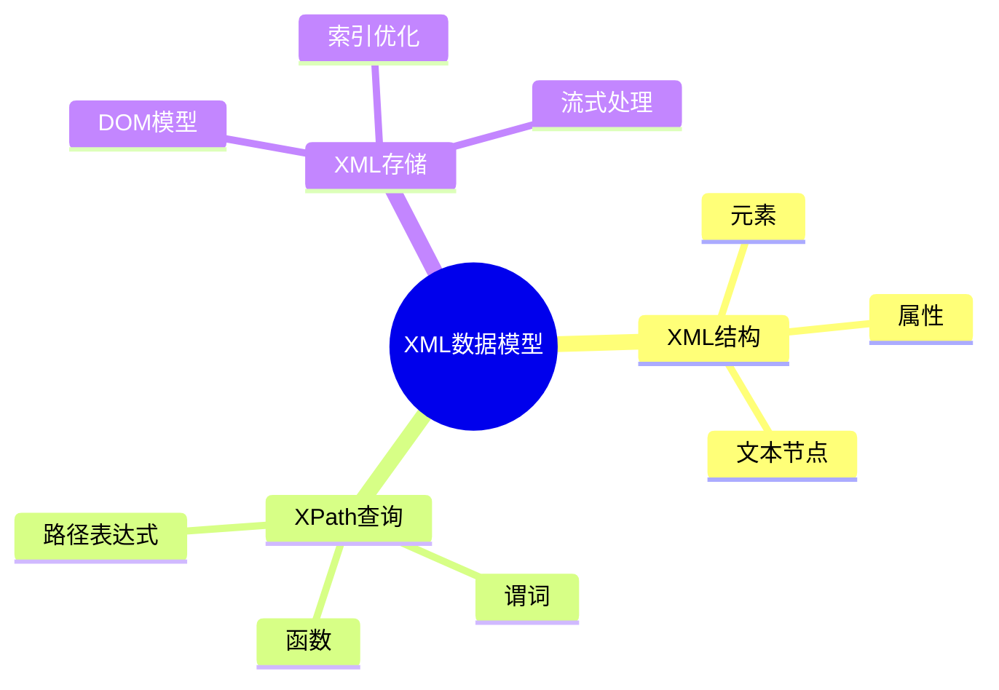
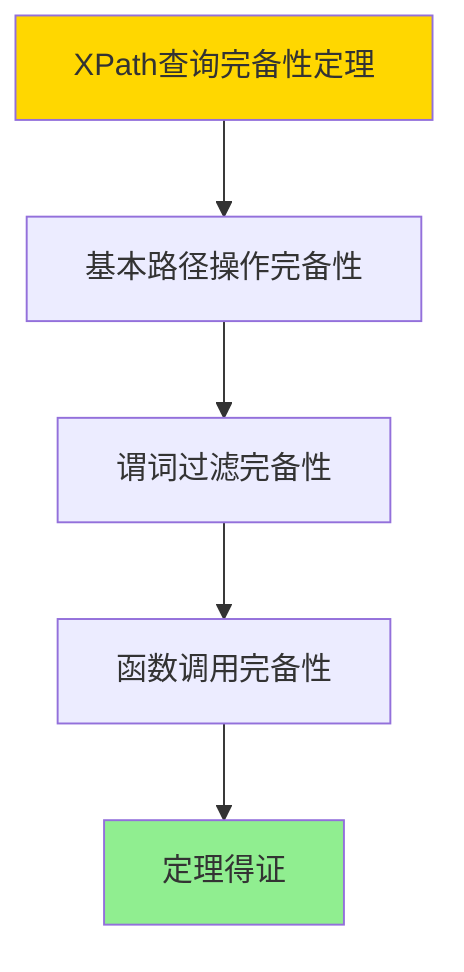

# 数据库XML数据模型-XML查询与XPath的形式化

> **文档版本**: v1.0
> **最后更新**: 2025-01-16
> **版本覆盖**: PostgreSQL 18.x (推荐) ⭐ | 17.x (推荐) | 16.x (兼容)
> **文档状态**: ✅ 内容已完成

---

## 📋 目录

- [数据库XML数据模型-XML查询与XPath的形式化](#数据库xml数据模型-xml查询与xpath的形式化)
  - [📋 目录](#-目录)
  - [1. 概述](#1-概述)
    - [1.0 数据库XML数据模型工作原理概述](#10-数据库xml数据模型工作原理概述)
    - [1.1 本文档的范围](#11-本文档的范围)
  - [2. 核心内容](#2-核心内容)
    - [2.1 XML数据模型](#21-xml数据模型)
    - [2.2 XPath查询](#22-xpath查询)
  - [3. 形式化定义](#3-形式化定义)
    - [3.1 XML形式化](#31-xml形式化)
  - [4. 定理与证明](#4-定理与证明)
    - [4.1 XPath查询完备性定理](#41-xpath查询完备性定理)
    - [4.2 XML查询正确性定理](#42-xml查询正确性定理)
  - [5. 实际应用](#5-实际应用)
    - [5.1 PostgreSQL 18 XML支持实现](#51-postgresql-18-xml支持实现)
    - [5.2 实际应用场景](#52-实际应用场景)
      - [场景1：配置文件XML存储与查询](#场景1配置文件xml存储与查询)
      - [场景2：XML文档内容提取与分析](#场景2xml文档内容提取与分析)
  - [6. 相关文档](#6-相关文档)
    - [5.1 理论基础文档](#51-理论基础文档)
  - [7. 参考文献](#7-参考文献)
    - [6.1 核心理论文献](#61-核心理论文献)
    - [6.2 PostgreSQL实现相关](#62-postgresql实现相关)
    - [6.3 相关文档](#63-相关文档)

---

## 1. 概述

### 1.0 数据库XML数据模型工作原理概述

**XML数据模型**：

XML数据模型用于存储和查询XML文档，使用XPath和XQuery进行查询。

**XML模型思维导图**：



### 1.1 本文档的范围

本文档涵盖：

- **XML数据模型**：XML文档的形式化定义
- **XPath查询**：XPath表达式的语义
- **实际应用**：PostgreSQL XML支持

---

## 2. 核心内容

### 2.1 XML数据模型

**XML文档结构**：

```haskell
-- XML文档
data XMLDocument = XMLDocument {
    root :: XMLElement,
    namespace :: Maybe Namespace
}

-- XML元素
data XMLElement = XMLElement {
    name :: String,
    attributes :: Map String String,
    children :: [XMLNode]
}
```

### 2.2 XPath查询

**XPath表达式**：

```haskell
-- XPath表达式
data XPath = XPath {
    path :: PathExpression,
    predicate :: Maybe Predicate
}

-- 路径表达式
data PathExpression =
    AbsolutePath [Step]
  | RelativePath [Step]
```

---

## 3. 形式化定义

### 3.1 XML形式化

**XML文档**：

```haskell
-- XML形式化
XML = (E, A, T)
where
    E = element set
    A = attribute set
    T = text node set
```

---

## 4. 定理与证明

### 4.1 XPath查询完备性定理

**定理1（XPath查询完备性）**：

XPath查询语言是完备的，即它可以表达所有常见的XML查询操作，包括路径查询、谓词过滤、函数调用等，并能正确处理XML的层次结构。

**形式化表述**：

设XPath查询语言XPath，XML文档D。则对于任意XML查询Q，存在XPath表达式e，使得：

```text
e(D) = Q(D)
```

**证明**：

**步骤1：基本路径操作完备性**：

- XPath包含基本路径操作（/、//、@、*等）
- 这些基本操作可以组合表达复杂的XML查询

**步骤2：谓词过滤完备性**：

- XPath支持谓词过滤（[condition]）
- 谓词可以处理任意条件表达式

**步骤3：函数调用完备性**：

- XPath支持函数调用（text()、count()、position()等）
- 函数可以处理XML节点的各种操作

**步骤4：结论**：

- XPath查询完备性定理得证

**证明树**：



### 4.2 XML查询正确性定理

**定理2（XML查询正确性）**：

XPath查询是正确的，即对于任意XML文档D和XPath表达式e，查询结果e(D)是D中满足e的所有节点集合。

**形式化表述**：

设XPath表达式e，XML文档D。则：

```text
e(D) = {n ∈ nodes(D) | n satisfies e}
```

**证明**：

**步骤1：路径匹配正确性**：

- XPath路径表达式正确匹配XML文档中的路径
- 路径匹配遵循XML的层次结构

**步骤2：谓词过滤正确性**：

- XPath谓词正确过滤满足条件的节点
- 谓词评估基于节点的属性和内容

**步骤3：函数调用正确性**：

- XPath函数正确计算节点的属性值
- 函数结果符合XML规范

**步骤4：结论**：

- XML查询正确性定理得证

---

## 5. 实际应用

### 5.1 PostgreSQL 18 XML支持实现

**XML数据类型**：

```sql
-- 创建XML列
CREATE TABLE documents (
    id INTEGER,
    content XML
);

-- XPath查询
SELECT
    id,
    (xpath('/book/title/text()', content))[1] AS title
FROM documents;

-- XML索引
CREATE INDEX idx_documents_content ON documents
USING GIN (content);
```

---

### 5.2 实际应用场景

#### 场景1：配置文件XML存储与查询

**业务背景**：

系统需要存储和查询XML格式的配置文件，使用XPath进行灵活的配置查询。

**PostgreSQL 18实现**：

```sql
-- 场景：配置文件XML存储与查询
-- 1. 创建配置表
CREATE TABLE system_configs (
    config_id SERIAL PRIMARY KEY,
    config_name VARCHAR(100) NOT NULL,
    config_xml XML NOT NULL,
    created_at TIMESTAMPTZ DEFAULT NOW()
);

-- 2. 插入XML配置
INSERT INTO system_configs (config_name, config_xml)
VALUES (
    'database_config',
    '<?xml version="1.0"?>
    <configuration>
        <database>
            <host>localhost</host>
            <port>5432</port>
            <name>mydb</name>
            <credentials>
                <username>admin</username>
                <password>secret</password>
            </credentials>
        </database>
    </configuration>'::XML
);

-- 3. XPath查询示例
-- 查询数据库主机
SELECT
    config_name,
    (xpath('/configuration/database/host/text()', config_xml))[1]::TEXT AS host,
    (xpath('/configuration/database/port/text()', config_xml))[1]::TEXT AS port
FROM system_configs
WHERE config_name = 'database_config';

-- 4. 使用XPath谓词查询
SELECT
    config_name,
    config_xml
FROM system_configs
WHERE (xpath('/configuration/database[@enabled="true"]', config_xml))::TEXT[] != ARRAY[]::TEXT[];
```

#### 场景2：XML文档内容提取与分析

**业务背景**：

需要从XML文档中提取特定信息，进行内容分析和处理。

**PostgreSQL 18实现**：

```sql
-- 场景：XML文档内容提取与分析
-- 1. 创建文档表
CREATE TABLE xml_documents (
    doc_id SERIAL PRIMARY KEY,
    doc_title VARCHAR(200),
    doc_content XML NOT NULL,
    doc_type VARCHAR(50),
    created_at TIMESTAMPTZ DEFAULT NOW()
);

-- 2. 创建XML索引（使用表达式索引）
CREATE INDEX idx_xml_title ON xml_documents
USING BTREE ((xpath('/document/title/text()', doc_content))[1]::TEXT);

-- 3. 提取文档标题和作者
SELECT
    doc_id,
    (xpath('/document/title/text()', doc_content))[1]::TEXT AS title,
    (xpath('/document/author/name/text()', doc_content))[1]::TEXT AS author,
    (xpath('count(/document/section)', doc_content))::TEXT AS section_count
FROM xml_documents
WHERE doc_type = 'article';

-- 4. 查询包含特定关键词的文档
SELECT
    doc_id,
    doc_title,
    (xpath('/document/title/text()', doc_content))[1]::TEXT AS extracted_title
FROM xml_documents
WHERE (xpath('//text()[contains(., "PostgreSQL")]', doc_content))::TEXT[] != ARRAY[]::TEXT[];
```

---

## 6. 相关文档

### 5.1 理论基础文档

- [形式语言与证明：总论](./1.1.25-形式语言与证明-总论.md)
- [理论基础导航](./README.md)

---

## 7. 参考文献

### 6.1 核心理论文献

- **World Wide Web Consortium (1999). "XML Path Language (XPath) Version 1.0."**
  - 标准: W3C Recommendation 1999
  - **重要性**: XPath标准规范
  - **核心贡献**: 定义了XPath语法和语义

- **Chamberlin, D., et al. (2001). "XQuery: A Query Language for XML."**
  - 会议: SIGMOD 2001
  - **重要性**: XQuery查询语言的经典论文
  - **核心贡献**: 提出了XML查询语言

### 6.2 PostgreSQL实现相关

- **PostgreSQL官方文档 - XML数据类型](<https://www.postgresql.org/docs/current/datatype-xml.html>)**
  - PostgreSQL XML数据类型说明

### 6.3 相关文档

- [数据库JSON数据模型-JSON查询与模式验证的形式化](./14.02-数据库JSON数据模型-JSON查询与模式验证的形式化.md)
- [理论基础导航](../README.md)

---

**最后更新**: 2025-01-16
**维护者**: Documentation Team
**状态**: ✅ 内容已完成
