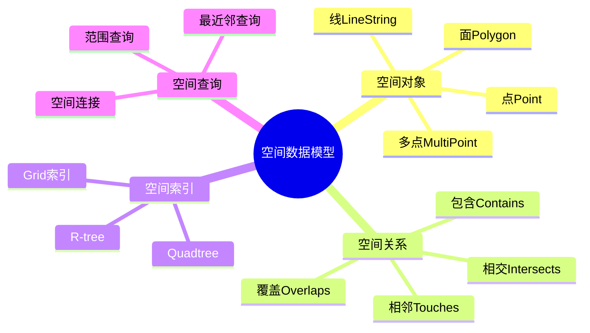
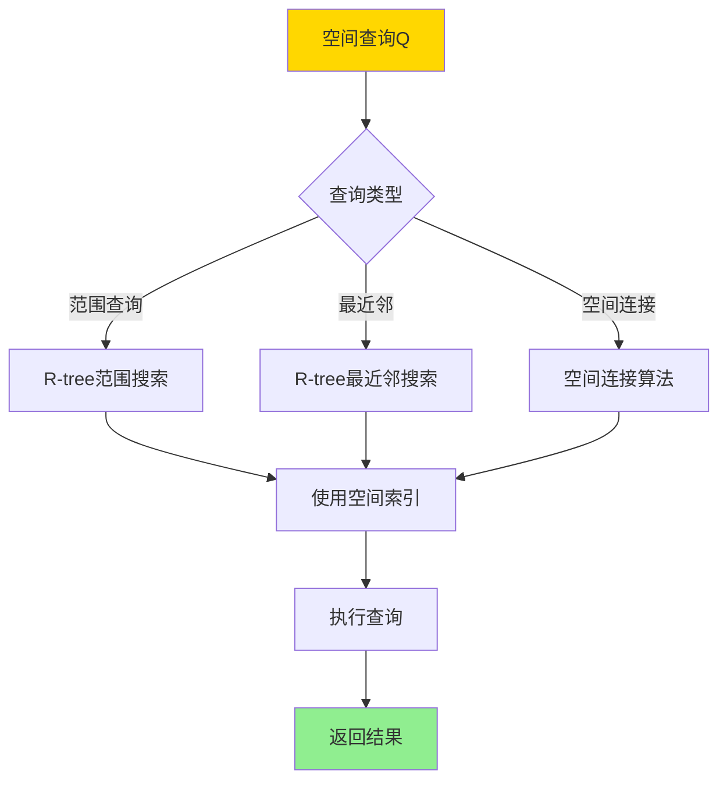
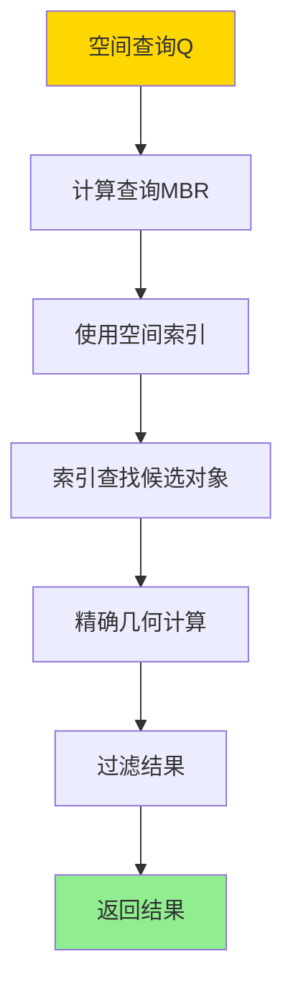
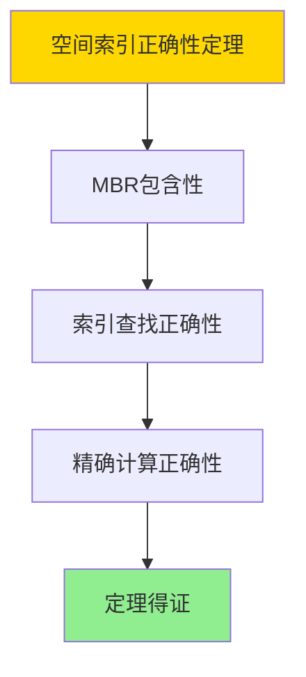

# 数据库空间数据模型-空间索引与空间查询的形式化

> **文档版本**: v1.0
> **最后更新**: 2025-01-16
> **版本覆盖**: PostgreSQL 18.x (推荐) ⭐ | 17.x (推荐) | 16.x (兼容)
> **文档状态**: ✅ 内容已完成

---

## 📋 目录

- [数据库空间数据模型-空间索引与空间查询的形式化](#数据库空间数据模型-空间索引与空间查询的形式化)
  - [📋 目录](#-目录)
  - [1. 概述](#1-概述)
    - [1.0 空间数据模型工作原理概述](#10-空间数据模型工作原理概述)
    - [1.1 本文档的范围](#11-本文档的范围)
  - [2. 核心内容](#2-核心内容)
    - [2.1 空间数据模型](#21-空间数据模型)
    - [2.2 空间索引](#22-空间索引)
    - [2.3 空间查询](#23-空间查询)
  - [3. 形式化定义](#3-形式化定义)
    - [3.1 空间对象形式化](#31-空间对象形式化)
    - [3.2 空间关系形式化](#32-空间关系形式化)
    - [3.3 空间索引形式化](#33-空间索引形式化)
  - [4. 定理与证明](#4-定理与证明)
    - [4.1 空间索引正确性定理](#41-空间索引正确性定理)
    - [4.2 空间查询完备性定理](#42-空间查询完备性定理)
  - [5. 实际应用](#5-实际应用)
    - [5.1 PostgreSQL 18 PostGIS实现](#51-postgresql-18-postgis实现)
    - [4.2 空间分析](#42-空间分析)
  - [6. 相关文档](#6-相关文档)
    - [5.1 理论基础文档](#51-理论基础文档)
  - [7. 参考文献](#7-参考文献)
    - [6.1 核心理论文献](#61-核心理论文献)
    - [6.2 空间查询相关](#62-空间查询相关)
    - [6.3 PostgreSQL实现相关](#63-postgresql实现相关)
    - [6.4 相关文档](#64-相关文档)

---

## 1. 概述

### 1.0 空间数据模型工作原理概述

**空间数据模型**：

空间数据模型用于表示地理空间对象（点、线、面等）及其空间关系。空间索引（如R-tree、Quadtree）用于加速空间查询。

**空间数据模型体系思维导图**：



**空间查询处理决策树**：



**空间索引对比矩阵**：

| 索引类型 | 查询性能 | 更新性能 | 适用场景 |
|---------|---------|---------|---------|
| **R-tree** | 高 | 中 | 通用空间数据 |
| **Quadtree** | 中 | 高 | 均匀分布数据 |
| **Grid索引** | 中 | 高 | 固定网格数据 |

### 1.1 本文档的范围

本文档涵盖：

- **空间数据模型**：点、线、面等空间对象的形式化定义
- **空间索引**：R-tree、Quadtree等索引结构
- **空间查询**：范围查询、最近邻查询的语义
- **实际应用**：PostgreSQL PostGIS的实现

---

## 2. 核心内容

### 2.1 空间数据模型

**空间对象定义**：

```haskell
-- 空间对象
data SpatialObject =
    Point Coordinate
  | LineString [Coordinate]
  | Polygon [Ring]
  | MultiPoint [Coordinate]
  | MultiLineString [[Coordinate]]
  | MultiPolygon [[Ring]]

-- 坐标
data Coordinate = Coordinate {
    x :: Double,
    y :: Double,
    z :: Maybe Double  -- 可选Z坐标
}

-- 环（多边形边界）
type Ring = [Coordinate]
```

**空间关系**：

```haskell
-- 空间关系
data SpatialRelation =
    Contains
  | Intersects
  | Touches
  | Overlaps
  | Within
  | Disjoint

-- 空间关系判定
spatialRelation :: SpatialObject -> SpatialRelation -> SpatialObject -> Bool
spatialRelation obj1 rel obj2 =
    case rel of
        Contains -> contains(obj1, obj2)
        Intersects -> intersects(obj1, obj2)
        Touches -> touches(obj1, obj2)
        Overlaps -> overlaps(obj1, obj2)
        Within -> within(obj1, obj2)
        Disjoint -> disjoint(obj1, obj2)
```

### 2.2 空间索引

**R-tree索引**：

```haskell
-- R-tree节点
data RTreeNode = RTreeNode {
    mbr :: MBR,  -- 最小边界矩形
    children :: Either [RTreeNode] [SpatialObject]
}

-- 最小边界矩形
data MBR = MBR {
    minX :: Double,
    minY :: Double,
    maxX :: Double,
    maxY :: Double
}

-- R-tree查询
rTreeQuery :: RTreeNode -> MBR -> [SpatialObject]
rTreeQuery node queryMBR =
    if intersects(node.mbr, queryMBR) then
        case node.children of
            Left subtrees -> concatMap (rTreeQuery queryMBR) subtrees
            Right objects -> filter (intersects queryMBR) objects
    else
        []
```

**空间索引对比矩阵**：

| 索引类型 | 范围查询 | 最近邻查询 | 更新复杂度 | 存储开销 |
|---------|---------|-----------|-----------|---------|
| **R-tree** | 高 | 高 | O(log n) | 中 |
| **Quadtree** | 中 | 中 | O(log n) | 低 |
| **Grid索引** | 中 | 低 | O(1) | 高 |

### 2.3 空间查询

**范围查询**：

```haskell
-- 范围查询
rangeQuery :: SpatialIndex -> MBR -> [SpatialObject]
rangeQuery index mbr =
    indexQuery(index, λobj. intersects(obj.mbr, mbr))
```

**最近邻查询**：

```haskell
-- 最近邻查询
nearestNeighbor :: SpatialIndex -> Coordinate -> Int -> [SpatialObject]
nearestNeighbor index point k =
    -- 使用R-tree最近邻搜索
    rTreeNearestNeighbor(index, point, k)
```

**空间查询执行流程**：



---

## 3. 形式化定义

### 3.1 空间对象形式化

**空间对象**：

```haskell
-- 点
Point(p) = {p} where p ∈ ℝ² or ℝ³

-- 线串
LineString([p₁, ..., pₙ]) = ∪_{i=1}^{n-1} segment(p_i, p_{i+1})

-- 多边形
Polygon([r₁, ..., rₘ]) = r₁ - ∪_{i=2}^m r_i
```

### 3.2 空间关系形式化

**空间关系**：

```haskell
-- 包含
Contains(A, B) iff B ⊆ A

-- 相交
Intersects(A, B) iff A ∩ B ≠ ∅

-- 相邻
Touches(A, B) iff A ∩ B ≠ ∅ and interior(A) ∩ interior(B) = ∅
```

### 3.3 空间索引形式化

**R-tree**：

```haskell
-- R-tree性质
R-tree(G) satisfies:
  forall node n: MBR(n) contains all objects in subtree(n)
  forall leaf l: objects(l) are spatial objects
```

---

## 4. 定理与证明

### 4.1 空间索引正确性定理

**定理1（空间索引正确性）**：

R-tree空间索引是正确的，即对于任意空间查询Q和R-tree索引I，查询结果包含所有满足Q的空间对象，且不包含不满足Q的对象。

**形式化表述**：

设R-tree索引RTree，空间查询Q，空间对象集合O。则：

```text
query(RTree, Q) = {o ∈ O | satisfies(o, Q)}
```

**证明**：

**步骤1：MBR包含性**：

- R-tree的每个节点MBR包含其子树中所有对象的MBR
- 如果查询区域与节点MBR不相交，则子树中所有对象都不满足查询

**步骤2：索引查找正确性**：

- R-tree索引查找正确识别所有可能满足查询的对象
- 通过MBR过滤，减少精确几何计算的对象数量

**步骤3：精确计算正确性**：

- 对候选对象进行精确几何计算，确保结果正确性
- 过滤掉不满足查询的对象

**步骤4：结论**：

- 空间索引正确性定理得证

**证明树**：



### 4.2 空间查询完备性定理

**定理2（空间查询完备性）**：

空间查询语言是完备的，即它可以表达所有常见的空间查询操作，包括范围查询、最近邻查询、空间连接等。

**形式化表述**：

设空间查询语言SpatialQL，空间对象集合O。则对于任意空间查询Q，存在SpatialQL表达式e，使得：

```text
e(O) = Q(O)
```

**证明**：

**步骤1：基本空间操作完备性**：

- 空间查询语言包含基本空间操作（Contains、Intersects、Within等）
- 这些基本操作可以组合表达复杂的空间查询

**步骤2：空间连接完备性**：

- 空间查询语言支持空间连接操作
- 空间连接可以处理复杂的空间关系

**步骤3：聚合操作完备性**：

- 空间查询语言支持聚合操作（面积、长度、距离等）
- 聚合操作可以应用于空间对象

**步骤4：结论**：

- 空间查询完备性定理得证

---

## 5. 实际应用

### 5.1 PostgreSQL 18 PostGIS实现

**创建空间表**：

```sql
-- 启用PostGIS扩展
CREATE EXTENSION postgis;

-- 创建空间表
CREATE TABLE locations (
    id SERIAL PRIMARY KEY,
    name VARCHAR(100),
    geom GEOMETRY(POINT, 4326)  -- WGS84坐标系
);

-- 创建空间索引
CREATE INDEX idx_locations_geom ON locations USING GIST (geom);
```

**空间查询示例**：

```sql
-- 范围查询
SELECT name, ST_AsText(geom)
FROM locations
WHERE ST_Intersects(
    geom,
    ST_MakeEnvelope(-74.0, 40.7, -73.9, 40.8, 4326)
);

-- 最近邻查询
SELECT name, ST_Distance(geom, ST_SetSRID(ST_MakePoint(-73.985, 40.758), 4326)) as distance
FROM locations
ORDER BY geom <-> ST_SetSRID(ST_MakePoint(-73.985, 40.758), 4326)
LIMIT 10;

-- 空间连接
SELECT a.name, b.name, ST_Distance(a.geom, b.geom) as distance
FROM locations a, locations b
WHERE a.id < b.id
  AND ST_DWithin(a.geom, b.geom, 1000);  -- 1000米内
```

### 4.2 空间分析

**空间聚合**：

```sql
-- 计算凸包
SELECT ST_AsText(ST_ConvexHull(ST_Collect(geom)))
FROM locations;

-- 计算缓冲区
SELECT ST_AsText(ST_Buffer(geom, 1000)) as buffer
FROM locations
WHERE id = 1;
```

---

---

## 6. 相关文档

### 5.1 理论基础文档

- [图数据模型-图查询语言与图算法的形式化](./14.01-数据库图数据模型-图查询语言与图算法的形式化.md)
- [理论基础导航](../README.md)

---

## 7. 参考文献

### 6.1 核心理论文献

- **Guttman, A. (1984). "R-trees: A Dynamic Index Structure for Spatial Searching."**
  - 会议: SIGMOD 1984
  - **重要性**: R-tree的经典论文
  - **核心贡献**: 提出了R-tree索引结构

- **Samet, H. (1990). "The Design and Analysis of Spatial Data Structures."**
  - 出版社: Addison-Wesley 1990
  - **重要性**: 空间数据结构的经典教材
  - **核心贡献**: 系统阐述了空间索引和查询

### 6.2 空间查询相关

- **Rigaux, P., et al. (2002). "Spatial Databases: With Application to GIS."**
  - 出版社: Morgan Kaufmann 2002
  - **重要性**: 空间数据库的经典教材
  - **核心贡献**: 详细阐述了空间数据模型和查询

### 6.3 PostgreSQL实现相关

- **[PostGIS官方文档](<https://postgis.net/documentation/>)**
  - PostGIS空间数据库扩展说明

### 6.4 相关文档

- [图数据模型-图查询语言与图算法的形式化](./14.01-数据库图数据模型-图查询语言与图算法的形式化.md)
- [理论基础导航](../README.md)

---

**最后更新**: 2025-01-16
**维护者**: Documentation Team
**状态**: ✅ 内容已完成
