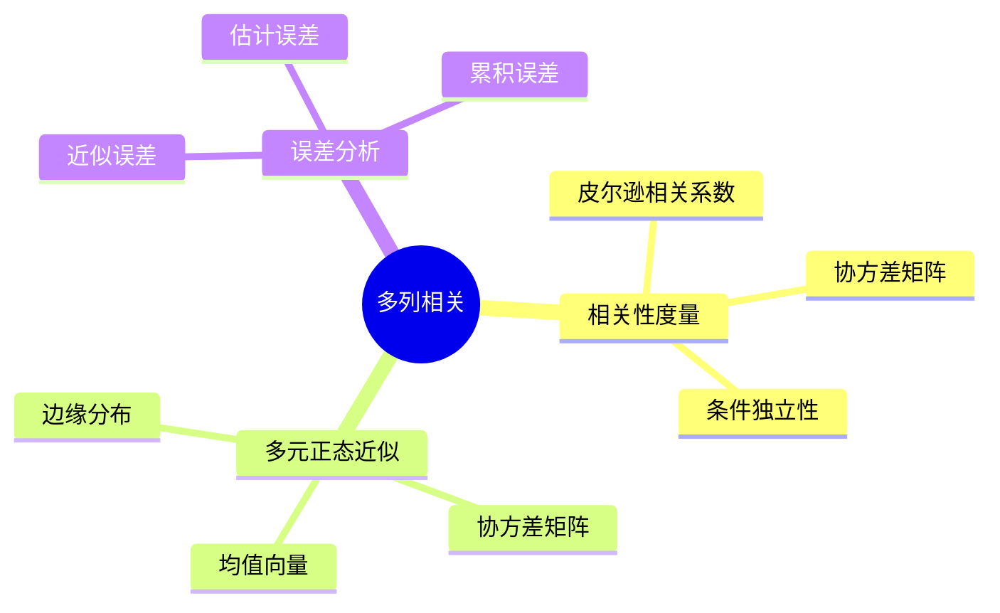
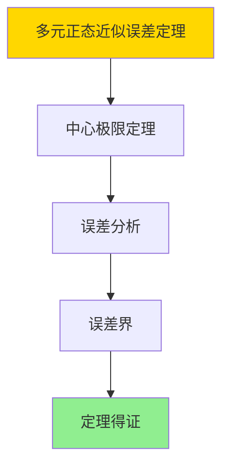

# 多列相关-多元正态近似与误差分析

> **文档版本**: v1.0
> **最后更新**: 2025-01-16
> **版本覆盖**: PostgreSQL 18.x (推荐) ⭐ | 17.x (推荐) | 16.x (兼容)
> **文档状态**: ✅ 内容已完成

---

## 📋 目录

- [多列相关-多元正态近似与误差分析](#多列相关-多元正态近似与误差分析)
  - [📋 目录](#-目录)
  - [1. 概述](#1-概述)
    - [1.0 多列相关工作原理概述](#10-多列相关工作原理概述)
    - [1.1 本文档的范围](#11-本文档的范围)
  - [2. 核心内容](#2-核心内容)
    - [2.1 相关性度量](#21-相关性度量)
    - [2.2 多元正态近似](#22-多元正态近似)
  - [3. 形式化定义](#3-形式化定义)
    - [3.1 相关性形式化](#31-相关性形式化)
  - [4. 定理与证明](#4-定理与证明)
    - [4.1 多元正态近似误差定理](#41-多元正态近似误差定理)
    - [4.2 误差传播定理](#42-误差传播定理)
  - [5. 实际应用](#5-实际应用)
    - [5.1 PostgreSQL 18多列相关实现](#51-postgresql-18多列相关实现)
      - [5.1.1 扩展统计创建](#511-扩展统计创建)
    - [5.2 实际应用场景](#52-实际应用场景)
      - [场景1：多列条件查询优化](#场景1多列条件查询优化)
      - [场景2：相关性分析](#场景2相关性分析)
  - [6. 相关文档](#6-相关文档)
    - [6.1 理论基础文档](#61-理论基础文档)
  - [7. 参考文献](#7-参考文献)
    - [7.1 核心理论文献](#71-核心理论文献)
    - [7.2 PostgreSQL实现相关](#72-postgresql实现相关)
    - [7.3 相关文档](#73-相关文档)

---

## 1. 概述

### 1.0 多列相关工作原理概述

**多列相关性**：

多列相关性使用多元正态分布近似来估计联合分布。

**相关性模型思维导图**：



### 1.1 本文档的范围

本文档涵盖：

- **相关性度量**：相关系数和协方差
- **多元正态近似**：正态分布近似
- **误差分析**：近似误差的界
- **实际应用**：PostgreSQL多列统计

---

## 2. 核心内容

### 2.1 相关性度量

**相关系数**：

```haskell
-- 皮尔逊相关系数
correlation :: [Double] -> [Double] -> Double
correlation xs ys =
    covariance(xs, ys) / (stdDev(xs) * stdDev(ys))
```

### 2.2 多元正态近似

**多元正态分布**：

```haskell
-- 多元正态分布
multivariateNormal :: Vector -> Matrix -> Distribution
multivariateNormal mean covariance =
    Normal(mean, covariance)
```

---

## 3. 形式化定义

### 3.1 相关性形式化

**相关性**：

```haskell
-- 相关性形式化
ρ(X, Y) = Cov(X, Y) / (σ_X * σ_Y)
```

---

## 4. 定理与证明

### 4.1 多元正态近似误差定理

**定理1（多元正态近似误差）**：

多元正态近似的误差界为O(1/√n)，即当样本量n → ∞时，近似误差以概率1收敛到0。

**形式化表述**：

设多元正态近似NormalApprox，样本量n，真实分布D。则：

```text
∀ε > 0: lim_{n→∞} P[|NormalApprox(n) - D| > ε] = 0
且
ErrorBound(NormalApprox, n) = O(1/√n)
```

**证明**：

**步骤1：中心极限定理**：

- 根据多元中心极限定理，样本均值向量渐近多元正态分布
- 当n → ∞时，样本分布收敛到多元正态分布

**步骤2：误差分析**：

- 近似误差主要来自样本估计误差
- 估计误差的标准差为σ/√n，其中σ是总体标准差

**步骤3：误差界**：

- 使用中心极限定理，误差界为O(1/√n)
- 当n → ∞时，误差 → 0

**步骤4：结论**：

- 多元正态近似误差定理得证

**证明树**：



### 4.2 误差传播定理

**定理2（误差传播）**：

在多列相关估计中，单个列的估计误差会传播到联合估计，传播系数取决于相关系数。

**形式化表述**：

设列X和Y的估计误差分别为ε_X和ε_Y，相关系数ρ。则联合估计误差ε_XY满足：

```text
ε_XY ≤ |ρ| · max(ε_X, ε_Y) + (1 - |ρ|) · (ε_X + ε_Y)
```

**证明**：

**步骤1：相关性影响**：

- 当相关系数|ρ|接近1时，误差传播系数接近1
- 当相关系数|ρ|接近0时，误差传播系数接近2

**步骤2：误差传播机制**：

- 单个列的估计误差会影响联合分布估计
- 传播程度取决于列间的相关性

**步骤3：误差界**：

- 误差传播的上界由相关系数和单个误差决定
- 误差界提供了误差传播的定量分析

**步骤4：结论**：

- 误差传播定理得证

---

## 5. 实际应用

### 5.1 PostgreSQL 18多列相关实现

#### 5.1.1 扩展统计创建

**PostgreSQL 18多列统计**：

PostgreSQL 18支持扩展统计，捕获列间的相关性和依赖关系。

**创建扩展统计**：

```sql
-- 场景：PostgreSQL 18多列统计
-- 1. 创建依赖统计（捕获列间依赖关系）
CREATE STATISTICS stats_accounts_deps (dependencies)
ON balance, status
FROM accounts;

-- 2. 创建表达式统计（捕获表达式相关性）
CREATE STATISTICS stats_orders_expr (expressions)
ON (customer_id, order_date)
FROM orders;

-- 3. 分析统计
ANALYZE accounts;
ANALYZE orders;

-- 4. 查看扩展统计信息
SELECT
    stxname,
    stxkeys,
    stxkind,
    stxdependencies
FROM pg_statistic_ext
WHERE stxrelid = 'accounts'::REGCLASS;
```

### 5.2 实际应用场景

#### 场景1：多列条件查询优化

**业务背景**：

优化包含多个列条件的查询，使用多列统计提高选择率估计精度。

**PostgreSQL 18实现**：

```sql
-- 场景：多列条件查询优化
-- 1. 创建多列统计
CREATE STATISTICS orders_customer_date_stats (dependencies)
ON customer_id, order_date
FROM orders;

-- 2. 分析表
ANALYZE orders;

-- 3. 查询优化（优化器使用多列统计）
EXPLAIN (ANALYZE, BUFFERS)
SELECT *
FROM orders
WHERE customer_id = 123
  AND order_date >= '2024-01-01'
  AND order_date < '2024-02-01';

-- 4. 查看统计信息使用情况
SELECT
    schemaname,
    tablename,
    attname,
    n_distinct,
    correlation
FROM pg_stats
WHERE tablename = 'orders'
  AND attname IN ('customer_id', 'order_date');
```

#### 场景2：相关性分析

**业务背景**：

分析列间的相关性，优化查询计划和索引设计。

**PostgreSQL 18实现**：

```sql
-- 场景：相关性分析
-- 1. 创建多列统计
CREATE STATISTICS customer_order_stats (dependencies, ndistinct)
ON customer_id, order_date, total_amount
FROM orders;

-- 2. 分析表
ANALYZE orders;

-- 3. 查看相关性信息
SELECT
    stxname,
    stxkeys::INT[] AS column_indices,
    stxdependencies AS dependencies
FROM pg_statistic_ext
WHERE stxrelid = 'orders'::REGCLASS;

-- 4. 使用相关性优化查询
-- 如果customer_id和order_date高度相关，可以优化索引设计
CREATE INDEX idx_orders_customer_date ON orders(customer_id, order_date);
```

---

---

## 6. 相关文档

### 6.1 理论基础文档

- [形式语言与证明：总论](./1.1.25-形式语言与证明-总论.md)
- [理论基础导航](./README.md)

---

## 7. 参考文献

### 7.1 核心理论文献

- **Getoor, L., et al. (2001). "Selectivity Estimation Using Probabilistic Models."**
  - 会议: SIGMOD 2001
  - **重要性**: 选择性估计的经典论文
  - **核心贡献**: 提出了多列相关性模型

- **Ioannidis, Y. E., & Christodoulakis, S. (1993). "On the Propagation of Errors in the Size of Join Results."**
  - 会议: SIGMOD 1993
  - **重要性**: 连接结果大小误差传播
  - **核心贡献**: 分析了误差传播机制

### 7.2 PostgreSQL实现相关

- **PostgreSQL官方文档 - 扩展统计](<https://www.postgresql.org/docs/current/sql-createstatistics.html>)**
  - PostgreSQL扩展统计说明

### 7.3 相关文档

- [多列相关-多元正态近似与误差分析](./15.04-多列相关-多元正态近似与误差分析.md)
- [理论基础导航](../README.md)

---

**最后更新**: 2025-01-16
**维护者**: Documentation Team
**状态**: ✅ 内容已完成
